# Session 9 — Kubernetes Fundamentals

## Name

Himanshu Rathi

## Roll No

`24BCS10365`

---

**Source folder:** `session9-k8s`  
**Reference README:** the upstream lab README in [`Nency-Ravaliya/devops-heros`](https://github.com/Nency-Ravaliya/devops-heros)

Cluster architecture from the inside out — nodes, the control plane components, namespaces, the API surface, and creating your first Pod both imperatively and declaratively.

Every command below was executed against a live Kubernetes cluster. Each screenshot is the real terminal output of the command shown directly above it — nothing is mocked or hand-written.

---

## Environment

| | |
|---|---|
| **Cluster** | `kind` v0.31.0 — 1 control-plane node + 2 worker nodes, running in Docker |
| **Kubernetes** | v1.35.0 |
| **kubectl** | v1.34.1 |
| **Host** | macOS (Apple Silicon), Docker Desktop |
| **Date run** | 17 September 2026 |

> **Note on Minikube vs kind.** The upstream READMEs are written for Minikube. This submission was
> produced on a 3-node **kind** cluster, which exercises the same Kubernetes APIs but gives a real
> multi-node topology (so Pods genuinely spread across nodes, and NodePort can be proven to answer
> on *every* node). The only command-level difference is how the cluster is reached from the host:
> wherever a README says `curl http://$(minikube ip):PORT`, this run uses `curl http://localhost:PORT`,
> because the kind cluster publishes those node ports to the host. Every `kubectl` command is
> unchanged.

---

## Key takeaways

- A Kubernetes cluster is a control-plane node (the brain) plus worker nodes (the muscle); `kubectl get nodes` shows the split in the ROLES column.
- The control plane is not magic — `kube-apiserver`, `etcd`, `kube-scheduler`, `kube-controller-manager`, `kube-proxy` and CoreDNS all run as ordinary Pods in the `kube-system` namespace.
- `kubectl run` is the fast imperative path; applying YAML is the declarative path, and the declarative path is what real clusters are run on because it can be committed to git.
- Every Pod gets CoreDNS injected as its nameserver — that single fact is what makes Service discovery work in sessions 10 and 11.
- A bare Pod that is deleted stays deleted. Nothing recreates it. That gap is exactly what ReplicaSets and Deployments exist to close.

---

## Commands executed, with output

### Step 1 — Versions

The toolchain. kubectl is the client that talks to the API server; kind runs a real multi-node Kubernetes cluster inside Docker containers.

```bash
kubectl version --client
kind version
docker --version
```

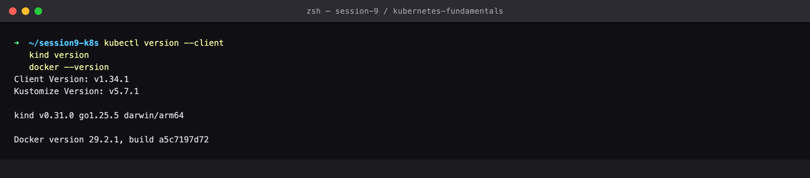

### Step 2 — Cluster create

The cluster definition used for every lab in sessions 9-11: one control-plane node and two worker nodes, with node ports published to the host.

```bash
cat kind-config.yaml
kind create cluster --config kind-config.yaml
```

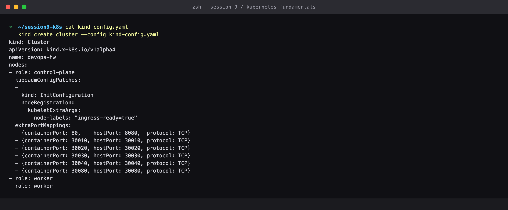

### Step 3 — Cluster info

The control plane endpoint and CoreDNS are reachable — the cluster is alive.

```bash
kubectl cluster-info
```

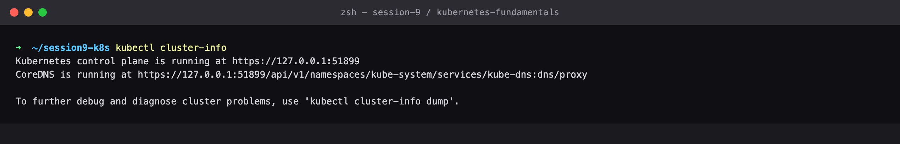

### Step 4 — Get nodes

THE CLUSTER: 1 control-plane node (runs the brain) and 2 worker nodes (run your workloads). ROLES is the column that distinguishes them.

```bash
kubectl get nodes -o wide
```

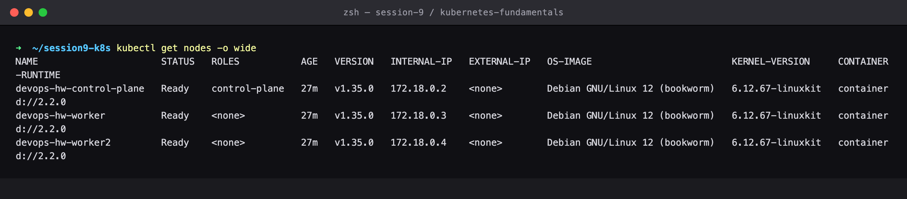

### Step 5 — Describe node

A node's Conditions (Ready, MemoryPressure, DiskPressure) are what the scheduler consults, and Capacity is the budget your Pod resource requests are drawn from.

```bash
kubectl describe node devops-hw-worker
```

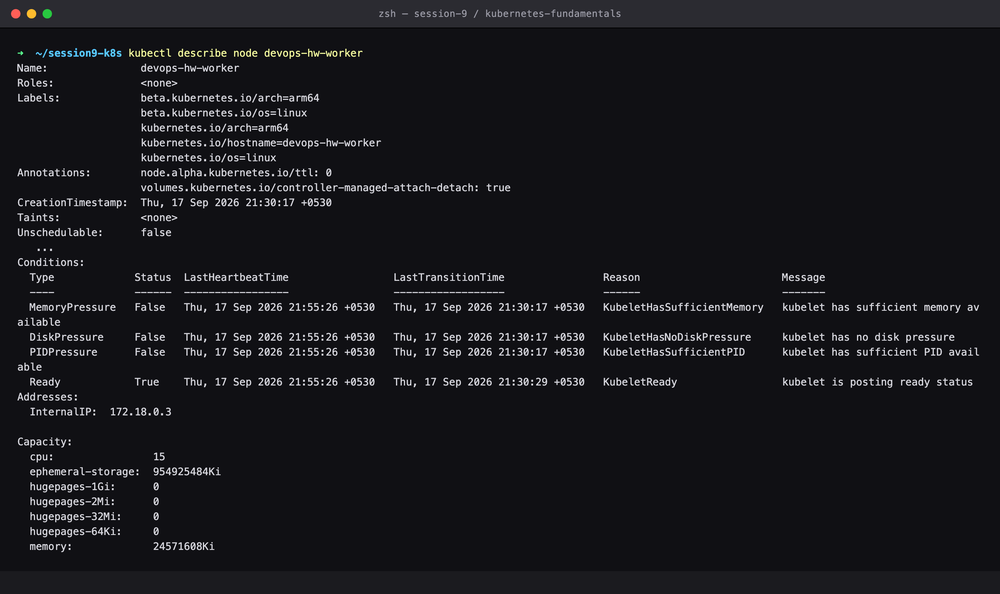

### Step 6 — Control plane pods

THE ARCHITECTURE, made concrete. kube-apiserver (the front door), etcd (the database), kube-scheduler (decides placement), kube-controller-manager (drives actual state toward desired state), kube-proxy (per-node networking) and CoreDNS (service discovery) are themselves just Pods.

```bash
kubectl get pods -n kube-system -o wide
```

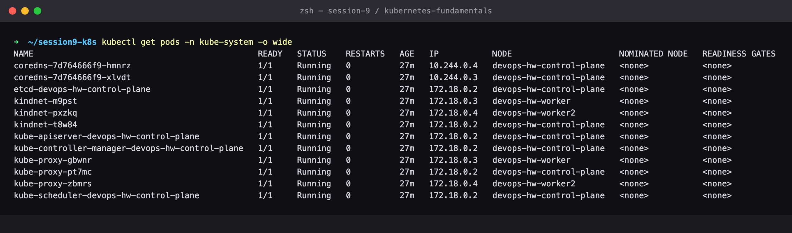

### Step 7 — Component roles

Note WHERE each component runs: the control plane components sit on the control-plane node, while kube-proxy and the CNI agent run on EVERY node (that is a DaemonSet).

```bash
kubectl get pods -n kube-system -o custom-columns=NAME:.metadata.name,NODE:.spec.nodeName
```

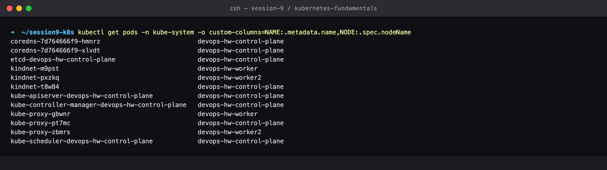

### Step 8 — Componentstatus

The API server's own health checks — etcd, the scheduler and the controller manager all reporting ok.

```bash
kubectl get --raw='/readyz?verbose'
```

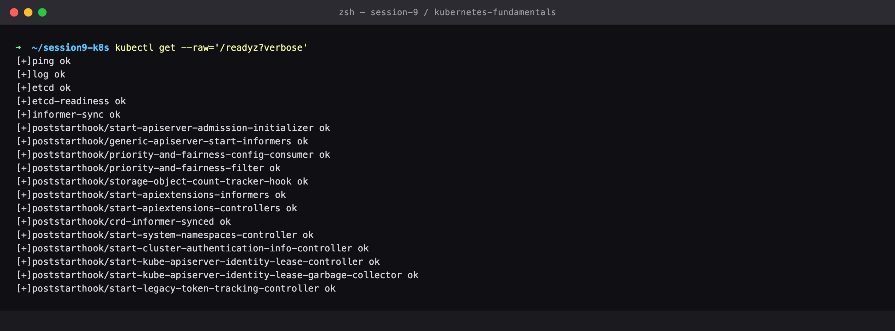

### Step 9 — Namespaces

Namespaces partition one physical cluster into isolated virtual clusters. kube-system holds the control plane; your work lands in default unless told otherwise.

```bash
kubectl get namespaces
```

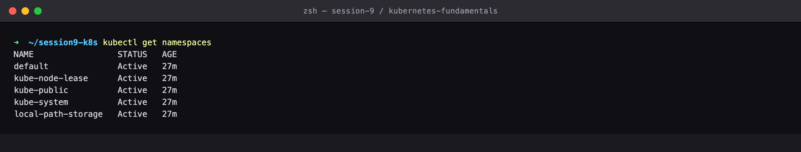

### Step 10 — Api resources

Every object type the cluster understands, with its short name and whether it is namespaced. This is the map of the entire API.

```bash
kubectl api-resources | head -22
```

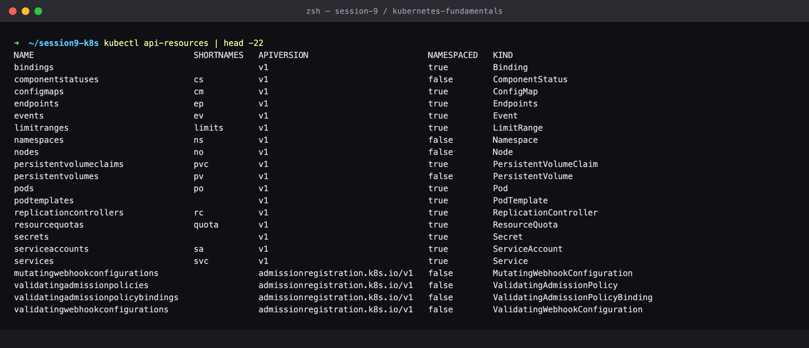

### Step 11 — Create Namespace

Create a namespace to keep this lab's objects isolated.

```bash
kubectl create namespace k8s-fundamentals
```


### Step 12 — Run pod

The imperative way to create a Pod — fastest path from zero to a running container.

```bash
kubectl run my-first-pod --image=nginx:1.25-alpine -n k8s-fundamentals
```

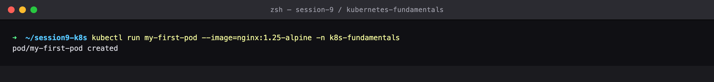

### Step 13 — Get pod

Running, with a Pod IP from the cluster's Pod CIDR, scheduled onto a worker node by the scheduler.

```bash
kubectl get pod my-first-pod -n k8s-fundamentals -o wide
```

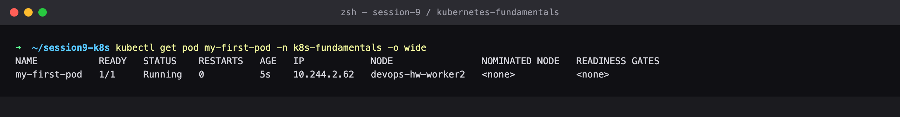

### Step 14 — Describe pod

The Events at the bottom tell the whole story: Scheduled -> Pulled -> Created -> Started. This is the first place to look when anything goes wrong.

```bash
kubectl describe pod my-first-pod -n k8s-fundamentals
```

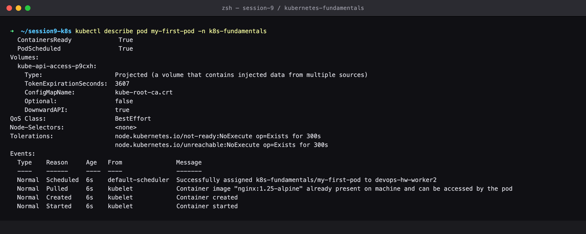

### Step 15 — Pod YAML

Kubernetes stored far more than was asked for — it filled in every default. This is the declarative object that now lives in etcd.

```bash
kubectl get pod my-first-pod -n k8s-fundamentals -o yaml
```

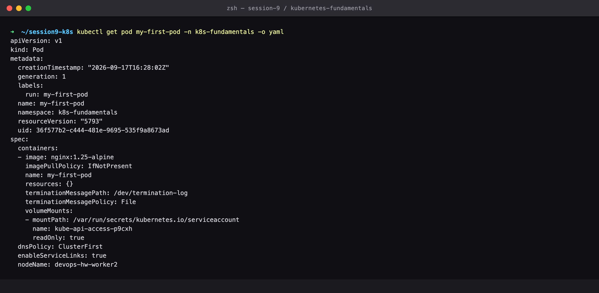

### Step 16 — Logs

Reading the container's stdout/stderr — the core debugging command.

```bash
kubectl logs my-first-pod -n k8s-fundamentals
```

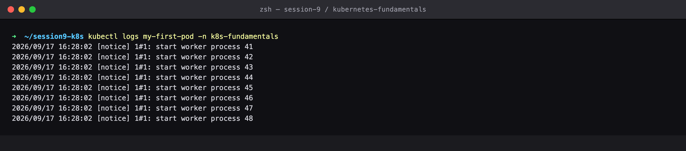

### Step 17 — Exec

A shell inside the running container. Note /etc/resolv.conf — the kubelet injected CoreDNS as the Pod's nameserver, which is what makes Service discovery work.

```bash
kubectl exec -it my-first-pod -n k8s-fundamentals -- sh
```

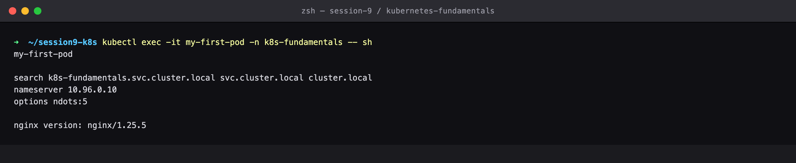

### Step 18 — Declarative

THE DECLARATIVE WAY, which is how real clusters are run: describe the desired state in YAML, commit it to git, and let Kubernetes reconcile reality to match.

```bash
cat nginx-pod.yaml
kubectl apply -f nginx-pod.yaml -n k8s-fundamentals
```

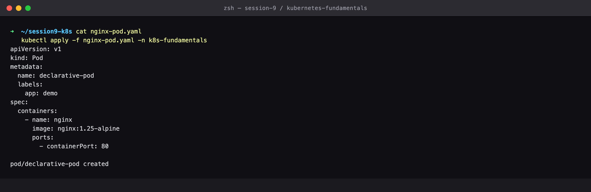

### Step 19 — Get both

Both Pods running. Only the declarative one carries the label we asked for — labels are the glue Services and Deployments use to find Pods.

```bash
kubectl get pods -n k8s-fundamentals --show-labels
```

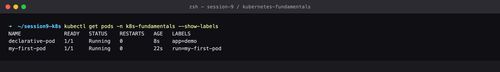

### Step 20 — Explain

Built-in schema documentation for every field — the reference you reach for instead of guessing YAML keys.

```bash
kubectl explain pod.spec.containers
```

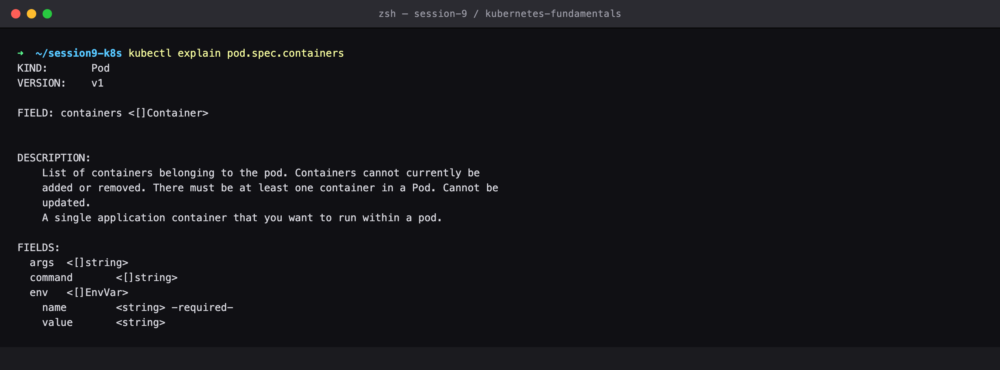

### Step 21 — Self healing

A bare Pod deleted is simply gone — nothing recreates it. That is precisely why production never runs bare Pods, and why session 10 moves to ReplicaSets and Deployments, which DO recreate them.

```bash
kubectl delete pod my-first-pod -n k8s-fundamentals
kubectl get pods -n k8s-fundamentals
```

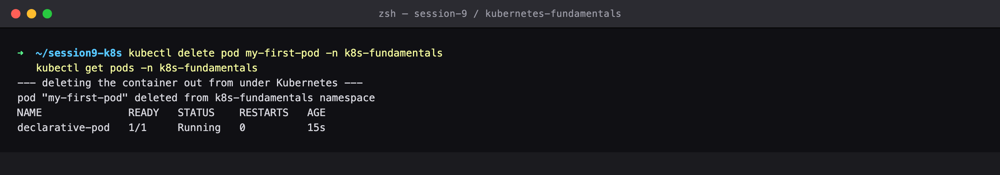

### Step 22 — Cleanup

Deleting the namespace garbage-collects every object inside it in one shot.

```bash
kubectl delete namespace k8s-fundamentals
```

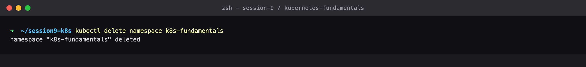

---

## Cleanup
All objects created by this lab were deleted at the end of the run (final step above), leaving the cluster clean for the next lab.
