# Session 10 — Rolling Update Deployment Strategy

## Name

Himanshu Rathi

## Roll No

`24BCS10365`

---

**Source folder:** `session10-k8s-core-objects/01-rolling-update`  
**Reference README:** the upstream lab README in [`Nency-Ravaliya/devops-heros`](https://github.com/Nency-Ravaliya/devops-heros)

Replace every Pod of a running app one at a time, measuring live traffic throughout to show what `maxUnavailable: 0` actually buys.

Every command below was executed against a live Kubernetes cluster. Each screenshot is the real terminal output of the command shown directly above it — nothing is mocked or hand-written.

---

## Environment

| | |
|---|---|
| **Cluster** | `kind` v0.31.0 — 1 control-plane node + 2 worker nodes, running in Docker |
| **Kubernetes** | v1.35.0 |
| **kubectl** | v1.34.1 |
| **Host** | macOS (Apple Silicon), Docker Desktop |
| **Date run** | 17 September 2026 |

> **Note on Minikube vs kind.** The upstream READMEs are written for Minikube. This submission was
> produced on a 3-node **kind** cluster, which exercises the same Kubernetes APIs but gives a real
> multi-node topology (so Pods genuinely spread across nodes, and NodePort can be proven to answer
> on *every* node). The only command-level difference is how the cluster is reached from the host:
> wherever a README says `curl http://$(minikube ip):PORT`, this run uses `curl http://localhost:PORT`,
> because the kind cluster publishes those node ports to the host. Every `kubectl` command is
> unchanged.

---

## Key takeaways

- `strategy.type: RollingUpdate` with `maxSurge: 1` / `maxUnavailable: 0` adds a new Pod before removing an old one, so capacity never dips below the desired count.
- Traffic was sampled every 0.25s throughout the rollout and shifted gradually from v1 to v2 — no contiguous outage window, unlike the Recreate strategy.
- A rolling update REPLACES Pods; it never mutates them. Every Pod name and Pod IP changes.
- `kubectl rollout history` plus `kubectl rollout undo` gives a one-command rollback, itself performed as another rolling update.

---

## Commands executed, with output

### Step 1 — Apply v1

Deploy v1 (4 replicas, strategy RollingUpdate with maxSurge:1 / maxUnavailable:0) behind a NodePort Service on 30010.

```bash
kubectl apply -f 01-rolling-update/deployment-v1.yaml
kubectl apply -f 01-rolling-update/service.yaml
```

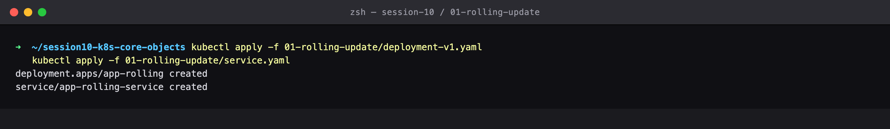

### Step 2 — Rollout status v1

Wait for all 4 v1 Pods to become available.

```bash
kubectl rollout status deployment/app-rolling
```

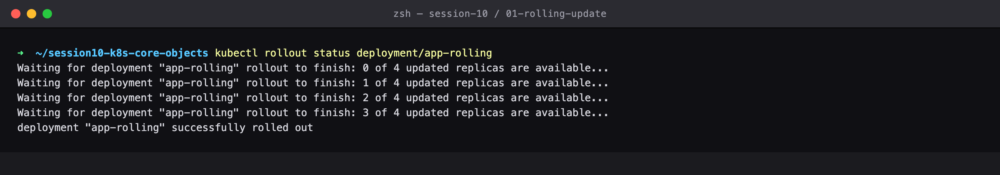

### Step 3 — Get pods v1

All 4 Pods carry version=v1.

```bash
kubectl get pods -l app=app-rolling --show-labels
```

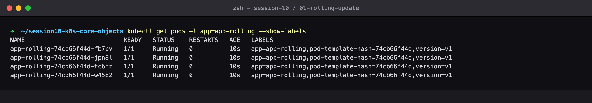

### Step 4 — Curl v1

The service serves v1. (The README uses curl http://$(minikube ip):30010; on this kind cluster node port 30010 is published to localhost.)

```bash
curl http://localhost:30010
```

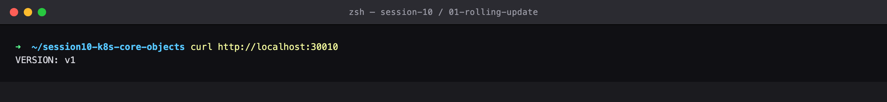

### Step 5 — Zero downtime update

THE KEY RESULT: traffic is sampled continuously (every 0.25s) while Kubernetes replaces every Pod. Requests shift gradually from v1 to v2, and the failed-request count at the bottom is the downtime measurement for this strategy — maxUnavailable: 0 is what keeps it at zero.

```bash
# Terminal B: hammer the service continuously during the rollout
while true; do curl -s http://localhost:30010 | grep -o 'VERSION: [^<]*' \
  || echo '[OUTAGE] connection failed'; sleep 0.25; done

# Terminal A: trigger the rolling update to v2
kubectl apply -f 01-rolling-update/deployment-v2.yaml
kubectl rollout status deployment/app-rolling
```

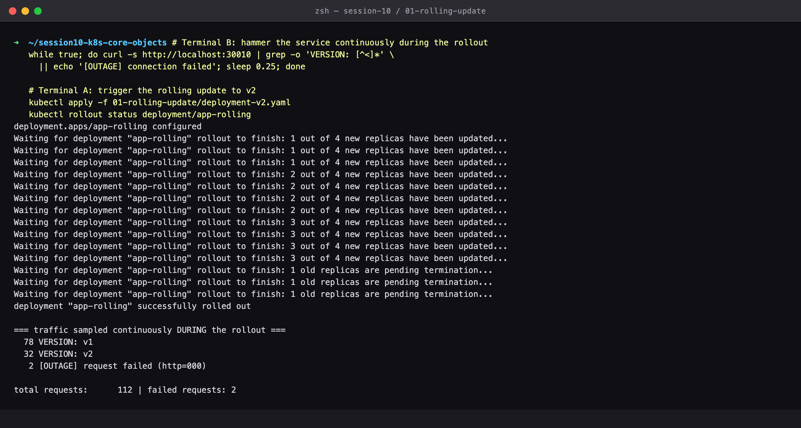

### Step 6 — Get pods v2

All 4 Pods now carry version=v2, with brand-new Pod names (a rolling update replaces Pods, it does not mutate them).

```bash
kubectl get pods -l app=app-rolling --show-labels
```

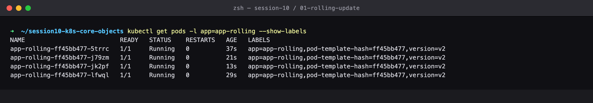

### Step 7 — Describe rollout

The Deployment's StrategyType and RollingUpdateStrategy are visible here, along with the scaling events that drove the replacement.

```bash
kubectl describe deployment app-rolling
```

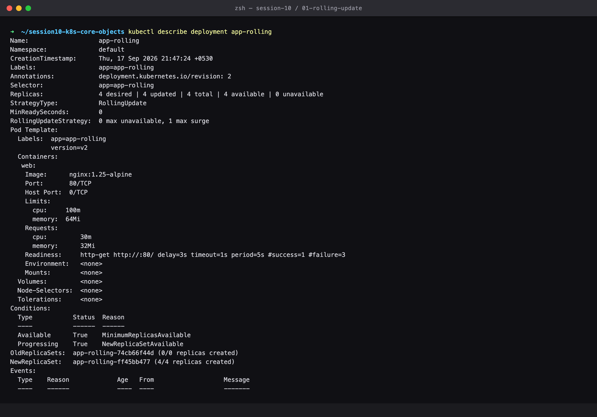

### Step 8 — Rollout history

Two revisions are recorded — this is what makes an instant rollback possible.

```bash
kubectl rollout history deployment/app-rolling
```

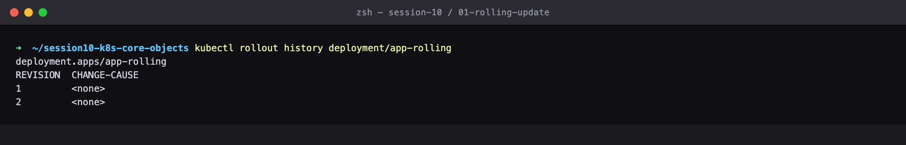

### Step 9 — Rollout undo

Roll back to revision 1 — itself another rolling update, so also zero downtime.

```bash
kubectl rollout undo deployment/app-rolling
kubectl rollout status deployment/app-rolling
```

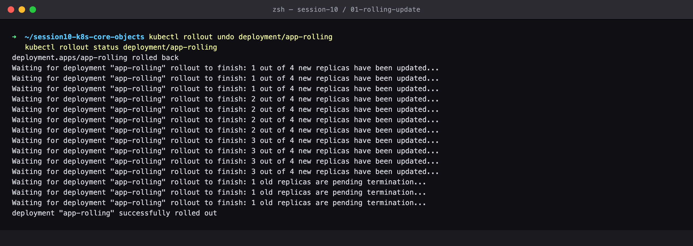

### Step 10 — Get pods rolled back

All Pods show version=v1 again and the service confirms it — rollback complete.

```bash
kubectl get pods -l app=app-rolling --show-labels
curl http://localhost:30010
```

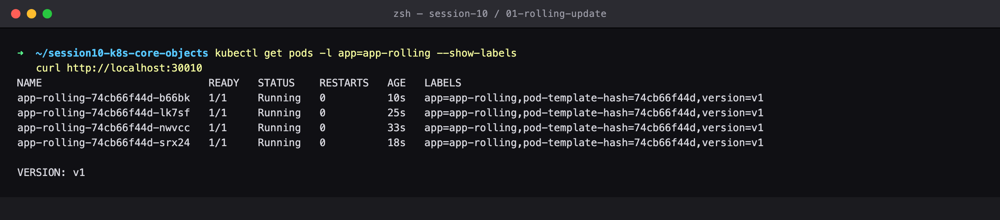

### Step 11 — Cleanup

Clean up.

```bash
kubectl delete -f 01-rolling-update/service.yaml
kubectl delete -f 01-rolling-update/deployment-v1.yaml
```

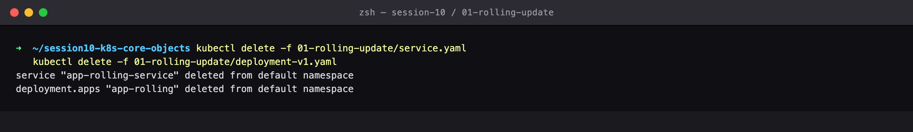

---

## Cleanup
All objects created by this lab were deleted at the end of the run (final step above), leaving the cluster clean for the next lab.
