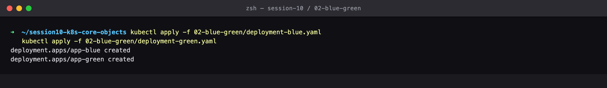
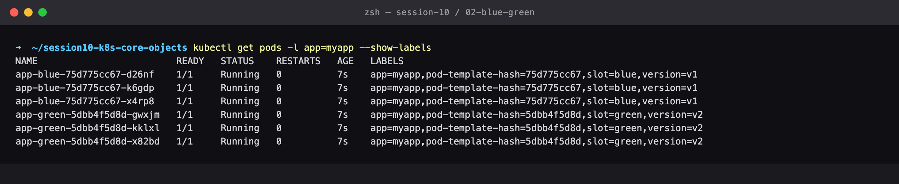
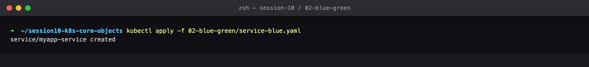
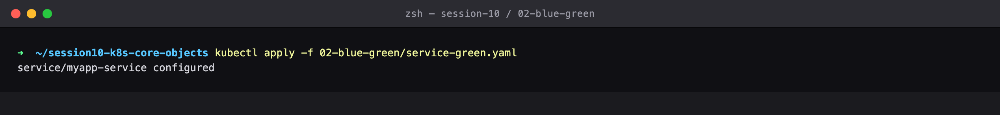
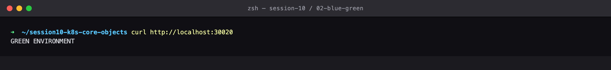
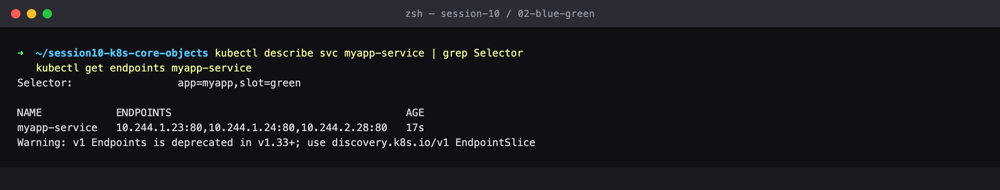
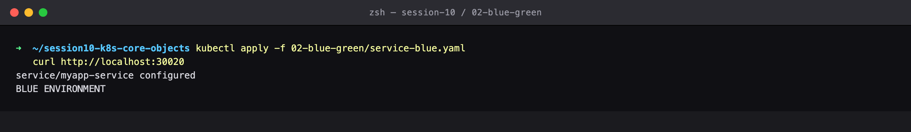
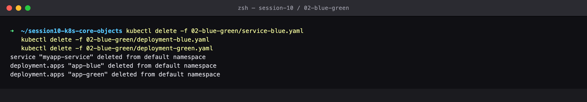

# Session 10 — Blue-Green Deployment Strategy

## Name

Himanshu Rathi

## Roll No

`24BCS10365`

---

**Source folder:** `session10-k8s-core-objects/02-blue-green`  
**Reference README:** the upstream lab README in [`Nency-Ravaliya/devops-heros`](https://github.com/Nency-Ravaliya/devops-heros)

Run two complete environments side by side and cut traffic over instantly by editing nothing but the Service's label selector.

Every command below was executed against a live Kubernetes cluster. Each screenshot is the real terminal output of the command shown directly above it — nothing is mocked or hand-written.

---

## Environment

| | |
|---|---|
| **Cluster** | `kind` v0.31.0 — 1 control-plane node + 2 worker nodes, running in Docker |
| **Kubernetes** | v1.35.0 |
| **kubectl** | v1.34.1 |
| **Host** | macOS (Apple Silicon), Docker Desktop |
| **Date run** | 17 September 2026 |

> **Note on Minikube vs kind.** The upstream READMEs are written for Minikube. This submission was
> produced on a 3-node **kind** cluster, which exercises the same Kubernetes APIs but gives a real
> multi-node topology (so Pods genuinely spread across nodes, and NodePort can be proven to answer
> on *every* node). The only command-level difference is how the cluster is reached from the host:
> wherever a README says `curl http://$(minikube ip):PORT`, this run uses `curl http://localhost:PORT`,
> because the kind cluster publishes those node ports to the host. Every `kubectl` command is
> unchanged.

---

## Key takeaways

- Both versions run at FULL capacity simultaneously — double the Pods and double the cost, bought in exchange for an instant cutover.
- The Service selector is the entire switch. Flipping `version: blue` to `version: green` swaps the endpoint list wholesale; no Pod is created or destroyed.
- Rollback is the same operation in reverse and is effectively instantaneous, because the blue Pods were never torn down.
- `kubectl get endpoints` is the fastest way to prove which environment is actually receiving traffic.

---

## Commands executed, with output

### Step 1 — Apply both

Blue-green runs BOTH versions at full capacity simultaneously. Double the Pods, double the cost — bought in exchange for an instant switch and instant rollback.

```bash
kubectl apply -f 02-blue-green/deployment-blue.yaml
kubectl apply -f 02-blue-green/deployment-green.yaml
```



### Step 2 — Get pods

Both environments are Running side by side, distinguished only by the version label.

```bash
kubectl get pods -l app=myapp --show-labels
```



### Step 3 — Apply Service blue

Point the Service selector at BLUE. The Service is the traffic switch.

```bash
kubectl apply -f 02-blue-green/service-blue.yaml
```



### Step 4 — Curl blue

Live traffic is served by the blue environment.

```bash
curl http://localhost:30020
```


### Step 5 — Selector blue

The selector includes version=blue, so only blue Pod IPs are in the endpoint list.

```bash
kubectl describe svc myapp-service | grep Selector
kubectl get endpoints myapp-service
```


### Step 6 — Switch green

THE CUTOVER: re-apply the same Service with the selector flipped to green. No Pods are created or destroyed — only the routing changes.

```bash
kubectl apply -f 02-blue-green/service-green.yaml
```



### Step 7 — Curl green

Instantly serving green. The switch took effect in well under a second.

```bash
curl http://localhost:30020
```



### Step 8 — Selector green

The endpoint list swapped wholesale to the green Pod IPs.

```bash
kubectl describe svc myapp-service | grep Selector
kubectl get endpoints myapp-service
```



### Step 9 — Rollback blue

ROLLBACK: green misbehaving? Flip the selector back. Recovery is immediate because the blue Pods never went away.

```bash
kubectl apply -f 02-blue-green/service-blue.yaml
curl http://localhost:30020
```



### Step 10 — Cleanup

Clean up.

```bash
kubectl delete -f 02-blue-green/service-blue.yaml
kubectl delete -f 02-blue-green/deployment-blue.yaml
kubectl delete -f 02-blue-green/deployment-green.yaml
```



---

## Cleanup
All objects created by this lab were deleted at the end of the run (final step above), leaving the cluster clean for the next lab.
