# Session 10 — Canary Deployment Strategy

## Name

Himanshu Rathi

## Roll No

`24BCS10365`

---

**Source folder:** `session10-k8s-core-objects/03-canary`  
**Reference README:** the upstream lab README in [`Nency-Ravaliya/devops-heros`](https://github.com/Nency-Ravaliya/devops-heros)

Expose a small percentage of real users to a new version, widen the exposure gradually, and prove both the promotion and the abort path.

Every command below was executed against a live Kubernetes cluster. Each screenshot is the real terminal output of the command shown directly above it — nothing is mocked or hand-written.

---

## Environment

| | |
|---|---|
| **Cluster** | `kind` v0.31.0 — 1 control-plane node + 2 worker nodes, running in Docker |
| **Kubernetes** | v1.35.0 |
| **kubectl** | v1.34.1 |
| **Host** | macOS (Apple Silicon), Docker Desktop |
| **Date run** | 17 September 2026 |

> **Note on Minikube vs kind.** The upstream READMEs are written for Minikube. This submission was
> produced on a 3-node **kind** cluster, which exercises the same Kubernetes APIs but gives a real
> multi-node topology (so Pods genuinely spread across nodes, and NodePort can be proven to answer
> on *every* node). The only command-level difference is how the cluster is reached from the host:
> wherever a README says `curl http://$(minikube ip):PORT`, this run uses `curl http://localhost:PORT`,
> because the kind cluster publishes those node ports to the host. Every `kubectl` command is
> unchanged.

---

## Key takeaways

- The trick is the Service selector matching only `app: myapp-canary` and deliberately IGNORING the `track` label, so stable and canary Pods share one endpoint pool.
- Traffic share is therefore controlled purely by replica counts: 9 stable + 1 canary ≈ 10% canary traffic, and 7 + 3 ≈ 30%.
- Widening the canary needs no Service change at all — just `kubectl scale`.
- The abort path is the important half: scaling the canary to 0 removes it from the endpoint pool immediately and every request returns to the stable version.

---

## Commands executed, with output

### Step 1 — Apply stable

Deploy the stable track at 9 replicas.

```bash
kubectl apply -f 03-canary/deployment-stable.yaml
kubectl rollout status deployment/app-stable
```

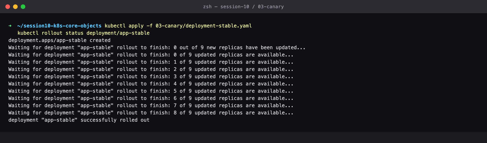

### Step 2 — Apply service

The Service selects on app=myapp-canary ONLY — deliberately ignoring the `track` label, so both tracks land in the same endpoint pool. Traffic share is therefore controlled purely by replica counts.

```bash
kubectl apply -f 03-canary/service.yaml
kubectl describe svc myapp-canary-service | grep Selector
```

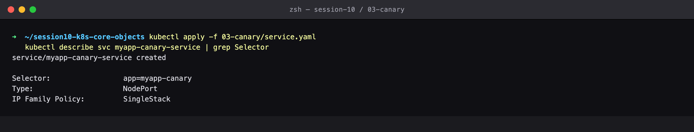

### Step 3 — Traffic 100% stable

Baseline: 10/10 requests hit STABLE v1.

```bash
for i in $(seq 1 10); do curl -s http://localhost:30030 | grep -o 'STABLE v1\|CANARY v2'; done | sort | uniq -c
```

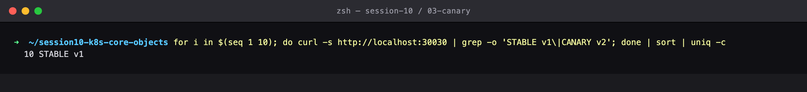

### Step 4 — Apply canary

Release the canary: 1 replica alongside 9 stable = roughly 10% of traffic.

```bash
kubectl apply -f 03-canary/deployment-canary.yaml
kubectl rollout status deployment/app-canary
```

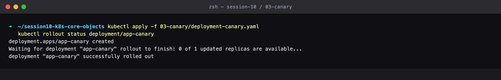

### Step 5 — Get pods labels

9 Pods labelled track=stable and 1 labelled track=canary, all sharing app=myapp-canary.

```bash
kubectl get pods -l app=myapp-canary --show-labels
```

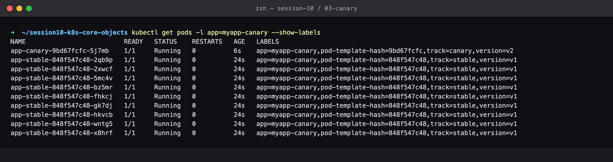

### Step 6 — Traffic 10%

20 requests across a 9:1 pool — roughly 10% reach the canary. Only that slice of users is exposed to the new version.

```bash
for i in $(seq 1 20); do curl -s http://localhost:30030 | grep -o 'STABLE v1\|CANARY v2'; done | sort | uniq -c
```


### Step 7 — Scale 30%

Widen the canary to 30% by shifting replica counts. No Service change needed.

```bash
kubectl scale deployment app-canary --replicas=3
kubectl scale deployment app-stable --replicas=7
```

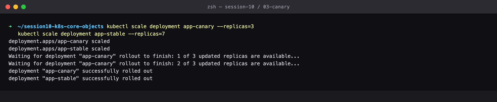

### Step 8 — Endpoints 10

One endpoint pool of 10 Pod IPs: 7 stable + 3 canary.

```bash
kubectl get endpoints myapp-canary-service
```

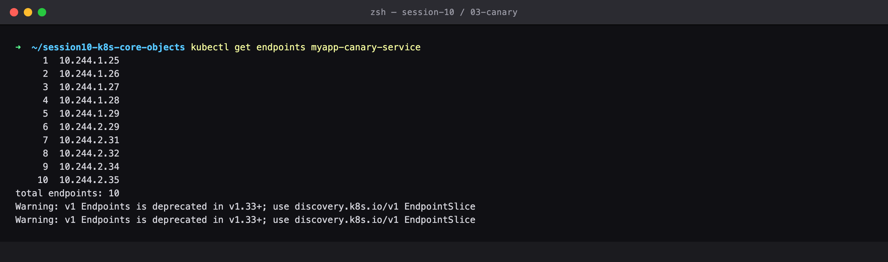

### Step 9 — Traffic 30%

Traffic now splits roughly 70/30, tracking the replica ratio.

```bash
for i in $(seq 1 20); do curl -s http://localhost:30030 | grep -o 'STABLE v1\|CANARY v2'; done | sort | uniq -c
```

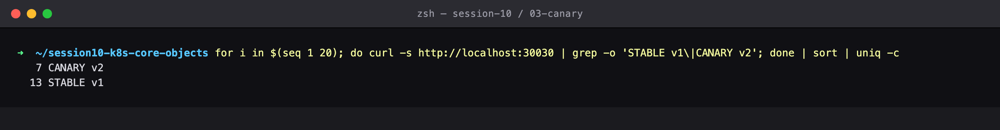

### Step 10 — Promote

PROMOTION: the canary looked healthy, so scale it to full and drain stable to zero.

```bash
kubectl scale deployment app-canary --replicas=9
kubectl scale deployment app-stable --replicas=0
```

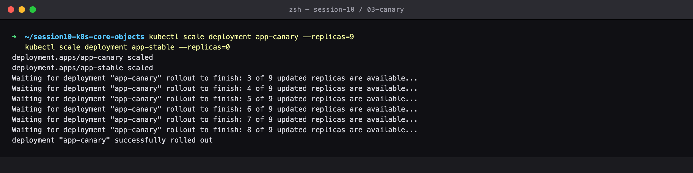

### Step 11 — Traffic 100% canary

100% CANARY v2 — the release is complete.

```bash
for i in $(seq 1 10); do curl -s http://localhost:30030 | grep -o 'STABLE v1\|CANARY v2'; done | sort | uniq -c
```

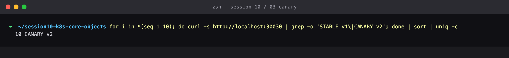

### Step 12 — Abort

THE ABORT PATH: scaling the canary to zero pulls it out of the endpoint pool immediately and every request returns to STABLE v1.

```bash
# the abort path, if the canary had looked bad instead
kubectl scale deployment app-canary --replicas=0
kubectl scale deployment app-stable --replicas=9
for i in $(seq 1 10); do curl -s http://localhost:30030 | grep -o 'STABLE v1\|CANARY v2'; done | sort | uniq -c
```

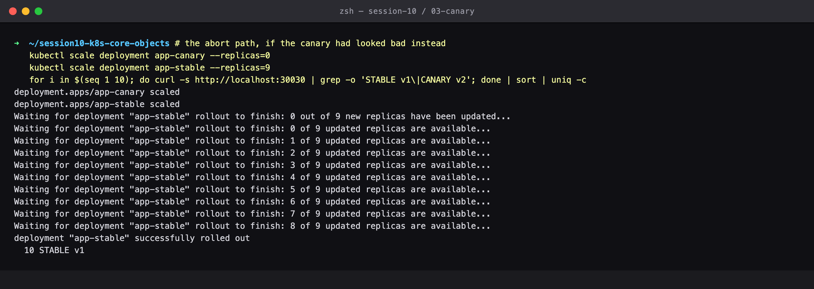

### Step 13 — Cleanup

Clean up.

```bash
kubectl delete -f 03-canary/service.yaml
kubectl delete -f 03-canary/deployment-canary.yaml
kubectl delete -f 03-canary/deployment-stable.yaml
```

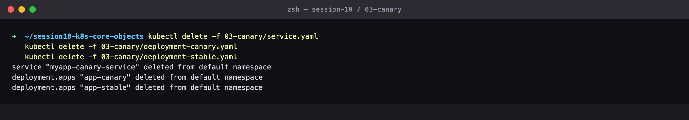

---

## Cleanup
All objects created by this lab were deleted at the end of the run (final step above), leaving the cluster clean for the next lab.
