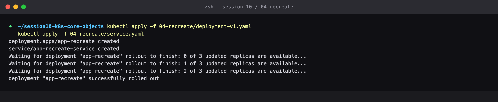
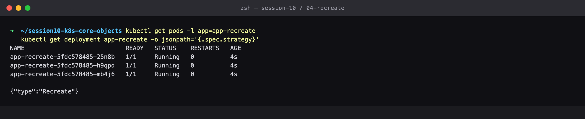
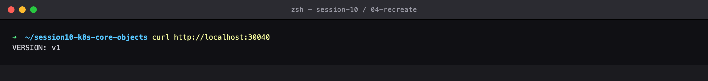
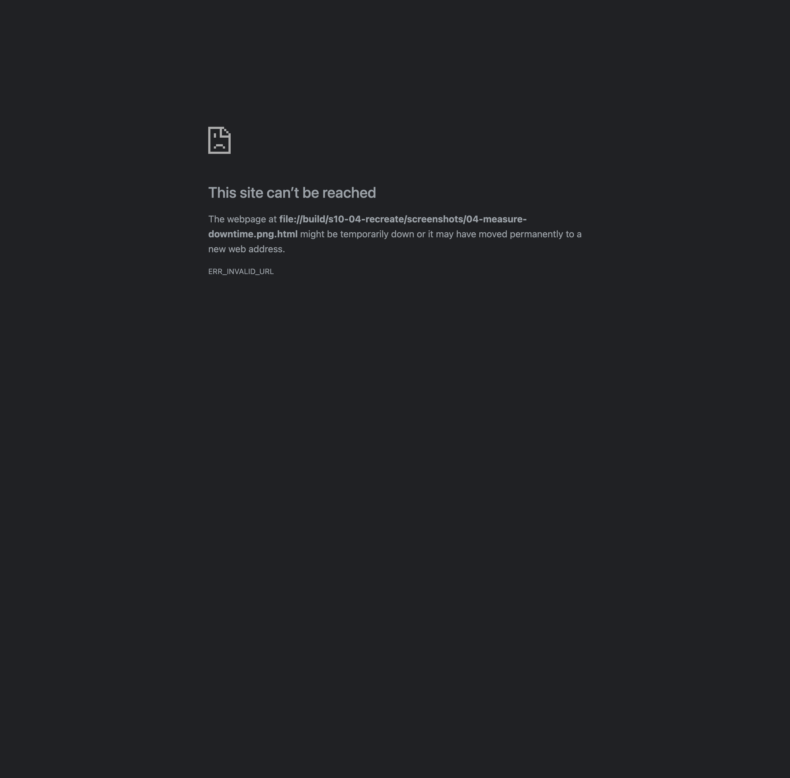
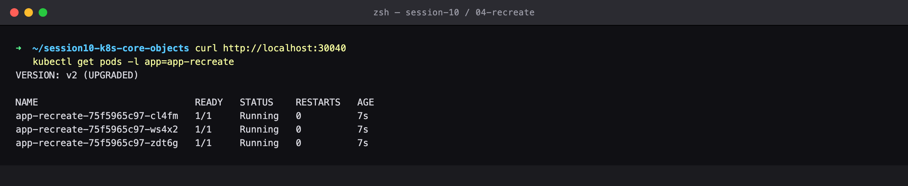
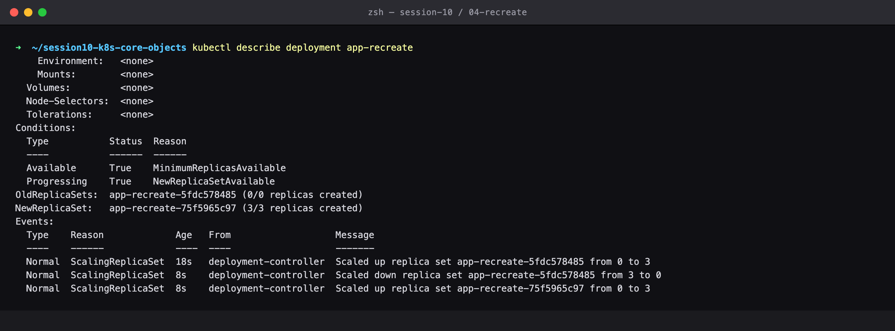
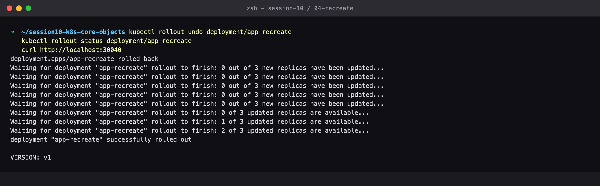
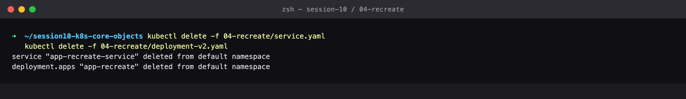

# Session 10 — Recreate Deployment Strategy

## Name

Himanshu Rathi

## Roll No

`24BCS10365`

---

**Source folder:** `session10-k8s-core-objects/04-recreate`  
**Reference README:** the upstream lab README in [`Nency-Ravaliya/devops-heros`](https://github.com/Nency-Ravaliya/devops-heros)

The deliberate-downtime strategy: terminate every old Pod before starting any new one, with the resulting outage window measured request by request.

Every command below was executed against a live Kubernetes cluster. Each screenshot is the real terminal output of the command shown directly above it — nothing is mocked or hand-written.

---

## Environment

| | |
|---|---|
| **Cluster** | `kind` v0.31.0 — 1 control-plane node + 2 worker nodes, running in Docker |
| **Kubernetes** | v1.35.0 |
| **kubectl** | v1.34.1 |
| **Host** | macOS (Apple Silicon), Docker Desktop |
| **Date run** | 17 September 2026 |

> **Note on Minikube vs kind.** The upstream READMEs are written for Minikube. This submission was
> produced on a 3-node **kind** cluster, which exercises the same Kubernetes APIs but gives a real
> multi-node topology (so Pods genuinely spread across nodes, and NodePort can be proven to answer
> on *every* node). The only command-level difference is how the cluster is reached from the host:
> wherever a README says `curl http://$(minikube ip):PORT`, this run uses `curl http://localhost:PORT`,
> because the kind cluster publishes those node ports to the host. Every `kubectl` command is
> unchanged.

---

## Key takeaways

- `strategy.type: Recreate` takes no `maxSurge`/`maxUnavailable` because it kills everything first by design.
- The measured traffic log shows a CONTIGUOUS block of failed requests sitting between the last v1 response and the first v2 response. That block IS the downtime.
- `kubectl describe deployment` proves the ordering: 'Scaled down ... to 0' is logged BEFORE 'Scaled up ... to 2'.
- Use it when two versions genuinely cannot coexist — incompatible database schema migrations, or a single-writer process holding an exclusive lock.
- Rolling back costs the same downtime, because the rollback is also a Recreate.

---

## Commands executed, with output

### Step 1 — Apply v1

Deploy v1 with strategy type: Recreate.

```bash
kubectl apply -f 04-recreate/deployment-v1.yaml
kubectl apply -f 04-recreate/service.yaml
```



### Step 2 — Get pods

Strategy is Recreate — there is no maxSurge/maxUnavailable, because Kubernetes will kill everything before starting anything.

```bash
kubectl get pods -l app=app-recreate
kubectl get deployment app-recreate -o jsonpath='{.spec.strategy}'
```



### Step 3 — Curl v1

v1 is serving.

```bash
curl http://localhost:30040
```



### Step 4 — Measure downtime

THE KEY RESULT — the exact opposite of the rolling update. Kubernetes terminates ALL v1 Pods before creating any v2 Pods, so there is a measurable window of failed requests. The [OUTAGE] lines between the last v1 and the first v2 ARE the downtime.

```bash
# Terminal B: sample traffic continuously during the update
while true; do curl -s --connect-timeout 1 http://localhost:30040 | grep -o 'VERSION: [^<]*' \
  || echo '[OUTAGE] Connection failed'; sleep 0.1; done

# Terminal A: trigger the recreate to v2
kubectl apply -f 04-recreate/deployment-v2.yaml
```



### Step 5 — Curl v2

v2 is up and serving, on entirely new Pods.

```bash
curl http://localhost:30040
kubectl get pods -l app=app-recreate
```



### Step 6 — Events

The event log proves the ordering: 'Scaled down replica set ... to 0' happens BEFORE 'Scaled up replica set ... to 2'.

```bash
kubectl describe deployment app-recreate
```



### Step 7 — Rollout undo

Rolling back takes the same downtime hit — Recreate applies to rollbacks too.

```bash
kubectl rollout undo deployment/app-recreate
kubectl rollout status deployment/app-recreate
curl http://localhost:30040
```



### Step 8 — Cleanup

Clean up.

```bash
kubectl delete -f 04-recreate/service.yaml
kubectl delete -f 04-recreate/deployment-v2.yaml
```



---

## Cleanup
All objects created by this lab were deleted at the end of the run (final step above), leaving the cluster clean for the next lab.
