# Session 10 — Pod Lifecycle, Phases & Probes

## Name

Himanshu Rathi

## Roll No

`24BCS10365`

---

**Source folder:** `session10-k8s-core-objects/pod-lifecycle`  
**Reference README:** the upstream lab README in [`Nency-Ravaliya/devops-heros`](https://github.com/Nency-Ravaliya/devops-heros)

Every Pod phase and failure mode reproduced deliberately — Running, Pending, Succeeded, Failed, CrashLoopBackOff, ImagePullBackOff — plus all three probe types, init containers, sidecars and graceful termination.

Every command below was executed against a live Kubernetes cluster. Each screenshot is the real terminal output of the command shown directly above it — nothing is mocked or hand-written.

---

## Environment

| | |
|---|---|
| **Cluster** | `kind` v0.31.0 — 1 control-plane node + 2 worker nodes, running in Docker |
| **Kubernetes** | v1.35.0 |
| **kubectl** | v1.34.1 |
| **Host** | macOS (Apple Silicon), Docker Desktop |
| **Date run** | 17 September 2026 |

> **Note on Minikube vs kind.** The upstream READMEs are written for Minikube. This submission was
> produced on a 3-node **kind** cluster, which exercises the same Kubernetes APIs but gives a real
> multi-node topology (so Pods genuinely spread across nodes, and NodePort can be proven to answer
> on *every* node). The only command-level difference is how the cluster is reached from the host:
> wherever a README says `curl http://$(minikube ip):PORT`, this run uses `curl http://localhost:PORT`,
> because the kind cluster publishes those node ports to the host. Every `kubectl` command is
> unchanged.

---

## Key takeaways

- `Pending` means the API server accepted the Pod but the scheduler cannot place it; `kubectl describe` names the exact failed predicate (here, Insufficient memory).
- `CrashLoopBackOff` is not itself an error — it is Kubernetes backing off (10s, 20s, 40s...) between restarts so a broken Pod cannot saturate the node.
- `kubectl logs --previous` is the essential debugging move for a crash loop: it reads the logs of the container that already died.
- `ImagePullBackOff` produces NO logs, because the container never started — the evidence lives only in the Pod's events.
- readinessProbe controls whether a Pod receives traffic; livenessProbe controls whether it gets RESTARTED; startupProbe holds the liveness probe off while a slow app boots.
- Termination is graceful: Kubernetes sends SIGTERM and waits out `terminationGracePeriodSeconds`, which is what lets a real service drain in-flight requests instead of dropping them.

---

## Commands executed, with output

### Step 1 — Apply running

PHASE 1 — Running. The healthy baseline every other phase is compared against.

```bash
kubectl apply -f 01-running.yaml
```

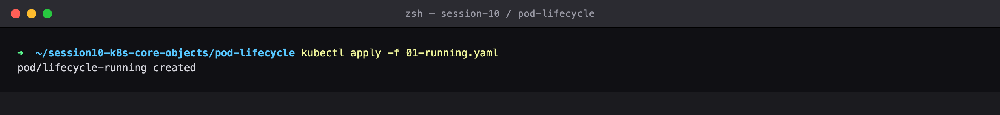

### Step 2 — Watch running

Watching the Pod transition Pending -> ContainerCreating -> Running in real time.

```bash
kubectl get pod lifecycle-running -w
```

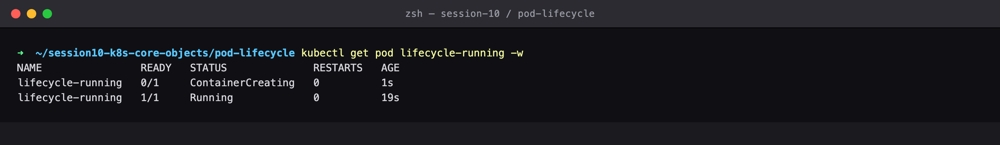

### Step 3 — Describe running

The Events block is the single most useful debugging surface on a Pod: Scheduled -> Pulled -> Created -> Started.

```bash
kubectl describe pod lifecycle-running
```

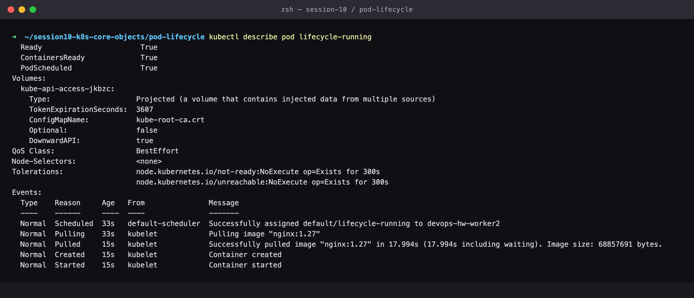

### Step 4 — Container state

The container state object shows `running` with its startedAt timestamp, and the Pod phase is Running.

```bash
kubectl get pod lifecycle-running -o jsonpath='{.status.containerStatuses[0].state}'
```

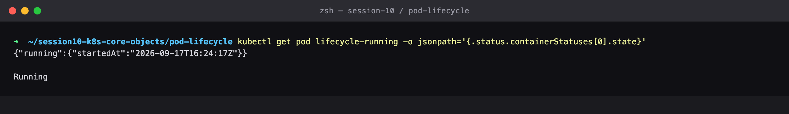

### Step 5 — Apply pending

PHASE 2 — Pending. This Pod requests 9Gi of memory, which no node in the cluster can satisfy.

```bash
kubectl apply -f 02-pending.yaml
```

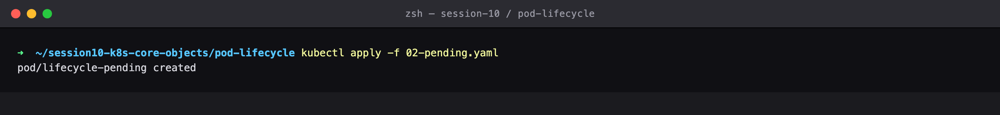

### Step 6 — Get pending

STATUS stays Pending forever — the Pod was accepted by the API server but the scheduler cannot place it.

```bash
kubectl get pod lifecycle-pending
```

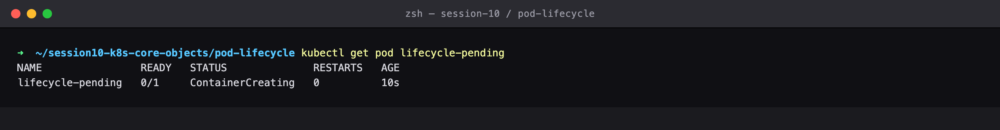

### Step 7 — Describe pending

THE DIAGNOSIS: FailedScheduling — 'Insufficient memory'. The scheduler reports exactly which predicate failed on each node.

```bash
kubectl describe pod lifecycle-pending
```

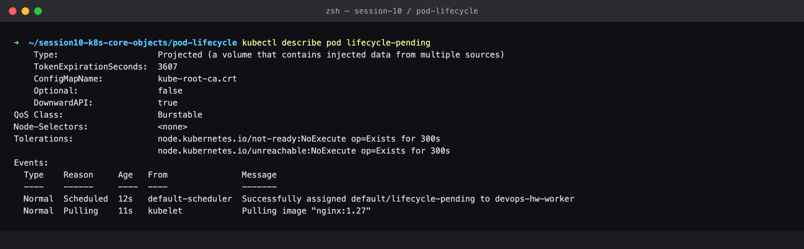

### Step 8 — Apply succeeded

PHASE 3 — Succeeded. A batch-style Pod whose container exits 0.

```bash
kubectl apply -f 03-succeeded.yaml
```


### Step 9 — Get succeeded

STATUS Completed / phase Succeeded. Note restartPolicy must not be Always, or Kubernetes would keep restarting it.

```bash
kubectl get pod lifecycle-succeeded
```

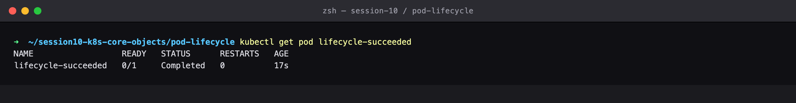

### Step 10 — Logs succeeded

Logs survive after the container exits, which is how you audit finished Jobs.

```bash
kubectl logs lifecycle-succeeded
```

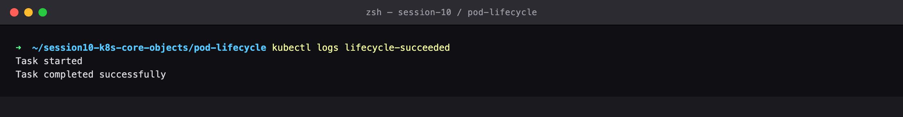

### Step 11 — Apply failed

PHASE 4 — Failed. The container exits with a non-zero code.

```bash
kubectl apply -f 04-failed.yaml
```

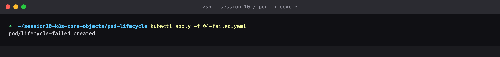

### Step 12 — Get failed

STATUS Error, phase Failed, and the terminated exit code is 1 — the container ran to completion but reported failure.

```bash
kubectl get pod lifecycle-failed
kubectl get pod lifecycle-failed -o jsonpath='{.status.containerStatuses[0].state.terminated.exitCode}'
```

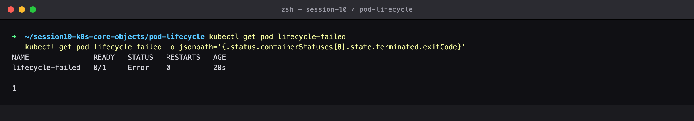

### Step 13 — Logs failed

The application's own output explains why it failed.

```bash
kubectl logs lifecycle-failed
```

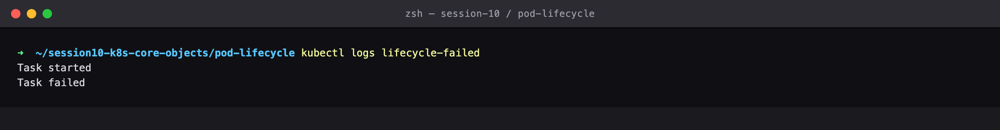

### Step 14 — Apply CrashLoopBackOff

PHASE 5 — CrashLoopBackOff, the single most common production Pod failure. The container starts, runs 3 seconds, then exits 1 — forever.

```bash
kubectl apply -f 05-crashloopbackoff.yaml
```

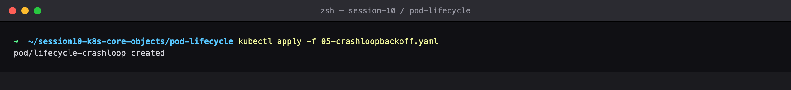

### Step 15 — Watch CrashLoopBackOff

Watch the cycle live: Running -> Error -> CrashLoopBackOff -> Running -> Error. The RESTARTS counter climbs and the back-off delay grows (10s, 20s, 40s...) so a broken Pod cannot saturate the node.

```bash
kubectl get pod lifecycle-crashloop -w
```

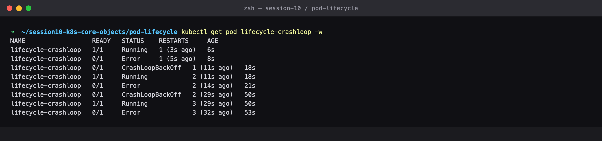

### Step 16 — Describe CrashLoopBackOff

'Back-off restarting failed container' plus the Last State block showing the previous termination reason and exit code.

```bash
kubectl describe pod lifecycle-crashloop
```

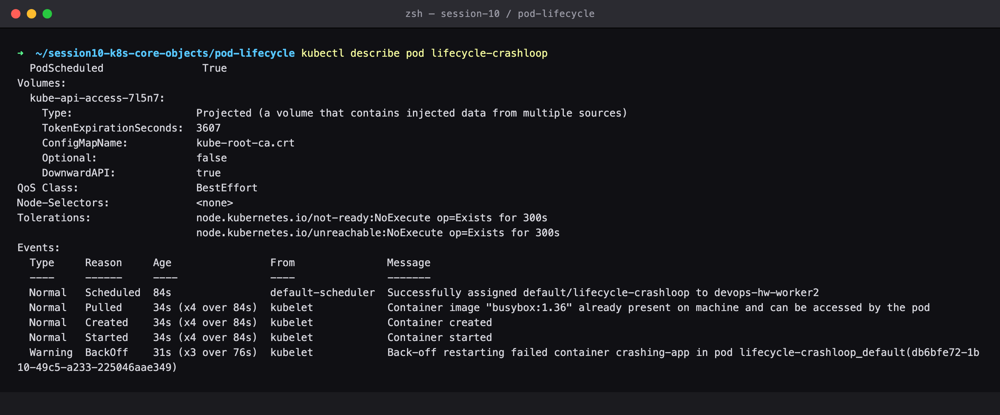

### Step 17 — Logs CrashLoopBackOff previous

THE CRITICAL DEBUGGING MOVE: --previous reads the logs of the container that already died. Without it you often catch a container too early to see the error.

```bash
kubectl logs lifecycle-crashloop
kubectl logs lifecycle-crashloop --previous
```

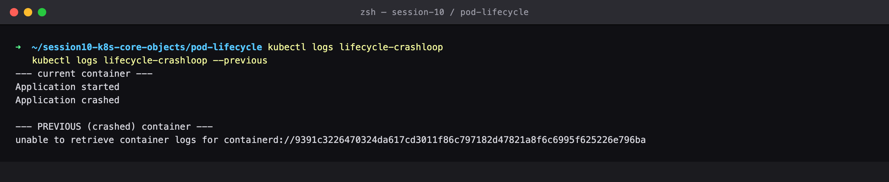

### Step 18 — Apply ImagePullBackOff

PHASE 6 — ImagePullBackOff. The image name is deliberately nonsense.

```bash
kubectl apply -f 06-imagepullbackoff.yaml
```

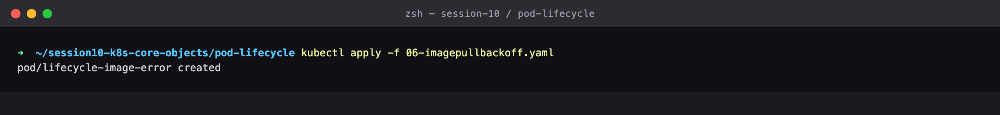

### Step 19 — Get ImagePullBackOff

STATUS cycles ErrImagePull -> ImagePullBackOff. The container never starts at all, so there are no logs to read.

```bash
kubectl get pod lifecycle-image-error
```

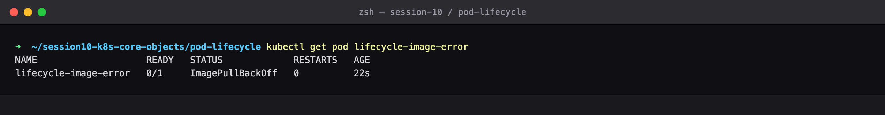

### Step 20 — Describe ImagePullBackOff

THE DIAGNOSIS: 'Failed to pull image ... not found'. In production this is usually a typo, a missing tag, or missing registry credentials (imagePullSecrets).

```bash
kubectl describe pod lifecycle-image-error
```

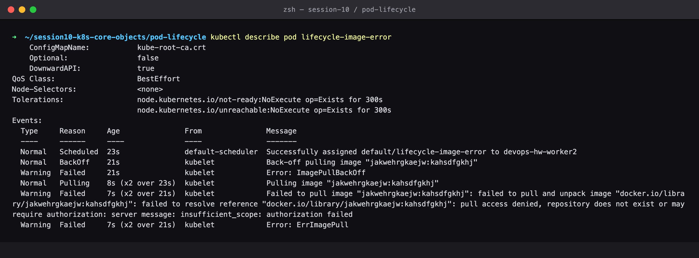

### Step 21 — Apply readiness

PROBE 1 — readinessProbe. Controls whether the Pod receives Service traffic.

```bash
kubectl apply -f 07-readiness.yaml
```

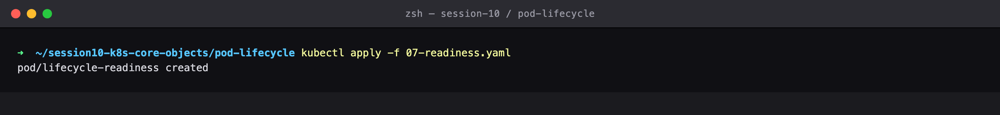

### Step 22 — Watch readiness

Watch READY go 0/1 -> 1/1. A Pod can be Running yet NOT Ready — while 0/1 it is kept out of Service endpoints, which is exactly what prevents traffic hitting a container that has not finished warming up.

```bash
kubectl get pod lifecycle-readiness -w
```

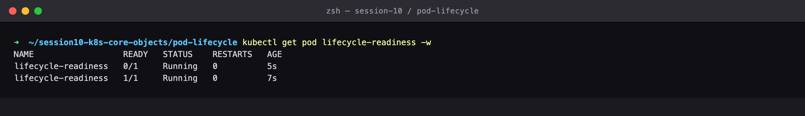

### Step 23 — Describe readiness

The probe definition and the resulting Ready condition.

```bash
kubectl describe pod lifecycle-readiness | grep -A4 Readiness
kubectl get pod lifecycle-readiness -o jsonpath='{.status.conditions[?(@.type=="Ready")]}'
```

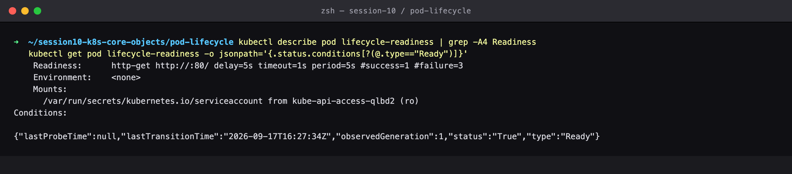

### Step 24 — Apply liveness

PROBE 2 — livenessProbe. Controls whether the container gets RESTARTED.

```bash
kubectl apply -f 08-liveness.yaml
```


### Step 25 — Watch liveness

The probe begins to fail, and Kubernetes kills and restarts the container — watch RESTARTS increment. This is the self-healing mechanism: a hung process that is still 'running' gets recycled automatically.

```bash
kubectl get pod lifecycle-liveness -w
```

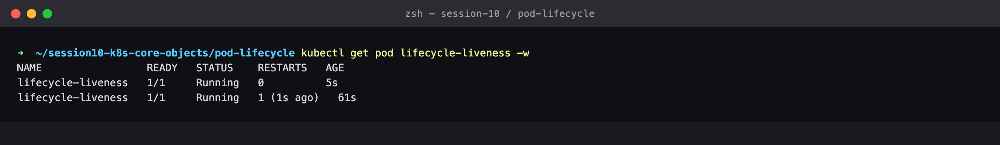

### Step 26 — Describe liveness

'Liveness probe failed' followed by 'Container ... failed liveness probe, will be restarted' — the full self-healing audit trail.

```bash
kubectl describe pod lifecycle-liveness
```

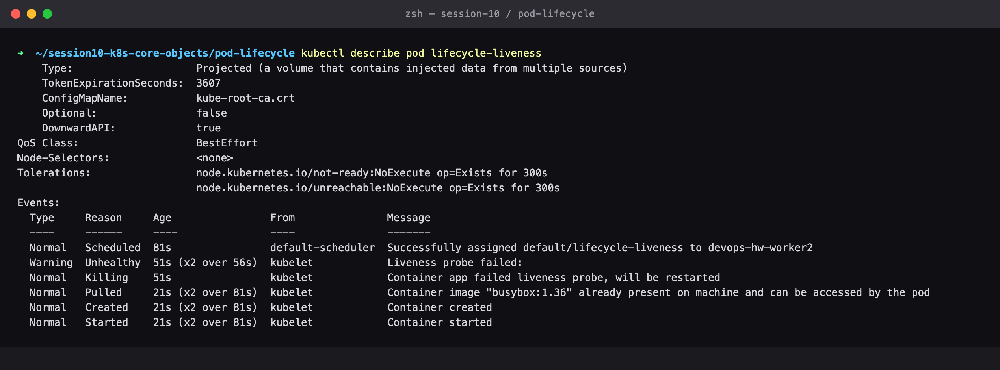

### Step 27 — Apply startup

PROBE 3 — startupProbe. Protects slow-booting apps from being killed by the liveness probe before they finish starting.

```bash
kubectl apply -f 09-startup.yaml
```


### Step 28 — Watch startup

The app sleeps 30s before creating /tmp/started. The startupProbe (failureThreshold 10 x periodSeconds 5 = 50s of grace) holds the liveness probe off until then, so the Pod is never prematurely killed.

```bash
kubectl get pod lifecycle-startup -w
```

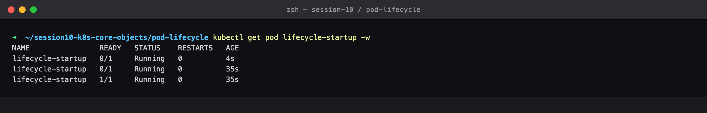

### Step 29 — Describe startup

Both probes are configured; the startup probe gates the liveness probe.

```bash
kubectl describe pod lifecycle-startup | grep -E 'Liveness|Startup'
```

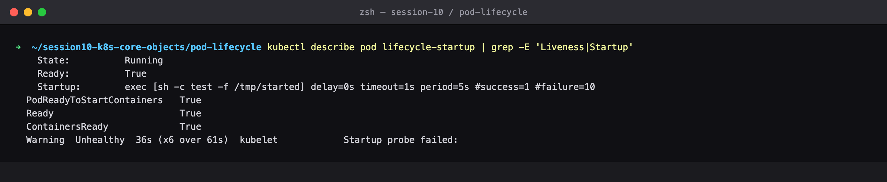

### Step 30 — Apply init container

INIT CONTAINERS — run to completion, in order, BEFORE the app container starts.

```bash
kubectl apply -f 10-init-container.yaml
```

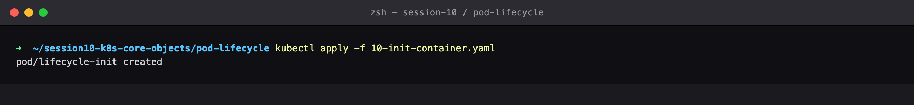

### Step 31 — Watch init container

STATUS shows Init:0/1 while the init container runs, then PodInitializing, then Running. The app container literally cannot start until init exits 0.

```bash
kubectl get pod lifecycle-init -w
```

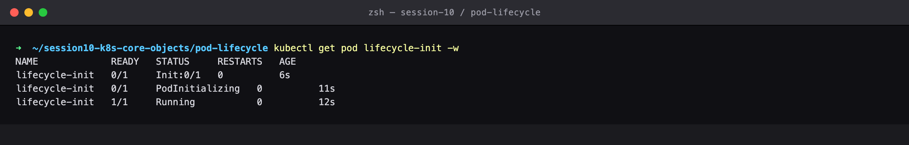

### Step 32 — Logs init container

Init container logs are fetched with -c <name>. This pattern is how you wait for a database migration or a config fetch before booting the app.

```bash
kubectl logs lifecycle-init -c setup
kubectl describe pod lifecycle-init
```

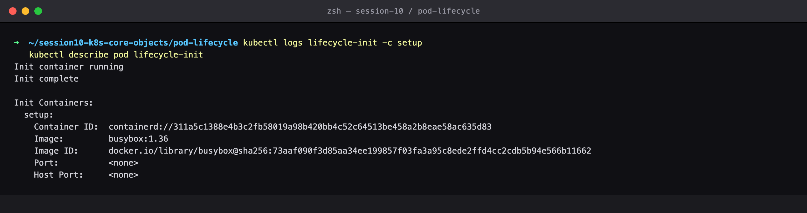

### Step 33 — Apply multi-container

MULTI-CONTAINER PODS — the sidecar pattern. Containers in one Pod share a network namespace and volumes.

```bash
kubectl apply -f 11-multi-container.yaml
```

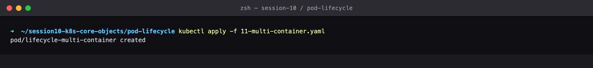

### Step 34 — Get multi-container

READY reads 2/2 — one Pod, two containers, one shared lifecycle and one Pod IP.

```bash
kubectl get pod lifecycle-multi-container
```

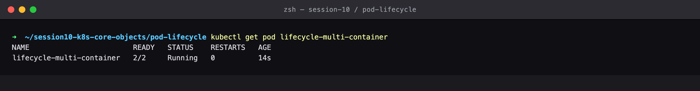

### Step 35 — Logs multi-container

Each container has its own log stream, addressed with -c. The sidecar is reading what the app wrote through the shared volume.

```bash
kubectl logs lifecycle-multi-container -c app
kubectl logs lifecycle-multi-container -c sidecar
```

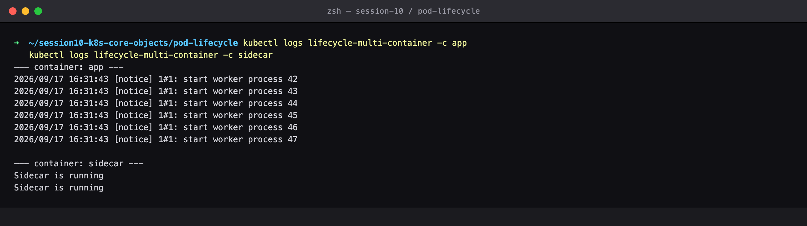

### Step 36 — Apply termination

GRACEFUL TERMINATION — this container traps SIGTERM and takes 10s to clean up, with terminationGracePeriodSeconds: 20.

```bash
kubectl apply -f 12-termination.yaml
```

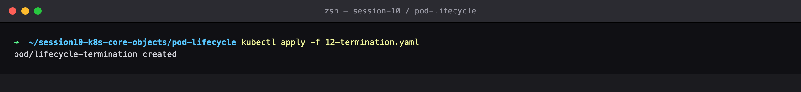

### Step 37 — Get termination

Running normally before deletion.

```bash
kubectl get pod lifecycle-termination
```

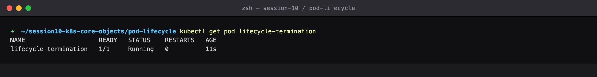

### Step 38 — Delete termination

THE SHUTDOWN SEQUENCE: the Pod goes to Terminating, Kubernetes sends SIGTERM, and the app gets its grace period to finish. It is NOT killed instantly — that is what lets a real service drain in-flight requests.

```bash
kubectl delete pod lifecycle-termination   # in terminal A
kubectl get pod lifecycle-termination -w    # in terminal B
```

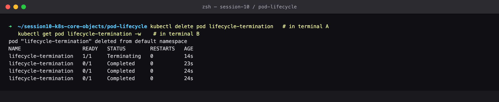

### Step 39 — Logs termination

The trap handler's output proves the app received SIGTERM and ran its cleanup rather than being SIGKILLed.

```bash
kubectl logs lifecycle-termination
```

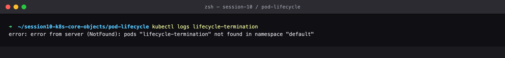

### Step 40 — All pods

Every lifecycle state side by side in one view — Running, Pending, Completed, Error, CrashLoopBackOff and ImagePullBackOff.

```bash
kubectl get pods -o wide
```

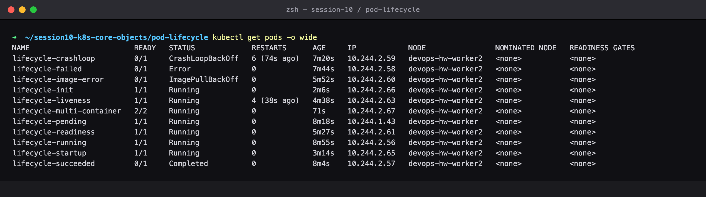

### Step 41 — Cleanup

Delete every Pod created by this lab.

```bash
kubectl delete -f .
```

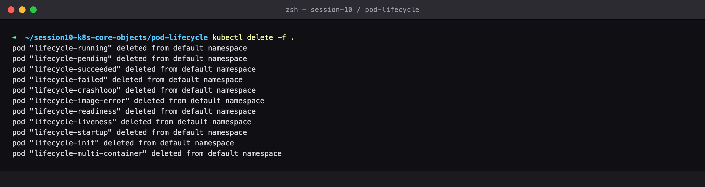

---

## Cleanup
All objects created by this lab were deleted at the end of the run (final step above), leaving the cluster clean for the next lab.
