# Session 11 — ClusterIP Service — Internal Communication

## Name

Himanshu Rathi

## Roll No

`24BCS10365`

---

**Source folder:** `session-11-kubernetes-services/01-clusterip`  
**Reference README:** the upstream lab README in [`Nency-Ravaliya/devops-heros`](https://github.com/Nency-Ravaliya/devops-heros)

The default Service type: a stable internal virtual IP and DNS name that fronts a set of ephemeral Pods, reachable only from inside the cluster.

Every command below was executed against a live Kubernetes cluster. Each screenshot is the real terminal output of the command shown directly above it — nothing is mocked or hand-written.

---

## Environment

| | |
|---|---|
| **Cluster** | `kind` v0.31.0 — 1 control-plane node + 2 worker nodes, running in Docker |
| **Kubernetes** | v1.35.0 |
| **kubectl** | v1.34.1 |
| **Host** | macOS (Apple Silicon), Docker Desktop |
| **Date run** | 17 September 2026 |

> **Note on Minikube vs kind.** The upstream READMEs are written for Minikube. This submission was
> produced on a 3-node **kind** cluster, which exercises the same Kubernetes APIs but gives a real
> multi-node topology (so Pods genuinely spread across nodes, and NodePort can be proven to answer
> on *every* node). The only command-level difference is how the cluster is reached from the host:
> wherever a README says `curl http://$(minikube ip):PORT`, this run uses `curl http://localhost:PORT`,
> because the kind cluster publishes those node ports to the host. Every `kubectl` command is
> unchanged.

---

## Key takeaways

- Pod IPs are ephemeral and change on every restart; the ClusterIP is a stable VIP that never moves, which is the entire problem Services solve.
- The same Service answers to three addresses: the short name, the raw ClusterIP, and the FQDN `<service>.<namespace>.svc.cluster.local`.
- `kubectl get endpoints` is the proof that the label selector matched. An empty endpoint list is almost always a selector/label mismatch.
- A ClusterIP is genuinely unreachable from the laptop — testing it needs either an in-cluster Pod or `kubectl port-forward`.
- kube-proxy load balances at Layer 4 across every healthy backend Pod.

---

## Commands executed, with output

### Step 1 — Apply deployment

Create the 3-replica NGINX Deployment that the ClusterIP Service will front.

```bash
kubectl apply -f 01-clusterip/app-deployment.yaml
```

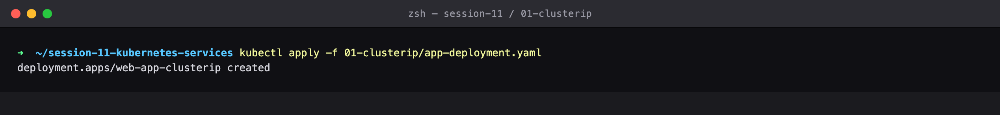

### Step 2 — Get pods wide

Confirm all 3 Pods are Running and note their ephemeral Pod IPs and nodes.

```bash
kubectl get pods -l app=web-clusterip -o wide
```

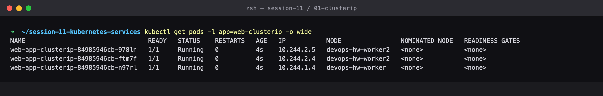

### Step 3 — Apply service

Create the ClusterIP Service (the stable virtual IP in front of the Pods).

```bash
kubectl apply -f 01-clusterip/service.yaml
```

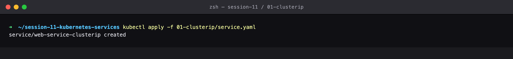

### Step 4 — Get Service

The Service gets a stable ClusterIP from the cluster's service CIDR. EXTERNAL-IP is <none> — it is unreachable from outside the cluster.

```bash
kubectl get svc web-service-clusterip
```

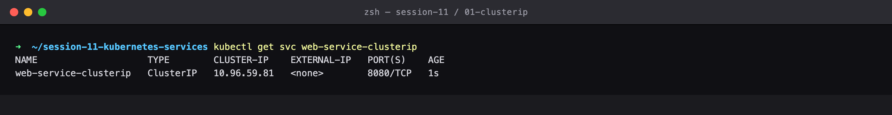

### Step 5 — Describe Service

Full Service spec: selector, port 8080 -> targetPort 80, and the bound Endpoints.

```bash
kubectl describe svc web-service-clusterip
```

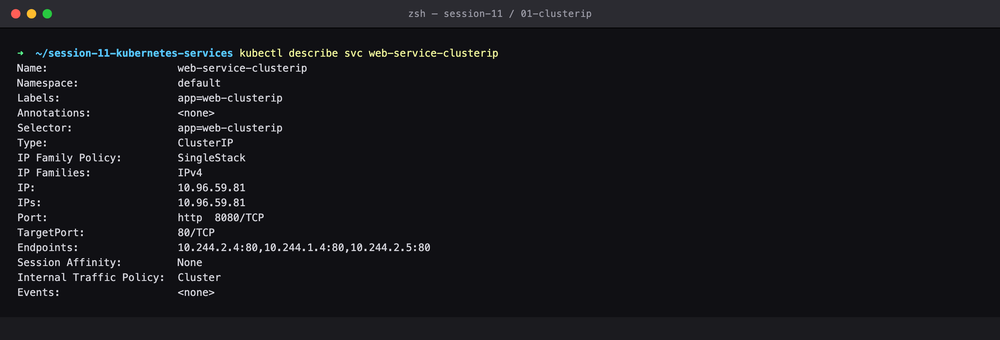

### Step 6 — Get endpoints

The Service has bound to all 3 Pod IPs on port 80 — proof the label selector matched.

```bash
kubectl get endpoints web-service-clusterip
```

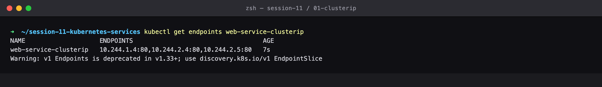

### Step 7 — Apply client

Deploy an in-cluster curl Pod, since a ClusterIP cannot be reached from the laptop.

```bash
kubectl apply -f 01-clusterip/client-pod.yaml
```

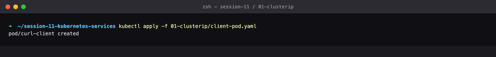

### Step 8 — Get client pod

Wait for the test client Pod to reach Running.

```bash
kubectl get pod curl-client
```

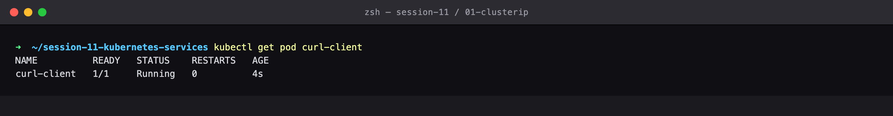

### Step 9 — Curl by name

Test 1 — reach the Service by its short DNS name. CoreDNS resolves it inside the cluster.

```bash
kubectl exec -it curl-client -- curl -s http://web-service-clusterip:8080
```

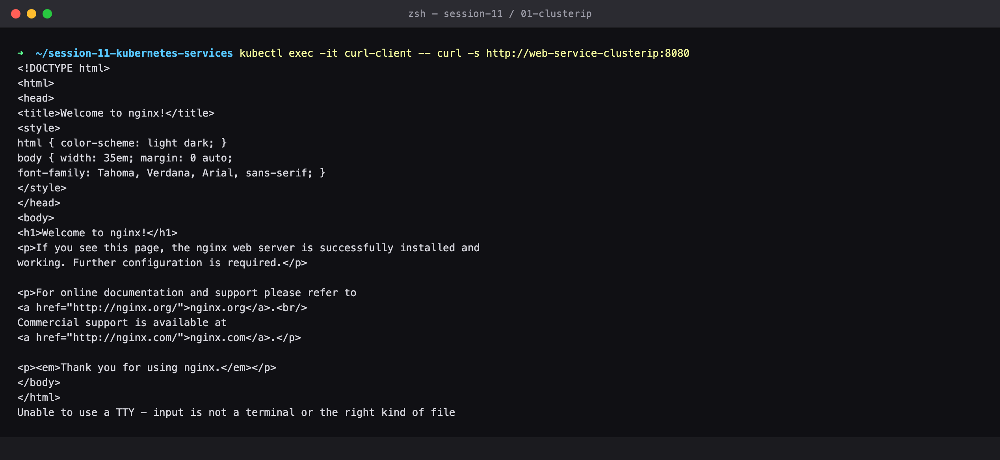

### Step 10 — Curl by IP

Test 2 — reach the same Service by its raw virtual IP.

```bash
CIP=$(kubectl get svc web-service-clusterip -o jsonpath='{.spec.clusterIP}')
kubectl exec -it curl-client -- curl -s http://$CIP:8080
```

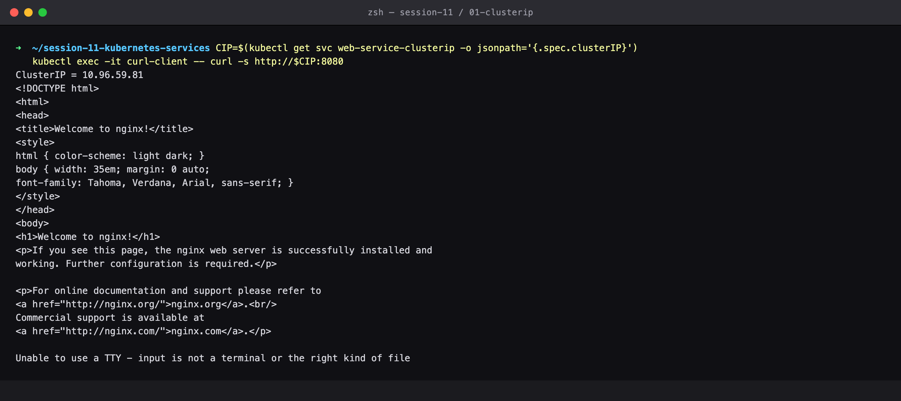

### Step 11 — Curl by FQDN

Test 3 — the fully qualified domain name <service>.<namespace>.svc.cluster.local also resolves.

```bash
kubectl exec -it curl-client -- curl -s http://web-service-clusterip.default.svc.cluster.local:8080
```

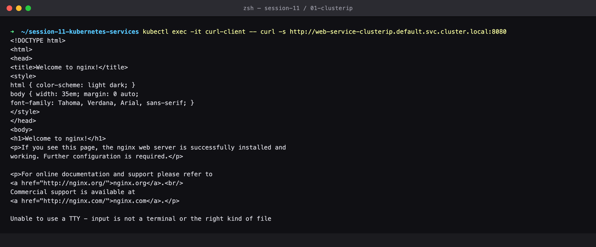

### Step 12 — DNS lookup

CoreDNS resolves the Service name straight to the ClusterIP.

```bash
kubectl exec -it curl-client -- nslookup web-service-clusterip
```

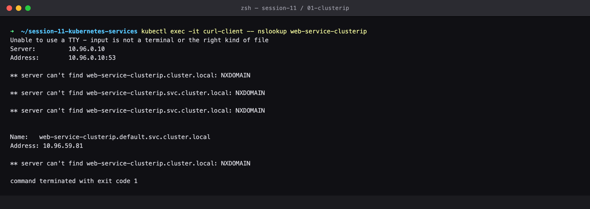

### Step 13 — Load balancing

Six requests through the ClusterIP — kube-proxy load balances each one across the 3 backend Pods at Layer 4.

```bash
for i in 1 2 3 4 5 6; do
  kubectl exec curl-client -- curl -s -o /dev/null \
    -w 'request %{http_code} in %{time_total}s\n' http://web-service-clusterip:8080
done
```

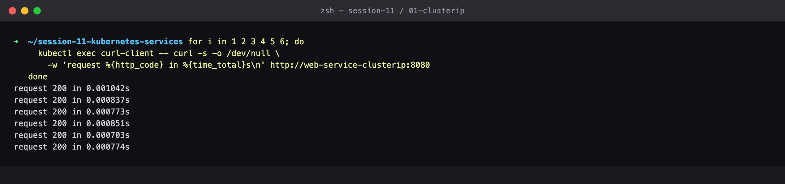

### Step 14 — Port forward

Method 2 — port-forward tunnels the ClusterIP to the laptop for debugging. (Local port 18080 is used because 8080 is already bound on this machine.)

```bash
kubectl port-forward svc/web-service-clusterip 18080:8080 &
curl -s http://localhost:18080
```

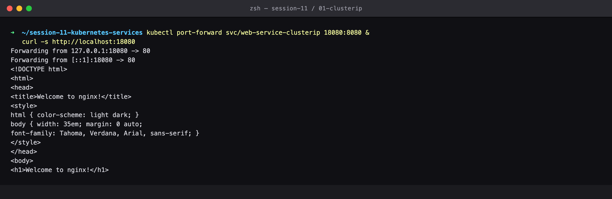

### Step 15 — Cleanup

Tear down every object created by this lab.

```bash
kubectl delete -f 01-clusterip/client-pod.yaml
kubectl delete -f 01-clusterip/service.yaml
kubectl delete -f 01-clusterip/app-deployment.yaml
```

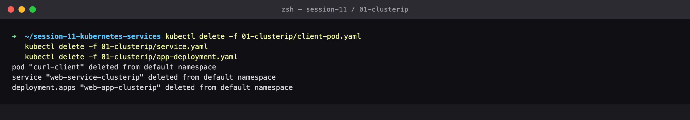

---

## Cleanup
All objects created by this lab were deleted at the end of the run (final step above), leaving the cluster clean for the next lab.
