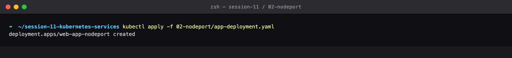
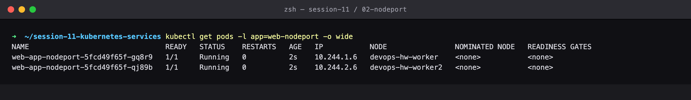
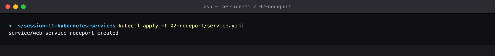
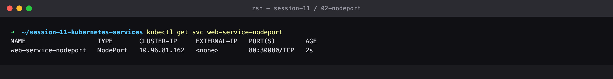
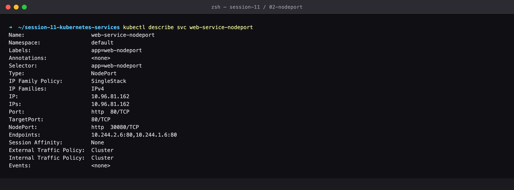
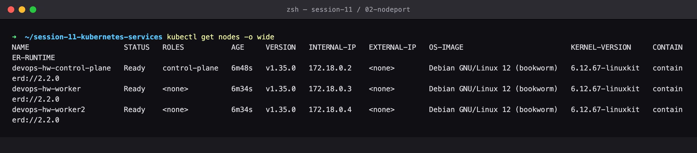
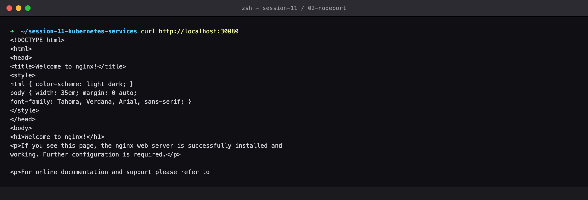
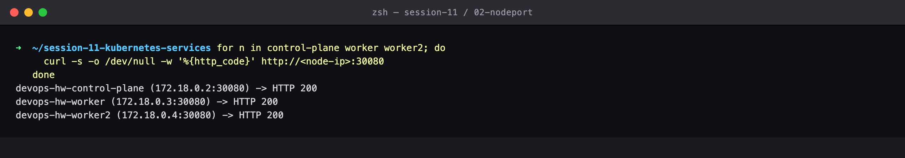
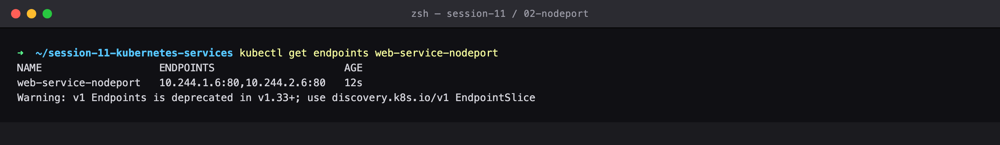
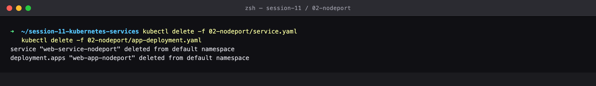

# Session 11 — NodePort Service — External Access

## Name

Himanshu Rathi

## Roll No

`24BCS10365`

---

**Source folder:** `session-11-kubernetes-services/02-nodeport`  
**Reference README:** the upstream lab README in [`Nency-Ravaliya/devops-heros`](https://github.com/Nency-Ravaliya/devops-heros)

Open a static port in the 30000–32767 range on every node in the cluster, and prove it answers on all of them.

Every command below was executed against a live Kubernetes cluster. Each screenshot is the real terminal output of the command shown directly above it — nothing is mocked or hand-written.

---

## Environment

| | |
|---|---|
| **Cluster** | `kind` v0.31.0 — 1 control-plane node + 2 worker nodes, running in Docker |
| **Kubernetes** | v1.35.0 |
| **kubectl** | v1.34.1 |
| **Host** | macOS (Apple Silicon), Docker Desktop |
| **Date run** | 17 September 2026 |

> **Note on Minikube vs kind.** The upstream READMEs are written for Minikube. This submission was
> produced on a 3-node **kind** cluster, which exercises the same Kubernetes APIs but gives a real
> multi-node topology (so Pods genuinely spread across nodes, and NodePort can be proven to answer
> on *every* node). The only command-level difference is how the cluster is reached from the host:
> wherever a README says `curl http://$(minikube ip):PORT`, this run uses `curl http://localhost:PORT`,
> because the kind cluster publishes those node ports to the host. Every `kubectl` command is
> unchanged.

---

## Key takeaways

- NodePort is a SUPERSET of ClusterIP — it still allocates an internal VIP underneath, and layers a node-level port on top.
- The port opens on EVERY node, not only the nodes where Pods are scheduled. This lab curls all three node IPs and gets HTTP 200 from each.
- `PORT(S)` reading `80:30080/TCP` means service port 80 is published on node port 30080.
- It is fine for development and bare-metal clusters, but exposing raw node IPs and high-numbered ports is why production puts a LoadBalancer or Ingress in front instead.

---

## Commands executed, with output

### Step 1 — Apply deployment

Deploy the backend Pods that the NodePort Service will expose.

```bash
kubectl apply -f 02-nodeport/app-deployment.yaml
```



### Step 2 — Get pods wide

Pods are spread across worker nodes — a NodePort opens port 30080 on *every* node.

```bash
kubectl get pods -l app=web-nodeport -o wide
```



### Step 3 — Apply service

Create the NodePort Service.

```bash
kubectl apply -f 02-nodeport/service.yaml
```



### Step 4 — Get Service

PORT(S) reads 80:30080/TCP — service port 80 is published on node port 30080.

```bash
kubectl get svc web-service-nodeport
```



### Step 5 — Describe Service

NodePort is listed explicitly, and a ClusterIP is still allocated underneath (NodePort is a superset of ClusterIP).

```bash
kubectl describe svc web-service-nodeport
```



### Step 6 — Get nodes wide

Any of these node IPs can serve traffic on port 30080.

```bash
kubectl get nodes -o wide
```



### Step 7 — Curl localhost

Hit the NodePort from the laptop. (On Minikube this is curl http://$(minikube ip):30080; on this kind cluster node port 30080 is published to localhost.)

```bash
curl http://localhost:30080
```



### Step 8 — Curl node ips

Proof that the node port answers on EVERY node in the cluster, not just the node where a Pod happens to run.

```bash
for n in control-plane worker worker2; do
  curl -s -o /dev/null -w '%{http_code}' http://<node-ip>:30080
done
```



### Step 9 — Endpoints

The same label selector still drives the backend endpoint list.

```bash
kubectl get endpoints web-service-nodeport
```



### Step 10 — Cleanup

Clean up.

```bash
kubectl delete -f 02-nodeport/service.yaml
kubectl delete -f 02-nodeport/app-deployment.yaml
```



---

## Cleanup
All objects created by this lab were deleted at the end of the run (final step above), leaving the cluster clean for the next lab.
