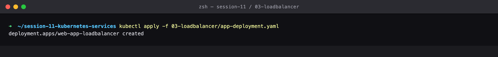
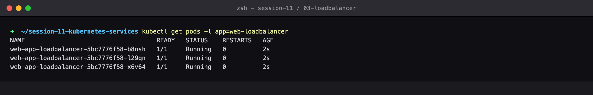
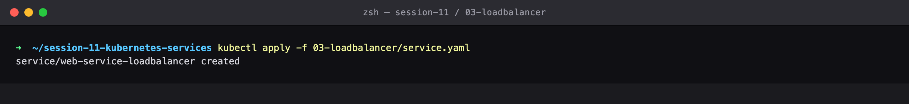
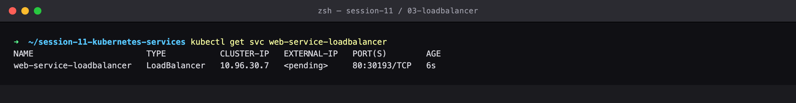
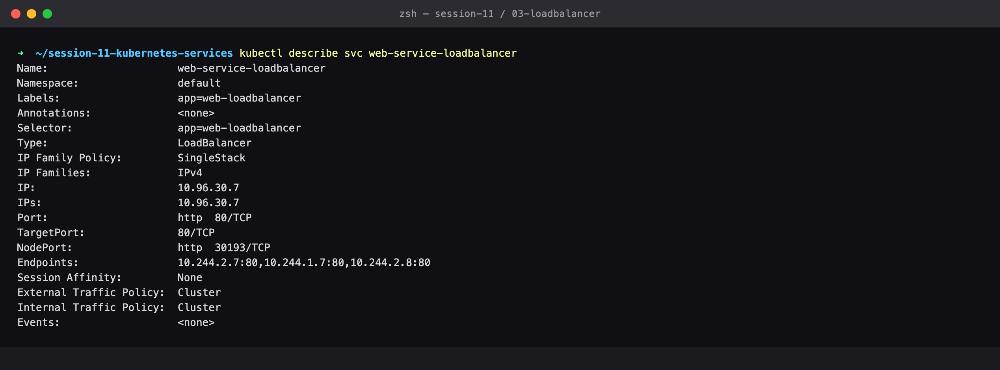
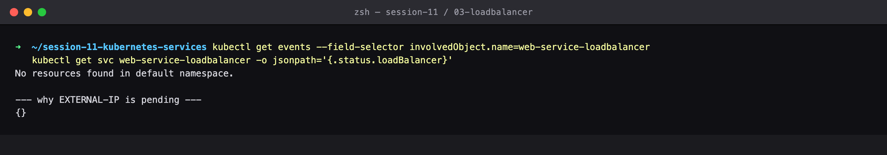
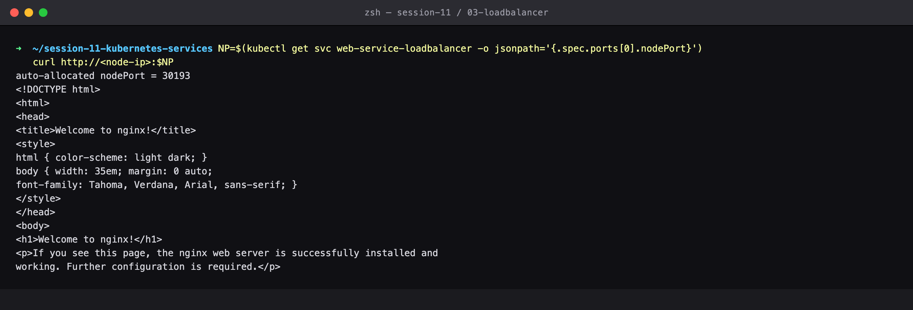
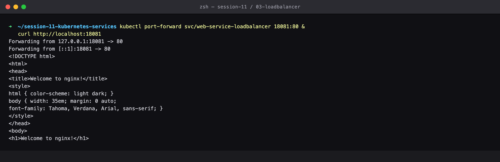
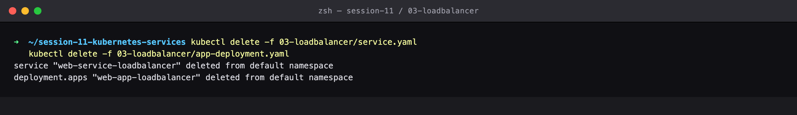

# Session 11 — LoadBalancer Service — Cloud Provisioning

## Name

Himanshu Rathi

## Roll No

`24BCS10365`

---

**Source folder:** `session-11-kubernetes-services/03-loadbalancer`  
**Reference README:** the upstream lab README in [`Nency-Ravaliya/devops-heros`](https://github.com/Nency-Ravaliya/devops-heros)

The cloud-native external Service type, and an honest look at what it does — and does not — do on a local cluster.

Every command below was executed against a live Kubernetes cluster. Each screenshot is the real terminal output of the command shown directly above it — nothing is mocked or hand-written.

---

## Environment

| | |
|---|---|
| **Cluster** | `kind` v0.31.0 — 1 control-plane node + 2 worker nodes, running in Docker |
| **Kubernetes** | v1.35.0 |
| **kubectl** | v1.34.1 |
| **Host** | macOS (Apple Silicon), Docker Desktop |
| **Date run** | 17 September 2026 |

> **Note on Minikube vs kind.** The upstream READMEs are written for Minikube. This submission was
> produced on a 3-node **kind** cluster, which exercises the same Kubernetes APIs but gives a real
> multi-node topology (so Pods genuinely spread across nodes, and NodePort can be proven to answer
> on *every* node). The only command-level difference is how the cluster is reached from the host:
> wherever a README says `curl http://$(minikube ip):PORT`, this run uses `curl http://localhost:PORT`,
> because the kind cluster publishes those node ports to the host. Every `kubectl` command is
> unchanged.

---

## Key takeaways

- `EXTERNAL-IP` stayed `<pending>` for the whole lab, exactly as the README predicts for a local cluster: there is no cloud controller manager here to provision an ELB/NLB. On EKS/GKE/AKS the field populates within 1–2 minutes.
- `status.loadBalancer` is literally an empty object `{}` — nothing has claimed the Service. That is the definitive way to diagnose a stuck LoadBalancer.
- A LoadBalancer Service is a superset of NodePort, which is a superset of ClusterIP: it quietly allocated node port 30193, and a real cloud LB would forward to exactly that.
- Traffic still flows locally through that node port and through `kubectl port-forward` — the local stand-ins for `minikube tunnel`.
- COST: every LoadBalancer Service provisions its own billed cloud asset (~$18–25/month). Fifty microservices means fifty load balancers. Production uses ONE LoadBalancer in front of an Ingress Controller instead.

---

## Commands executed, with output

### Step 1 — Apply deployment

Deploy the app behind the LoadBalancer.

```bash
kubectl apply -f 03-loadbalancer/app-deployment.yaml
```



### Step 2 — Get pods

All backend Pods Running.

```bash
kubectl get pods -l app=web-loadbalancer
```



### Step 3 — Apply service

Create the Service of type LoadBalancer.

```bash
kubectl apply -f 03-loadbalancer/service.yaml
```



### Step 4 — Get Service

EXTERNAL-IP stays <pending> — exactly as the README predicts for a local cluster. There is no cloud controller manager here to provision an ELB/NLB. On EKS/GKE/AKS this field fills in with a real public DNS name within 1-2 minutes.

```bash
kubectl get svc web-service-loadbalancer
```



### Step 5 — Describe Service

Note that a LoadBalancer Service is a superset: it still has a ClusterIP AND an auto-allocated NodePort. The cloud LB would forward to that node port.

```bash
kubectl describe svc web-service-loadbalancer
```



### Step 6 — Events

status.loadBalancer is empty — nothing has claimed the Service. This is the local equivalent of needing `minikube tunnel`.

```bash
kubectl get events --field-selector involvedObject.name=web-service-loadbalancer
kubectl get svc web-service-loadbalancer -o jsonpath='{.status.loadBalancer}'
```



### Step 7 — Curl NodePort

The traffic path still works locally through the node port the LoadBalancer Service allocated — this is precisely what a cloud LB would target.

```bash
NP=$(kubectl get svc web-service-loadbalancer -o jsonpath='{.spec.ports[0].nodePort}')
curl http://<node-ip>:$NP
```



### Step 8 — Port forward

Serving the same app to the laptop browser, the local stand-in for `minikube tunnel`.

```bash
kubectl port-forward svc/web-service-loadbalancer 18081:80 &
curl http://localhost:18081
```



### Step 9 — Cleanup

Clean up (important in the cloud — every LoadBalancer costs real money).

```bash
kubectl delete -f 03-loadbalancer/service.yaml
kubectl delete -f 03-loadbalancer/app-deployment.yaml
```



---

## Cleanup
All objects created by this lab were deleted at the end of the run (final step above), leaving the cluster clean for the next lab.
