# Session 11 — ExternalName Service — CNAME Aliasing

## Name

Himanshu Rathi

## Roll No

`24BCS10365`

---

**Source folder:** `session-11-kubernetes-services/04-externalname`  
**Reference README:** the upstream lab README in [`Nency-Ravaliya/devops-heros`](https://github.com/Nency-Ravaliya/devops-heros)

A Service that is nothing but a DNS CNAME to an external host — including a real failure found in the committed manifest, diagnosed and fixed.

Every command below was executed against a live Kubernetes cluster. Each screenshot is the real terminal output of the command shown directly above it — nothing is mocked or hand-written.

---

## Environment

| | |
|---|---|
| **Cluster** | `kind` v0.31.0 — 1 control-plane node + 2 worker nodes, running in Docker |
| **Kubernetes** | v1.35.0 |
| **kubectl** | v1.34.1 |
| **Host** | macOS (Apple Silicon), Docker Desktop |
| **Date run** | 17 September 2026 |

> **Note on Minikube vs kind.** The upstream READMEs are written for Minikube. This submission was
> produced on a 3-node **kind** cluster, which exercises the same Kubernetes APIs but gives a real
> multi-node topology (so Pods genuinely spread across nodes, and NodePort can be proven to answer
> on *every* node). The only command-level difference is how the cluster is reached from the host:
> wherever a README says `curl http://$(minikube ip):PORT`, this run uses `curl http://localhost:PORT`,
> because the kind cluster publishes those node ports to the host. Every `kubectl` command is
> unchanged.

---

## Key takeaways

- ExternalName allocates no ClusterIP, has no selector and has no endpoints. It exists only as a CoreDNS record.
- **Real bug found in the repo:** the committed `externalName: nencyravaliya.me` no longer resolves, and every lookup returns NXDOMAIN. Kubernetes never validates the target, so a dead or typo'd hostname fails silently until the first lookup.
- The fix was repointing the same Service at a live host — the Service is reconfigured, not recreated, which is the whole value of the indirection.
- The classic gotcha: `curl https://<service-name>` sends SNI for the SERVICE name, so TLS verification fails against a certificate issued for the real hostname. Confirmed here with `curl: (60) no alternative certificate subject name matches`.
- Application code only ever references the Service name, so swapping the external backend is a one-line config change with no redeploy.

---

## Commands executed, with output

### Step 1 — Apply service

Create the ExternalName Service exactly as committed in the repo — a pure CNAME record, with no proxying and no endpoints.

```bash
kubectl apply -f 04-externalname/service.yaml
```

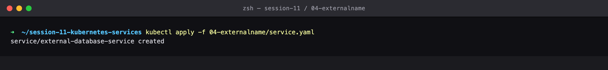

### Step 2 — Get Service

TYPE is ExternalName, CLUSTER-IP is <none>, and EXTERNAL-IP shows the CNAME target. No virtual IP is allocated at all.

```bash
kubectl get svc external-database-service
```

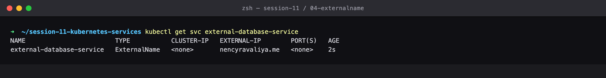

### Step 3 — Describe Service

No Selector and no Endpoints — this Service exists only as a CoreDNS record.

```bash
kubectl describe svc external-database-service
```

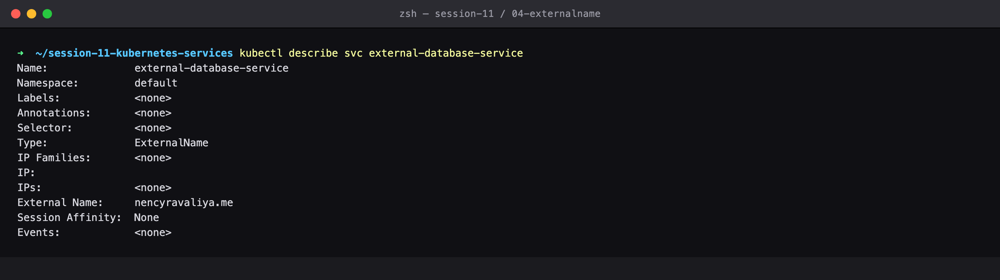

### Step 4 — Apply client

Deploy a client Pod to prove the alias resolves from inside the cluster.

```bash
kubectl apply -f 04-externalname/client-pod.yaml
```

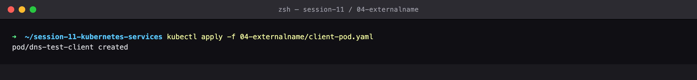

### Step 5 — Get client

Client Pod is Running.

```bash
kubectl get pod dns-test-client
```

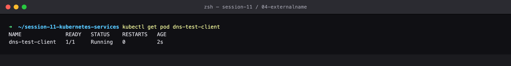

### Step 6 — Nslookup broken

TROUBLESHOOTING FINDING: NXDOMAIN. The CNAME itself was created correctly, but the domain it points at (nencyravaliya.me) no longer exists on the public internet. This is the #1 ExternalName failure mode: Kubernetes never validates the target, so a dead or typo'd hostname fails only at lookup time.

```bash
kubectl exec -it dns-test-client -- nslookup external-database-service
```

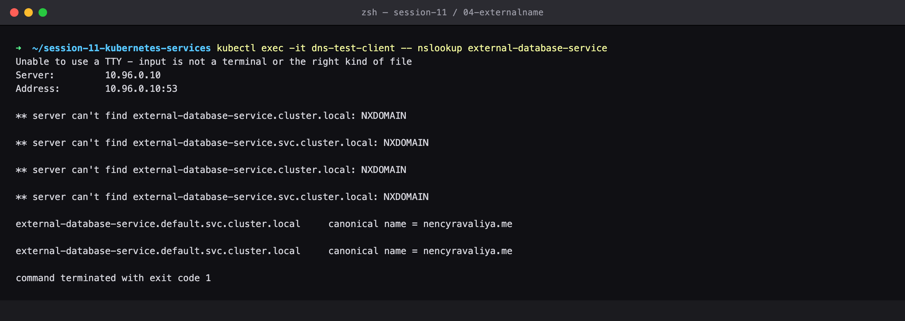

### Step 7 — Verify target dead

Confirmed outside the cluster too — the target domain is genuinely NXDOMAIN, so the fault is the externalName value, not CoreDNS.

```bash
nslookup nencyravaliya.me
```

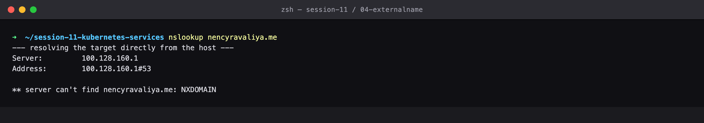

### Step 8 — Apply fixed

THE FIX: repoint the same Service at a hostname that actually resolves (api.github.com). Note the Service is only *configured*, not recreated.

```bash
cat 04-externalname/service-fixed.yaml
kubectl apply -f 04-externalname/service-fixed.yaml
```

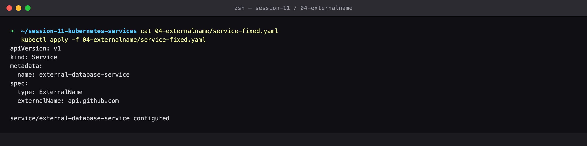

### Step 9 — Nslookup fixed

Now CoreDNS returns the CNAME and resolves it to the real public IPs. The app still only ever says 'external-database-service' — the external address is swappable config, which is the whole point of ExternalName.

```bash
kubectl exec -it dns-test-client -- nslookup external-database-service
```

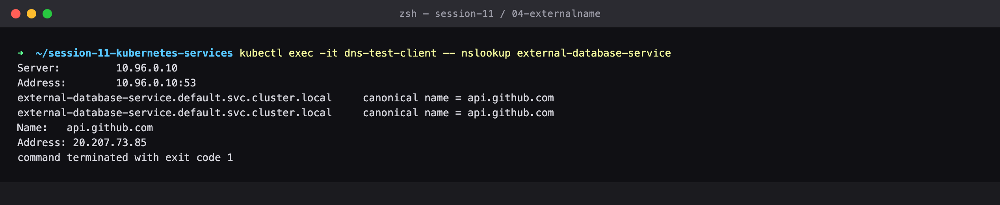

### Step 10 — Curl external

The connection DOES reach the real external IP, but TLS verification fails. This is the classic ExternalName gotcha: curl sends SNI 'external-database-service', and GitHub's certificate is issued for *.github.com, so the names do not match. DNS worked perfectly; only the TLS handshake objected.

```bash
kubectl exec -it dns-test-client -- curl -s -w 'HTTP %{http_code} from %{remote_ip}' https://external-database-service
```

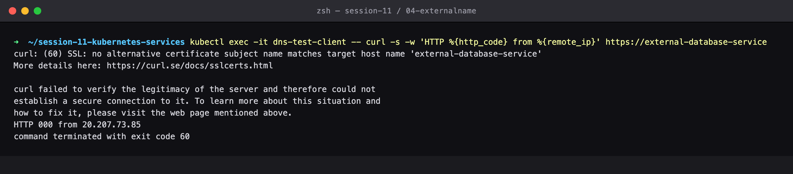

### Step 11 — Curl with host header

The README's own command, plus -k to skip the name check. HTTP 200 straight from GitHub's real IP — final proof that the ExternalName alias carried live traffic out of the cluster. In production you would set the Service name to match the certificate, or terminate TLS at an Ingress instead.

```bash
kubectl exec -it dns-test-client -- curl -sk -H 'Host: api.github.com' https://external-database-service
```

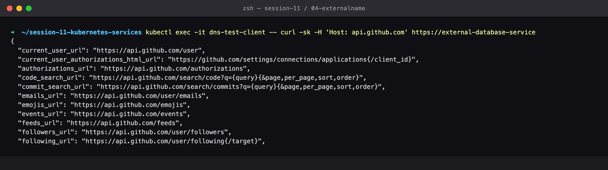

### Step 12 — Cleanup

Clean up.

```bash
kubectl delete -f 04-externalname/client-pod.yaml
kubectl delete -f 04-externalname/service.yaml
```

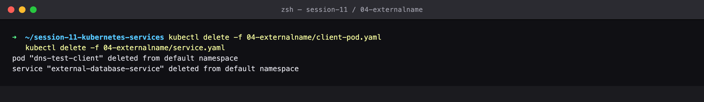

---

## Cleanup
All objects created by this lab were deleted at the end of the run (final step above), leaving the cluster clean for the next lab.
