# Session 11 — Headless Service — Direct Pod Addressing

## Name

Himanshu Rathi

## Roll No

`24BCS10365`

---

**Source folder:** `session-11-kubernetes-services/05-headless`  
**Reference README:** the upstream lab README in [`Nency-Ravaliya/devops-heros`](https://github.com/Nency-Ravaliya/devops-heros)

`clusterIP: None` — no virtual IP, no load balancing. DNS returns every Pod IP directly, which is how StatefulSet members address each other.

Every command below was executed against a live Kubernetes cluster. Each screenshot is the real terminal output of the command shown directly above it — nothing is mocked or hand-written.

---

## Environment

| | |
|---|---|
| **Cluster** | `kind` v0.31.0 — 1 control-plane node + 2 worker nodes, running in Docker |
| **Kubernetes** | v1.35.0 |
| **kubectl** | v1.34.1 |
| **Host** | macOS (Apple Silicon), Docker Desktop |
| **Date run** | 17 September 2026 |

> **Note on Minikube vs kind.** The upstream READMEs are written for Minikube. This submission was
> produced on a 3-node **kind** cluster, which exercises the same Kubernetes APIs but gives a real
> multi-node topology (so Pods genuinely spread across nodes, and NodePort can be proven to answer
> on *every* node). The only command-level difference is how the cluster is reached from the host:
> wherever a README says `curl http://$(minikube ip):PORT`, this run uses `curl http://localhost:PORT`,
> because the kind cluster publishes those node ports to the host. Every `kubectl` command is
> unchanged.

---

## Key takeaways

- With `clusterIP: None` there is no VIP and kube-proxy does no load balancing at all; the CLUSTER-IP column literally reads `None`.
- A DNS lookup of the Service returns MULTIPLE A records — one per Pod — and the client chooses which to talk to.
- Combined with a StatefulSet, every Pod gets a stable ordinal name and its own DNS record: `web-stateful-0.web-service-headless.default.svc.cluster.local`.
- That per-Pod addressability is what database clusters need — a replica must reach its primary specifically, not 'whichever node the load balancer picked'.

---

## Commands executed, with output

### Step 1 — Apply service

Create the headless Service (clusterIP: None).

```bash
kubectl apply -f 05-headless/service.yaml
```

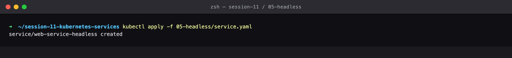

### Step 2 — Get Service

CLUSTER-IP is None — there is no virtual IP and no kube-proxy load balancing at all.

```bash
kubectl get svc web-service-headless
```

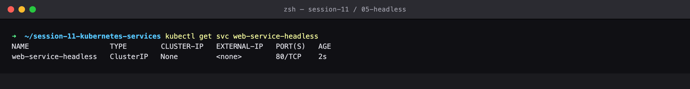

### Step 3 — Apply StatefulSet

Create the StatefulSet that the headless Service gives stable identities to.

```bash
kubectl apply -f 05-headless/app-statefulset.yaml
```

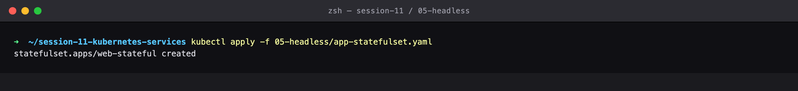

### Step 4 — Get pods wide

StatefulSet Pods get ordinal, stable names: web-stateful-0, -1, ... (not the random hashes a Deployment produces).

```bash
kubectl get pods -l app=web-headless -o wide
```

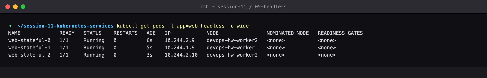

### Step 5 — Apply client

Deploy the DNS test client.

```bash
kubectl apply -f 05-headless/client-pod.yaml
```

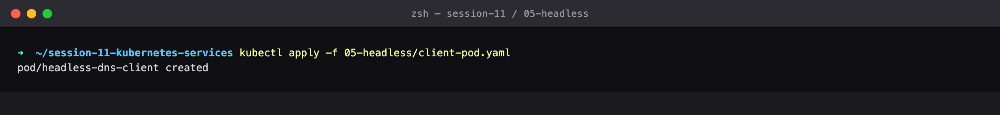

### Step 6 — Get client

Client Pod Running.

```bash
kubectl get pod headless-dns-client
```

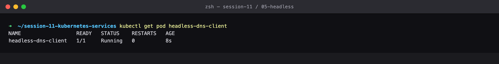

### Step 7 — Nslookup service

The key result: DNS returns EVERY Pod IP directly (multiple A records) instead of one virtual IP. The client picks a Pod itself.

```bash
kubectl exec -it headless-dns-client -- nslookup web-service-headless
```

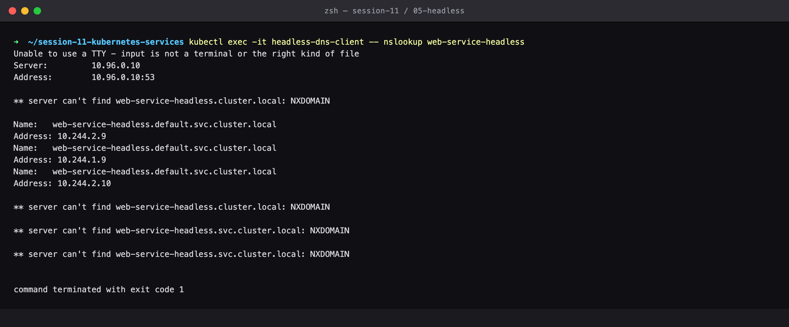

### Step 8 — Nslookup pod FQDN

Each Pod gets its own stable DNS record — this is how a database replica addresses its primary directly.

```bash
kubectl exec -it headless-dns-client -- nslookup web-stateful-0.web-service-headless.default.svc.cluster.local
```

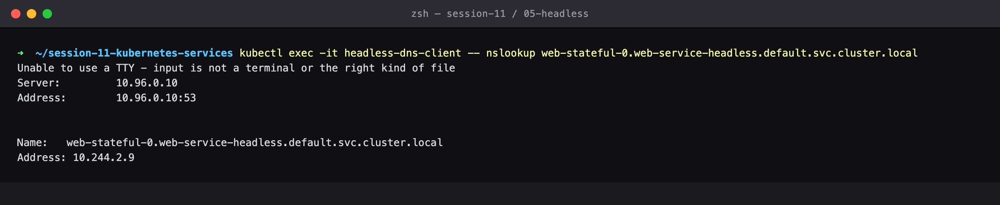

### Step 9 — Curl pod 0

Addressing one specific Pod by name, bypassing load balancing entirely.

```bash
kubectl exec -it headless-dns-client -- curl -s http://web-stateful-0.web-service-headless:80
```

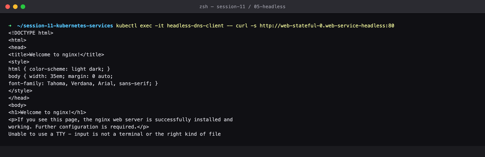

### Step 10 — Curl each pod

Every Pod is individually addressable and each answers from its own Pod IP.

```bash
for i in 0 1; do
  kubectl exec headless-dns-client -- curl -s -w 'HTTP %{http_code} from %{remote_ip}' \
    http://web-stateful-$i.web-service-headless:80
done
```

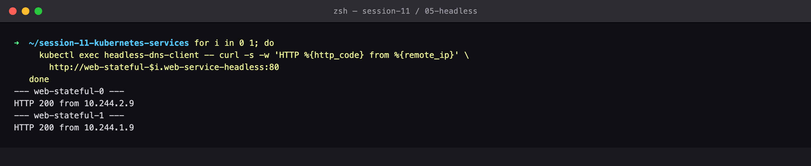

### Step 11 — Cleanup

Clean up.

```bash
kubectl delete -f 05-headless/client-pod.yaml
kubectl delete -f 05-headless/app-statefulset.yaml
kubectl delete -f 05-headless/service.yaml
```

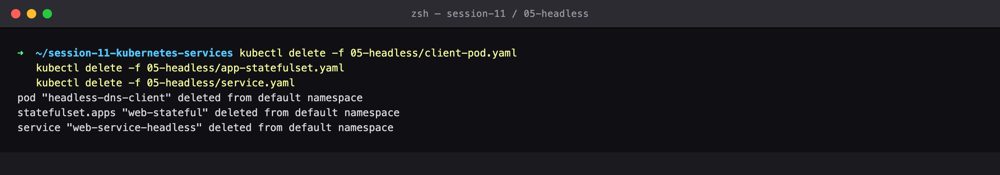

---

## Cleanup
All objects created by this lab were deleted at the end of the run (final step above), leaving the cluster clean for the next lab.
