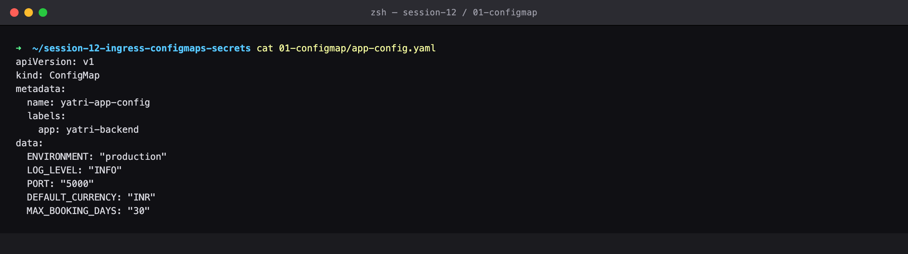
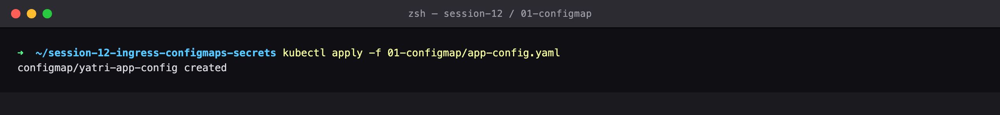
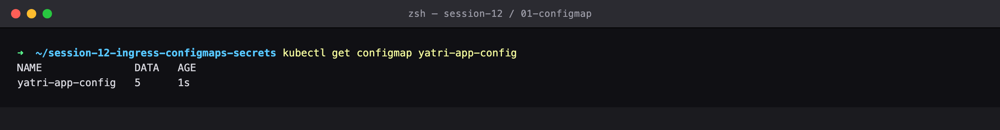
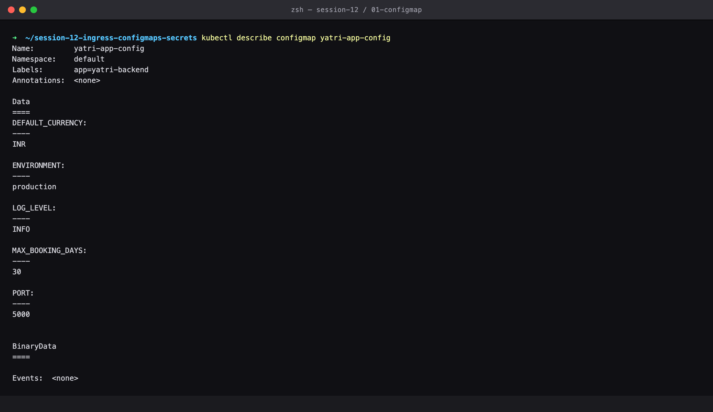
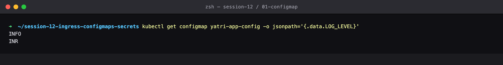
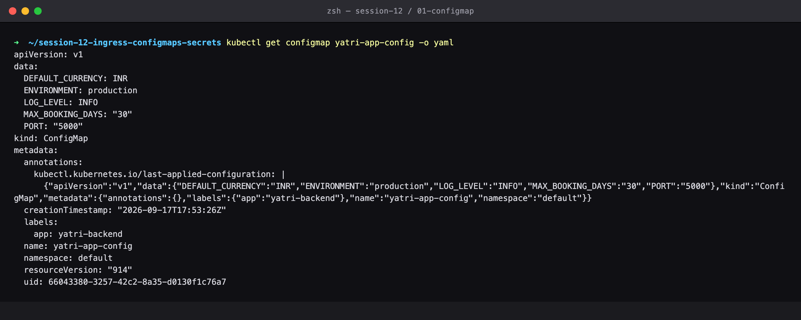
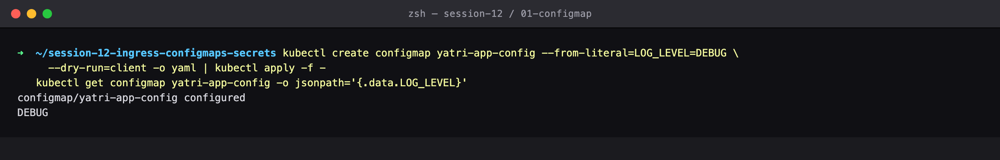
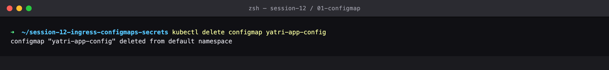

# Session 12 — ConfigMaps — External Application Config

## Name

Himanshu Rathi

## Roll No

`24BCS10365`

---

**Source folder:** `session-12-ingress-configmaps-secrets/01-configmap`  
**Reference README:** the upstream lab README in [`Nency-Ravaliya/devops-heros`](https://github.com/Nency-Ravaliya/devops-heros)

Key/value application config stored in the cluster instead of baked into the container image, so one image runs in every environment.

Every command below was executed against a live Kubernetes cluster. Each screenshot is the real terminal output of the command shown directly above it — nothing is mocked or hand-written.

---

## Environment

| | |
|---|---|
| **Cluster** | `kind` v0.31.0 — 1 control-plane node + 2 worker nodes, running in Docker |
| **Kubernetes** | v1.35.0 |
| **kubectl** | v1.34.1 |
| **Host** | macOS (Apple Silicon), Docker Desktop |
| **Date run** | 17 September 2026 |

> **Note on Minikube vs kind.** The upstream READMEs are written for Minikube. This submission was
> produced on a 3-node **kind** cluster, which exercises the same Kubernetes APIs but gives a real
> multi-node topology (so Pods genuinely spread across nodes, and NodePort can be proven to answer
> on *every* node). The only command-level difference is how the cluster is reached from the host:
> wherever a README says `curl http://$(minikube ip):PORT`, this run uses `curl http://localhost:PORT`,
> because the kind cluster publishes those node ports to the host. Every `kubectl` command is
> unchanged.

---

## Key takeaways

- A ConfigMap decouples config from the image: the same image runs in dev and prod, and only the ConfigMap differs.
- `kubectl describe configmap` prints every value IN FULL — there is nothing sensitive here, which is the whole distinction from a Secret.
- `-o jsonpath='{.data.KEY}'` pulls a single value out, which is how config gets read inside scripts and CI pipelines.
- GOTCHA found while running this: applying a ConfigMap rebuilt from a single `--from-literal` REPLACES the entire data map. The other four keys silently disappear.
- The README refers to this manifest as `configmap/app-config.yaml`, but the folder in the repo is actually `01-configmap/`.

---

## Commands executed, with output

### Step 1 — Show manifest

The ConfigMap: plain key/value application config, stored in the cluster instead of baked into the container image. (Note: the README writes this path as `configmap/app-config.yaml`, but the folder in the repo is actually `01-configmap/`.)

```bash
cat 01-configmap/app-config.yaml
```



### Step 2 — Apply configmap

Create the ConfigMap.

```bash
kubectl apply -f 01-configmap/app-config.yaml
```



### Step 3 — Get configmap

DATA reads 5 — the number of keys stored, not their size.

```bash
kubectl get configmap yatri-app-config
```



### Step 4 — Describe configmap

`describe` prints every value IN FULL. There is nothing sensitive here, which is exactly the difference from a Secret (see lab 02).

```bash
kubectl describe configmap yatri-app-config
```



### Step 5 — Jsonpath one key

Pull a single key out with jsonpath — the scriptable way to read config in CI.

```bash
kubectl get configmap yatri-app-config -o jsonpath='{.data.LOG_LEVEL}'
```



### Step 6 — Get YAML

The stored object. The values sit in `data:` as plain, readable strings.

```bash
kubectl get configmap yatri-app-config -o yaml
```



### Step 7 — Edit and reread

The same image can run in dev and prod purely by swapping the ConfigMap — here LOG_LEVEL flips from INFO to DEBUG with no rebuild. (Applying a ConfigMap built from a single literal REPLACES the whole data map, so the other four keys are gone — a real gotcha when patching config this way.)

```bash
kubectl create configmap yatri-app-config --from-literal=LOG_LEVEL=DEBUG \
  --dry-run=client -o yaml | kubectl apply -f -
kubectl get configmap yatri-app-config -o jsonpath='{.data.LOG_LEVEL}'
```



### Step 8 — Cleanup

Clean up.

```bash
kubectl delete configmap yatri-app-config
```



---

## Cleanup
All objects created by this lab were deleted at the end of the run (final step above), leaving the cluster clean for the next lab.
