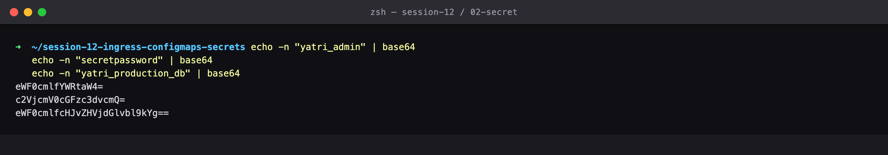
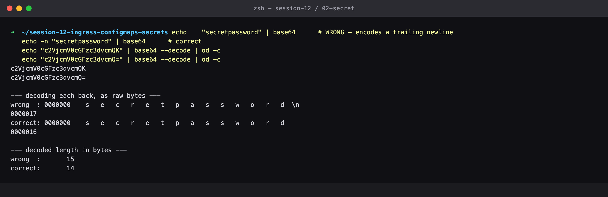
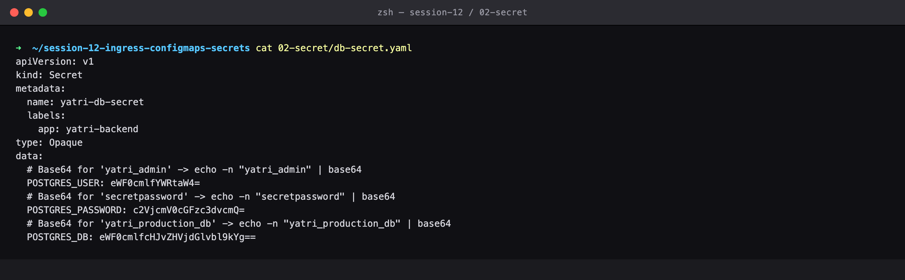
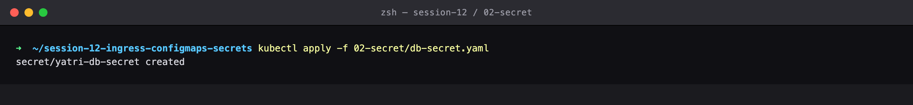
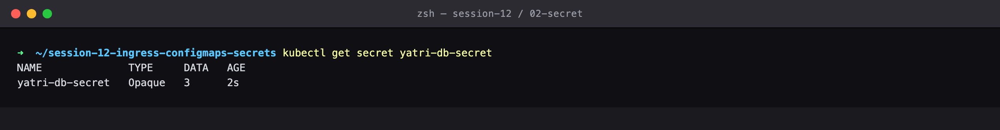
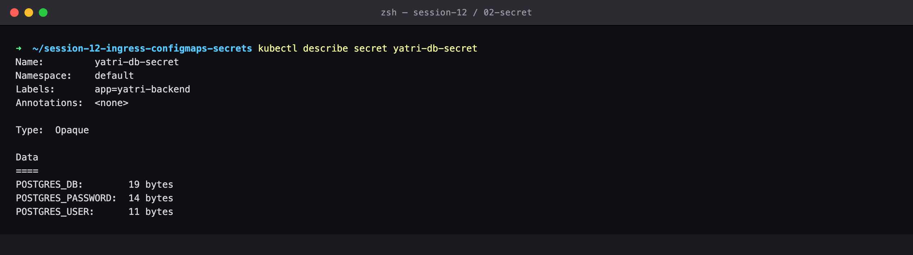
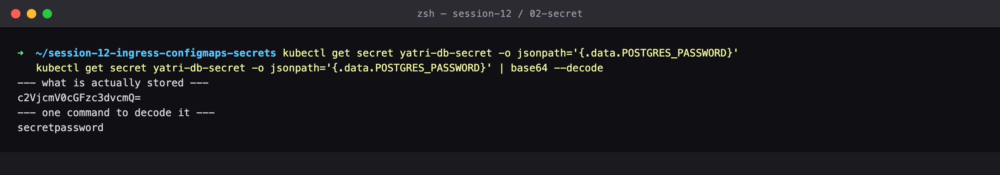
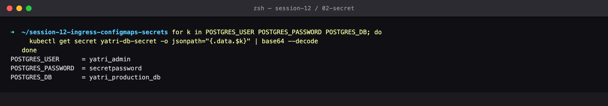
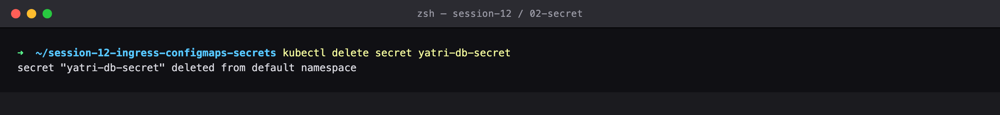

# Session 12 — Secrets — Credentials and the base64 Myth

## Name

Himanshu Rathi

## Roll No

`24BCS10365`

---

**Source folder:** `session-12-ingress-configmaps-secrets/02-secret`  
**Reference README:** the upstream lab README in [`Nency-Ravaliya/devops-heros`](https://github.com/Nency-Ravaliya/devops-heros)

The same key/value idea as a ConfigMap, but base64-encoded and hidden from `describe` — and a demonstration that this is not security.

Every command below was executed against a live Kubernetes cluster. Each screenshot is the real terminal output of the command shown directly above it — nothing is mocked or hand-written.

---

## Environment

| | |
|---|---|
| **Cluster** | `kind` v0.31.0 — 1 control-plane node + 2 worker nodes, running in Docker |
| **Kubernetes** | v1.35.0 |
| **kubectl** | v1.34.1 |
| **Host** | macOS (Apple Silicon), Docker Desktop |
| **Date run** | 17 September 2026 |

> **Note on Minikube vs kind.** The upstream READMEs are written for Minikube. This submission was
> produced on a 3-node **kind** cluster, which exercises the same Kubernetes APIs but gives a real
> multi-node topology (so Pods genuinely spread across nodes, and NodePort can be proven to answer
> on *every* node). The only command-level difference is how the cluster is reached from the host:
> wherever a README says `curl http://$(minikube ip):PORT`, this run uses `curl http://localhost:PORT`,
> because the kind cluster publishes those node ports to the host. Every `kubectl` command is
> unchanged.

---

## Key takeaways

- `kubectl describe secret` shows only BYTE COUNTS, never values. That stops a credential being printed by accident into a terminal, a CI log or a screenshot.
- **base64 is encoding, not encryption.** One command recovers the plaintext password. The real protection is RBAC — who may read Secrets at all — plus encryption-at-rest on etcd.
- THE CLASSIC GOTCHA, measured here: `echo "pw" | base64` encodes a trailing newline and `echo -n "pw" | base64` does not. `od -c` shows the stray `\n` byte and the lengths come out 15 vs 14.
- That extra newline means the app authenticates with `secretpassword\n`, the database rejects it, and nothing in the error message points at the cause.

---

## Commands executed, with output

### Step 1 — Encode values

Secrets are stored base64-encoded, so the values have to be encoded before they go into the manifest. These three outputs match the values committed in db-secret.yaml.

```bash
echo -n "yatri_admin" | base64
echo -n "secretpassword" | base64
echo -n "yatri_production_db" | base64
```



### Step 2 — Newline gotcha

THE CLASSIC GOTCHA (the repo has a whole troubleshooting note on this). Without `-n`, echo appends a newline and it gets encoded too — the two base64 strings differ. `od -c` shows the stray `\n` byte on the decoded value, and the lengths come out 15 vs 14. The app then authenticates with 'secretpassword\n' and the database rejects it, with no obvious clue why.

```bash
echo    "secretpassword" | base64      # WRONG - encodes a trailing newline
echo -n "secretpassword" | base64      # correct
echo "c2VjcmV0cGFzc3dvcmQK" | base64 --decode | od -c
echo "c2VjcmV0cGFzc3dvcmQ=" | base64 --decode | od -c
```



### Step 3 — Show manifest

The Secret manifest. Note `type: Opaque` and the base64 values.

```bash
cat 02-secret/db-secret.yaml
```



### Step 4 — Apply secret

Create the Secret.

```bash
kubectl apply -f 02-secret/db-secret.yaml
```



### Step 5 — Get secret

TYPE Opaque, DATA 3.

```bash
kubectl get secret yatri-db-secret
```



### Step 6 — Describe secret

THE KEY DIFFERENCE from a ConfigMap: `describe` shows only BYTE COUNTS, never the values. That stops a secret being printed by accident into a terminal, a CI log or a screenshot.

```bash
kubectl describe secret yatri-db-secret
```



### Step 7 — Decode secret

THE POINT OF THE WHOLE LAB: base64 is ENCODING, not ENCRYPTION. Anyone who can read the Secret can decode it in one command. The real protection is RBAC — who is allowed to read Secrets at all — plus encryption-at-rest on etcd.

```bash
kubectl get secret yatri-db-secret -o jsonpath='{.data.POSTGRES_PASSWORD}'
kubectl get secret yatri-db-secret -o jsonpath='{.data.POSTGRES_PASSWORD}' | base64 --decode
```



### Step 8 — All keys

All three credentials recovered in plain text.

```bash
for k in POSTGRES_USER POSTGRES_PASSWORD POSTGRES_DB; do
  kubectl get secret yatri-db-secret -o jsonpath="{.data.$k}" | base64 --decode
done
```



### Step 9 — Cleanup

Clean up.

```bash
kubectl delete secret yatri-db-secret
```



---

## Cleanup
All objects created by this lab were deleted at the end of the run (final step above), leaving the cluster clean for the next lab.
