# Session 12 — Ingress — Path Routing, Host Routing & TLS

## Name

Himanshu Rathi

## Roll No

`24BCS10365`

---

**Source folder:** `session-12-ingress-configmaps-secrets/03-ingress`  
**Reference README:** the upstream lab README in [`Nency-Ravaliya/devops-heros`](https://github.com/Nency-Ravaliya/devops-heros)

One entry point routing by URL path and by hostname, terminating HTTPS — including two real bugs in the committed lab, each diagnosed and fixed.

Every command below was executed against a live Kubernetes cluster. Each screenshot is the real terminal output of the command shown directly above it — nothing is mocked or hand-written.

---

## Environment

| | |
|---|---|
| **Cluster** | `kind` v0.31.0 — 1 control-plane node + 2 worker nodes, running in Docker |
| **Kubernetes** | v1.35.0 |
| **kubectl** | v1.34.1 |
| **Host** | macOS (Apple Silicon), Docker Desktop |
| **Date run** | 17 September 2026 |

> **Note on Minikube vs kind.** The upstream READMEs are written for Minikube. This submission was
> produced on a 3-node **kind** cluster, which exercises the same Kubernetes APIs but gives a real
> multi-node topology (so Pods genuinely spread across nodes, and NodePort can be proven to answer
> on *every* node). The only command-level difference is how the cluster is reached from the host:
> wherever a README says `curl http://$(minikube ip):PORT`, this run uses `curl http://localhost:PORT`,
> because the kind cluster publishes those node ports to the host. Every `kubectl` command is
> unchanged.

---

## Key takeaways

- An Ingress object is ONLY a set of rules. Without a controller running to read them, nothing routes at all.
- **Bug 1 — dangling backends.** Applying the Ingress before its Services exist is accepted by the API server; `describe` then reads `<error: services "yatri-backend-service" not found>` and requests return 503. Kubernetes never validates that an Ingress backend exists.
- **Bug 2 — the TLS certificate covers no hostname.** The README's openssl command sets only `/CN=campus.local` with no Subject Alternative Name, while the Ingress serves `portal.campus.local` and `api.campus.local`. Modern X.509 validation ignores CN and matches on SANs, so ingress-nginx rejected the cert and silently served its own 'Fake Certificate' instead. Fixed with `-addext subjectAltName=...`.
- `curl -k` hid Bug 2 completely — it returned 200 the whole time. The bug was only visible in the controller logs and via `openssl s_client`. After the fix, `curl --cacert` verifies successfully with no `-k`.
- Path routing (`/` vs `/api/`) and host routing (two hostnames, one IP) both work off the HTTP request itself, which is what makes Ingress layer 7 and a Service layer 4.

---

## Commands executed, with output

### Step 1 — Controller running

PREREQUISITE: an Ingress object is only a set of RULES. Without a controller running to read them, nothing routes. The README says `minikube addons enable ingress`; on this kind cluster the equivalent is applying the ingress-nginx deployment manifest.

```bash
kubectl get pods -n ingress-nginx; echo; kubectl get ingressclass
```

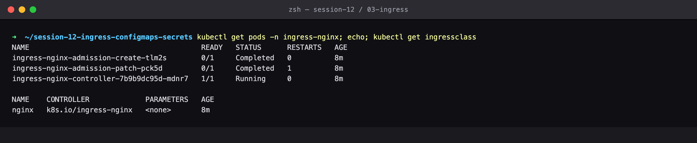

### Step 2 — Apply ingress noservices

Apply the Ingress BEFORE the services it points at exist — which is exactly what the README's command order does.

```bash
kubectl apply -f 03-ingress/ingress-routes.yaml
```

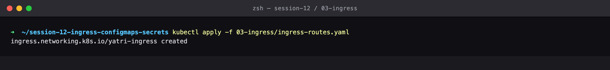

### Step 3 — Describe broken

TROUBLESHOOTING FINDING: the Backends column reads `<error: endpoints "yatri-backend-service" not found>`. The Ingress is accepted by the API server even though it points at services that do not exist — Kubernetes never validates the target. This is the #1 reason an Ingress returns 503.

```bash
kubectl describe ingress yatri-ingress
```

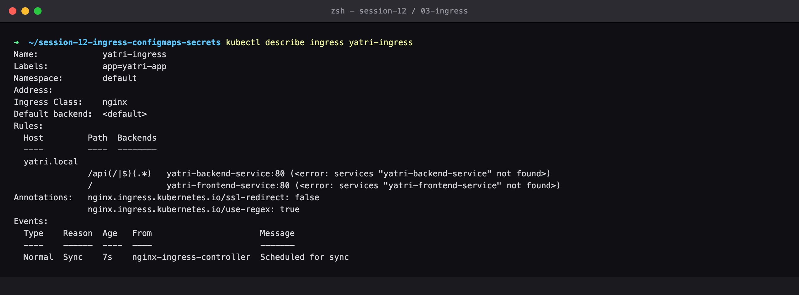

### Step 4 — Curl 503

Confirmed from the outside: HTTP 503. (The README edits /etc/hosts with sudo to make `yatri.local` resolve; `curl --resolve` does the same thing without touching the system file. Port 8080 is where this kind cluster publishes the controller's port 80.)

```bash
curl --resolve yatri.local:8080:127.0.0.1 http://yatri.local:8080/
```

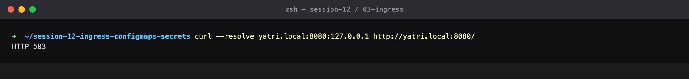

### Step 5 — Deploy backends

THE FIX: create the two Services the Ingress rules name.

```bash
kubectl apply -f 04-full-demo/configmap.yaml
kubectl apply -f 04-full-demo/secret.yaml
kubectl apply -f 04-full-demo/frontend.yaml
kubectl apply -f 04-full-demo/backend.yaml
```

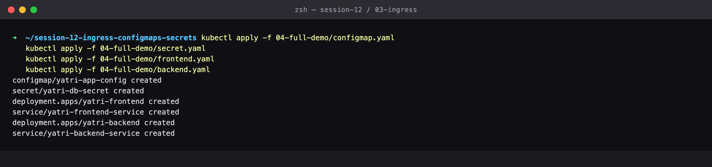

### Step 6 — Describe fixed

The same Ingress, unchanged — the Backends column now resolves to real Pod IPs and ports. Nothing about the Ingress was edited; it simply found its services.

```bash
kubectl describe ingress yatri-ingress
```

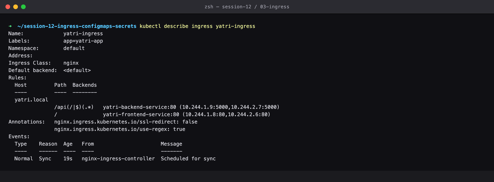

### Step 7 — Curl path routing

PATH-BASED ROUTING WORKING: same host, same port, two completely different applications chosen purely by URL path. That is the whole point of Ingress — one entry point instead of a LoadBalancer (and a separate cloud bill) per service.

```bash
curl --resolve yatri.local:8080:127.0.0.1 http://yatri.local:8080/
curl --resolve yatri.local:8080:127.0.0.1 http://yatri.local:8080/api/
```

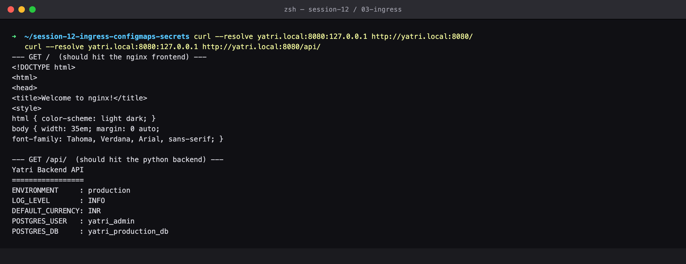

### Step 8 — Wrong host 404

Without the `yatri.local` Host header the controller has no idea which site is wanted and returns 404. Host matching is what lets one controller serve many sites.

```bash
curl http://localhost:8080/        # no matching Host header
```

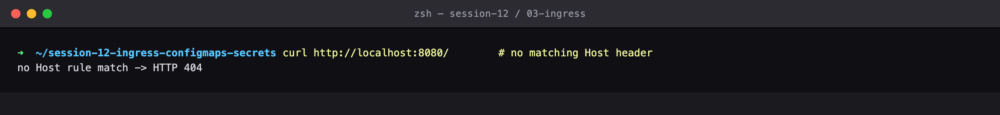

### Step 9 — Make cert

Generate a self-signed certificate for the TLS half of the lab.

```bash
openssl req -x509 -nodes -days 365 -newkey rsa:2048 \
  -keyout tls.key -out tls.crt \
  -subj '/CN=campus.local/O=CampusDevOps'
```

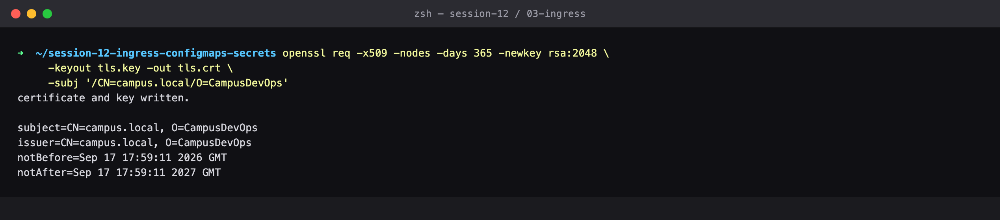

### Step 10 — Create tls secret

A TLS Secret is a distinct type (`kubernetes.io/tls`, not `Opaque`) holding exactly two keys: tls.crt and tls.key. Again only byte counts are shown.

```bash
kubectl create secret tls campus-tls-cert --cert=tls.crt --key=tls.key
kubectl get secret campus-tls-cert
kubectl describe secret campus-tls-cert
```

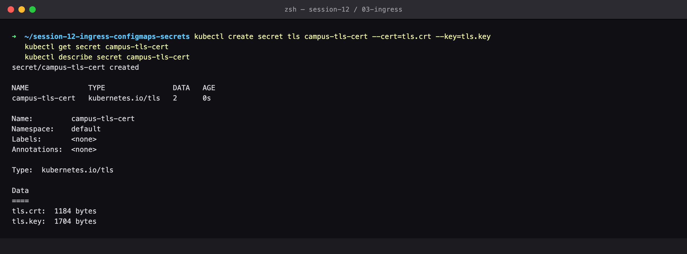

### Step 11 — Apply tls ingress

This Ingress does HOST-based routing across two hostnames, both served over HTTPS from the one certificate. PORTS now reads 80, 443.

```bash
kubectl apply -f 03-ingress/ingress-tls.yaml
kubectl get ingress campus-ingress-tls
```

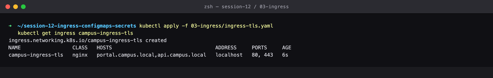

### Step 12 — Describe tls ingress

Two Host rules, and the TLS block naming the certificate Secret that terminates them both.

```bash
kubectl describe ingress campus-ingress-tls
```

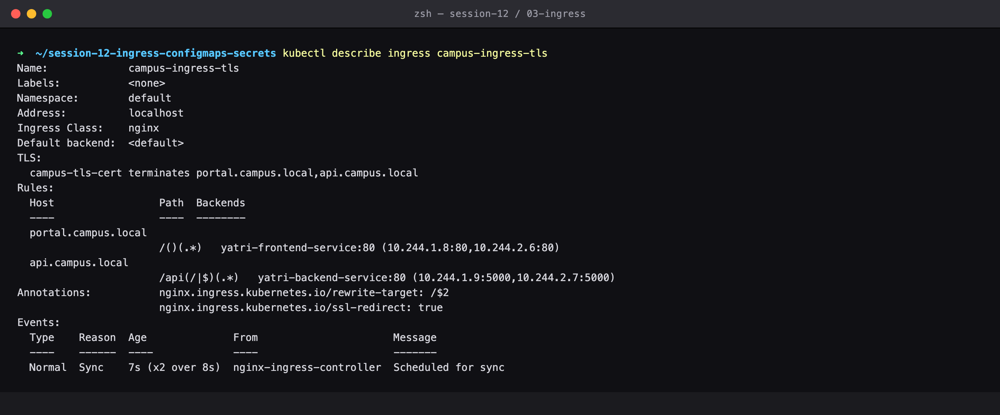

### Step 13 — Curl tls hosts

HOST-BASED TLS ROUTING WORKING: two hostnames, one IP, one certificate, two different backends. `-k` is required because the certificate is self-signed.

```bash
curl -k --resolve portal.campus.local:443:$INGRESS_IP https://portal.campus.local/
curl -k --resolve api.campus.local:443:$INGRESS_IP https://api.campus.local/api/health
```

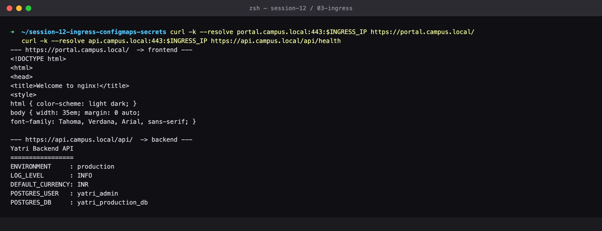

### Step 14 — Show cert served

TROUBLESHOOTING FINDING: this is NOT our certificate. The controller is serving its built-in 'Kubernetes Ingress Controller Fake Certificate'. The `curl -k` above passed anyway, because -k skips verification entirely — which is exactly how this class of bug reaches production unnoticed.

```bash
openssl s_client -connect <ingress>:443 -servername portal.campus.local | openssl x509 -noout -subject -issuer
```

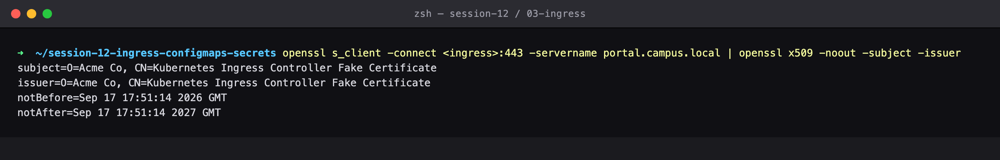

### Step 15 — Tls fallback diagnosis

THE DIAGNOSIS, straight from the controller log: 'certificate is not valid for any names, but wanted to match portal.campus.local ... Using default certificate'. The README's openssl command sets only `/CN=campus.local` and NO Subject Alternative Name, but the Ingress declares hosts portal.campus.local and api.campus.local. Modern X.509 validation ignores CN entirely and matches on SANs, so the cert covers no names at all and ingress-nginx silently falls back.

```bash
kubectl logs -n ingress-nginx deploy/ingress-nginx-controller | grep -i certificate
```

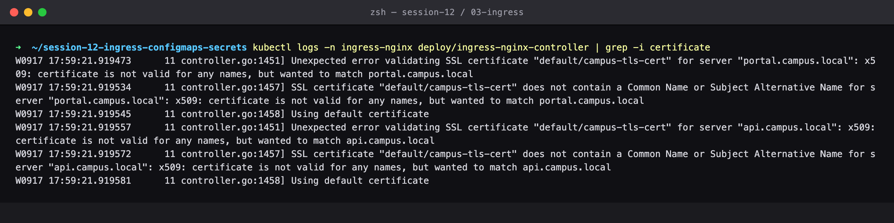

### Step 16 — Inspect bad cert

Confirmed on the certificate itself: 'No extensions in certificate' — there is no SAN section, so there is nothing for the hostname to match against.

```bash
openssl x509 -in tls.crt -noout -subject -ext subjectAltName
```

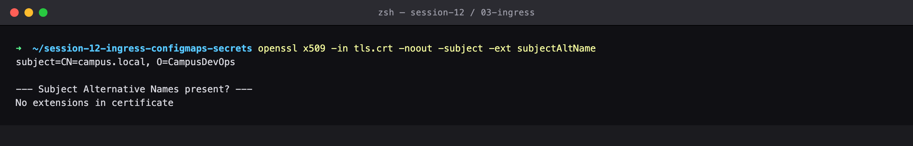

### Step 17 — Regenerate with san

THE FIX: regenerate the certificate with `-addext subjectAltName=...` listing every hostname the Ingress serves. The SAN block is now present and covers both hosts.

```bash
openssl req -x509 -nodes -days 365 -newkey rsa:2048 \
  -keyout tls.key -out tls.crt \
  -subj '/CN=campus.local/O=CampusDevOps' \
  -addext 'subjectAltName=DNS:campus.local,DNS:portal.campus.local,DNS:api.campus.local'
```

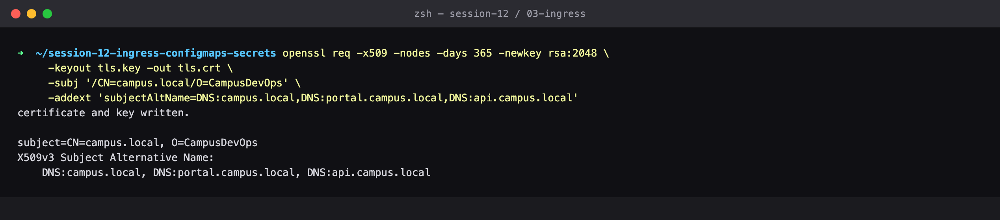

### Step 18 — Replace tls secret

Replace the Secret. The Ingress itself is untouched — it already points at this Secret name, so the controller reloads the new certificate automatically.

```bash
kubectl delete secret campus-tls-cert
kubectl create secret tls campus-tls-cert --cert=tls.crt --key=tls.key
```

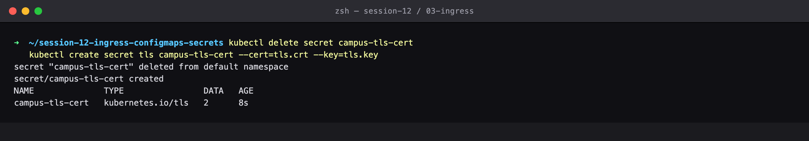

### Step 19 — Show cert served fixed

NOW it is our certificate: subject CN=campus.local, O=CampusDevOps, with both hostnames in the SAN list. Compare against the 'Fake Certificate' two steps above.

```bash
openssl s_client -connect <ingress>:443 -servername portal.campus.local | openssl x509 -noout -subject -ext subjectAltName
```

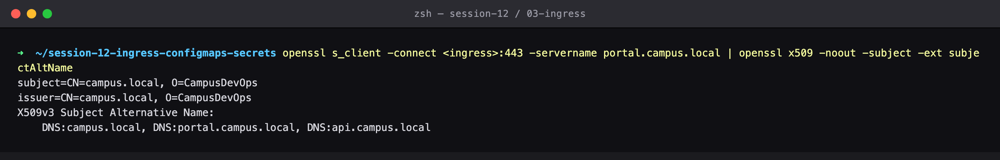

### Step 20 — Curl verified tls

THE REAL PROOF: both hosts now return 200 with certificate verification fully ENABLED (`--cacert` instead of `-k`). Before the fix this would have failed with a hostname-mismatch error.

```bash
curl --cacert tls.crt --resolve portal.campus.local:443:$INGRESS_IP https://portal.campus.local/
curl --cacert tls.crt --resolve api.campus.local:443:$INGRESS_IP https://api.campus.local/api/
```

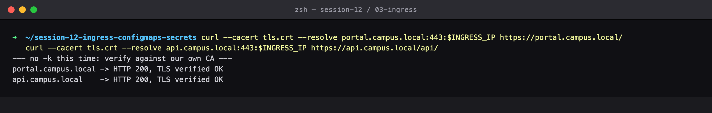

### Step 21 — Ssl redirect

The `ssl-redirect: "true"` annotation on this Ingress sends plain HTTP straight to HTTPS with a 308 — compare with the first Ingress, which set it to false.

```bash
curl --resolve portal.campus.local:80:$INGRESS_IP http://portal.campus.local/
```

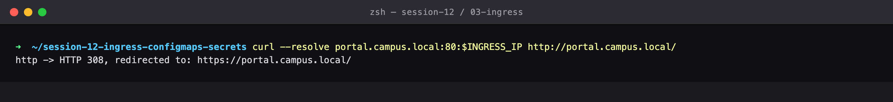

### Step 22 — Cleanup

Clean up everything this lab created.

```bash
kubectl delete ingress campus-ingress-tls
kubectl delete secret campus-tls-cert
rm -f tls.key tls.crt
```

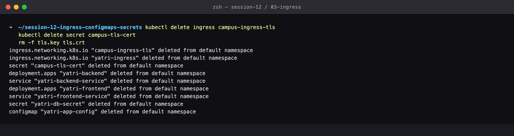

---

## Cleanup
All objects created by this lab were deleted at the end of the run (final step above), leaving the cluster clean for the next lab.
