# Session 12 — Full Demo — ConfigMap + Secret + Ingress End to End

## Name

Himanshu Rathi

## Roll No

`24BCS10365`

---

**Source folder:** `session-12-ingress-configmaps-secrets/04-full-demo`  
**Reference README:** the upstream lab README in [`Nency-Ravaliya/devops-heros`](https://github.com/Nency-Ravaliya/devops-heros)

The complete stack: one ConfigMap and one Secret feeding a Python backend and an nginx frontend, with a single Ingress routing `/` and `/api/` between them.

Every command below was executed against a live Kubernetes cluster. Each screenshot is the real terminal output of the command shown directly above it — nothing is mocked or hand-written.

---

## Environment

| | |
|---|---|
| **Cluster** | `kind` v0.31.0 — 1 control-plane node + 2 worker nodes, running in Docker |
| **Kubernetes** | v1.35.0 |
| **kubectl** | v1.34.1 |
| **Host** | macOS (Apple Silicon), Docker Desktop |
| **Date run** | 17 September 2026 |

> **Note on Minikube vs kind.** The upstream READMEs are written for Minikube. This submission was
> produced on a 3-node **kind** cluster, which exercises the same Kubernetes APIs but gives a real
> multi-node topology (so Pods genuinely spread across nodes, and NodePort can be proven to answer
> on *every* node). The only command-level difference is how the cluster is reached from the host:
> wherever a README says `curl http://$(minikube ip):PORT`, this run uses `curl http://localhost:PORT`,
> because the kind cluster publishes those node ports to the host. Every `kubectl` command is
> unchanged.

---

## Key takeaways

- THE CENTRAL RESULT: ConfigMap values (via `envFrom`) and Secret values (via `secretKeyRef`) both arrive inside the container as ORDINARY environment variables. The app calls `os.getenv('POSTGRES_PASSWORD')` and cannot tell which source it came from; the base64 is decoded automatically on the way in.
- The backend's HTTP response is end-to-end proof the injection worked — every value it prints came out of an environment variable read at startup.
- One Ingress, one hostname, one port, two completely different applications selected purely by URL path — instead of a LoadBalancer (and a separate cloud bill) per service.
- `rewrite-target: /$2` strips the `/api` prefix before forwarding, so the backend sees `/`. The `(/|$)(.*)` in the path rule is what creates the `$2` capture group, and `use-regex: "true"` is what enables it.
- The injected password is visible in plain text in `env`, so anyone who can `exec` into the Pod can read it — Pod exec access is effectively credential access.

---

## Commands executed, with output

### Step 1 — Context

Starting state. The README runs `minikube status` and `minikube addons enable ingress`; the kind equivalent is this 3-node cluster with ingress-nginx already deployed and its controller Running.

```bash
kubectl config current-context
kubectl get nodes
kubectl get pods -n ingress-nginx
```

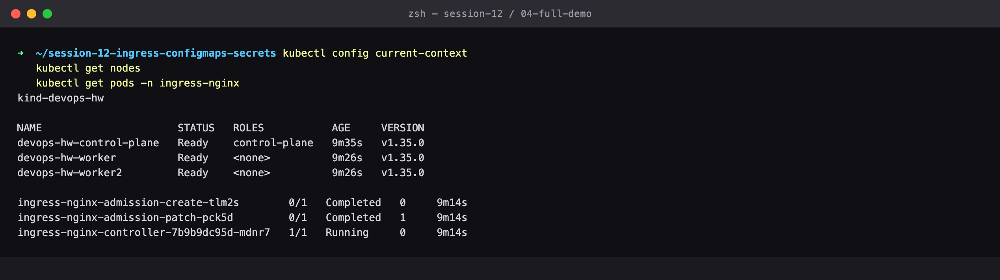

### Step 2 — Apply configmap

STEP 1 — the non-sensitive config, values printed in full.

```bash
kubectl apply -f 04-full-demo/configmap.yaml
kubectl describe configmap yatri-app-config
```

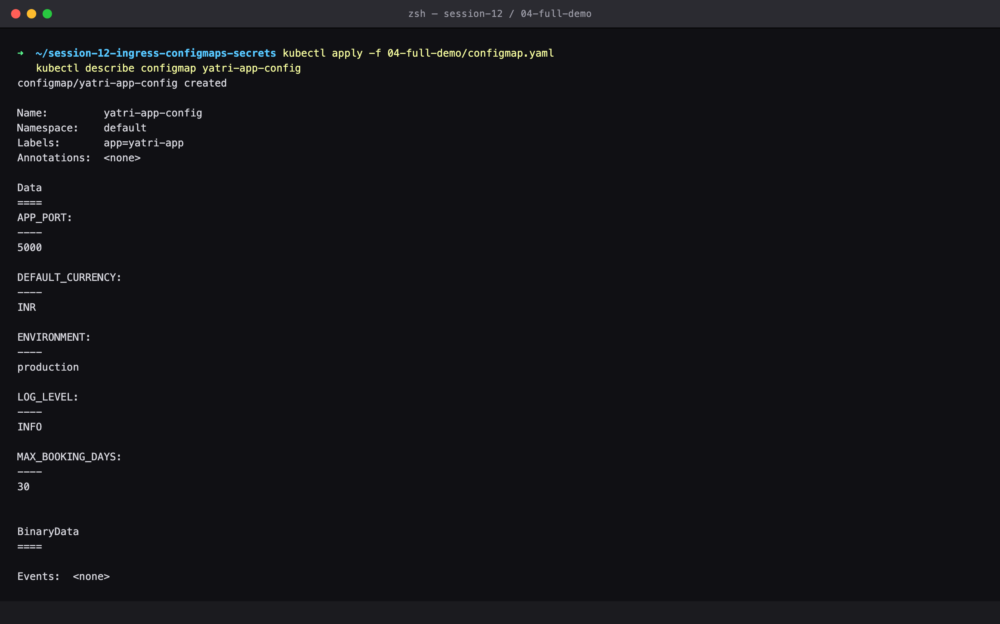

### Step 3 — Apply secret

STEP 2 — the credentials, shown only as byte counts.

```bash
kubectl apply -f 04-full-demo/secret.yaml
kubectl describe secret yatri-db-secret
```

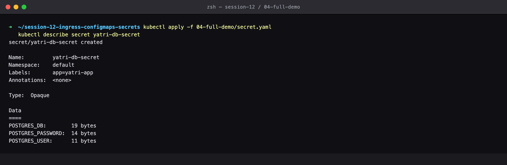

### Step 4 — Apply frontend

STEP 3 — the nginx frontend Deployment and its ClusterIP Service.

```bash
kubectl apply -f 04-full-demo/frontend.yaml
```

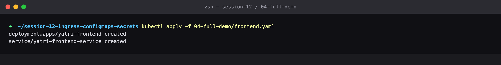

### Step 5 — Get frontend

Frontend Pods Running behind an internal ClusterIP.

```bash
kubectl get pods -l app=yatri-frontend
kubectl get svc yatri-frontend-service
```

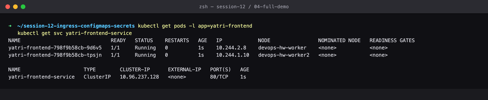

### Step 6 — Apply backend

STEP 4 — the Python backend, which consumes the ConfigMap via `envFrom` and each Secret key via `secretKeyRef`.

```bash
kubectl apply -f 04-full-demo/backend.yaml
```


### Step 7 — Get backend

Backend Pods Running, Service mapping port 80 -> container port 5000.

```bash
kubectl rollout status deployment/yatri-backend
kubectl get pods -l app=yatri-backend
kubectl get svc yatri-backend-service
```

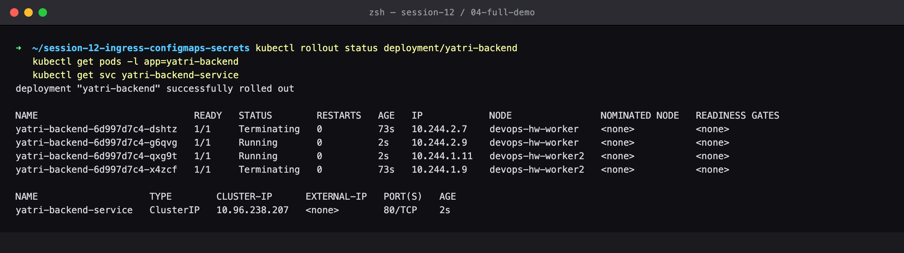

### Step 8 — Env injection

THE CENTRAL RESULT: ConfigMap values and Secret values both arrive inside the container as ORDINARY environment variables. The app just reads os.getenv('POSTGRES_PASSWORD') and neither knows nor cares which source it came from — and the base64 was decoded automatically on the way in. Note the password sitting in plain text, which is why anyone who can `exec` into a Pod can read it.

```bash
kubectl exec -it deploy/yatri-backend -- env | grep -E 'ENVIRONMENT|LOG_LEVEL|POSTGRES'
```

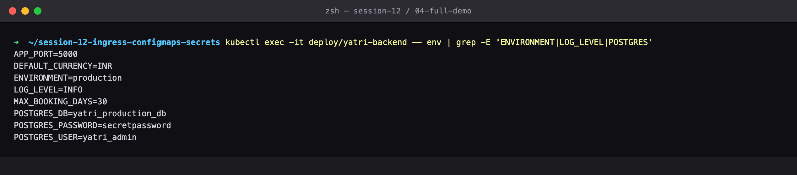

### Step 9 — Apply ingress

STEP 5 — one Ingress fronting both Services.

```bash
kubectl apply -f 04-full-demo/ingress.yaml
kubectl get ingress yatri-ingress
```

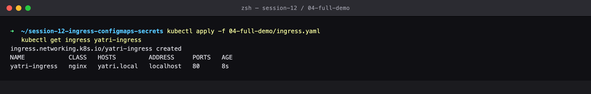

### Step 10 — Describe ingress

Both rules resolve to real Pod IPs: 2 backend Pods on 5000 and 2 frontend Pods on 80. The three annotations are doing the work — use-regex enables the capture groups, and rewrite-target: /$2 strips the /api prefix before forwarding.

```bash
kubectl describe ingress yatri-ingress
```

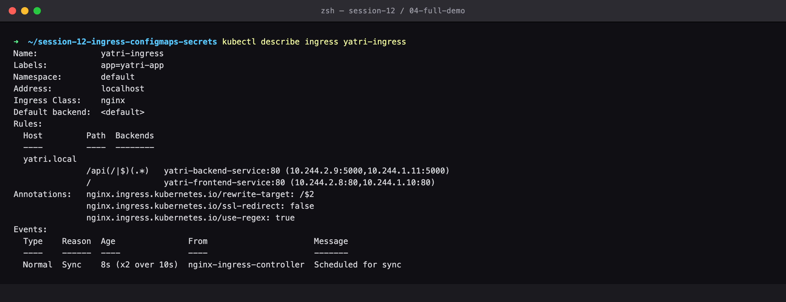

### Step 11 — Curl frontend

GET / -> the nginx frontend. (The README appends `$(minikube ip) yatri.local` to /etc/hosts with sudo; `curl --resolve` achieves the same without modifying a system file.)

```bash
curl http://yatri.local/
```

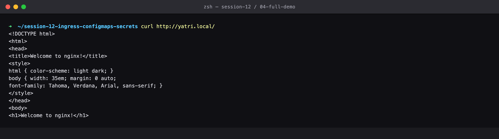

### Step 12 — Curl backend

GET /api/ -> the Python backend, on the SAME host and port. The response body is end-to-end proof that the ConfigMap and Secret injection worked: every value printed here came out of an environment variable the backend read at startup.

```bash
curl http://yatri.local/api/
```

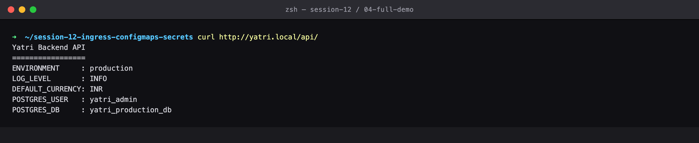

### Step 13 — Rewrite proof

`rewrite-target: /$2` strips the /api prefix, so the backend sees `/` and answers regardless of what follows /api. Both paths return 200 from different apps.

```bash
curl http://yatri.local/api/health
curl -o /dev/null -w '%{http_code}' http://yatri.local/
curl -o /dev/null -w '%{http_code}' http://yatri.local/api/
```

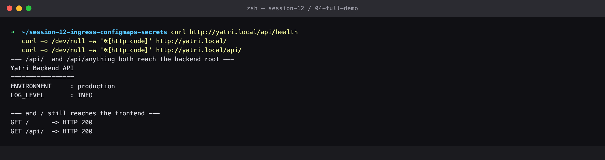

### Step 14 — Decode secret

A closing reminder that the Secret is only encoded, never encrypted.

```bash
kubectl get secret yatri-db-secret -o jsonpath='{.data.POSTGRES_PASSWORD}' | base64 --decode
```

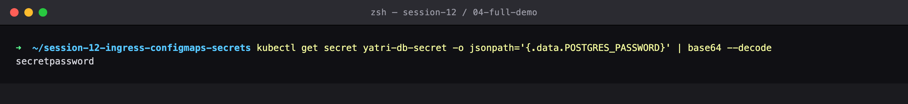

### Step 15 — Full picture

The complete stack: 1 ConfigMap + 1 Secret feeding 2 Deployments, exposed by 2 ClusterIP Services, fronted by 1 Ingress.

```bash
kubectl get configmap,secret,deploy,svc,ingress
```

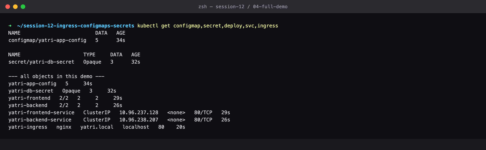

### Step 16 — Cleanup

Clean up the whole demo.

```bash
kubectl delete -f 04-full-demo/ingress.yaml
kubectl delete -f 04-full-demo/backend.yaml
kubectl delete -f 04-full-demo/frontend.yaml
kubectl delete -f 04-full-demo/secret.yaml
kubectl delete -f 04-full-demo/configmap.yaml
```

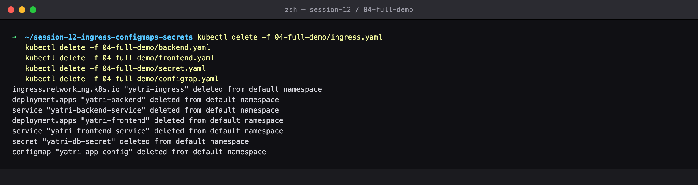

---

## Cleanup
All objects created by this lab were deleted at the end of the run (final step above), leaving the cluster clean for the next lab.
