# Session 13 — Kubernetes Volumes

## Name

Himanshu Rathi

## Roll No

`24BCS10365`

---

**Source folders:** `session-13-storage-hpa-probes/01-volumes`, `02-persistent-storage`, `03-storageclass`

What I learned about emptyDir, hostPath, PersistentVolume, PersistentVolumeClaim, StorageClass and dynamic provisioning. Each concept is followed by a run that proves the claim on a live cluster, including one bug in the course manifests.

Every command below was executed against a live Kubernetes cluster. Each screenshot is the real terminal output of the command shown directly above it. Nothing is mocked or hand-written.

---

## Environment

| | |
|---|---|
| **Cluster** | `kind` v0.31.0: 1 control-plane node + 2 worker nodes, running in Docker |
| **Kubernetes** | v1.35.0 |
| **kubectl** | v1.34.1 |
| **Default StorageClass** | `standard` → `rancher.io/local-path`, `WaitForFirstConsumer`, reclaim `Delete` |
| **Namespace** | `s13-volumes` |
| **Host** | macOS (Apple Silicon), Docker Desktop |
| **Date run** | 7 October 2026 |

---

## Key takeaways

- A container's own filesystem dies with the container. A **volume** is storage whose lifetime is tied to something longer: the Pod (`emptyDir`), the node (`hostPath`) or an independent cluster object (`PersistentVolume`).
- `emptyDir` **survives a container restart but not a Pod deletion**. Both are shown below.
- `hostPath` data lives on **one node**. A Pod scheduled anywhere else sees an empty directory, which is shown below by forcing a Pod onto the other worker.
- PV = the actual storage (an admin or a provisioner creates it). PVC = a request for storage (a developer creates it). The control plane **binds** one PVC to one PV.
- **BUG FOUND:** the course's `pvc.yaml` never binds to the course's `pv.yaml`. With no `storageClassName`, the PVC silently gets the cluster's default StorageClass and a brand-new dynamically provisioned volume, while `student-pv` sits `Available` forever. The fix is `storageClassName: ""`.
- A **StorageClass** turns PVCs into volumes automatically (dynamic provisioning). `WaitForFirstConsumer` delays that until a Pod uses the claim, so the volume is created on the node where the Pod runs.
- Reclaim policy matters: `Delete` (dynamic default) destroyed the volume with its claim. `Retain` left the PV `Released` **with the data still on disk**.

---

## 1. Concepts

| Type | Lifetime | Where the bytes live | Typical use |
|---|---|---|---|
| **emptyDir** | the Pod | node disk (or RAM with `medium: Memory`) | scratch space, cache, files shared between containers of one Pod |
| **hostPath** | the node | a directory on the node the Pod landed on | node agents (log collectors, CNI plugins), *not* app data |
| **PersistentVolume (PV)** | independent of Pods | whatever backs it: disk, NFS, EBS, local path… | the storage itself, created by an admin or a provisioner |
| **PersistentVolumeClaim (PVC)** | independent of Pods | n/a. It is a *request* (size + access mode + class) | what a Pod references. It never names a disk directly |
| **StorageClass** | cluster object | n/a. It is a *recipe* (provisioner + parameters) | lets a PVC create its own PV on demand (**dynamic provisioning**) |

**Binding rules** for a PVC to a PV: the access mode must match, PV capacity ≥ request, and the **storageClassName must be equal**. An *omitted* class on a PVC means "use the default class", which is not the same as an empty `""` class. That difference is the bug in section 4.

**Access modes:** `ReadWriteOnce` (RWO, one *node* may mount it read-write, though several Pods on that node can), `ReadOnlyMany`, `ReadWriteMany`, `ReadWriteOncePod`.

**Reclaim policy** (what happens to the PV when its PVC is deleted): `Delete` removes the PV and the underlying storage. `Retain` keeps both, and the PV goes `Released` and must be cleaned up by hand.

---

## 2. emptyDir

### Step 1: Namespace and the cluster's StorageClass

```bash
kubectl create namespace s13-volumes
kubectl get sc
```

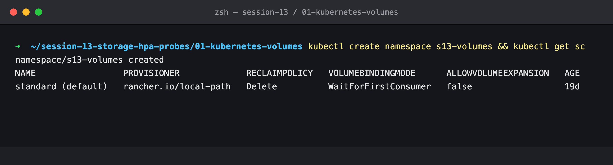

### Step 2: Run the emptyDir Pod

```bash
kubectl apply -n s13-volumes -f manifests/emptydir-pod.yaml
kubectl get pod -n s13-volumes emptydir-demo -o wide
```

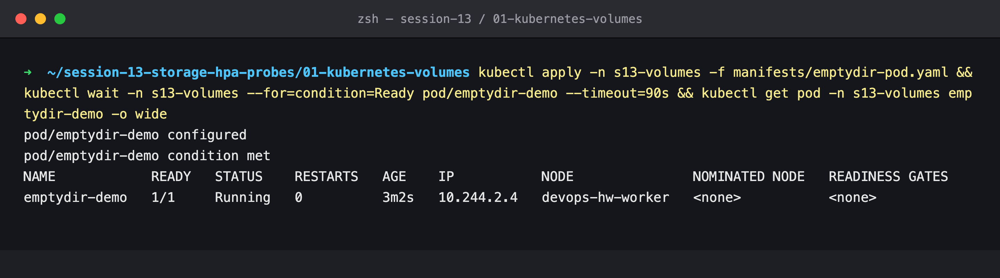

The output says `configured` with an age of 3m because the Pod was first created minutes earlier and sat in `ImagePullBackOff`: Docker Hub was rate-limiting the kind nodes (`429 Too Many Requests`). After the image was imported into the nodes it started, and this re-apply simply found it already there.

### Step 3: Write a file into the volume

```bash
kubectl exec -n s13-volumes emptydir-demo -- sh -c 'echo "written at $(date +%T) by $(hostname)" > /data/message.txt; cat /data/message.txt'
```

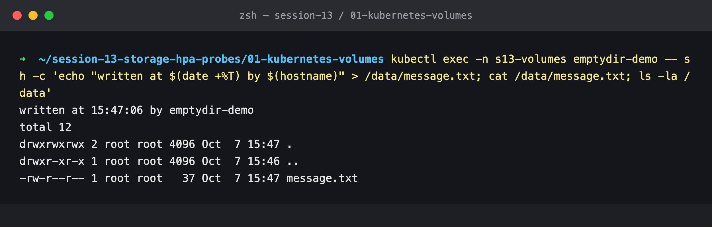

### Step 4: Kill the container (not the Pod)

`kill 1` stops nginx (PID 1), so the kubelet restarts the container **inside the same Pod**.

```bash
kubectl exec -n s13-volumes emptydir-demo -- sh -c 'kill 1'
kubectl get pod -n s13-volumes emptydir-demo
kubectl exec -n s13-volumes emptydir-demo -- cat /data/message.txt
```

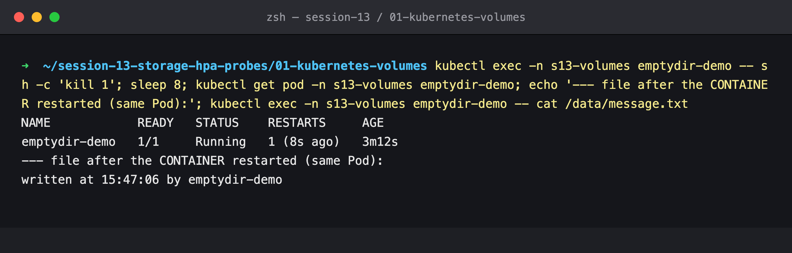

`RESTARTS 1`, and the file is still there: an emptyDir belongs to the Pod, so a container restart doesn't touch it.

### Step 5: Delete and recreate the Pod

```bash
kubectl delete pod -n s13-volumes emptydir-demo
kubectl apply -n s13-volumes -f manifests/emptydir-pod.yaml
kubectl exec -n s13-volumes emptydir-demo -- sh -c 'ls -la /data; cat /data/message.txt'
```

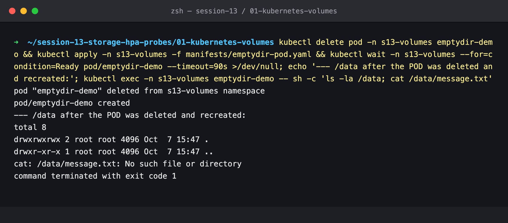

`/data` is empty. The new Pod got a new emptyDir, and the old one was deleted with the old Pod.

---

## 3. hostPath

### Step 6: Run the hostPath Pod

```bash
kubectl apply -n s13-volumes -f manifests/hostpath-pod.yaml
kubectl get pod -n s13-volumes hostpath-demo -o wide
```

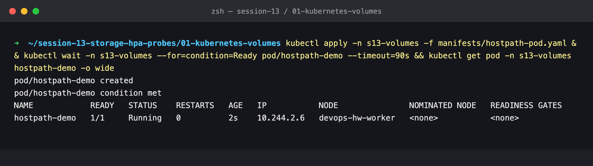

### Step 7: Write from the Pod, read it on the node

A kind node is a Docker container, so `docker exec <node>` is the equivalent of SSH-ing into the node.

```bash
kubectl exec -n s13-volumes hostpath-demo -- sh -c 'echo "hello from hostPath" > /data/host.txt'
docker exec devops-hw-worker cat /tmp/hostpath-data/host.txt
```

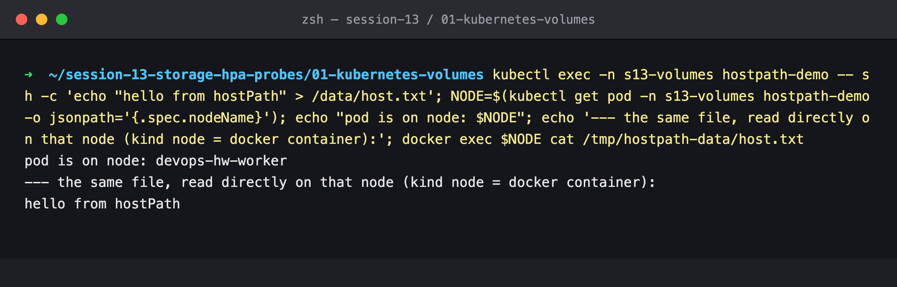

### Step 8: The other worker doesn't have it

```bash
for n in devops-hw-worker devops-hw-worker2; do docker exec $n ls /tmp/hostpath-data; done
```

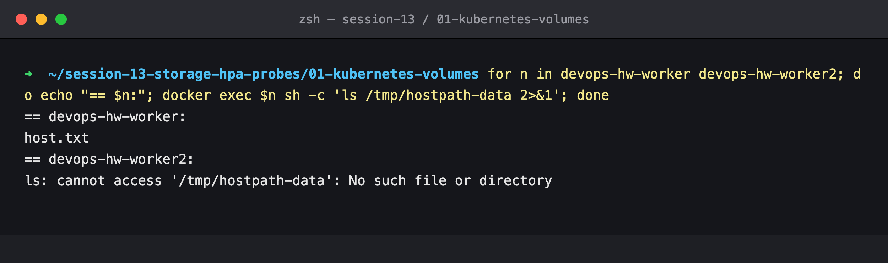

### Step 9: Recreate the Pod (it happened to land on the same node)

```bash
kubectl delete pod -n s13-volumes hostpath-demo
kubectl apply -n s13-volumes -f manifests/hostpath-pod.yaml
kubectl exec -n s13-volumes hostpath-demo -- cat /data/host.txt
```

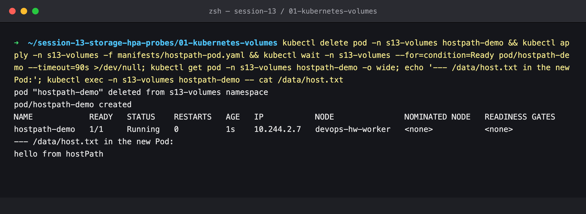

The data survived, but only because the scheduler happened to pick `devops-hw-worker` again.

### Step 10: Force the same Pod onto the other node

```bash
# same manifest, plus nodeName: devops-hw-worker2
kubectl exec -n s13-volumes hostpath-demo-w2 -- ls -la /data
```

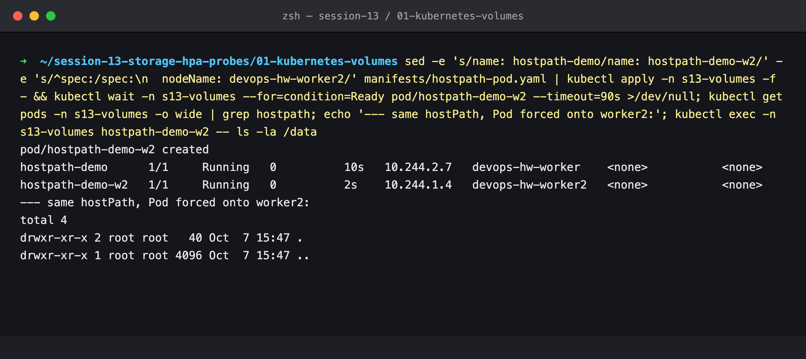

Same hostPath, same mount, but an empty directory. hostPath has no idea it is "the app's data". It is just a folder on whichever machine the Pod runs on. This is why hostPath is for node-level agents, not for application state.

---

## 4. The static PV that never gets used (bug in the course manifests)

### Step 11: Create the course's PV

```bash
kubectl apply -f manifests/student-pv.yaml
kubectl get pv student-pv
```

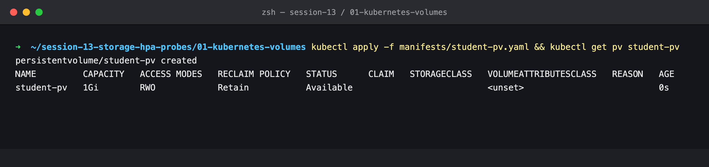

`STORAGECLASS` is empty. The PV has no class.

### Step 12: Create the course's PVC as written

```bash
kubectl apply -n s13-volumes -f manifests/student-pvc.yaml
kubectl get pvc -n s13-volumes student-pvc
```

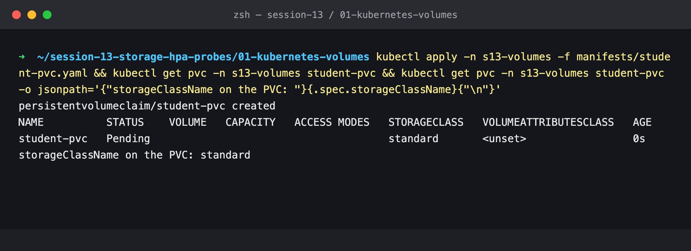

The PVC was written without a class, but the API server's `DefaultStorageClass` admission plugin filled in `storageClassName: standard` the moment it was created. A PVC of class `standard` can never bind a PV of class `""`.

### Step 13: Start the Pod and see what it actually got

```bash
kubectl apply -n s13-volumes -f manifests/storage-pod.yaml
kubectl get pvc -n s13-volumes student-pvc
kubectl get pv
```

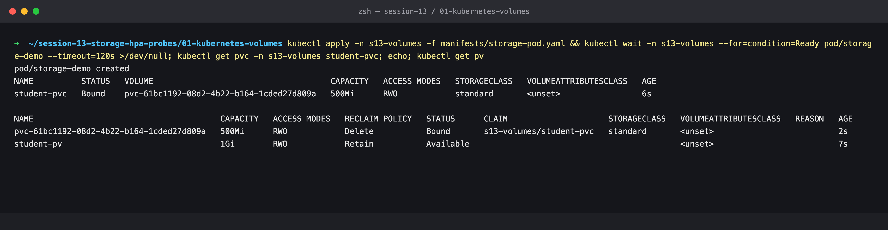

**The bug:** `student-pvc` is `Bound` to `pvc-61bc…`, a volume the local-path provisioner created on the fly, while `student-pv` is still `Available`. The course README expects `student-pvc   Bound   student-pv`, which doesn't happen on kind, minikube or any cloud cluster with a default class. The lab *looks* like it works (the Pod runs and data persists), but the PV that was meant to be demonstrated is never used.

### Step 14: Tear down the wrong binding

```bash
kubectl delete pod -n s13-volumes storage-demo
kubectl delete pvc -n s13-volumes student-pvc
kubectl delete pv student-pv
```

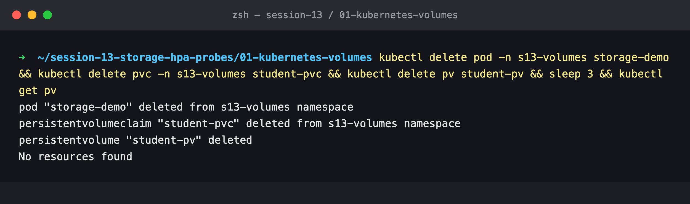

### Step 15: Apply the fixed PV and PVC

[`student-pvc-static.yaml`](manifests/student-pvc-static.yaml) adds `storageClassName: ""` (opt out of the default class) and `volumeName: student-pv` (bind to exactly this PV). [`student-pv-pinned.yaml`](manifests/student-pv-pinned.yaml) also adds the matching `storageClassName: ""` and a `nodeAffinity`. Step 10 showed that a hostPath is only on one node, and without node affinity the scheduler would not know that.

```bash
kubectl apply -f manifests/student-pv-pinned.yaml
kubectl apply -n s13-volumes -f manifests/student-pvc-static.yaml
kubectl get pv student-pv
kubectl get pvc -n s13-volumes student-pvc
```

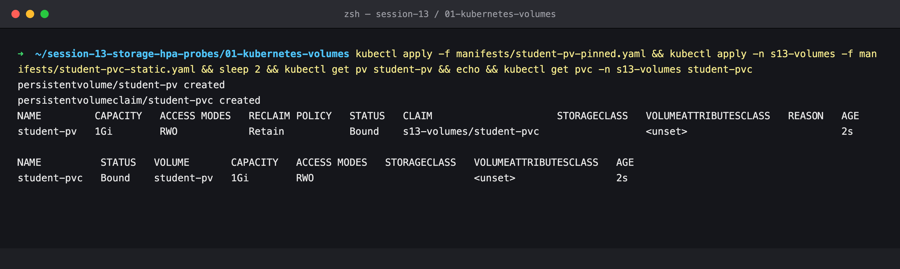

Now `student-pvc → student-pv`, bound immediately (a class-less PV has no `WaitForFirstConsumer`). The claim shows `1Gi` even though it asked for 500Mi: a PVC gets the *whole* PV it binds, never a slice of it.

### Step 16: Write data through the claim

```bash
kubectl apply -n s13-volumes -f manifests/storage-pod.yaml
kubectl exec -n s13-volumes storage-demo -- sh -c 'echo "Student: Himanshu Rathi (24BCS10365)" > /data/message.txt'
```

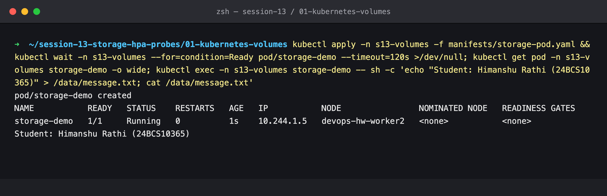

The Pod was placed on `devops-hw-worker2` because of the PV's node affinity, not by chance.

### Step 17: Delete the Pod, recreate it, read the data back

```bash
kubectl delete pod -n s13-volumes storage-demo
kubectl apply -n s13-volumes -f manifests/storage-pod.yaml
kubectl exec -n s13-volumes storage-demo -- cat /data/message.txt
docker exec devops-hw-worker2 cat /tmp/student-data/message.txt
```

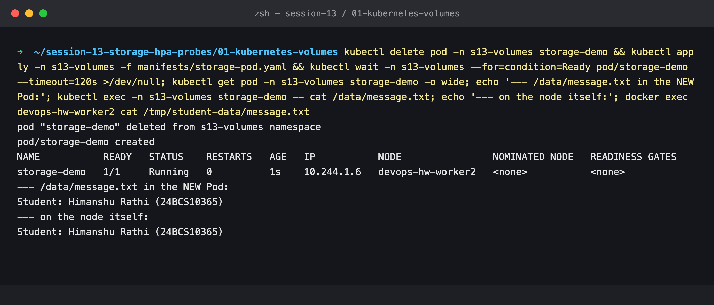

A new Pod reads the same bytes, which really live in `/tmp/student-data` on worker2.

---

## 5. StorageClass and dynamic provisioning

### Step 18: Inspect the default StorageClass

```bash
kubectl describe storageclass standard
```

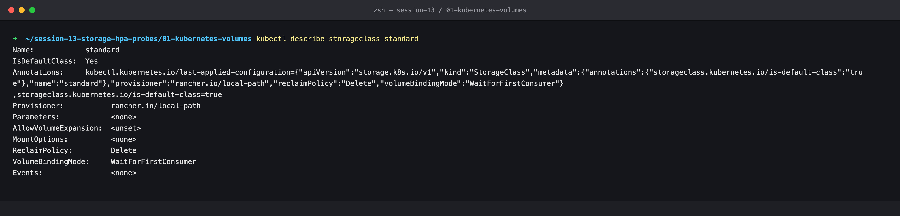

- `IsDefaultClass: Yes` is why the course PVC in step 12 was silently given this class.
- `Provisioner: rancher.io/local-path` is the controller that creates the volumes.
- `VolumeBindingMode: WaitForFirstConsumer` means don't create a volume until a Pod needs it.
- `ReclaimPolicy: Delete` means volumes it creates are destroyed with their claim.

### Step 19: A dynamic PVC waits for a consumer

```bash
kubectl apply -n s13-volumes -f manifests/dynamic-pvc.yaml
kubectl get pvc -n s13-volumes dynamic-pvc
kubectl describe pvc -n s13-volumes dynamic-pvc
```

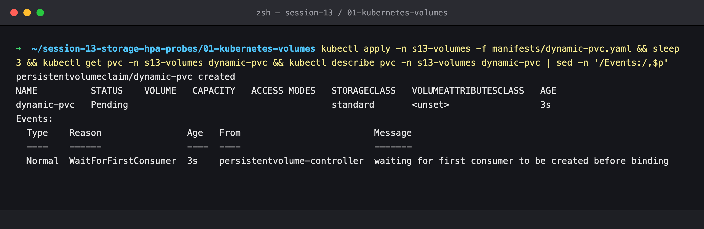

`Pending` is expected here: `waiting for first consumer to be created before binding`.

### Step 20: Mount it from a Pod, and a PV appears

```bash
# storage-pod.yaml with claimName: dynamic-pvc
kubectl get pvc -n s13-volumes dynamic-pvc
kubectl get pv
```

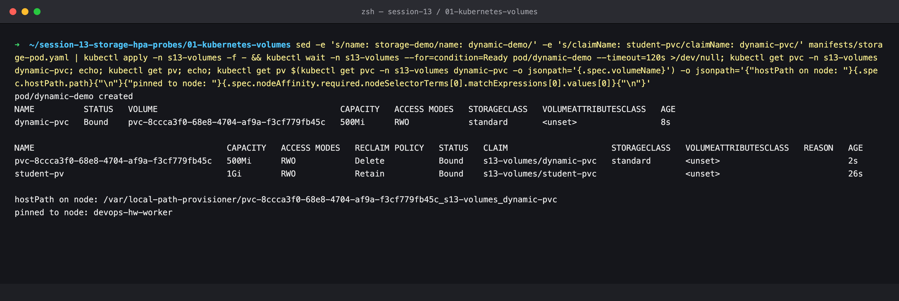

Nobody wrote a PV for this claim. The provisioner created `pvc-8ccc…` (500Mi, reclaim `Delete`) as soon as the Pod was scheduled, as a directory under `/var/local-path-provisioner/` on the Pod's node, and pinned the PV to that node.

### Step 21: Delete both claims and compare reclaim policies

```bash
kubectl delete pod -n s13-volumes dynamic-demo storage-demo
kubectl delete pvc -n s13-volumes dynamic-pvc student-pvc
kubectl get pv
```

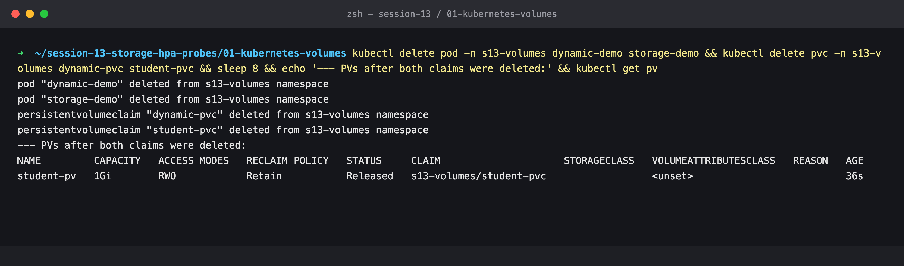

- The dynamic PV (`Delete`) is **gone**, along with its data.
- `student-pv` (`Retain`) is **`Released`**. It still exists but cannot be bound again until an admin cleans it up.

---

## Cleanup

### Step 22

```bash
docker exec devops-hw-worker2 cat /tmp/student-data/message.txt   # Retain kept the bytes
kubectl delete pv student-pv
kubectl delete namespace s13-volumes
# remove the hostPath directories from the nodes
```

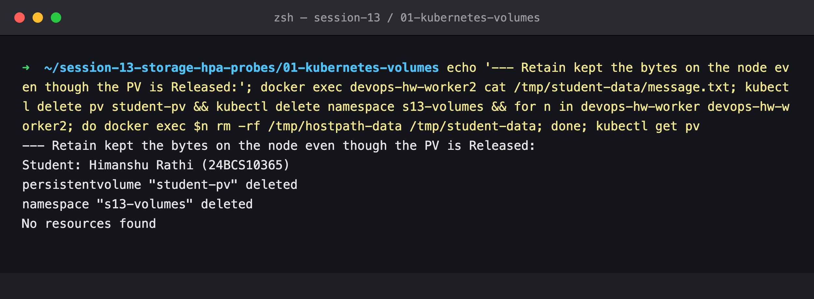

Even after the claim was gone, the file was still on the node. That is what `Retain` is for, and why a Released PV needs manual cleanup.
