# Session 13 — HPA Hands-on (Horizontal Pod Autoscaler)

## Name

Himanshu Rathi

## Roll No

`24BCS10365`

---

**Source folder:** `session-13-storage-hpa-probes/04-hpa`

Deploy an app with a CPU request, put an HPA on it, generate load, and watch the replica count follow CPU up to the maximum and back down to the minimum. Two `-w` watches recorded the whole run with timestamps, so the timeline at the end is real data, not a reconstruction.

Every command below was executed against a live Kubernetes cluster. Each screenshot is the real terminal output of the command shown directly above it. Nothing is mocked or hand-written.

---

## Environment

| | |
|---|---|
| **Cluster** | `kind` v0.31.0: 1 control-plane node + 2 worker nodes, running in Docker |
| **Kubernetes** | v1.35.0 |
| **kubectl** | v1.34.1 |
| **Metrics** | `metrics-server` v0.9.0 (`--kubelet-insecure-tls`): the kind equivalent of `minikube addons enable metrics-server` |
| **Namespace** | `s13-hpa` |
| **Host** | macOS (Apple Silicon), Docker Desktop, 15 CPUs given to Docker |
| **Date run** | 7 October 2026 |

---

## Key takeaways

- HPA works from **utilization = usage ÷ request**. `hpa-demo` requests `100m`, so 50m of CPU is 50%. Without `resources.requests.cpu` the HPA can only show `<unknown>`.
- Formula seen in action: `desired = ceil(current × currentUtil / targetUtil)`. At 2 Pods and 195% the HPA jumped straight from 2 to 4 in one step, then to 5 (`maxReplicas`) on the next sync.
- **Scale-up is fast, scale-down is deliberately slow.** Scale-out started ~45 s after load began. After load stopped, CPU read 0% at 21:30:54 but replicas stayed at 5 until 21:35:24, because of the default 5-minute `scaleDown` stabilization window (`ScaleDownStabilized` in `describe`).
- **FINDING:** the course load generator (a single `wget` loop) can't push this app past 2 replicas. busybox itself burns ~0.8 CPU on the loop but only delivers ~90m of nginx work, which settles at 45% across 2 Pods, just under the 50% target. Four more copies of the same loop ([`load-burst.yaml`](manifests/load-burst.yaml)) took it to 195% and to `maxReplicas`.
- The first ~60 s after creating the HPA show `<unknown>` and `FailedGetResourceMetric` events. That is normal: metrics-server needs a scrape or two of a new Pod before it can report.

---

## Commands executed, with output

### Step 1: Confirm metrics-server is serving

```bash
kubectl get deploy -n kube-system metrics-server
kubectl top nodes
```

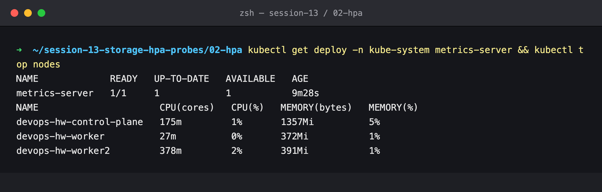

### Step 2: Deploy the app and its Service

```bash
kubectl create namespace s13-hpa
kubectl apply -n s13-hpa -f manifests/deployment.yaml -f manifests/service.yaml
kubectl get deploy,svc,pods -n s13-hpa
```

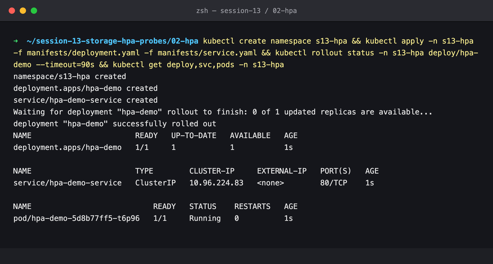

### Step 3: Create the HPA

```bash
kubectl apply -n s13-hpa -f manifests/hpa.yaml
kubectl get hpa -n s13-hpa
kubectl top pods -n s13-hpa
```

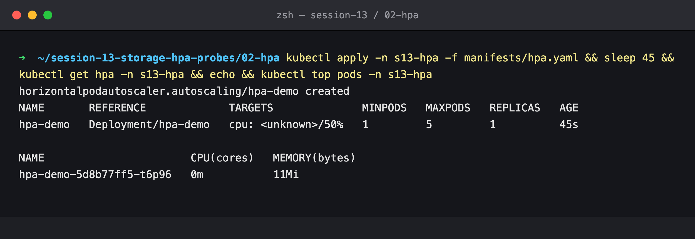

`cpu: <unknown>/50%` 45 s after creation: the HPA exists, but metrics-server has not reported the new Pod yet.

### Step 4: The HPA at rest

```bash
kubectl get hpa -n s13-hpa
kubectl describe hpa -n s13-hpa hpa-demo
```

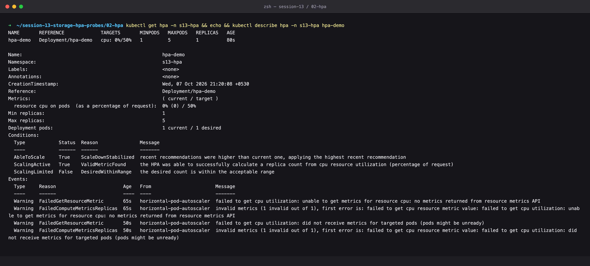

Now `0%/50%` with `ScalingActive True / ValidMetricFound`. The two warning events are from the first minute, before metrics arrived.

### Step 5: Start the load generator

At this point two background watches were started (`kubectl get hpa -w` and `kubectl get pods -w`, each line prefixed with the time). Their raw output is committed as [`hpa-watch.log`](hpa-watch.log) and [`pods-watch.log`](pods-watch.log).

```bash
./manifests/load-generator.sh     # = kubectl run load-generator --image=busybox:1.36 ... wget loop
```

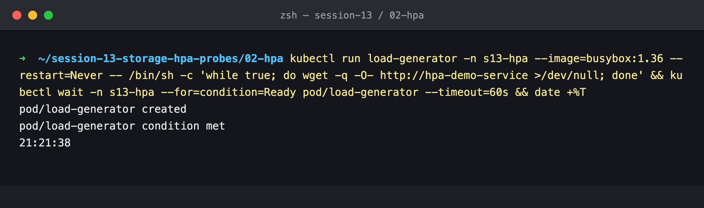

### Step 6: One minute of load

```bash
kubectl get hpa -n s13-hpa
kubectl top pods -n s13-hpa
kubectl get pods -n s13-hpa -o wide
```

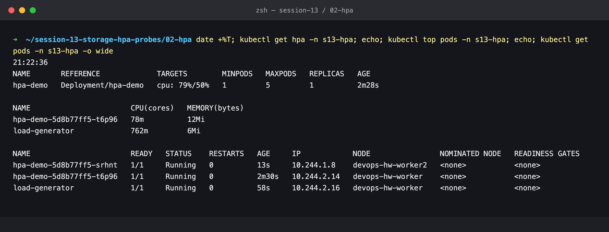

79% of request → the HPA asked for `ceil(1 × 79/50) = 2` replicas, and the second Pod (`srhnt`) is already 13 s old, on the other worker.

### Step 7: Five minutes of load, stuck at 2

```bash
kubectl get hpa -n s13-hpa
kubectl top pods -n s13-hpa
```

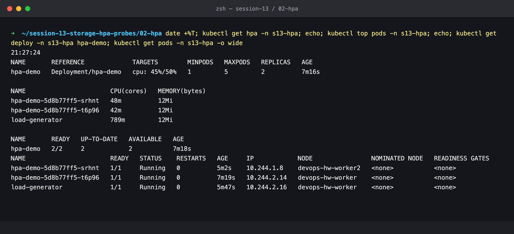

This is the plateau. Look at `kubectl top`: the **load generator** uses 789m of CPU while the two nginx Pods use 48m + 42m. The bottleneck is the single-threaded busybox loop, not nginx. 45% < 50% target, so the HPA correctly holds at 2.

### Step 8: Add more load

[`load-burst.yaml`](manifests/load-burst.yaml) is 4 more replicas of the identical `wget` loop.

```bash
kubectl apply -n s13-hpa -f manifests/load-burst.yaml
```

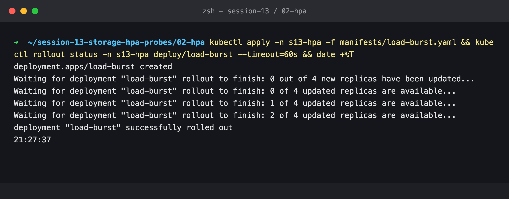

### Step 9: Scaled out to the maximum

```bash
kubectl get hpa -n s13-hpa
kubectl top pods -n s13-hpa -l app=hpa-demo
kubectl get pods -n s13-hpa -l app=hpa-demo -o wide
```

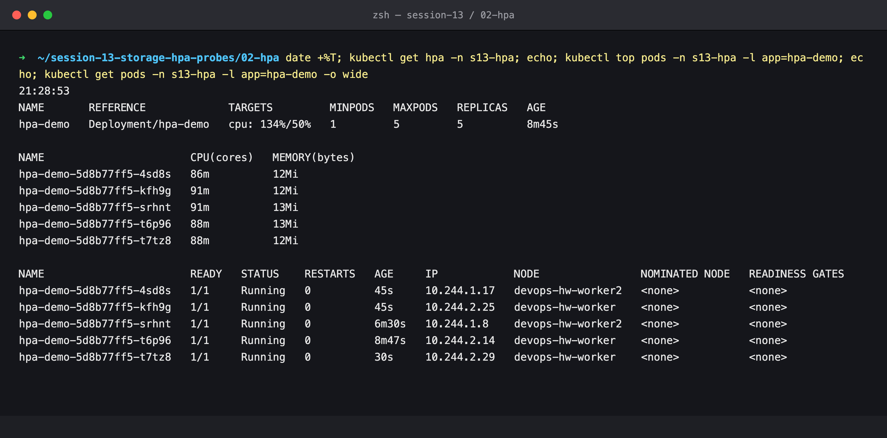

5/5 replicas, spread across both workers. All five are now doing ~90m each.

### Step 10: `describe hpa` at the cap

```bash
kubectl describe hpa -n s13-hpa hpa-demo
```

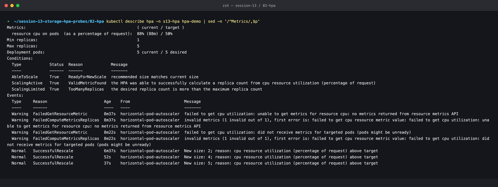

- `ScalingLimited True / TooManyReplicas`: the formula wants more than 5, and `maxReplicas` stops it.
- Events show the whole decision history: `New size: 2`, then `New size: 4`, then `New size: 5`, each with the reason `cpu resource utilization above target`.

### Step 11: Stop all load

```bash
kubectl delete pod -n s13-hpa load-generator
kubectl delete deploy -n s13-hpa load-burst
```

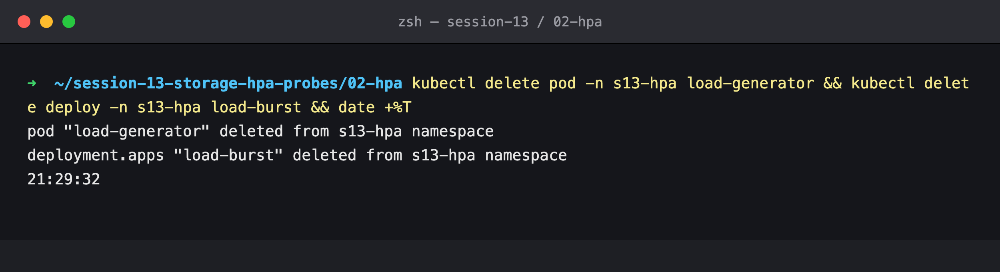

### Step 12: Cooling down, CPU 0% but still 5 replicas

```bash
kubectl get hpa -n s13-hpa
kubectl describe hpa -n s13-hpa hpa-demo | grep -A1 AbleToScale
```

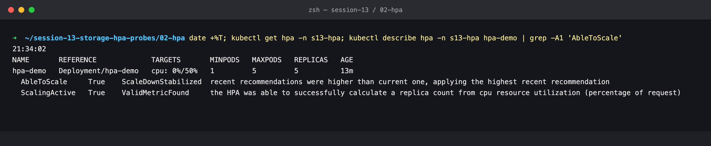

`ScaleDownStabilized`: the HPA keeps the **highest** recommendation from the last 5 minutes, so a short dip in traffic doesn't remove capacity.

### Step 13: Scaled back down to 1

```bash
kubectl get hpa -n s13-hpa
kubectl get pods -n s13-hpa
kubectl describe hpa -n s13-hpa hpa-demo | grep SuccessfulRescale
```

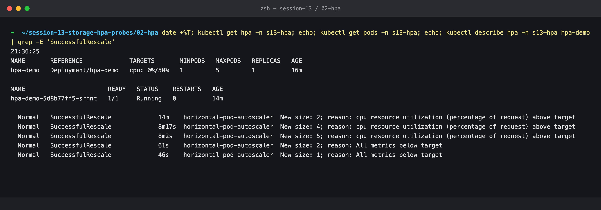

`New size: 2; reason: All metrics below target`, then `New size: 1`, about 6 minutes after the load stopped.

### Step 14: The full HPA timeline (recorded with `kubectl get hpa -w`)

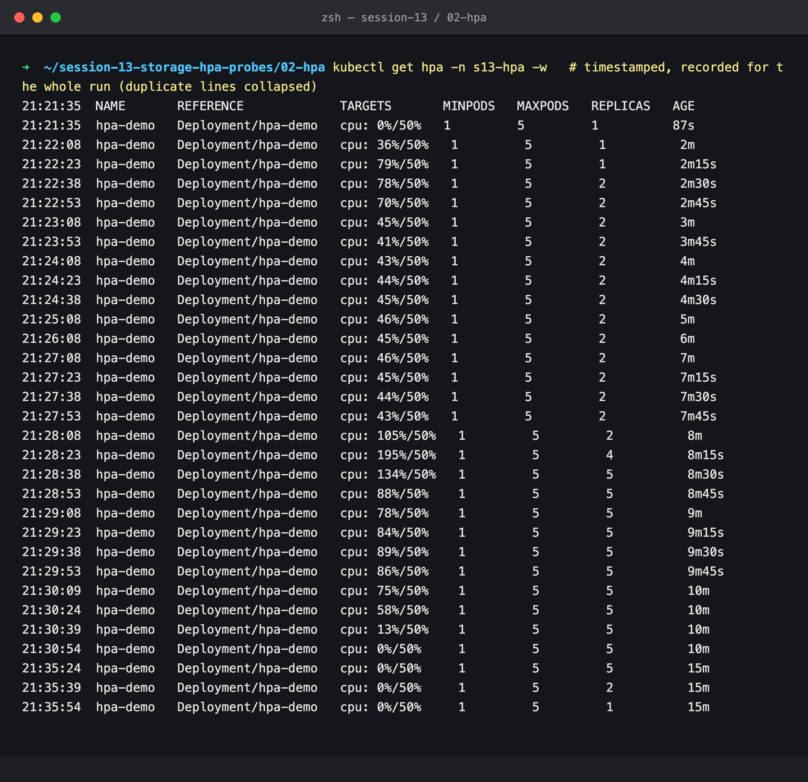

| Time | What happened |
|---|---|
| 21:21:38 | load generator started |
| 21:22:23 | 79% → replicas 1 → **2** |
| 21:23:08 – 21:27:53 | plateau at 41–46%, just under the 50% target: **stuck at 2** |
| 21:27:37 | 4 more load Pods added |
| 21:28:23 | 195% → **4** |
| 21:28:38 | 134% → **5** (max) |
| 21:29:32 | all load stopped |
| 21:30:54 | CPU at 0%, still 5 (stabilization window) |
| 21:35:39 | → **2** |
| 21:35:54 | → **1** (`minReplicas`) |

### Step 15: The Pod side of the same run (recorded with `kubectl get pods -w`)

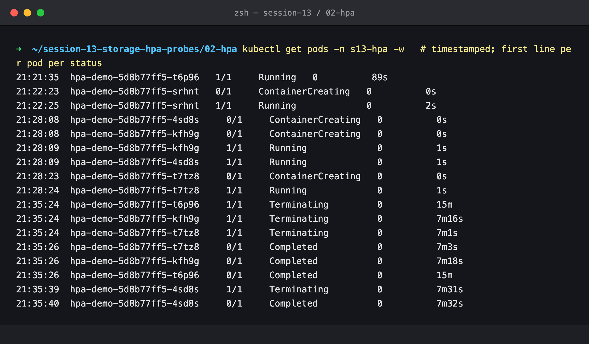

Every new Pod went `ContainerCreating` → `Running` in 1–2 s (image already on the node). On scale-down the three surplus Pods were terminated together at 21:35:24 and the fourth at 21:35:39, matching the HPA's two `SuccessfulRescale` events.

---

## Cleanup

### Step 16

```bash
kubectl delete namespace s13-hpa
```

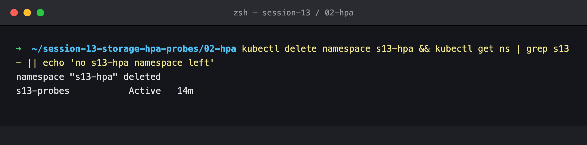

(`s13-probes` in the output is the next lab's namespace, which was running at the same time. It is deleted at the end of that lab.)
