# Session 13 — Probes (Liveness, Readiness, Startup)

## Name

Himanshu Rathi

## Roll No

`24BCS10365`

---

**Source folder:** `session-13-storage-hpa-probes/05-probes`

Each probe was broken on purpose so its *failure* behaviour could be watched. The three probes do very different things when they fail, and that difference is the whole lesson.

Every command below was executed against a live Kubernetes cluster. Each screenshot is the real terminal output of the command shown directly above it. Nothing is mocked or hand-written.

---

## Environment

| | |
|---|---|
| **Cluster** | `kind` v0.31.0: 1 control-plane node + 2 worker nodes, running in Docker |
| **Kubernetes** | v1.35.0 |
| **kubectl** | v1.34.1 |
| **Namespace** | `s13-probes` |
| **Host** | macOS (Apple Silicon), Docker Desktop |
| **Date run** | 7 October 2026 |

---

## Key takeaways

| Probe | Question | On failure | Seen below |
|---|---|---|---|
| **Liveness** | "Are you still working?" | kubelet **restarts the container** | `403` → `Killing` → `RESTARTS 1`, and the restart repaired the app |
| **Readiness** | "Can you take traffic now?" | Pod is **removed from Service endpoints**, never restarted | `READY 0/1`, endpoint `ready=false`, `ENDPOINTS` empty; back in when fixed |
| **Startup** | "Have you finished booting?" | container restarted, but liveness/readiness are **held off** until it passes | slow app survives with a startup probe and is killed forever without one |

- A liveness failure only "fixes" things that a fresh container fixes. Here the deleted `index.html` came back from the image. A bug baked into the image would just turn into a restart loop.
- Readiness needs `failureThreshold × periodSeconds` (3 × 5 s = 15 s) of consecutive failures before the Pod is pulled. A first check at 12 s still showed `1/1`, and the screenshot below was taken at 22 s.
- **FINDING:** without a startup probe, a 30 s boot is killed at 15 s, but the restart cycle measured **45 s**, not 15 s. The container's PID 1 is `sh` (sleeping), which ignores SIGTERM, so every kill waits the full `terminationGracePeriodSeconds: 30` and then SIGKILLs (`exitCode 137`). nginx never starts. After 19 minutes the Pod had 9 restarts and was in `CrashLoopBackOff`.
- A Pod with **no readiness probe is `1/1 Ready` as soon as its process starts**, even while nothing is listening (`slow-no-startup` at t+10 s). A Service would have sent it traffic.

---

## Commands executed, with output

## Liveness

### Step 1: Apply the liveness Pod

```bash
kubectl create namespace s13-probes
kubectl apply -n s13-probes -f manifests/liveness.yaml
kubectl describe pod -n s13-probes liveness-demo | grep -E 'Liveness|Readiness|Startup'
```

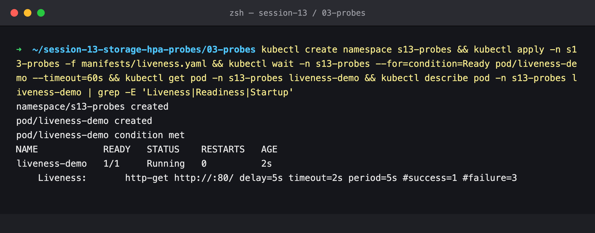

`http-get :80/ delay=5s timeout=2s period=5s #failure=3`: an HTTP check every 5 s, and 3 failures in a row means restart.

### Step 2: Break the app

Deleting nginx's `index.html` makes `GET /` return 403. Then wait 25 s.

```bash
kubectl exec -n s13-probes liveness-demo -- rm /usr/share/nginx/html/index.html
kubectl exec -n s13-probes liveness-demo -- curl -s -o /dev/null -w "%{http_code}" localhost/
kubectl get pod -n s13-probes liveness-demo
kubectl get events -n s13-probes --field-selector involvedObject.name=liveness-demo
```

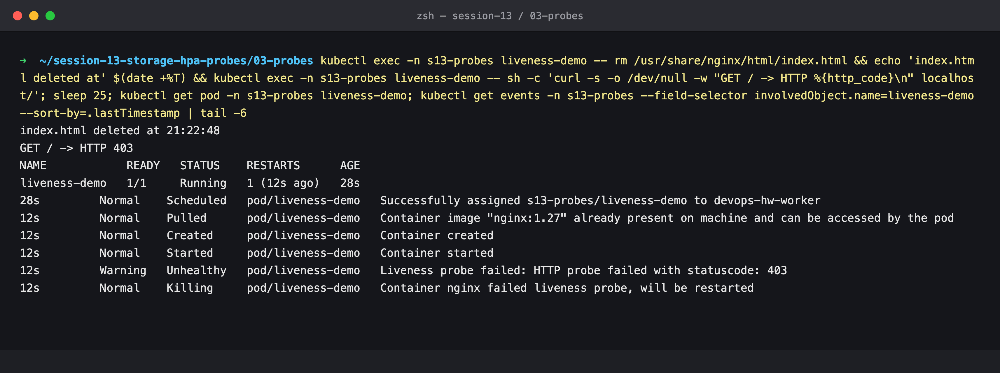

`Liveness probe failed: HTTP probe failed with statuscode: 403` → `Container nginx failed liveness probe, will be restarted` → `RESTARTS 1`.

### Step 3: After the restart

```bash
kubectl exec -n s13-probes liveness-demo -- sh -c 'ls /usr/share/nginx/html; curl -s -o /dev/null -w "%{http_code}" localhost/'
```

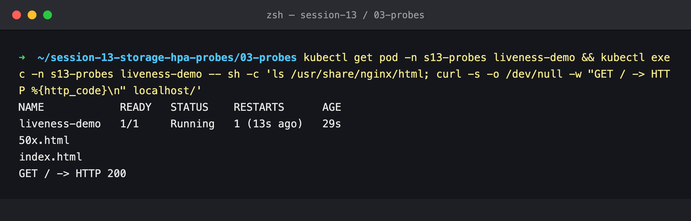

`index.html` is back and `/` returns 200. The restarted container started from the image's filesystem, so the "corruption" was undone.

## Readiness

### Step 4: Apply the readiness Pod plus a Service in front of it

```bash
kubectl apply -n s13-probes -f manifests/readiness.yaml
kubectl expose pod readiness-demo -n s13-probes --port=80 --name=readiness-svc
kubectl get pod -n s13-probes readiness-demo     # sampled every 2 s
kubectl get endpointslices -n s13-probes -l kubernetes.io/service-name=readiness-svc
```

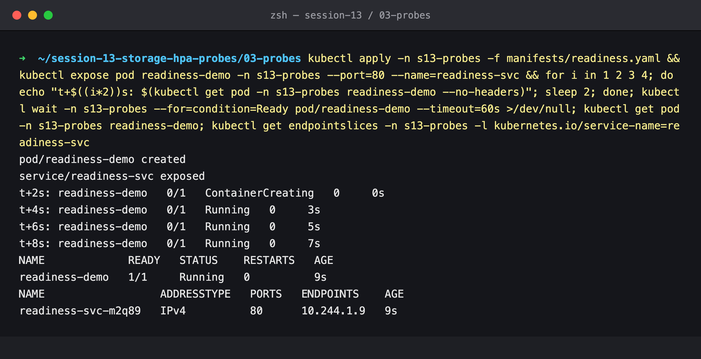

`Running` but `0/1` for the first ~8 s (`initialDelaySeconds: 5` + the first check), then `1/1`. Only then does the Pod IP appear behind the Service.

### Step 5: Break readiness

```bash
kubectl exec -n s13-probes readiness-demo -- mv /usr/share/nginx/html/index.html /tmp/
sleep 22
kubectl get pod -n s13-probes readiness-demo
kubectl get endpointslices ... -o jsonpath='{...ready}'
kubectl get endpoints -n s13-probes readiness-svc
```

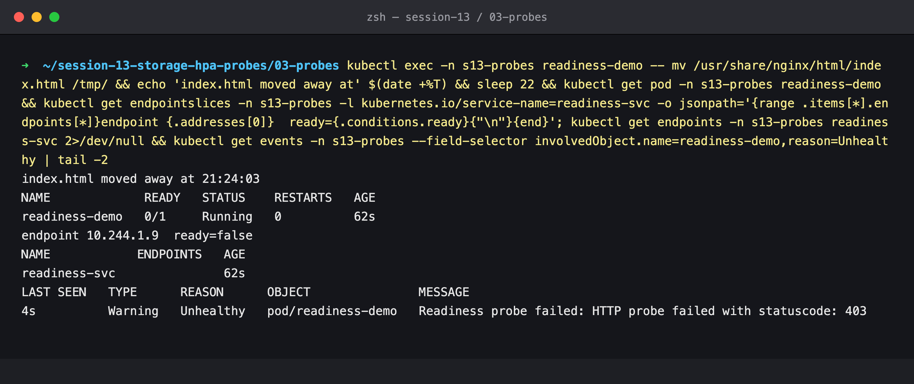

`READY 0/1` but still `Running` with **0 restarts**. The endpoint is marked `ready=false` and the Service's `ENDPOINTS` column is empty, so the Pod gets no traffic but is left alone to recover.

### Step 6: Fix it, and it rejoins on its own

```bash
kubectl exec -n s13-probes readiness-demo -- mv /tmp/index.html /usr/share/nginx/html/
kubectl get pod -n s13-probes readiness-demo
kubectl get endpoints -n s13-probes readiness-svc
```

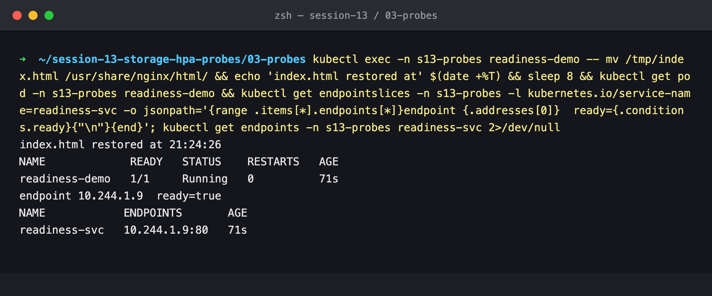

One successful check (`successThreshold: 1`) and the Pod is `1/1` again, back in the endpoints as `10.244.1.9:80`.

## Startup

### Step 7: The course's startup Pod

```bash
kubectl apply -n s13-probes -f manifests/startup.yaml
kubectl describe pod -n s13-probes startup-demo | grep -E 'Liveness|Readiness|Startup'
```

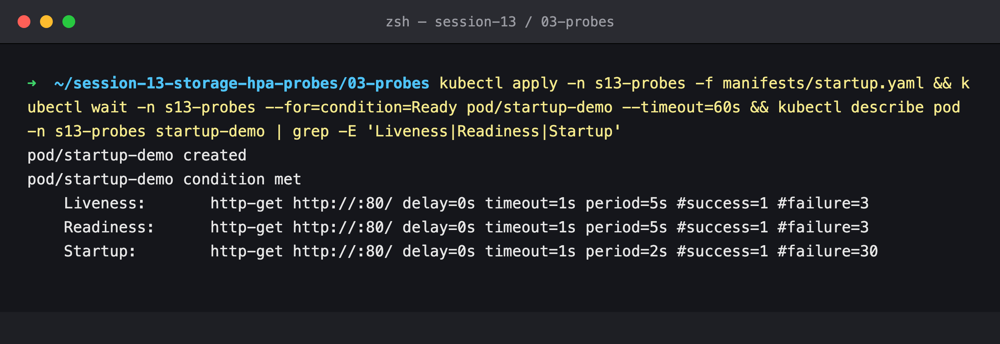

The startup probe allows `30 × 2 s = 60 s` to boot. nginx starts in under a second, though, so this manifest can't show the probe *doing* anything. Steps 8–10 use a deliberately slow app.

### Step 8: Same slow app, with and without a startup probe

Both Pods run `sleep 30; exec nginx` (a 30 s boot) with the same liveness probe (`period 5s`, `failure 3`). Only [`slow-start-with-startup-probe.yaml`](manifests/slow-start-with-startup-probe.yaml) adds the startup probe. The other is [`slow-start-no-startup-probe.yaml`](manifests/slow-start-no-startup-probe.yaml).

```bash
kubectl apply -n s13-probes -f manifests/slow-start-no-startup-probe.yaml -f manifests/slow-start-with-startup-probe.yaml
kubectl get pods -n s13-probes slow-no-startup slow-with-startup    # every 10 s
```

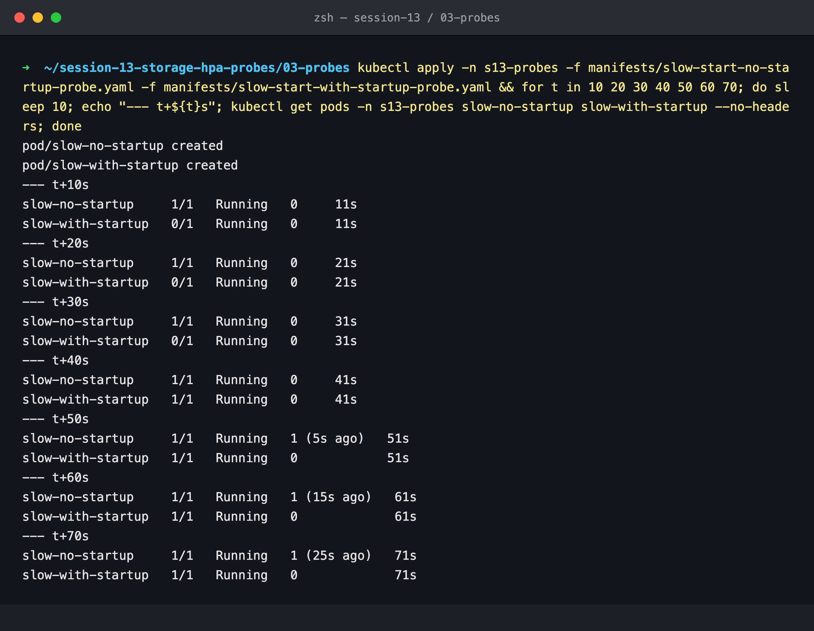

- `slow-with-startup`: `0/1` until the startup probe passes at ~40 s, then `1/1`, **0 restarts**.
- `slow-no-startup`: shows `1/1` immediately (no readiness probe, so it is "ready" while nothing listens), then gets restarted.

### Step 9: The events

```bash
kubectl get events -n s13-probes --field-selector involvedObject.name=slow-no-startup
kubectl get events -n s13-probes --field-selector involvedObject.name=slow-with-startup
```

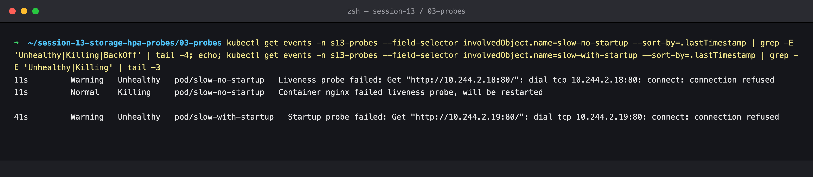

- Without a startup probe: **liveness** fails (`connection refused`) → `Killing`.
- With one: the failures are **startup** probe failures, which only mean "not booted yet". No `Killing`.

### Step 10: Why the restart cycle is 45 s, not 15 s

```bash
kubectl get pod -n s13-probes slow-no-startup -o jsonpath='{...lastState.terminated...}'
kubectl get events ... -o custom-columns=FIRST:.firstTimestamp,LAST:.lastTimestamp,COUNT:.count,REASON:.reason
```

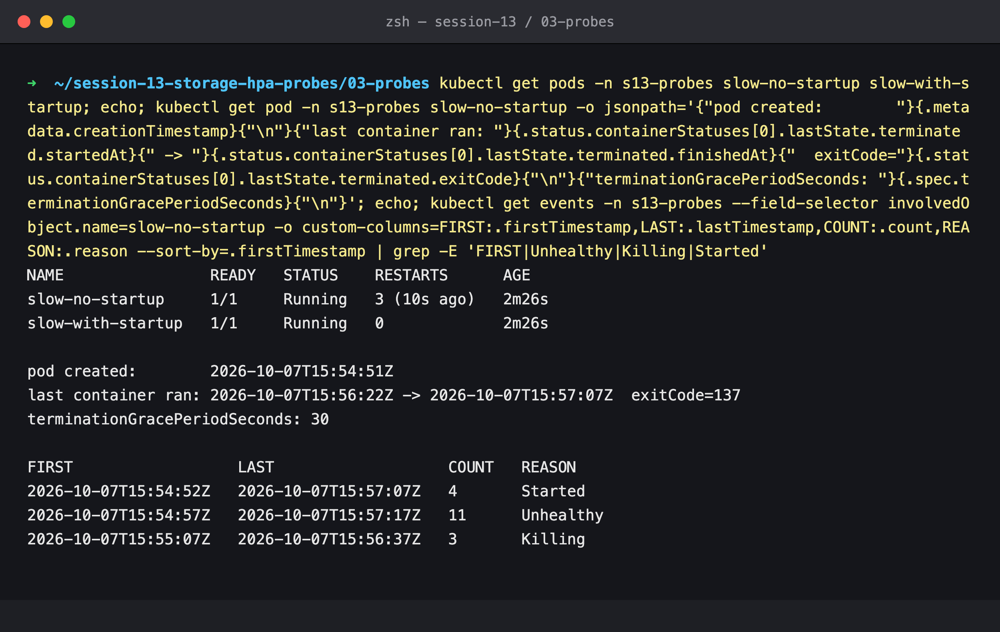

- Started 15:54:52, first liveness failure 15:54:57, first `Killing` 15:55:07. That is exactly 3 failures × 5 s = 15 s after start.
- But the last container ran **15:56:22 → 15:57:07 = 45 s** and exited **137** (SIGKILL). PID 1 is `sh` running `sleep`, and as PID 1 it has no default SIGTERM handler, so it ignores the polite stop. The kubelet waits the full `terminationGracePeriodSeconds: 30`, then kills it. 15 s + 30 s = 45 s.
- Each new attempt restarts the 30 s boot from zero, so nginx **never** comes up. That is the case startup probes exist for.

---

## Cleanup

### Step 11

```bash
kubectl get pods -n s13-probes
kubectl delete namespace s13-probes
```

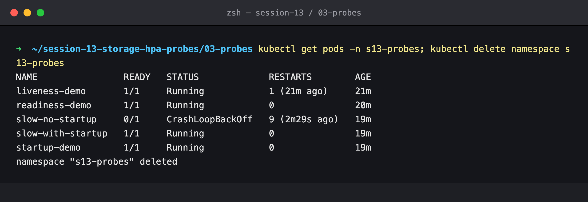

The final state is the best summary of the lab. After 19 minutes, `slow-no-startup` had **9 restarts and was in `CrashLoopBackOff`**, while the identical app with a startup probe had 0.
