# Session 13 — Mini Project: Production-Ready Web App (PVC + HPA + Probes)

## Name

Himanshu Rathi

## Roll No

`24BCS10365`

---

**Source folder:** `session-13-storage-hpa-probes/mini-project`

The capstone puts all three pillars into one Deployment: a PersistentVolumeClaim mounted at `/data`, an HPA between 2 and 5 replicas at 50% CPU, and startup, readiness and liveness probes. All the verification tasks and both bonus challenges were run, plus the cleanup.

Every command below was executed against a live Kubernetes cluster. Each screenshot is the real terminal output of the command shown directly above it. Nothing is mocked or hand-written.

---

## Environment

| | |
|---|---|
| **Cluster** | `kind` v0.31.0: 1 control-plane node + 2 worker nodes, running in Docker |
| **Kubernetes** | v1.35.0 |
| **kubectl** | v1.34.1 |
| **StorageClass** | `standard` (`rancher.io/local-path`). This replaces minikube's `k8s.io/minikube-hostpath` in the project's diagram |
| **Namespace** | `production-webapp` (as written in the project manifests) |
| **Date run** | 7 October 2026 |

---

## Key takeaways

- Data written to `/data` by one replica survived **deleting every replica at once**. The PVC, not any Pod, owns it.
- Both replicas read the same file even though the claim is `ReadWriteOnce`. RWO restricts the volume to one **node**, not one Pod, and both Pods were on that node.
- **FINDING:** that same fact limits the HPA. The local-path PV is pinned to `devops-hw-worker`, so all **5** autoscaled replicas were scheduled onto that single node, and the other worker sat idle. Spreading replicas needs `ReadWriteMany` storage or per-Pod volumes (a StatefulSet).
- The manifest's `strategy: Recreate` fits RWO (old Pods stop before new ones mount the volume), but it means **any** template change takes every Pod down at once. Bonus 1 shows this as a total outage.
- Bonus 1 (bad readiness path): Pods `Running 0/1`, Service has **no endpoints**, and requests fail even though nothing is restarting.
- Bonus 2 (bad liveness path): restarts every **~20 s** (5 s initial delay + 3 × 5 s), not 15 s as the project README says. Between restarts the Pods even show `1/1 Ready`, because readiness checks `/`, which works. So the Service keeps routing to Pods that are about to be killed.

---

## Commands executed, with output

### Step 1: Namespace and PVC

```bash
kubectl apply -f manifests/namespace.yaml
kubectl apply -f manifests/pvc.yaml
kubectl get pvc -n production-webapp
```

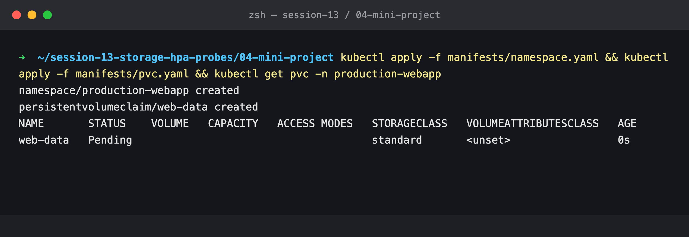

`Pending` is correct here, not an error: the `standard` class is `WaitForFirstConsumer`, so no volume is created until a Pod uses the claim.

### Step 2: Deployment and Service

```bash
kubectl apply -f manifests/deployment.yaml -f manifests/service.yaml
kubectl rollout status -n production-webapp deploy/web-app
kubectl get pods -n production-webapp -o wide
kubectl get pvc,svc -n production-webapp
```

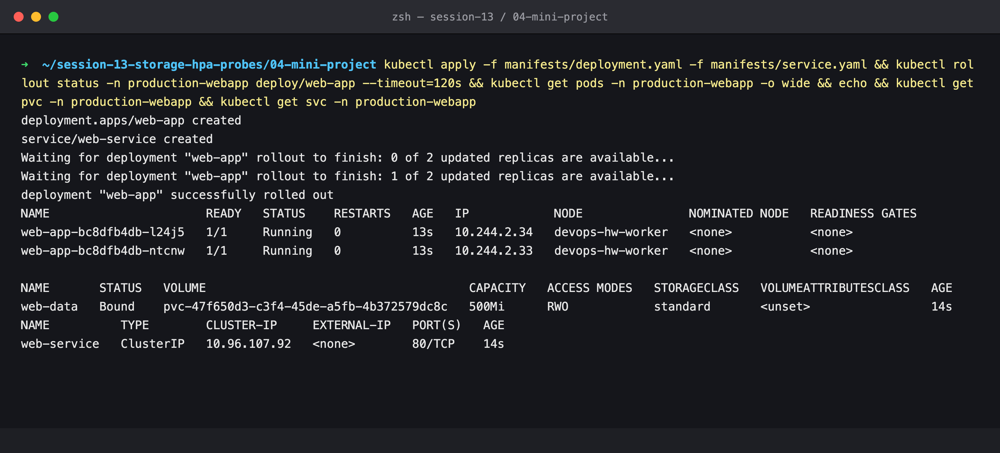

The first Pod triggered provisioning, and the PVC is now `Bound` to `pvc-47f6…`. Both replicas landed on `devops-hw-worker`, the node the volume was created on.

### Step 3: HPA

```bash
kubectl apply -f manifests/hpa.yaml
kubectl get hpa -n production-webapp
```

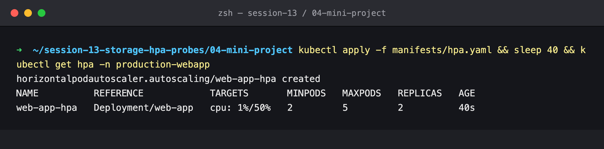

## Task 1: Storage persistence

### Step 4: Write from one replica, read from the other

```bash
POD_NAME=$(kubectl get pods -n production-webapp -l app=web-app -o jsonpath='{.items[0].metadata.name}')
kubectl exec -n production-webapp "$POD_NAME" -- sh -c 'echo "Student: Himanshu Rathi (24BCS10365)" > /data/student.txt'
kubectl exec -n production-webapp "$POD_NAME" -- cat /data/student.txt
kubectl exec -n production-webapp <other-pod> -- cat /data/student.txt
```

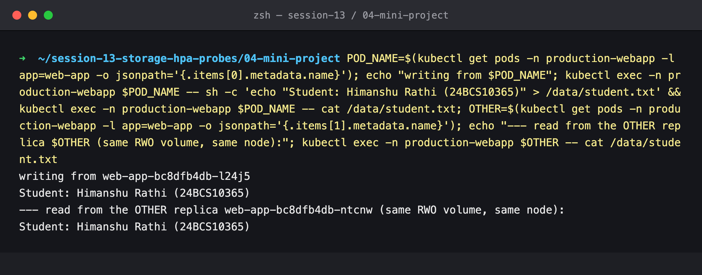

### Step 5: Delete that Pod, read from its replacement

```bash
kubectl delete pod -n production-webapp "$POD_NAME"
kubectl exec -n production-webapp <newest-pod> -- cat /data/student.txt
```

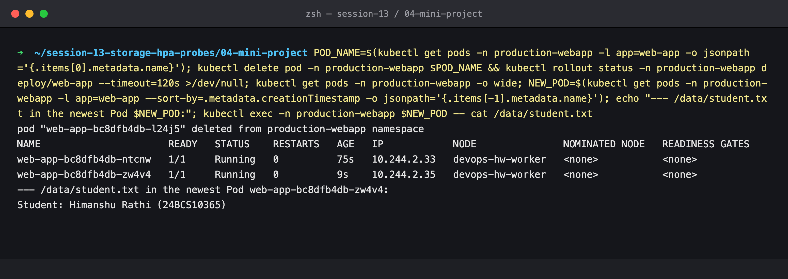

### Step 6: Stronger test, delete **every** replica at once

Step 5 alone is a weak proof, because the other replica was alive the whole time. Here no Pod survives.

```bash
kubectl delete pods -n production-webapp -l app=web-app
kubectl rollout status -n production-webapp deploy/web-app
for p in $(kubectl get pods -n production-webapp -l app=web-app -o name); do kubectl exec -n production-webapp $p -- cat /data/student.txt; done
```

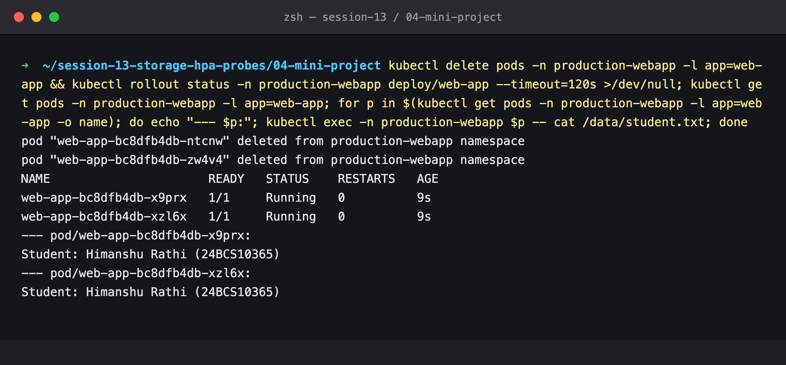

Two brand-new Pods, same file. The data lives in the PersistentVolume, independent of any Pod.

## Task 2: Service verification

### Step 7: Port-forward and curl

Host port 18080 was used (8080 is taken by the kind cluster's ingress port mapping).

```bash
kubectl port-forward -n production-webapp svc/web-service 18080:80 &
curl http://localhost:18080
```

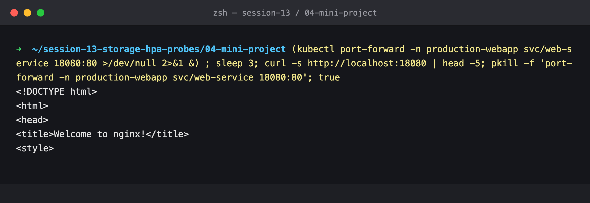

## Task 3: HPA elastic scaling

### Step 8: Start load

The project's single `load-generator` Pod, plus the same 4-replica `load-burst` used in the [HPA lab](../02-hpa/submission.md). There, one generator alone could not push nginx past 2 replicas.

```bash
kubectl run load-generator -n production-webapp --image=busybox:1.36 --restart=Never \
  -- /bin/sh -c "while true; do wget -q -O- http://web-service; done"
kubectl apply -n production-webapp -f ../02-hpa/manifests/load-burst.yaml   # target changed to web-service
```

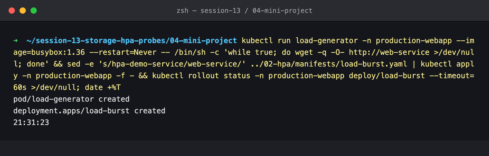

### Step 9: Scaled to 5, all on one node

```bash
kubectl get hpa -n production-webapp
kubectl top pods -n production-webapp -l app=web-app
kubectl get pods -n production-webapp -l app=web-app -o wide
kubectl get pv <web-data volume> -o jsonpath='{.spec.nodeAffinity...}'
```

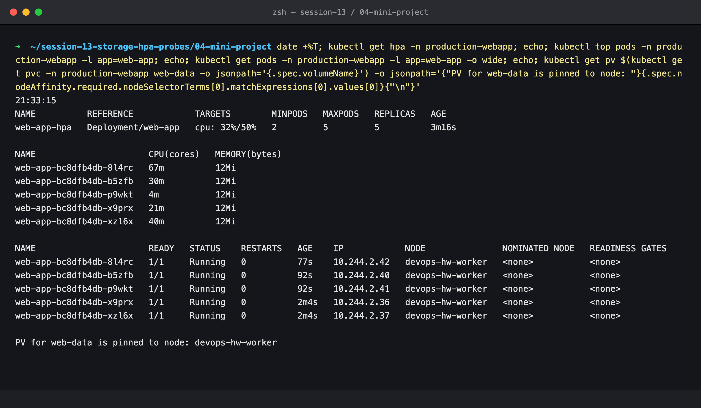

5/5 replicas, **every one on `devops-hw-worker`**, because that is where the PV is pinned. The scheduler is forced to honour the volume's node affinity, so the HPA adds Pods but not nodes. CPU per Pod is uneven too (4m – 67m): kube-proxy spreads connections, not CPU.

### Step 10: `describe hpa`

```bash
kubectl describe hpa -n production-webapp web-app-hpa
```

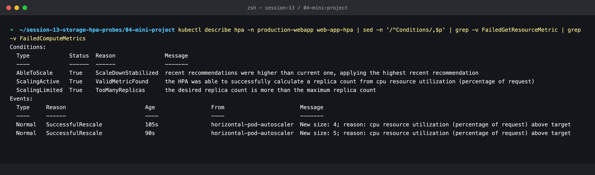

`New size: 4`, then `New size: 5`, and `ScalingLimited True / TooManyReplicas`.

### Step 11: Stop the load

```bash
kubectl delete pod -n production-webapp load-generator
kubectl delete deploy -n production-webapp load-burst
```

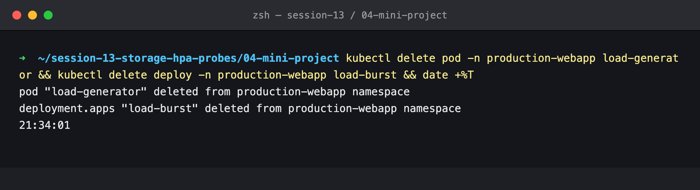

### Step 12: Still 5 during the stabilization window

```bash
kubectl get hpa -n production-webapp
```

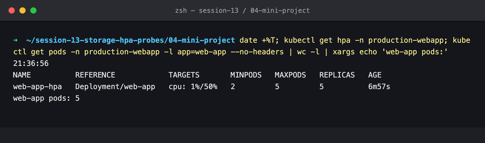

### Step 13: Back to `minReplicas: 2`

```bash
kubectl get hpa -n production-webapp
kubectl get pods -n production-webapp -l app=web-app
kubectl describe hpa -n production-webapp web-app-hpa | grep SuccessfulRescale
```

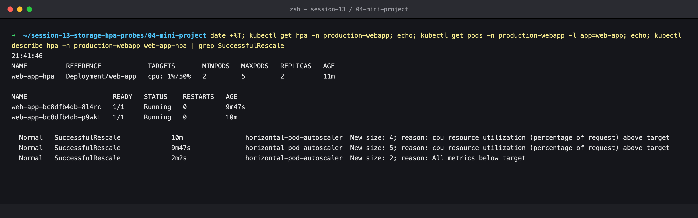

`New size: 2; reason: All metrics below target`. It stops at 2, not 1, because of `minReplicas`.

## Bonus challenges

### Step 14: Challenge 2, readiness pointed at `/does-not-exist`

```bash
kubectl patch deploy -n production-webapp web-app --type=json \
  -p='[{"op":"replace","path":"/spec/template/spec/containers/0/readinessProbe/httpGet/path","value":"/does-not-exist"}]'
kubectl get pods -n production-webapp -l app=web-app
kubectl get endpoints -n production-webapp web-service
kubectl run curl-test -n production-webapp --rm -i --restart=Never --image=curlimages/curl:8.6.0 -- curl -s -m 3 http://web-service
```

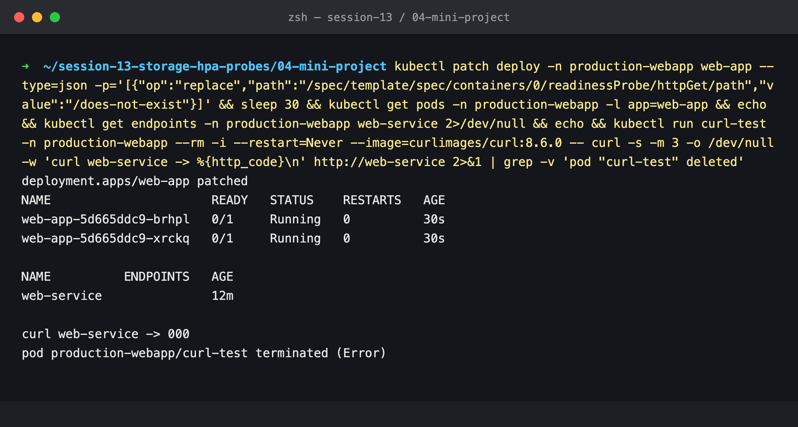

Exactly as the challenge predicts: `Running` but `0/1`, endpoints **empty**, and the Service is unreachable (`000`). Because the strategy is `Recreate`, both old Pods were removed before the broken ones started, so this is a full outage, not a partial one.

### Step 15: Why they're not ready

```bash
kubectl get events -n production-webapp --field-selector reason=Unhealthy
```

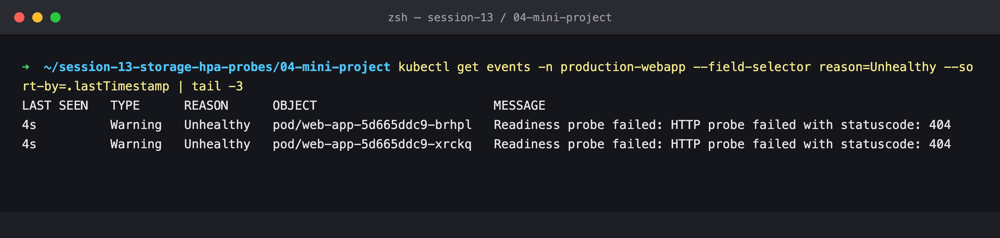

`Readiness probe failed: HTTP probe failed with statuscode: 404`.

### Step 16: Challenge 3, liveness pointed at `/crash`

Readiness was restored to `/` in the same patch.

```bash
kubectl patch deploy -n production-webapp web-app --type=json -p='[... readiness "/" ..., ... liveness "/crash" ...]'
kubectl get pods -n production-webapp -l app=web-app      # every 20 s
kubectl get events -n production-webapp --field-selector reason=Killing
```

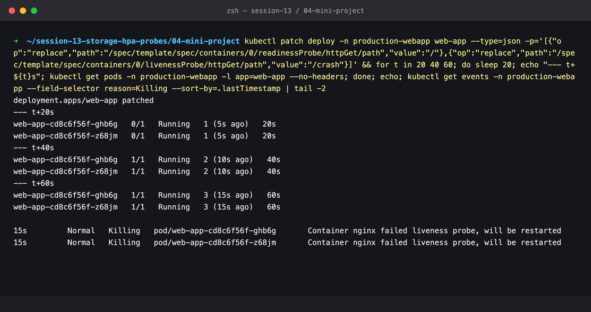

`RESTARTS` climbs 1 → 2 → 3, one restart every ~20 s: 5 s `initialDelaySeconds` + 3 failures × 5 s `periodSeconds`. `Container nginx failed liveness probe, will be restarted`. Note the `1/1` between restarts: readiness (`/`) passes, so these Pods keep receiving traffic right up until they are killed.

---

## Cleanup

### Step 17: Restore, verify, delete

```bash
kubectl apply -f manifests/deployment.yaml
kubectl get pods,endpoints -n production-webapp
kubectl delete namespace production-webapp
kubectl get pv
```

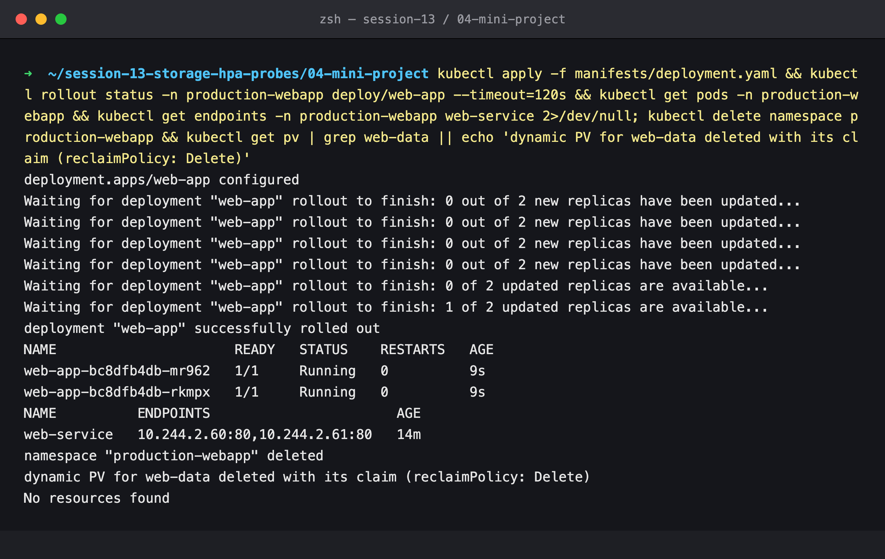

Re-applying the original manifest brought both Pods back to `1/1` with two endpoints. Deleting the namespace deleted the PVC, and the dynamically provisioned PV went with it (`reclaimPolicy: Delete`).
