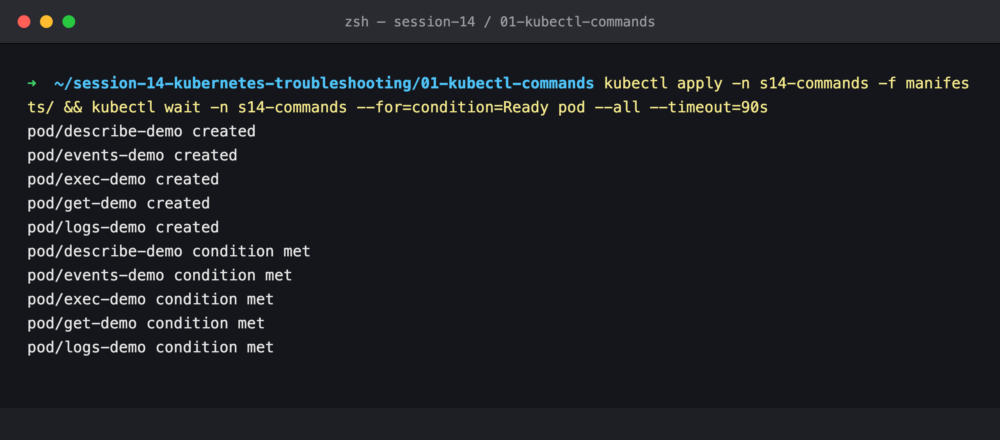
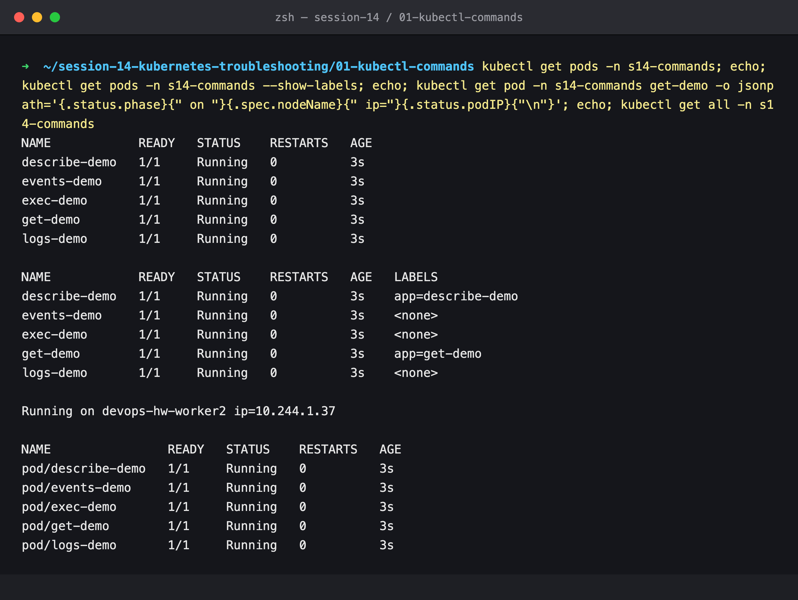
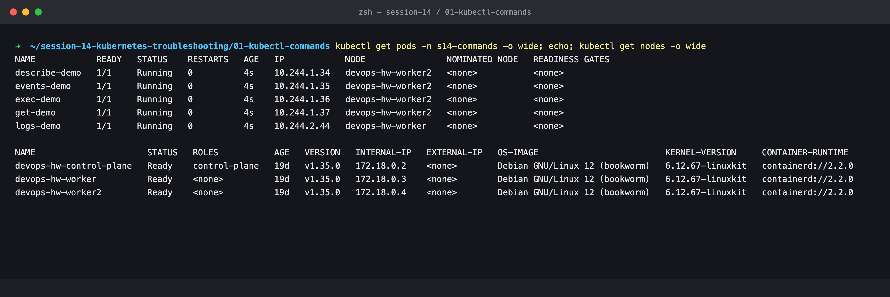
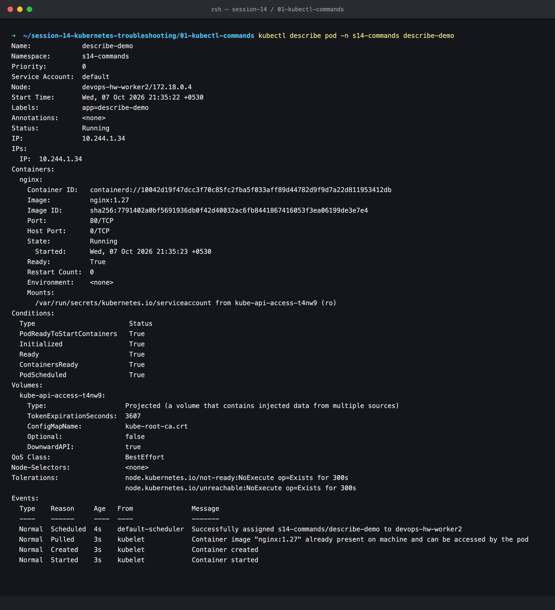
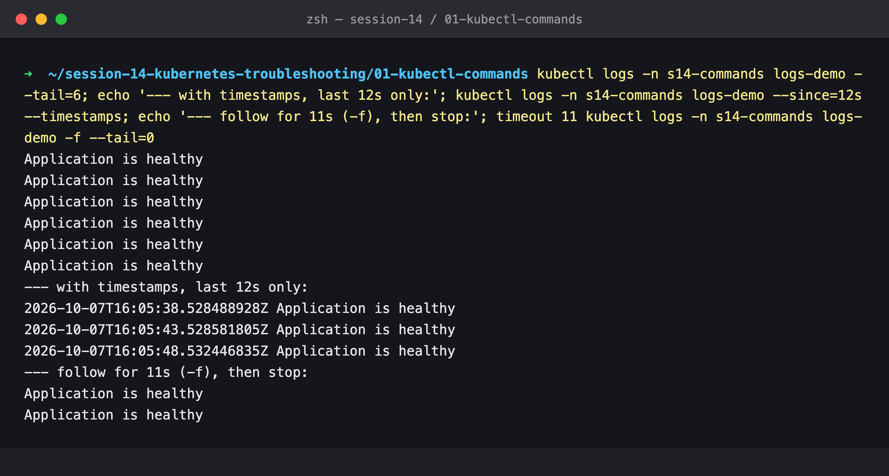
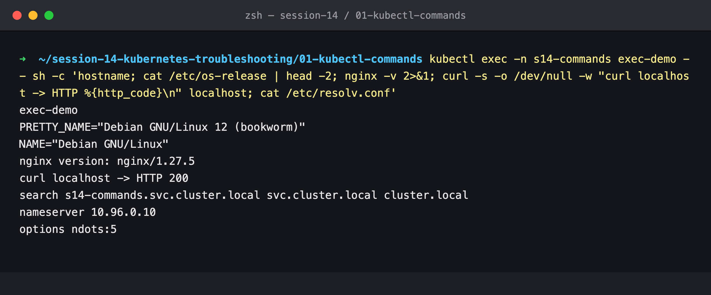
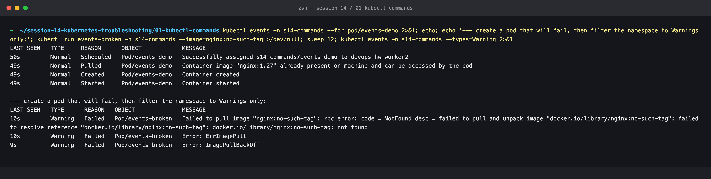
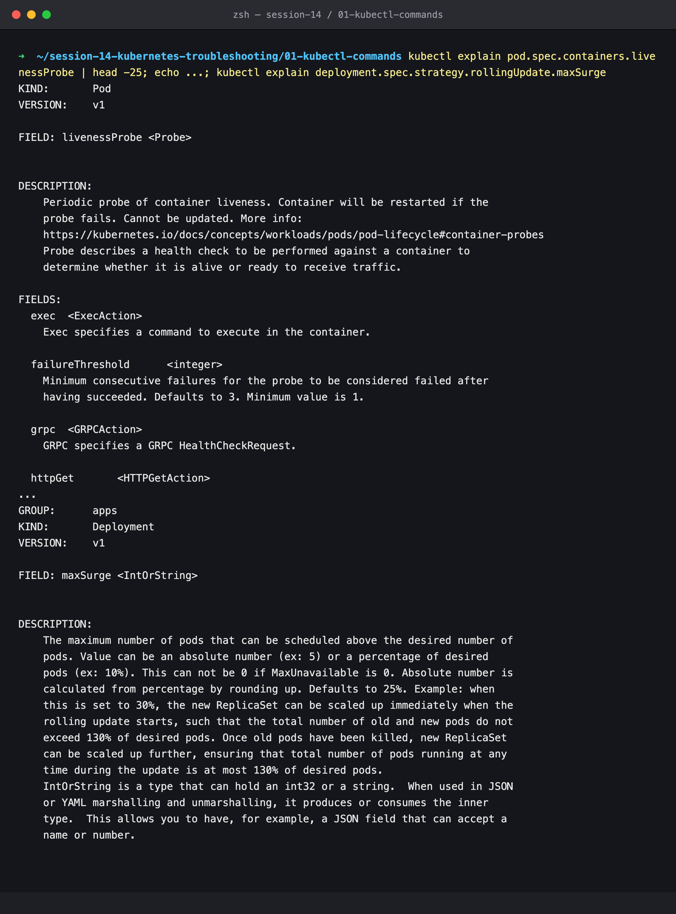
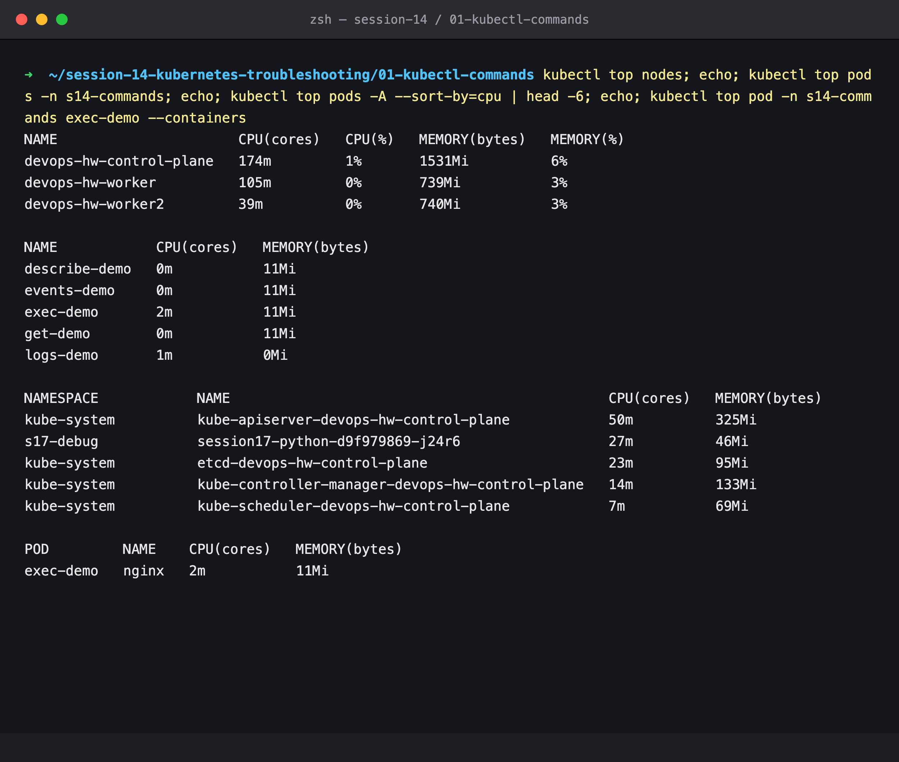
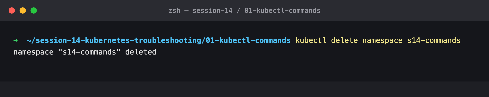

# Session 14 — Troubleshooting Commands

## Name

Himanshu Rathi

## Roll No

`24BCS10365`

---

**Source folders:** `session-14-kubernetes-troubleshooting/01-kubectl-get` … `05-events`

The eight commands every investigation is built from, each run on real Pods and explained by what it is *for* during an incident.

Every command below was executed against a live Kubernetes cluster. Each screenshot is the real terminal output of the command shown directly above it. Nothing is mocked or hand-written.

---

## Environment

| | |
|---|---|
| **Cluster** | `kind` v0.31.0: 1 control-plane node + 2 worker nodes, running in Docker |
| **Kubernetes** | v1.35.0 |
| **kubectl** | v1.34.1 |
| **Metrics** | `metrics-server` v0.9.0 |
| **Namespace** | `s14-commands` |
| **Date run** | 7 October 2026 |

---

## Key takeaways

| Command | Answers | Use it when |
|---|---|---|
| `kubectl get` | *What exists, and what state is it in?* | always first: STATUS, READY, RESTARTS, AGE |
| `kubectl get -o wide` | *Where is it running?* | node placement, Pod IPs, node OS/runtime |
| `kubectl describe` | *Why is it in that state?* | full spec + conditions + **Events** at the bottom |
| `kubectl logs` | *What did the application say?* | the app started but misbehaves or crashes |
| `kubectl exec` | *What does it look like from inside?* | test localhost, DNS, files, env, ports from the container itself |
| `kubectl events` | *What happened, in order?* | filter by object (`--for`) or by type (`--types=Warning`) |
| `kubectl explain` | *What does this field mean?* | writing or reviewing YAML: built-in API docs, offline |
| `kubectl top` | *How much CPU and memory is it using?* | OOM, throttling, HPA decisions (needs metrics-server) |

- `get` shows **state**, `describe` shows **reasons**. A `Pending` in `get` turns into "0/3 nodes are available: …" in `describe`.
- Events live about an hour and are namespaced. `kubectl events --types=Warning` across a namespace is the fastest "what is broken here?".

---

## Commands executed, with output

### Step 1: Create the five demo Pods

```bash
kubectl create namespace s14-commands
kubectl apply -n s14-commands -f manifests/
kubectl wait -n s14-commands --for=condition=Ready pod --all
```



### Step 2: `kubectl get`

```bash
kubectl get pods -n s14-commands
kubectl get pods -n s14-commands --show-labels
kubectl get pod -n s14-commands get-demo -o jsonpath='{.status.phase} on {.spec.nodeName} ip={.status.podIP}'
kubectl get all -n s14-commands
```



`--show-labels` is how you check what a Service selector *could* match. `-o jsonpath` pulls single fields for scripts.

### Step 3: `kubectl get -o wide`

```bash
kubectl get pods -n s14-commands -o wide
kubectl get nodes -o wide
```



`-o wide` adds Pod IP and NODE, and for nodes the internal IP, OS image, kernel and container runtime (`containerd://2.2.0`).

### Step 4: `kubectl describe`

```bash
kubectl describe pod -n s14-commands describe-demo
```



The useful parts during an incident: **State / Last State / Restart Count** (did it crash, and with what exit code), **Conditions** (scheduled? initialized? ready?), **QoS Class** (`BestEffort` here, since there are no requests, so it is the first to be evicted), and **Events**.

### Step 5: `kubectl logs`

```bash
kubectl logs -n s14-commands logs-demo --tail=6
kubectl logs -n s14-commands logs-demo --since=12s --timestamps
kubectl logs -n s14-commands logs-demo -f --tail=0      # follow, stopped after 11 s
```



`--tail` limits lines, `--since` limits time, `--timestamps` shows the 5 s rhythm of the health message, and `-f` streams new lines. For a crashed container `--previous` is meant to show the last run. On this kind cluster it could not retrieve them, see [lab 2](../02-common-issues/submission.md#1-crashloopbackoff).

### Step 6: `kubectl exec`

```bash
kubectl exec -n s14-commands exec-demo -- sh -c 'hostname; head -2 /etc/os-release; nginx -v; curl -s -o /dev/null -w "%{http_code}" localhost; cat /etc/resolv.conf'
```



From inside: the app answers on localhost (200), and `resolv.conf` shows how DNS works for this Pod: nameserver `10.96.0.10` (CoreDNS) and the search list `s14-commands.svc.cluster.local …`. That search list is why short Service names only work inside their own namespace (shown in the DNS section of lab 2).

### Step 7: `kubectl events`

```bash
kubectl events -n s14-commands --for pod/events-demo
kubectl run events-broken -n s14-commands --image=nginx:no-such-tag
kubectl events -n s14-commands --types=Warning
```



A healthy Pod's life is `Scheduled → Pulled → Created → Started`. Filtering the namespace to Warnings immediately surfaces the broken Pod and the exact registry error.

### Step 8: `kubectl explain`

```bash
kubectl explain pod.spec.containers.livenessProbe
kubectl explain deployment.spec.strategy.rollingUpdate.maxSurge
```



The API documents itself, including defaults (`failureThreshold` defaults to 3, `maxSurge` to 25%).

### Step 9: `kubectl top`

```bash
kubectl top nodes
kubectl top pods -n s14-commands
kubectl top pods -A --sort-by=cpu
kubectl top pod -n s14-commands exec-demo --containers
```



Live CPU and memory from metrics-server. `--sort-by=cpu` across all namespaces finds the noisy neighbour. (`s17-debug` in that list belongs to another lab running on the same cluster at the time.)

---

## Cleanup

### Step 10

```bash
kubectl delete namespace s14-commands
```


