# Session 14 — Troubleshooting Common Issues

## Name

Himanshu Rathi

## Roll No

`24BCS10365`

---

**Source folders:** `session-14-kubernetes-troubleshooting/06-crashloopbackoff`, `07-imagepullbackoff`, `08-pending-pods`, `09-service-dns-troubleshooting`, plus manifests written for this lab where the course has none (ContainerCreating, configuration, wrong targetPort, NetworkPolicy)

Nine failure types. Each one is broken on purpose, then worked through: **problem → investigation → root cause → fix → verification**.

Every command below was executed against a live Kubernetes cluster. Each screenshot is the real terminal output of the command shown directly above it. Nothing is mocked or hand-written.

---

## Environment

| | |
|---|---|
| **Cluster** | `kind` v0.31.0: 1 control-plane node + 2 worker nodes, running in Docker |
| **Kubernetes** | v1.35.0 |
| **kubectl** | v1.34.1 |
| **CNI** | kindnet (enforces NetworkPolicy) |
| **Namespaces** | `s14-issues`, `s14-other` |
| **Date run** | 7 October 2026 |

---

## Key takeaways

- **Read the status, then go where it points.** Container problems (`CrashLoopBackOff`, `OOMKilled`) → `logs`. Kubelet problems (`ErrImagePull`, `ContainerCreating`, `CreateContainerConfigError`) → `describe` / events. Scheduler problems (`Pending`) → events. Pods healthy but traffic failing → Service → endpoints → DNS → network policy, in that order.
- Pod specs are mostly immutable. `kubectl apply` of a fixed bare Pod is **rejected** (only `image` and a few other fields can change in place), so fixes use `kubectl set image` or `kubectl replace --force`.
- `curl` exit codes told the network failures apart: **7** = connection refused (Service with no endpoints, so kube-proxy rejects), **28** = timeout (NetworkPolicy silently dropping packets), **6** = DNS name not resolvable.
- Two bugs in the course's `09-service-dns-troubleshooting` folder were found and fixed: the DNS test image doesn't exist, and the "good" `service.yaml` has a selector that matches nothing.

---

## 1. CrashLoopBackOff

**Problem:** [`crashloop-broken.yaml`](manifests/crashloop-broken.yaml) runs a script that prints two lines and `exit 1`.

### Step 1: Apply and observe

```bash
kubectl create namespace s14-issues
kubectl apply -n s14-issues -f manifests/crashloop-broken.yaml
kubectl get pod -n s14-issues crash-demo          # 45 s later
```

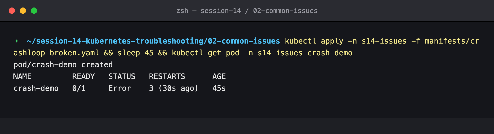

3 restarts in 45 s. The STATUS column flips between `Error` (just exited) and `CrashLoopBackOff` (waiting out the back-off), so either can show at any given moment.

### Step 2: Investigate with `describe`

```bash
kubectl describe pod -n s14-issues crash-demo
```

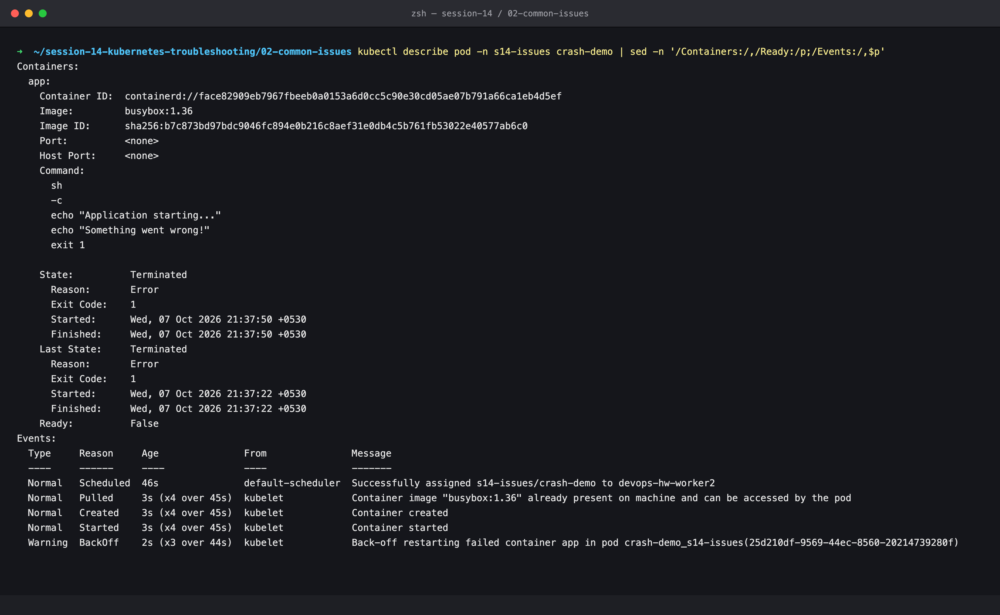

`State: Terminated / Reason: Error / Exit Code: 1`, same for `Last State`. `Started` and `Finished` are the **same second**, so it dies immediately. Event: `Back-off restarting failed container`.

### Step 3: Watch the cycle and read the logs

```bash
kubectl get pod -n s14-issues crash-logs -w
kubectl logs -n s14-issues crash-logs
kubectl logs -n s14-issues crash-logs --previous
```

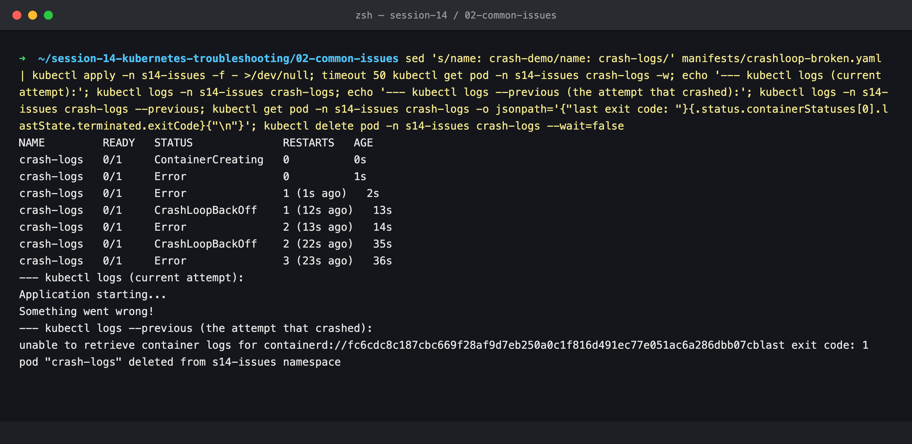

The watch shows the back-off growing: restarts at 1 s, 13 s and 36 s (10 s, then 20 s of waiting, doubling up to a 5-minute cap). The logs show the root cause: `Something went wrong!`, then exit code 1.

On this kind cluster `--previous` returned `unable to retrieve container logs` for this sub-second container on every attempt (even though `lastState` clearly records the previous run with exit 1). Because every attempt prints the same thing, the current attempt's log is enough here.

**Root cause:** the application exits non-zero on start. Kubernetes isn't broken; it is restarting a process that keeps quitting.

### Step 4: Try to fix with `apply`

```bash
kubectl apply -n s14-issues -f manifests/crashloop-fixed.yaml
```

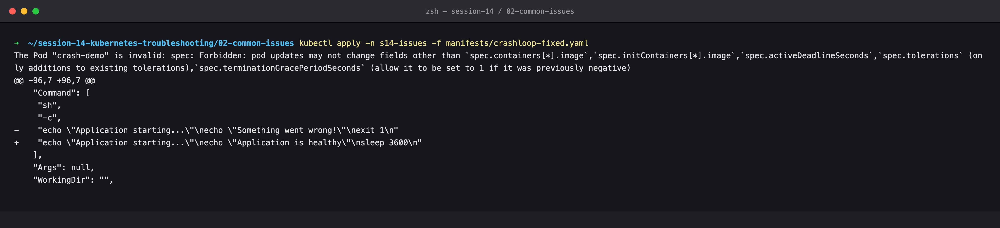

Rejected: `pod updates may not change fields other than spec.containers[*].image, …`. A Pod's command can't be edited in place.

### Step 5: Fix and verify

```bash
kubectl replace --force -n s14-issues -f manifests/crashloop-fixed.yaml
kubectl get pod -n s14-issues crash-demo
kubectl logs -n s14-issues crash-demo
```

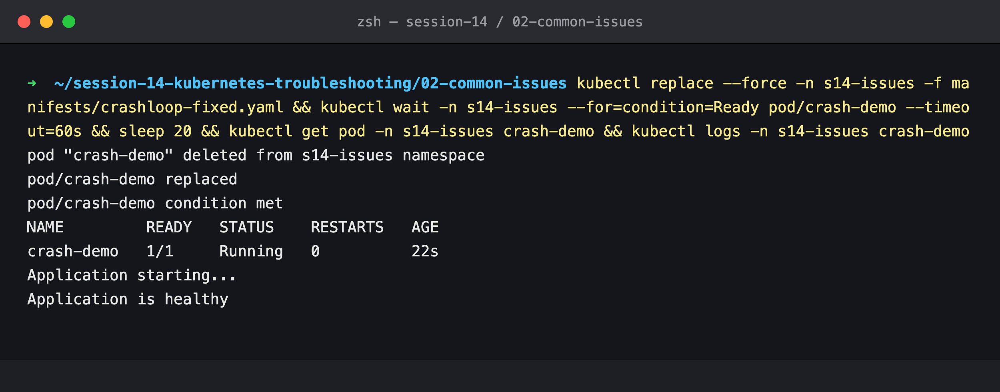

`Running`, 0 restarts after 22 s, and the log says `Application is healthy`.

---

## 2. ErrImagePull / ImagePullBackOff

**Problem:** [`imagepull-broken.yaml`](manifests/imagepull-broken.yaml) uses `nginx:this-image-does-not-exist`.

### Step 6: Apply and watch

```bash
kubectl apply -n s14-issues -f manifests/imagepull-broken.yaml
kubectl get pod -n s14-issues image-demo -w
```

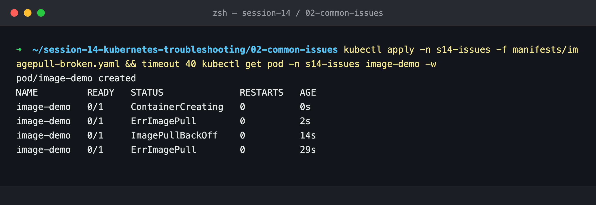

`ErrImagePull` is the pull that just failed. `ImagePullBackOff` is the kubelet waiting before trying again. They alternate.

### Step 7: Investigate

```bash
kubectl describe pod -n s14-issues image-demo
kubectl events -n s14-issues --for pod/image-demo
```

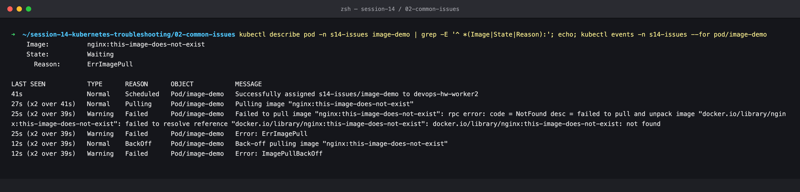

The registry's exact answer: `docker.io/library/nginx:this-image-does-not-exist: not found`. Note how the short name expands to `docker.io/library/…`.

### Step 8: Confirm with the registry directly

```bash
docker manifest inspect nginx:this-image-does-not-exist
docker manifest inspect nginx:1.27
```

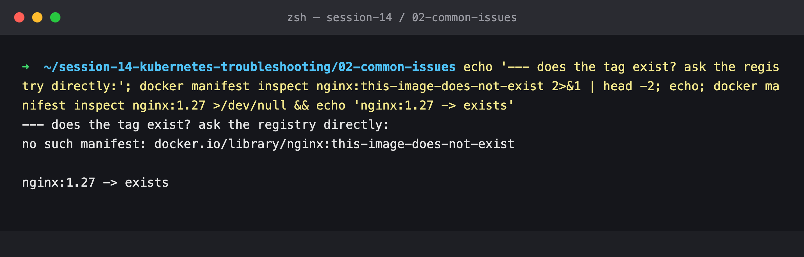

**Root cause:** the tag doesn't exist. The repository does, so it is a tag typo, not an auth or network problem.

### Step 9: Fix in place and verify

`image` is one of the few mutable Pod fields, so no recreate is needed.

```bash
kubectl set image -n s14-issues pod/image-demo app=nginx:1.27
kubectl get pod -n s14-issues image-demo
```

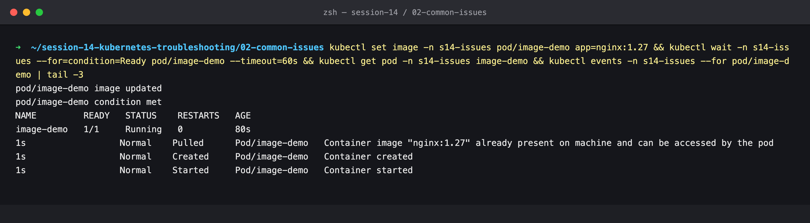

The same Pod (age 80 s) is now `Running`.

**A second, real ImagePullBackOff from this session:** at the start of the Session 13 labs every Pod using `nginx:1.27` failed with:

```
Failed to pull image "nginx:1.27": ... unexpected status from HEAD request to
https://registry-1.docker.io/v2/library/nginx/manifests/1.27: 429 Too Many Requests
```

Here the image and tag were fine. Docker Hub was rate-limiting the nodes' anonymous pulls. The fix was to pull once on the host and import the images into each node. In production the fixes are an `imagePullSecret` with a Docker Hub account, a pull-through cache, or a private mirror. The event text is the only way to tell this case apart from a typo. (A retry later pulled fine, so this case could not be re-captured as a screenshot. The text above is copied from that run's events.)

---

## 3. Pending

**Problem:** [`pending-broken.yaml`](manifests/pending-broken.yaml) has `nodeSelector: kubernetes.io/hostname: node-that-does-not-exist`.

### Step 10: Apply

```bash
kubectl apply -n s14-issues -f manifests/pending-broken.yaml
kubectl get pod -n s14-issues pending-demo -o wide
```

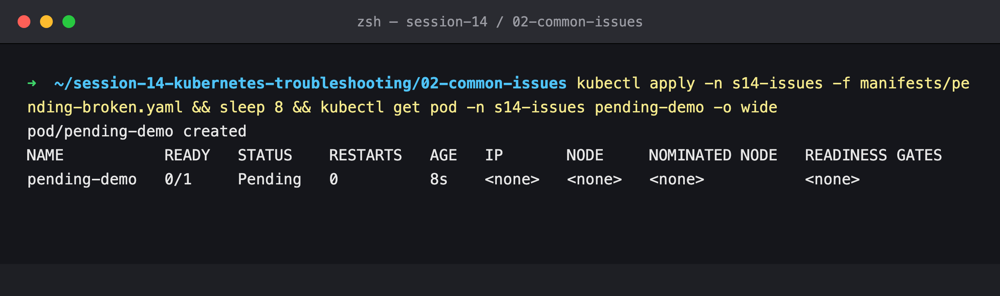

`Pending` with `NODE <none>` and `IP <none>`. It was never scheduled, so there are no logs and nothing to exec into.

### Step 11: Investigate

```bash
kubectl describe pod -n s14-issues pending-demo
kubectl events -n s14-issues --for pod/pending-demo
```

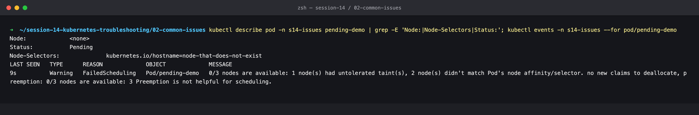

The scheduler's verdict accounts for every node: `0/3 nodes are available: 1 node(s) had untolerated taint(s)` (the control plane), `2 node(s) didn't match Pod's node affinity/selector`.

### Step 12: Compare what's asked for with what exists

```bash
kubectl get pod -n s14-issues pending-demo -o jsonpath='{.spec.nodeSelector}'
kubectl get nodes -L kubernetes.io/hostname
```

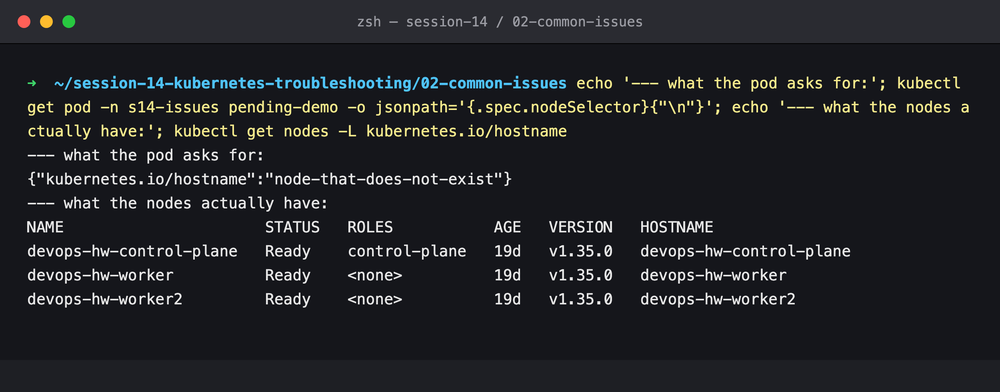

**Root cause:** no node has `hostname=node-that-does-not-exist`.

### Step 13: Fix and verify

```bash
kubectl replace --force -n s14-issues -f manifests/pending-fixed.yaml
kubectl get pod -n s14-issues pending-demo -o wide
```

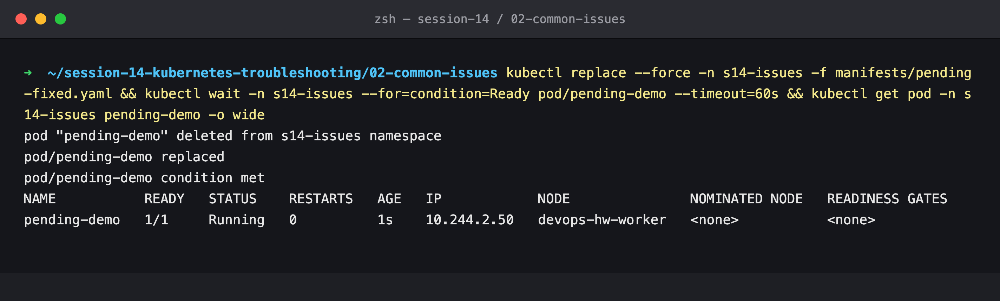

Other common Pending causes are requests bigger than any node (shown in the [triage gauntlet](../04-triage-scenarios/submission.md#scenario-3--pending)), a PVC that can't bind, and taints without tolerations.

---

## 4. Stuck in ContainerCreating

**Problem** (manifest written for this lab, since the course has none): [`containercreating-broken.yaml`](manifests/containercreating-broken.yaml) mounts a ConfigMap named `site-content` that was never created.

### Step 14: Apply

```bash
kubectl apply -n s14-issues -f manifests/containercreating-broken.yaml
kubectl get pod -n s14-issues creating-demo
```

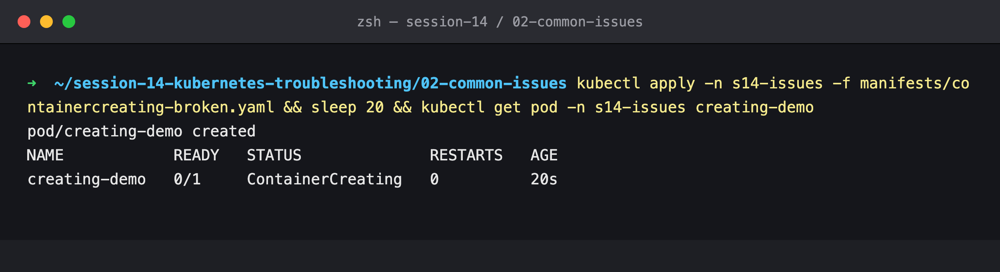

Still `ContainerCreating` after 20 s. This status normally lasts about a second.

### Step 15: Investigate

```bash
kubectl describe pod -n s14-issues creating-demo
kubectl events -n s14-issues --for pod/creating-demo
kubectl get configmap -n s14-issues site-content
```

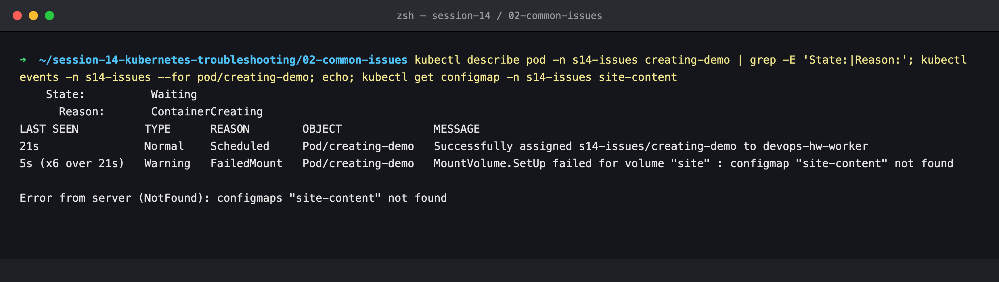

`FailedMount … configmap "site-content" not found`, retried 6 times in 21 s. **Root cause:** the kubelet can't build the volume, so it never starts the container. That also means `kubectl logs` has nothing to show.

### Step 16: Fix and verify

Create the missing ConfigMap and touch nothing else. The kubelet's next mount retry picks it up.

```bash
kubectl apply -n s14-issues -f manifests/containercreating-fix-configmap.yaml
kubectl get pod -n s14-issues creating-demo
kubectl exec -n s14-issues creating-demo -- curl -s localhost
```

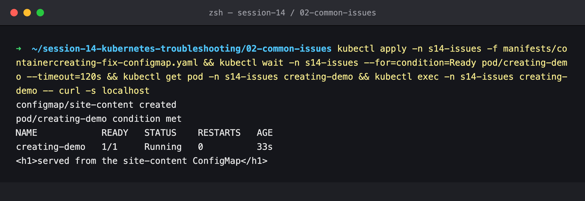

The same Pod started and serves the page from the ConfigMap. (Same pattern for a missing Secret volume, or a PVC that isn't bound yet.)

---

## 5. Configuration issue: CreateContainerConfigError

**Problem** (written for this lab): [`config-broken.yaml`](manifests/config-broken.yaml) reads env var `DB_HOST` from ConfigMap key `DB_HOST`, but the ConfigMap stores it as `db_host`.

### Step 17: Apply

```bash
kubectl apply -n s14-issues -f manifests/config-broken.yaml
kubectl get pod -n s14-issues config-demo
```

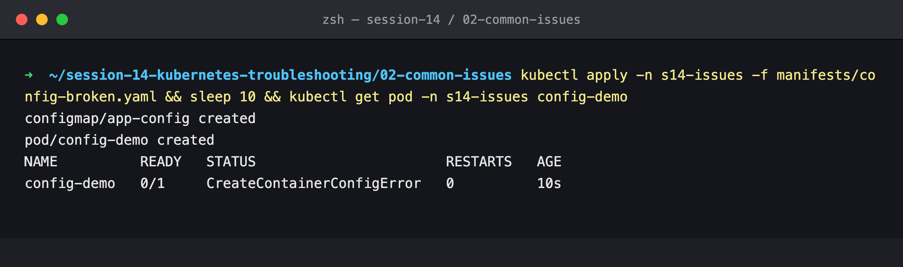

### Step 18: Investigate, comparing the keys asked for with the keys present

```bash
kubectl events -n s14-issues --for pod/config-demo --types=Warning
kubectl get pod -n s14-issues config-demo -o jsonpath='{range .spec.containers[0].env[*]}...'
kubectl get configmap -n s14-issues app-config -o go-template='{{range $k,$v := .data}}{{$k}}{{end}}'
```

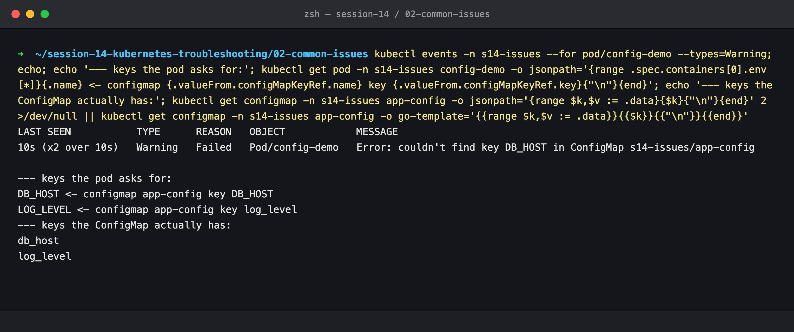

`couldn't find key DB_HOST in ConfigMap s14-issues/app-config`. The Pod asks for `DB_HOST`, the ConfigMap has `db_host`. **Root cause:** ConfigMap keys are case-sensitive.

### Step 19: Fix and verify

```bash
kubectl delete pod -n s14-issues config-demo
kubectl apply -n s14-issues -f manifests/config-fixed.yaml
kubectl logs -n s14-issues config-demo
```

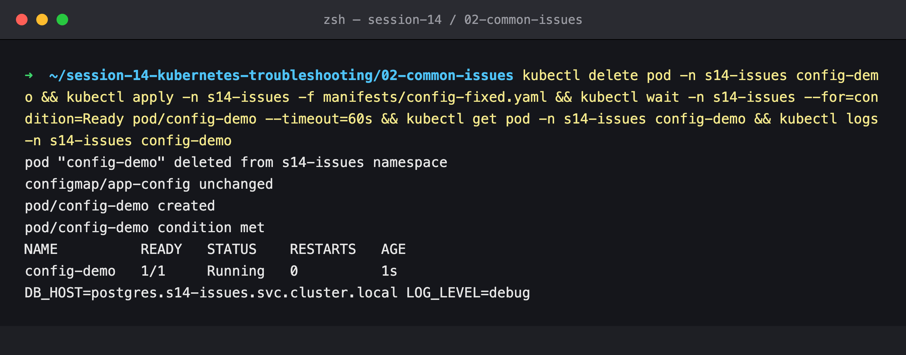

Both values now reach the app.

---

## 6. Service connectivity

**Problem:** the course's [`deployment.yaml`](manifests/deployment.yaml) (`app: web`) with its [`service.yaml`](manifests/service.yaml).

### Step 20: Deploy and test from inside the cluster

```bash
kubectl apply -n s14-issues -f manifests/deployment.yaml -f manifests/service.yaml
kubectl run curl-$RANDOM -n s14-issues --rm -i --restart=Never --image=curlimages/curl:8.6.0 \
  -- curl -s -m 4 -o /dev/null -w '%{http_code}' http://web-service
```

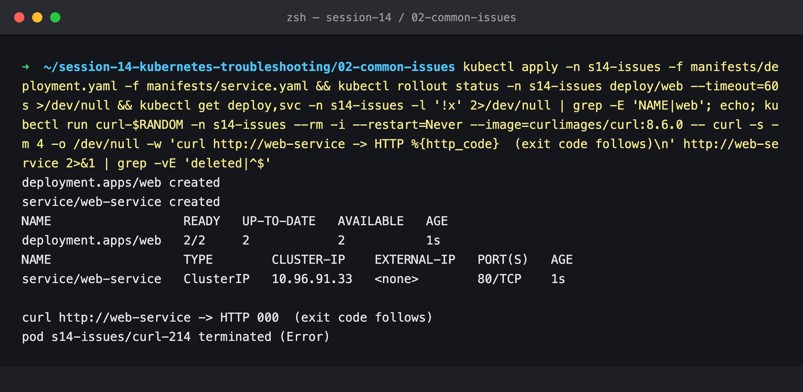

The Deployment is 2/2 and the Service exists, but the request fails (`000`, and the curl Pod `terminated (Error)`).

### Step 21: Investigate: Service → endpoints → labels

```bash
kubectl get endpoints -n s14-issues web-service
kubectl describe svc -n s14-issues web-service
kubectl get pods -n s14-issues -l app=web --show-labels
```

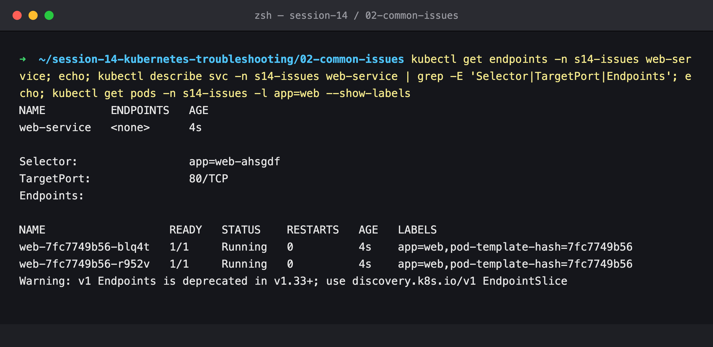

`ENDPOINTS <none>`. Selector `app=web-ahsgdf`, but the Pods are labelled `app=web`. **Root cause:** the selector matches no Pods, so the Service has nowhere to send traffic. (Bug in the course's `service.yaml`, not in `broken-service.yaml`.)

### Step 22: Fix the selector and verify

```bash
kubectl apply -n s14-issues -f manifests/service-fixed.yaml
kubectl get endpoints -n s14-issues web-service
# curl again
```

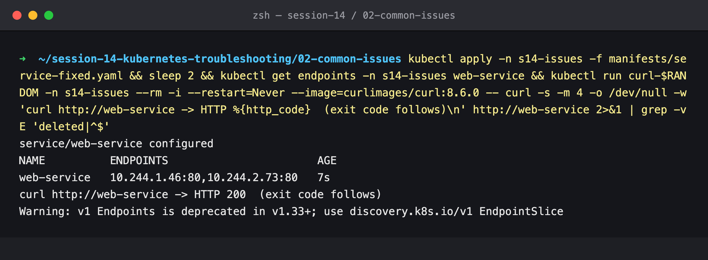

Two endpoints and `HTTP 200`.

### Step 23: The second classic break, a wrong `targetPort`

[`service-wrong-targetport.yaml`](manifests/service-wrong-targetport.yaml): correct selector, `targetPort: 8080`.

```bash
kubectl apply -n s14-issues -f manifests/service-wrong-targetport.yaml
kubectl get endpoints -n s14-issues web-service
# curl again
kubectl exec -n s14-issues deploy/web -- cat /proc/net/tcp   # what is actually listening
```

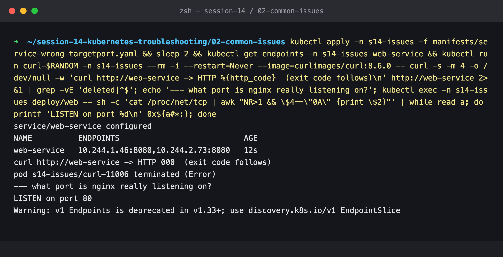

This one is sneakier: the endpoints **are** populated (`…:8080`), so "check endpoints" alone says everything is fine. The listening-socket table inside the Pod shows nginx is on **80**. **Root cause:** `targetPort` doesn't match the container's port.

### Step 24: Fix and verify

```bash
kubectl apply -n s14-issues -f manifests/service-fixed.yaml
```

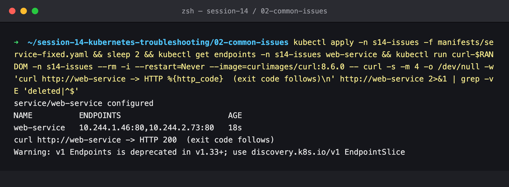

---

## 7. DNS

### Step 25: Apply the course's DNS test Pod as written

```bash
kubectl apply -n s14-issues -f manifests/dns-test-pod.yaml
kubectl get pod -n s14-issues dns-test
kubectl events -n s14-issues --for pod/dns-test --types=Warning
```

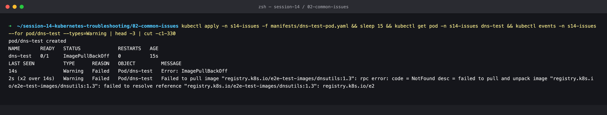

The debugging tool itself is broken: `ImagePullBackOff`, `registry.k8s.io/e2e-test-images/dnsutils:1.3 … not found`.

### Step 26: Ask the registry

```bash
curl -sL https://registry.k8s.io/v2/e2e-test-images/dnsutils/tags/list
curl -sL https://registry.k8s.io/v2/e2e-test-images/jessie-dnsutils/tags/list
```

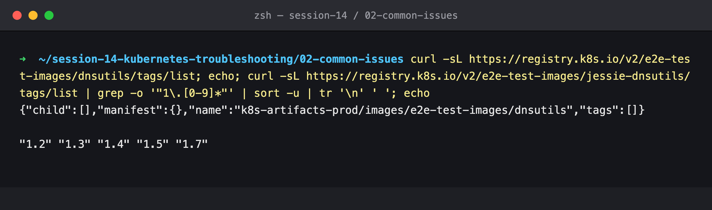

**Root cause (course bug):** `e2e-test-images/dnsutils` has `"tags":[]`, so it has never had a pullable tag. The image used in the Kubernetes DNS-debugging documentation is `jessie-dnsutils`, which has `1.3`. Fixed in [`dns-test-pod-fixed.yaml`](manifests/dns-test-pod-fixed.yaml).

### Step 27: Start the fixed DNS test Pod

```bash
kubectl delete pod -n s14-issues dns-test
kubectl apply -n s14-issues -f manifests/dns-test-pod-fixed.yaml
```

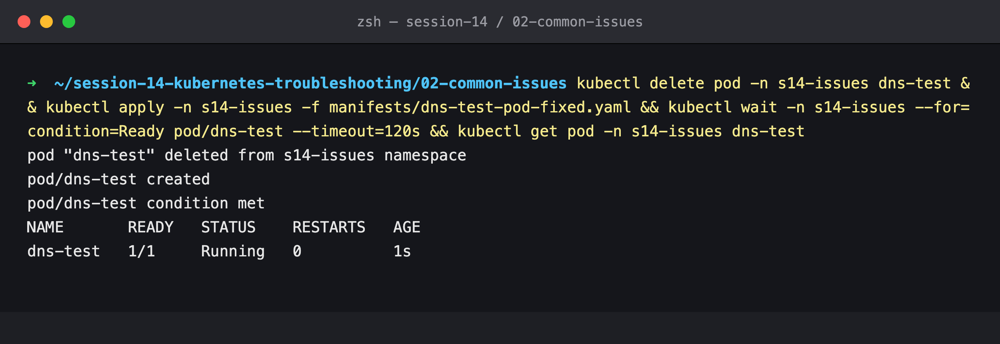

### Step 28: How a Pod resolves names, and a working lookup

```bash
kubectl exec -n s14-issues dns-test -- cat /etc/resolv.conf
kubectl exec -n s14-issues dns-test -- nslookup web-service
kubectl exec -n s14-issues dns-test -- nslookup web-service.s14-issues.svc.cluster.local
```

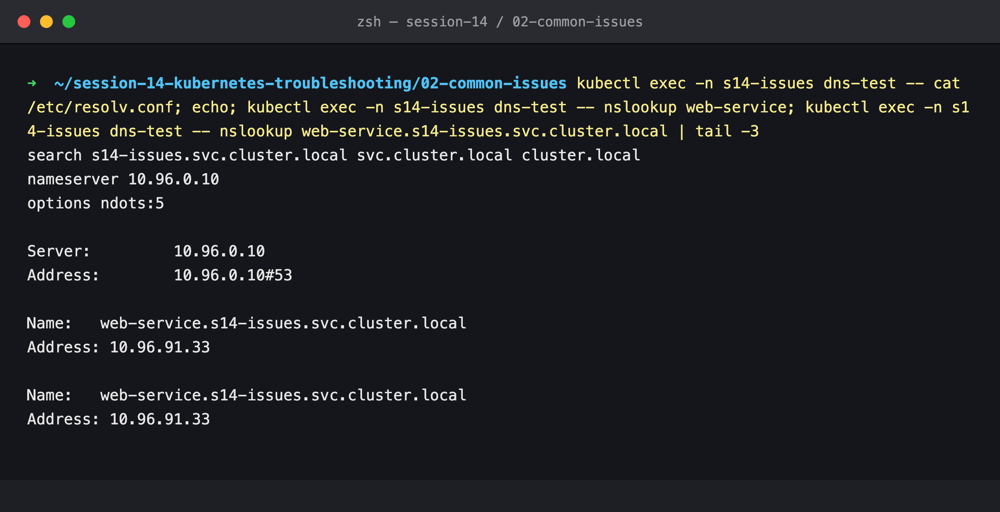

`web-service` was expanded through the search list into `web-service.s14-issues.svc.cluster.local` → `10.96.91.33`, the Service's ClusterIP.

### Step 29: Two DNS failures, a typo and the wrong namespace

```bash
kubectl exec -n s14-issues dns-test -- nslookup web-servce
kubectl run dns-other -n s14-other ... -- sh -c 'nslookup web-service; nslookup web-service.s14-issues'
```

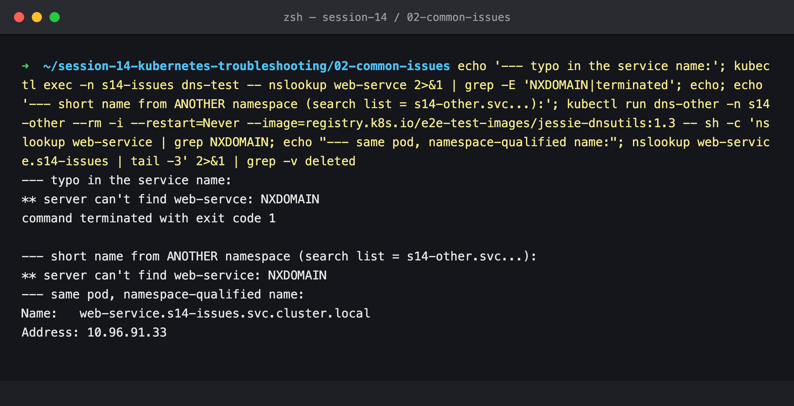

- Typo → `NXDOMAIN`.
- The **correct** name `web-service` from a Pod in another namespace → also `NXDOMAIN`, because its search list starts with `s14-other.svc.cluster.local`. Adding the namespace (`web-service.s14-issues`) resolves.

### Step 30: Is CoreDNS itself healthy?

```bash
kubectl get pods -n kube-system -l k8s-app=kube-dns -o wide
kubectl get svc -n kube-system kube-dns
kubectl get endpointslices -n kube-system -l kubernetes.io/service-name=kube-dns
kubectl logs -n kube-system -l k8s-app=kube-dns --tail=3
```

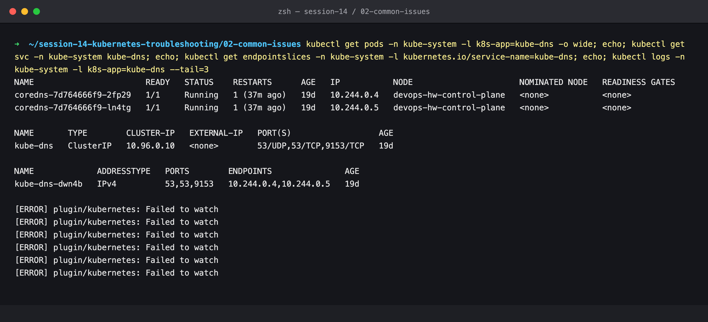

Two CoreDNS Pods running behind `kube-dns` (`10.96.0.10`, the nameserver in every Pod's `resolv.conf`), both in its endpoints. The logs show `Failed to watch` errors, so the next step checks *when* they happened.

### Step 31: CoreDNS configuration

```bash
kubectl get configmap -n kube-system coredns -o jsonpath='{.data.Corefile}'
```

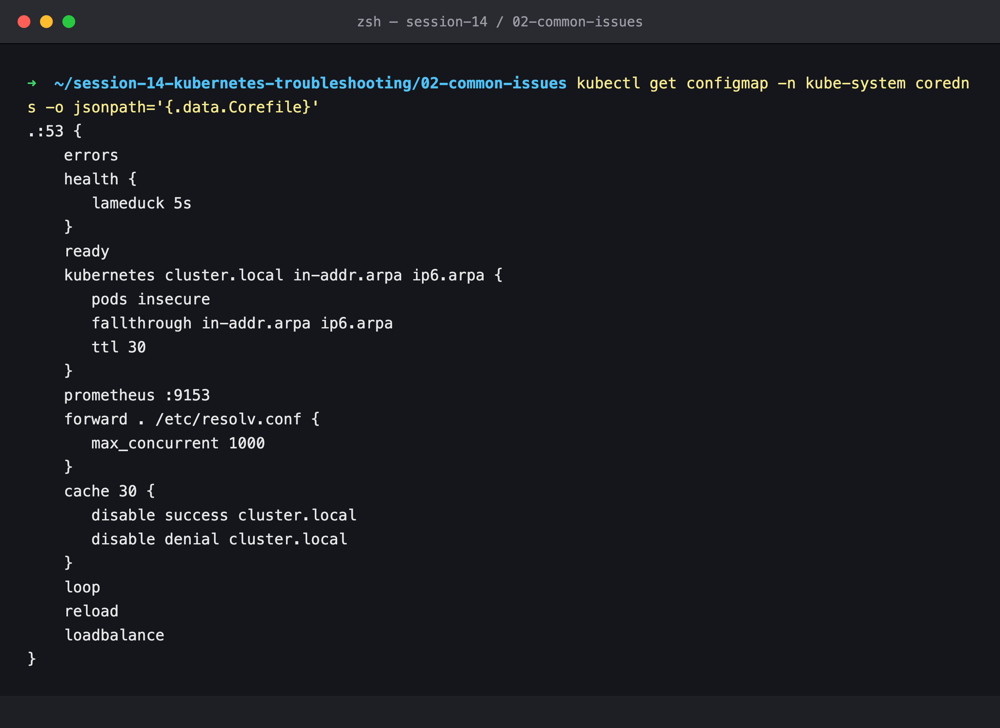

The `kubernetes cluster.local` plugin answers Service and Pod names, and everything else is `forward`ed to the node's resolver.

### Step 32: Were the CoreDNS errors current?

```bash
kubectl logs -n kube-system -l k8s-app=kube-dns --since=10m
kubectl get pods -n kube-system -l k8s-app=kube-dns -o jsonpath='{...startedAt}'
```

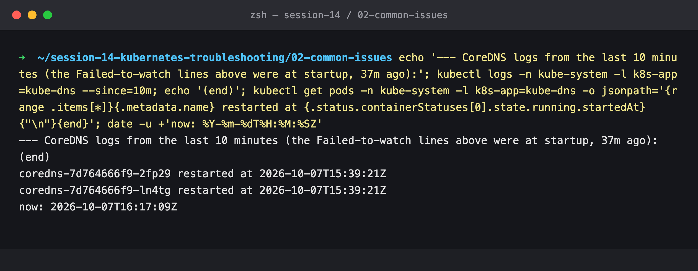

No log lines in the last 10 minutes. The CoreDNS containers restarted at 15:39 (when Docker Desktop and the cluster were started that day), and the watch errors date from that startup while the API server was still coming up. The DNS failures above were all client-side mistakes, not CoreDNS faults.

---

## 8. Pod networking: NetworkPolicy

**Problem** (written for this lab): [`netpol-broken-deny-all.yaml`](manifests/netpol-broken-deny-all.yaml), a namespace-wide default-deny ingress policy.

### Step 33: Baseline

```bash
kubectl get networkpolicy -n s14-issues
# curl web-service from a client Pod
```

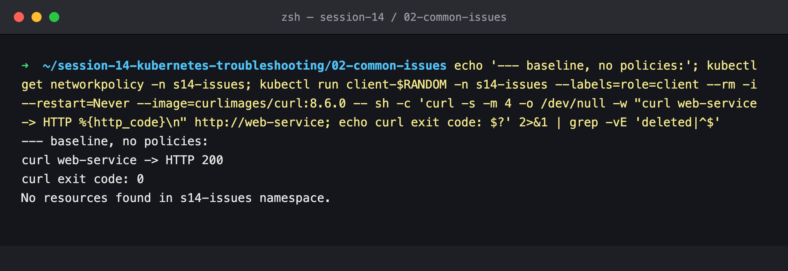

### Step 34: Apply the policy

```bash
kubectl apply -n s14-issues -f manifests/netpol-broken-deny-all.yaml
# curl web-service again
```

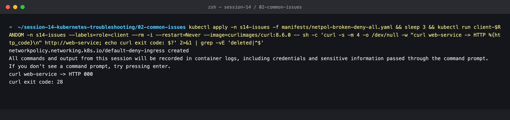

`HTTP 000`, `curl exit code: 28`: a **timeout**. The packets are silently dropped, not refused.

### Step 35: Investigate, ruling things out layer by layer

```bash
kubectl get pods -n s14-issues -l app=web -o wide                       # 1. pods healthy
kubectl get endpointslices -n s14-issues -l kubernetes.io/service-name=web-service   # 2. endpoints
kubectl exec -n s14-issues dns-test -- nslookup web-service             # 3. DNS
kubectl exec -n s14-issues dns-test -- bash -c '</dev/tcp/<pod-ip>/80'  # 4. Pod IP direct
kubectl exec -n s14-issues deploy/web -- curl localhost                 # 5. app itself
kubectl get networkpolicy -n s14-issues; kubectl describe networkpolicy ...   # 6. filtering
```

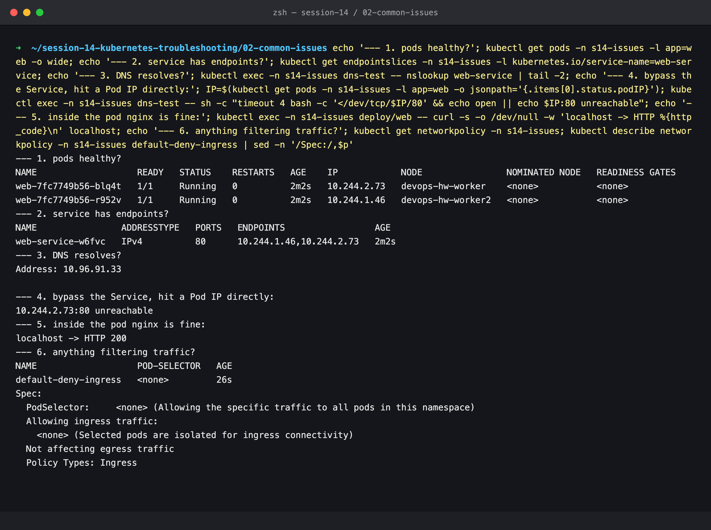

Pods are Running, endpoints are present, DNS resolves, and the app answers on localhost. Only Pod-to-Pod traffic fails, even to the Pod IP directly, which takes the Service out of the picture. `describe networkpolicy`: `PodSelector: <none>` (all Pods), `Allowing ingress traffic: <none>`. **Root cause:** a default-deny ingress policy with no allow rules. DNS kept working because CoreDNS lives in `kube-system`, which this policy doesn't cover.

### Step 36: Fix with least privilege and verify

Keep the deny-all and add [`netpol-fix-allow-web.yaml`](manifests/netpol-fix-allow-web.yaml): allow Pods labelled `role=client` to reach `app=web` on TCP 80.

```bash
kubectl apply -n s14-issues -f manifests/netpol-fix-allow-web.yaml
# curl from a Pod labelled role=client, and from one without the label
```

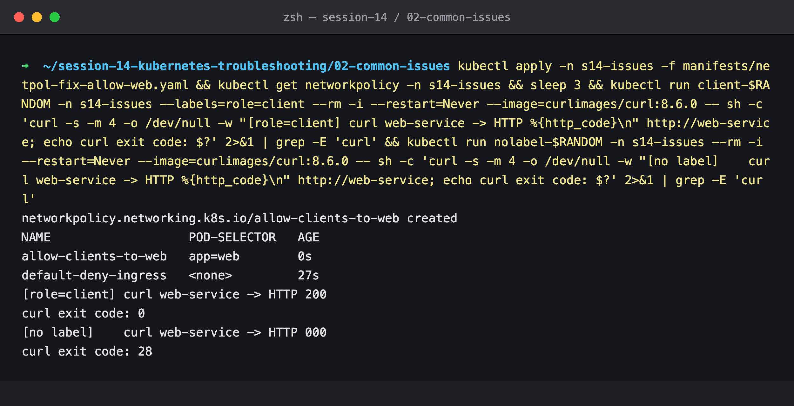

`[role=client] → 200`, `[no label] → 000 (exit 28)`. The app is reachable again only for the clients meant to reach it.

---

## Cleanup

### Step 37

```bash
kubectl get pods -n s14-issues
kubectl delete namespace s14-issues s14-other
```

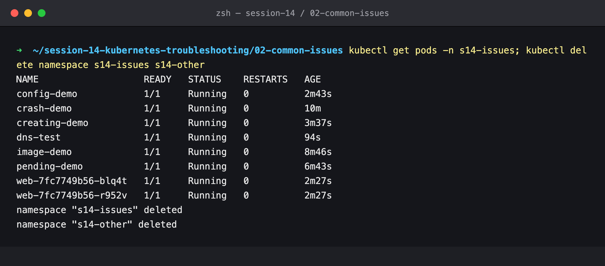

Every Pod in the namespace is `Running` before deletion, so all fixes held.
