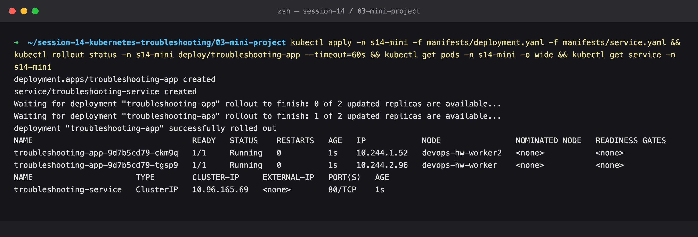
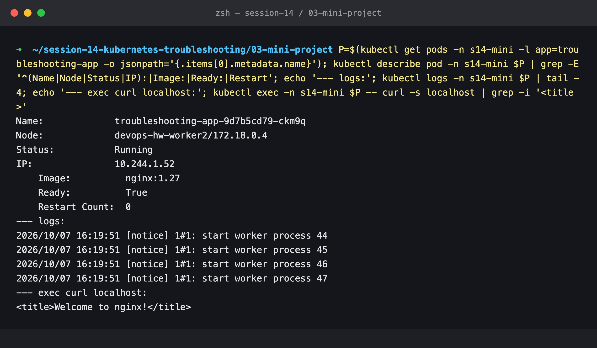
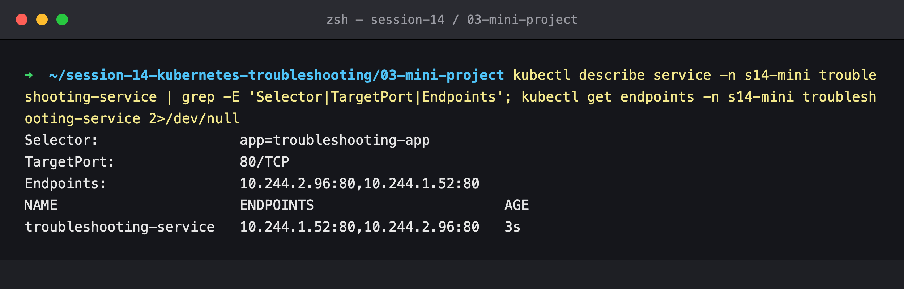
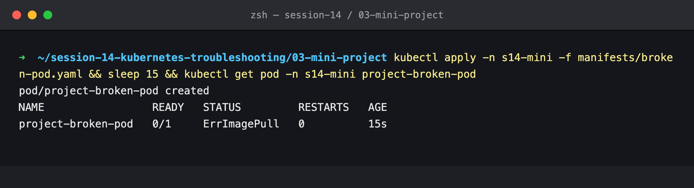
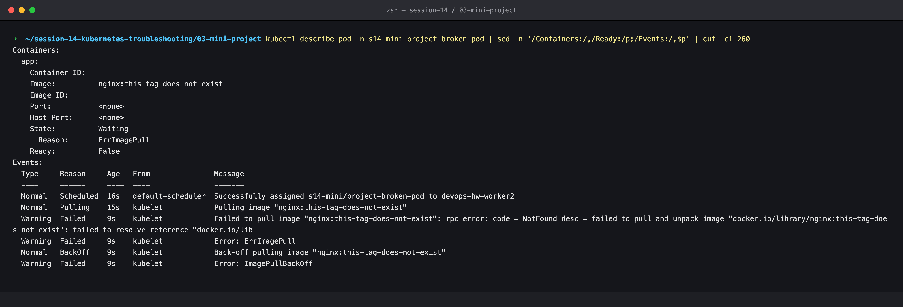
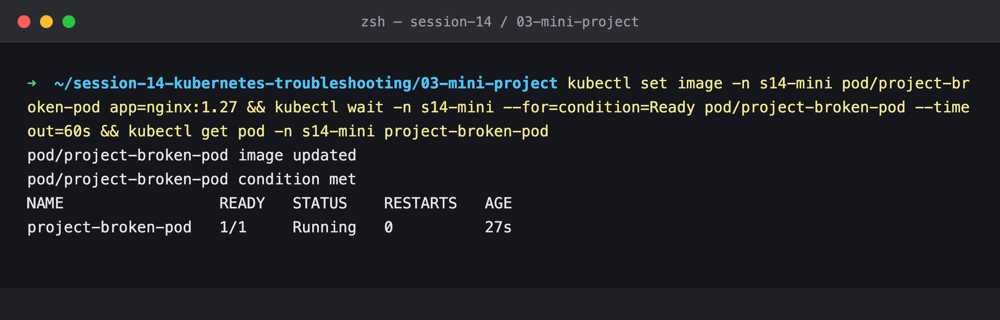
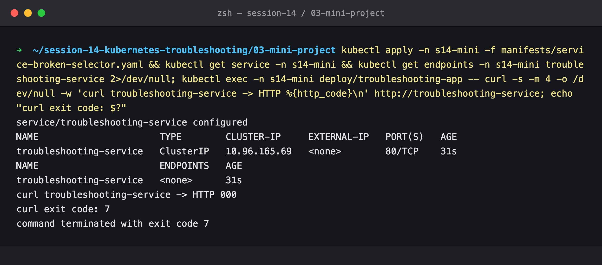
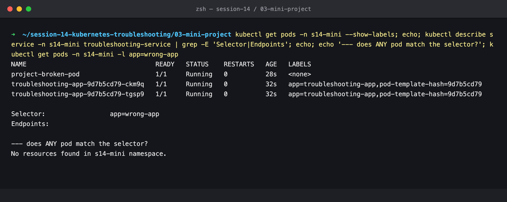
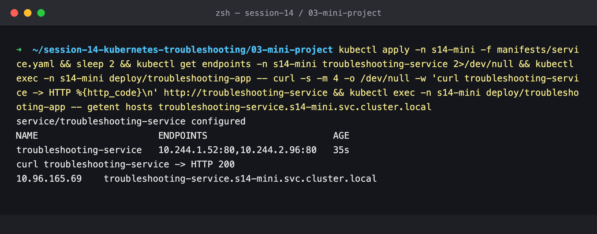
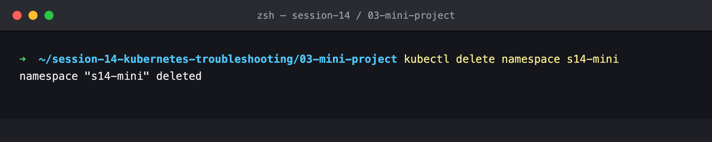

# Session 14 — Mini Project: Kubernetes Troubleshooting Challenge

## Name

Himanshu Rathi

## Roll No

`24BCS10365`

---

**Source folder:** `session-14-kubernetes-troubleshooting/mini-project`

Deploy → observe → break → investigate → find the root cause → fix → verify, for the challenge's two problems: a broken image and a broken Service selector. Answers to the challenge's questions, troubleshooting table and README questions are at the end.

Every command below was executed against a live Kubernetes cluster. Each screenshot is the real terminal output of the command shown directly above it. Nothing is mocked or hand-written.

---

## Environment

| | |
|---|---|
| **Cluster** | `kind` v0.31.0: 1 control-plane node + 2 worker nodes, running in Docker |
| **Kubernetes** | v1.35.0 |
| **kubectl** | v1.34.1 |
| **Namespace** | `s14-mini` |
| **Date run** | 7 October 2026 |

---

## Key takeaways

- The rule of the challenge, "you are NOT allowed to immediately change the YAML", is the right habit: the Events told me exactly what was wrong before I touched anything.
- A Service with no matching Pods doesn't time out. It **refuses** (`curl` exit 7): kube-proxy installs a reject rule for a Service with no endpoints. That quick refusal is itself a clue pointing at endpoints.
- `kubectl get pods --show-labels` next to `kubectl describe service` (Selector) is the whole diagnosis for a selector mismatch.

---

## Commands executed, with output

### Step 1: Deploy the application

```bash
kubectl create namespace s14-mini
kubectl apply -n s14-mini -f manifests/deployment.yaml -f manifests/service.yaml
kubectl get pods -n s14-mini -o wide
kubectl get service -n s14-mini
```



### Step 2: Check the application: describe, logs, exec

```bash
kubectl describe pod -n s14-mini <pod>
kubectl logs -n s14-mini <pod>
kubectl exec -n s14-mini <pod> -- curl -s localhost
```



`Running`, `Ready: True`, 0 restarts, nginx worker processes started, and `curl localhost` returns the nginx page. The app is healthy.

### Step 3: Check the Service and its endpoints

```bash
kubectl describe service -n s14-mini troubleshooting-service
kubectl get endpoints -n s14-mini troubleshooting-service
```



Selector `app=troubleshooting-app`, `TargetPort 80`, and both Pod IPs are endpoints. This is the known-good baseline.

### Step 4: Create the broken Pod

```bash
kubectl apply -n s14-mini -f manifests/broken-pod.yaml
kubectl get pod -n s14-mini project-broken-pod
```



### Step 5: Troubleshoot it (no YAML changes yet)

```bash
kubectl describe pod -n s14-mini project-broken-pod
```



### Step 6: Fix and verify

```bash
kubectl set image -n s14-mini pod/project-broken-pod app=nginx:1.27
kubectl get pod -n s14-mini project-broken-pod
```



### Step 7: Service challenge, break the selector

[`service-broken-selector.yaml`](manifests/service-broken-selector.yaml) is the original Service with `app: wrong-app`.

```bash
kubectl apply -n s14-mini -f manifests/service-broken-selector.yaml
kubectl get service -n s14-mini
kubectl get endpoints -n s14-mini troubleshooting-service
kubectl exec -n s14-mini deploy/troubleshooting-app -- curl -s -m 4 http://troubleshooting-service
```



The Service still exists with the same ClusterIP, but `ENDPOINTS <none>` and curl fails **immediately** with exit code 7 (connection refused).

### Step 8: Find the root cause

```bash
kubectl get pods -n s14-mini --show-labels
kubectl describe service -n s14-mini troubleshooting-service
kubectl get pods -n s14-mini -l app=wrong-app
```



Pods carry `app=troubleshooting-app`, the Service selects `app=wrong-app`, and selecting with that label returns no Pods.

### Step 9: Fix and verify, including DNS

```bash
kubectl apply -n s14-mini -f manifests/service.yaml
kubectl get endpoints -n s14-mini troubleshooting-service
kubectl exec -n s14-mini deploy/troubleshooting-app -- curl -s http://troubleshooting-service
kubectl exec -n s14-mini deploy/troubleshooting-app -- getent hosts troubleshooting-service.s14-mini.svc.cluster.local
```



Endpoints are back, `HTTP 200`, and the Service's full DNS name resolves to its ClusterIP.

### Step 10: Cleanup

```bash
kubectl delete namespace s14-mini
```



---

## 7. Your Task: answers for the broken Pod

**Question 1: What is the Pod status?**
*Answer:* `ErrImagePull` when first checked (step 4), alternating with `ImagePullBackOff` while the kubelet waits between retries (both appear in the events in step 5). `READY 0/1`, and the container state is `Waiting`.

**Question 2: What is the actual error?**
*Answer:* `Failed to pull image "nginx:this-tag-does-not-exist": rpc error: code = NotFound desc = failed to pull and unpack image "docker.io/library/nginx:this-tag-does-not-exist": failed to resolve reference … not found`

**Question 3: Which command helped you find the reason?**
*Answer:* `kubectl describe pod project-broken-pod`, specifically the **Events** section at the bottom. `kubectl get` only shows the symptom, and `kubectl logs` has nothing because no container ever started.

**Question 4: What is wrong with the image?**
*Answer:* the repository `nginx` exists on Docker Hub, but the **tag** `this-tag-does-not-exist` doesn't. The registry answered `NotFound` for that tag.

**Question 5: How would you fix it?**
*Answer:* point the container at a tag that exists. For a running bare Pod, `kubectl set image pod/project-broken-pod app=nginx:1.27` (image is one of the few mutable Pod fields), as done in step 6. The lasting fix is to correct the tag in `broken-pod.yaml`, and ideally pin a specific version rather than guessing tags.

---

## 11. Troubleshooting table

| Problem | What I Saw | Command I Used | Root Cause | Fix |
| :--- | :--- | :--- | :--- | :--- |
| **Broken Pod** | `project-broken-pod 0/1 ErrImagePull`, then `ImagePullBackOff`, no restarts, no logs | `kubectl get pod`, `kubectl describe pod` (Events) | The container image could not be pulled, so the container never started | `kubectl set image … app=nginx:1.27`, then fix the YAML |
| **Service Problem** | Service exists, `ENDPOINTS <none>`, curl fails immediately (exit 7) | `kubectl get endpoints`, `kubectl describe service`, `kubectl get pods --show-labels` | Service selector `app=wrong-app` ≠ Pod label `app=troubleshooting-app` | Restore `selector: app: troubleshooting-app` and re-apply `service.yaml` |
| **Image Problem** | Event: `nginx:this-tag-does-not-exist … not found` (expanded to `docker.io/library/nginx`) | `kubectl describe pod`, `kubectl events --for pod/…` | The tag does not exist in the repository | Use an existing tag (`nginx:1.27`) |

---

## 12. README questions

1. **What does `kubectl get` tell us?**
   The current state of resources at a glance: which objects exist, and for Pods READY, STATUS, RESTARTS and AGE. With `-o wide` it adds the node and IP. It is the first look: it tells you *something* is wrong and which object to look at.

2. **What is the difference between `get` and `describe`?**
   `get` is a one-line summary of state. `describe` is the full story of one object: its spec, container state with exit codes and last state, conditions, volumes, and the **Events** that explain *why* it is in that state. `get` says "Pending", `describe` says "0/3 nodes are available: 2 node(s) didn't match Pod's node selector".

3. **Why do we use `kubectl logs`?**
   To see what the application itself printed (stdout/stderr). Kubernetes reports *that* a container crashed. Only the app's logs say *why* (e.g. `DATABASE_URL environment variable is MISSING!`). `--previous` targets the run that crashed.

4. **When would you use `kubectl exec`?**
   When the Pod is running but something is wrong and you need to test from inside it: does the app answer on `localhost` (rules out the app vs. the network), does DNS resolve, is a config file or env var present, which port the process really listens on.

5. **What does `CrashLoopBackOff` mean?**
   The container starts and then exits, repeatedly, and the kubelet waits an increasing delay (10 s, 20 s, 40 s … up to 5 min) before each restart. The image pulled fine. The process itself keeps exiting: an error at startup, missing config, a failing liveness probe, or (as seen in the triage gauntlet) even a clean `exit 0` when the restart policy is `Always`.

6. **What does `ImagePullBackOff` mean?**
   The kubelet failed to pull the container image (`ErrImagePull`) and is backing off before retrying. Causes: a wrong image name or tag, a private registry without `imagePullSecrets`, registry rate limits (I hit Docker Hub's `429 Too Many Requests` during this session), or no network access to the registry. The exact cause is in the events.

7. **Why can a Pod remain `Pending`?**
   The scheduler cannot find a node that fits it: a nodeSelector or affinity that matches no node, resource requests larger than any node's free capacity, taints the Pod doesn't tolerate, or a PVC that can't be bound. The `FailedScheduling` event lists exactly how many nodes were rejected and why.

8. **Why can a Service have no endpoints?**
   Its selector matches no Pods (label typo or mismatch), the matching Pods are in a different namespace, or the matching Pods exist but are not **Ready** (failing readiness probe). Only Ready Pods with matching labels in the same namespace become endpoints.

9. **What is the relationship between a Service selector and Pod labels?**
   A Service doesn't point at Pods by name. It continuously selects every Ready Pod in its namespace whose labels contain all of its selector's key/value pairs, and those Pods' IPs become its endpoints. That is what lets Pods be replaced, scaled or rescheduled while the Service name and ClusterIP stay the same, and it is why one wrong label silently disconnects everything.

10. **What is Kubernetes DNS?**
    The cluster's internal name service, run by CoreDNS behind the `kube-dns` Service (`10.96.0.10` here, written into every Pod's `/etc/resolv.conf`). Every Service gets a name `<service>.<namespace>.svc.cluster.local` that resolves to its ClusterIP, and the Pod's search list lets short names like `troubleshooting-service` work from within the same namespace. It is how Pods find each other without hard-coding IPs.
