# Session 14 — Triage Gauntlet (5 Broken Production Pods)

## Name

Himanshu Rathi

## Roll No

`24BCS10365`

---

**Source folder:** `session-14-kubernetes-troubleshooting/scenarios`

`triage_all.sh` deploys five intentionally broken workloads at once. Each was diagnosed from the evidence and fixed, and every fix has a committed `fixed.yaml` next to the course's `broken.yaml`.

Every command below was executed against a live Kubernetes cluster. Each screenshot is the real terminal output of the command shown directly above it. Nothing is mocked or hand-written.

---

## Environment

| | |
|---|---|
| **Cluster** | `kind` v0.31.0: 1 control-plane node + 2 worker nodes, running in Docker |
| **Kubernetes** | v1.35.0 |
| **kubectl** | v1.34.1 |
| **Namespace** | `s14-triage`. The script calls plain `kubectl`, so it was run with a tiny `kubectl` wrapper first on `PATH` that adds `-n s14-triage`. That avoided changing the shared kubeconfig's default namespace. |
| **Date run** | 7 October 2026 |

---

## Key takeaways

| # | Status seen | Root cause | Fix |
|---|---|---|---|
| 1 | `Error` / `CrashLoopBackOff` | `DATABASE_URL` missing → `exit 1`. **And** after adding it, the script exits 0, which a Pod also restarts | add the env var **and** keep the process in the foreground (or use a Job) |
| 2 | `ErrImagePull` / `ImagePullBackOff` | `yatri-api-service` → `docker.io/library/yatri-api-service`, which doesn't exist | point at a real image |
| 3 | `Pending` | requests 500 CPUs and 1000 GiB, while nodes have 15 CPUs and ~23 GiB | right-size requests and add limits |
| 4 | **`Running`** (looks healthy) | wrong hostname → DNS `NXDOMAIN`, hidden by `curl -s … \|\| true` | correct `<svc>.<ns>.svc.cluster.local` for a Service that exists, and stop swallowing the error |
| 5 | `OOMKilled` / `CrashLoopBackOff` | needs ~1 GiB, limit is 20 MiB → exit 137 | raise the limit to fit (with a matching request), `restartPolicy: OnFailure` |

- **Scenario 4 is the dangerous one.** `kubectl get` shows `1/1 Running`, 0 restarts. A `|| true` in the start script turned a fatal error into a green Pod. Nothing in Kubernetes can flag that. Only reading the logs critically does.
- **Scenario 1 needed two fixes.** The first obvious one ("add the env var") produced `Completed` → `CrashLoopBackOff`, a new symptom with a different cause.
- **Scenario 5's logs were empty**, not even `Allocating memory rapidly...`. Python buffers stdout when it isn't a terminal, and SIGKILL from the OOM killer discarded the buffer. The evidence is in `describe` (`Reason: OOMKilled`, `Exit Code: 137`).

---

## Commands executed, with output

### Step 1: Run the gauntlet

```bash
kubectl create namespace s14-triage
bash manifests/triage_all.sh
```

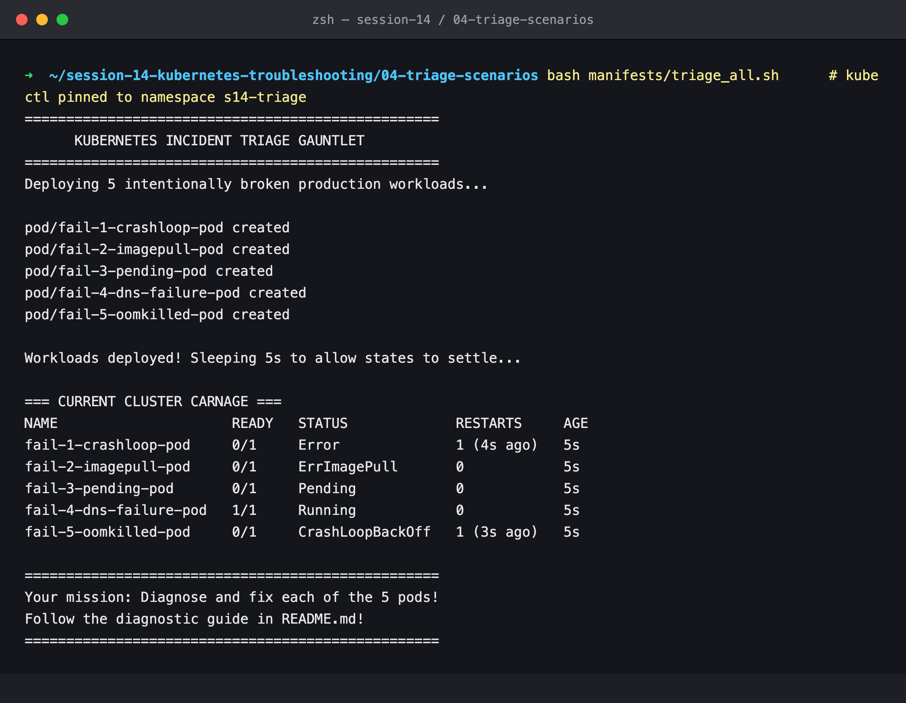

### Step 2: The carnage after 30 s

```bash
kubectl get pods -n s14-triage -l tier=triage-gauntlet -o wide
```

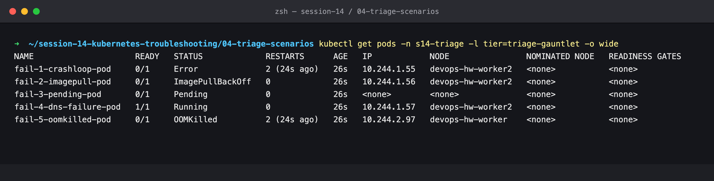

Four visibly broken Pods, and `fail-4-dns-failure-pod` showing `1/1 Running`.

---

## Scenario 1: crashloop

### Step 3: Investigate

```bash
kubectl describe pod -n s14-triage fail-1-crashloop-pod | grep -A3 'Last State'
kubectl logs -n s14-triage fail-1-crashloop-pod
kubectl get pod -n s14-triage fail-1-crashloop-pod -o jsonpath='{.spec.containers[0].env}'
```

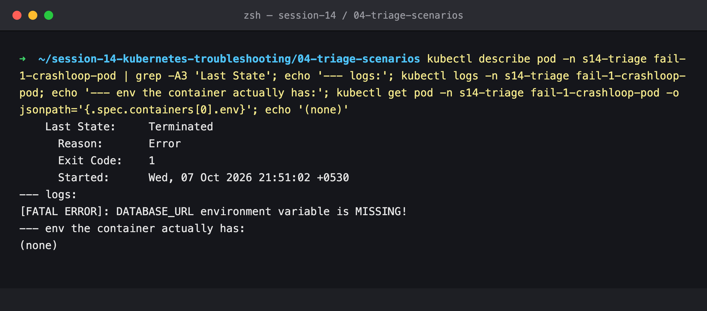

`Exit Code: 1`, the log says `[FATAL ERROR]: DATABASE_URL environment variable is MISSING!`, and the container has no env at all. **Root cause 1:** required config not provided.

### Step 4: Fix attempt 1, add the env var

[`fixed-env-only.yaml`](manifests/scenario-1-crashloop/fixed-env-only.yaml)

```bash
kubectl replace --force -n s14-triage -f manifests/scenario-1-crashloop/fixed-env-only.yaml
kubectl get pod -n s14-triage fail-1-crashloop-pod -w
kubectl logs -n s14-triage fail-1-crashloop-pod
```

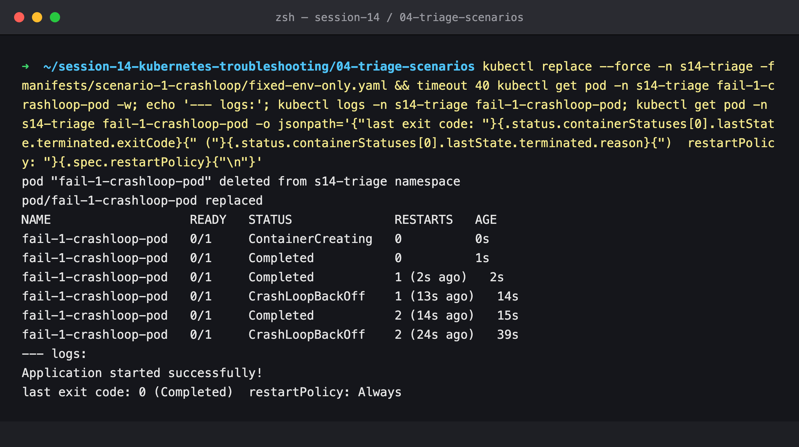

The fatal error is gone, and the log now says `Application started successfully!`, yet the Pod goes `Completed` → `CrashLoopBackOff`. `last exit code: 0 (Completed)`, `restartPolicy: Always`. **Root cause 2:** the script finishes and exits. A bare Pod's default restart policy is `Always`, so the kubelet restarts even a successful exit, and backs off when it keeps happening.

### Step 5: Final fix, config plus a long-running process

[`fixed.yaml`](manifests/scenario-1-crashloop/fixed.yaml): the env var, plus the process stays in the foreground like a real server. (If the work really were one-shot, the right object would be a **Job**.)

```bash
kubectl replace --force -n s14-triage -f manifests/scenario-1-crashloop/fixed.yaml
kubectl get pod -n s14-triage fail-1-crashloop-pod
kubectl logs -n s14-triage fail-1-crashloop-pod
```

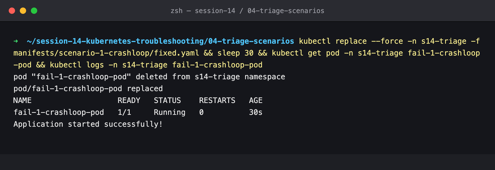

`Running`, 0 restarts after 30 s.

---

## Scenario 2: imagepull

### Step 6: Investigate

```bash
kubectl get pod -n s14-triage fail-2-imagepull-pod
kubectl events -n s14-triage --for pod/fail-2-imagepull-pod --types=Warning
docker manifest inspect docker.io/library/yatri-api-service:v999-invalid-tag-does-not-exist
```

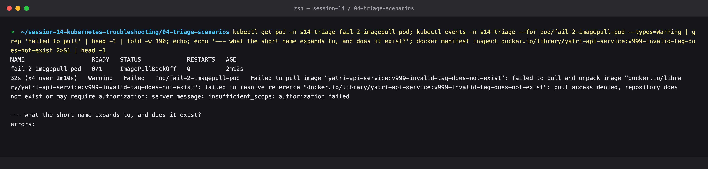

`pull access denied, repository does not exist or may require authorization`. The image has no registry prefix, so it means `docker.io/library/yatri-api-service`, a repository that doesn't exist on Docker Hub (and the registry check fails the same way). **Root cause:** wrong image reference. Docker Hub reports a missing repository the same way as a private one, so the "may require authorization" wording is misleading here.

### Step 7: Fix and verify

The course provides no real `yatri-api-service` image, so a known-good published image stands in (see the comment in [`fixed.yaml`](manifests/scenario-2-imagepull/fixed.yaml)). In a real incident the correct `name:tag` comes from the registry or the CI build output.

```bash
kubectl set image -n s14-triage pod/fail-2-imagepull-pod web-app=nginx:alpine
kubectl get pod -n s14-triage fail-2-imagepull-pod
```

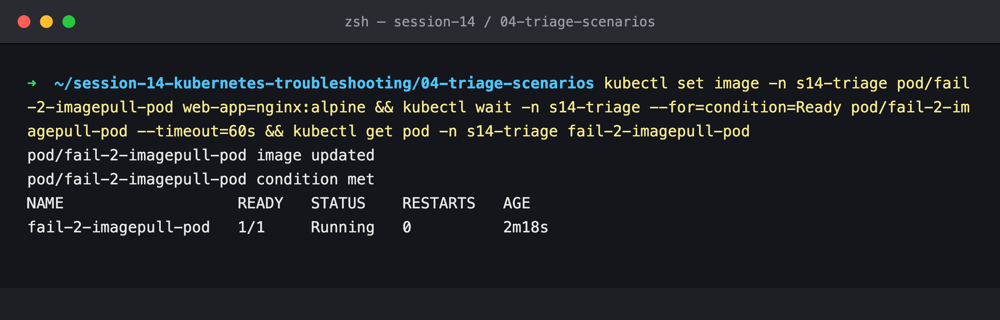

---

## Scenario 3: pending

### Step 8: Investigate

```bash
kubectl events -n s14-triage --for pod/fail-3-pending-pod
kubectl get pod -n s14-triage fail-3-pending-pod -o jsonpath='{.spec.containers[0].resources.requests}'
kubectl get nodes -o custom-columns=NODE:.metadata.name,CPU:.status.allocatable.cpu,MEMORY:.status.allocatable.memory
```

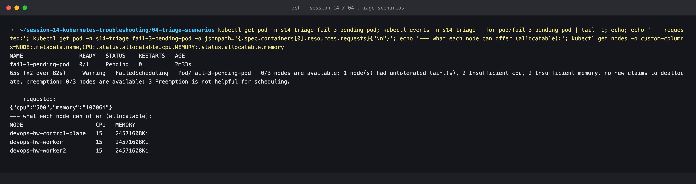

`2 Insufficient cpu, 2 Insufficient memory` (and the control-plane is excluded by its taint). Requested `cpu: 500`, `memory: 1000Gi`, while each node can offer 15 CPUs and ~23.4 GiB. **Root cause:** the request is impossible on any node. Requests are *reserved* by the scheduler, so it must fit before the Pod is placed.

### Step 9: Fix and verify

[`fixed.yaml`](manifests/scenario-3-pending/fixed.yaml): `requests: 100m / 64Mi`, `limits: 500m / 128Mi`.

```bash
kubectl replace --force -n s14-triage -f manifests/scenario-3-pending/fixed.yaml
kubectl get pod -n s14-triage fail-3-pending-pod -o wide
```

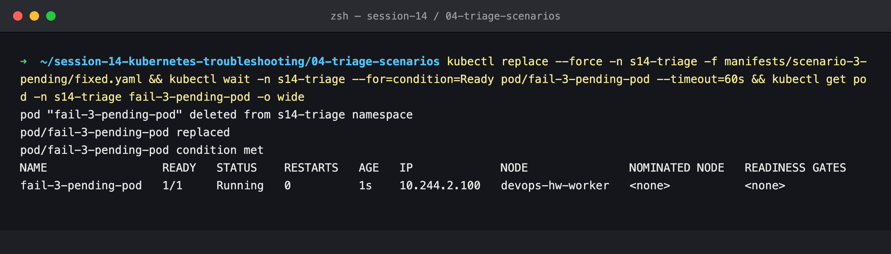

Scheduled to `devops-hw-worker` and running within 1 s.

---

## Scenario 4: dns-failure

### Step 10: It looks healthy

```bash
kubectl get pod -n s14-triage fail-4-dns-failure-pod
kubectl logs -n s14-triage fail-4-dns-failure-pod
```

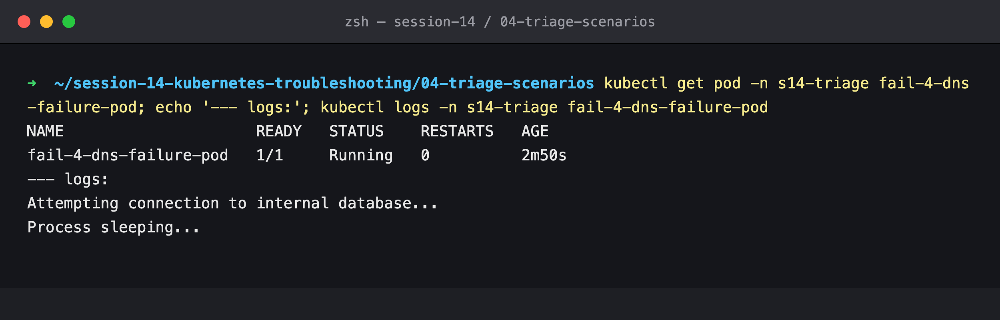

`1/1 Running`, 0 restarts, and the log goes straight from "Attempting connection…" to "Process sleeping…". There is no success message, which is the only clue.

### Step 11: Investigate by running the same request without `-s` and `|| true`

```bash
kubectl exec -n s14-triage fail-4-dns-failure-pod -- curl -sS --connect-timeout 3 http://postgres-db-wrong-name.production.svc.cluster.local:5432
kubectl exec -n s14-triage fail-4-dns-failure-pod -- nslookup postgres-db-wrong-name.production.svc.cluster.local
kubectl get ns production
kubectl get svc -A | grep -i postgres
```

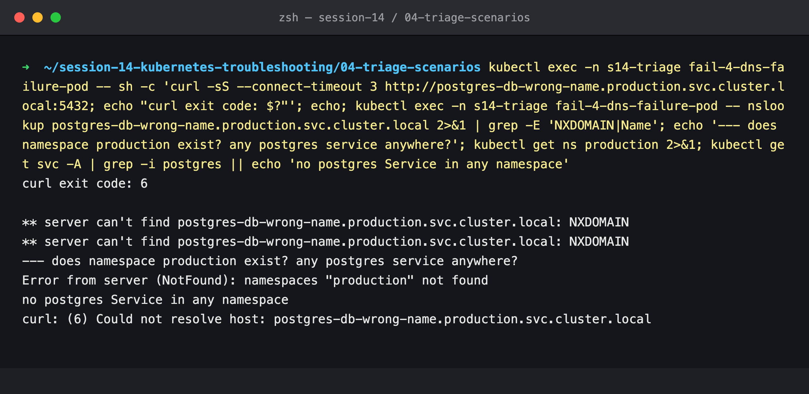

`curl: (6) Could not resolve host` and `NXDOMAIN`. The hostname is wrong twice: the namespace `production` doesn't exist, and there is no postgres Service in any namespace. **Root cause:** a wrong service FQDN, plus a start script that swallows the error (`curl -s … || true`, then sleep), so the Pod stays green.

### Step 12: Fix and verify

The course never deploys the database the client is looking for, so [`postgres-db-standin.yaml`](manifests/scenario-4-dns-failure/postgres-db-standin.yaml) adds a minimal TCP listener on 5432 behind a Service named `postgres-db`. [`fixed.yaml`](manifests/scenario-4-dns-failure/fixed.yaml) uses `postgres-db.s14-triage.svc.cluster.local`, and a failed lookup or connect now **exits 1**, so a regression would show up as a restart instead of a silent "Running".

```bash
kubectl apply -n s14-triage -f manifests/scenario-4-dns-failure/postgres-db-standin.yaml
kubectl replace --force -n s14-triage -f manifests/scenario-4-dns-failure/fixed.yaml
kubectl logs -n s14-triage fail-4-dns-failure-pod
```

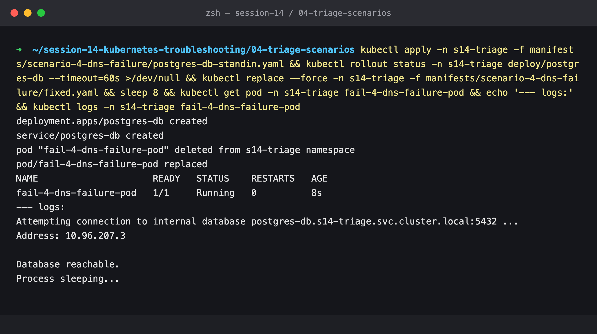

The name resolves to the Service's ClusterIP (`10.96.207.3`), the TCP connect succeeds, and the log says `Database reachable.`

---

## Scenario 5: oomkilled

### Step 13: Investigate

```bash
kubectl get pod -n s14-triage fail-5-oomkilled-pod
kubectl describe pod -n s14-triage fail-5-oomkilled-pod | grep -A4 'Last State'
kubectl describe pod -n s14-triage fail-5-oomkilled-pod | grep -A1 Limits
kubectl logs -n s14-triage fail-5-oomkilled-pod
```

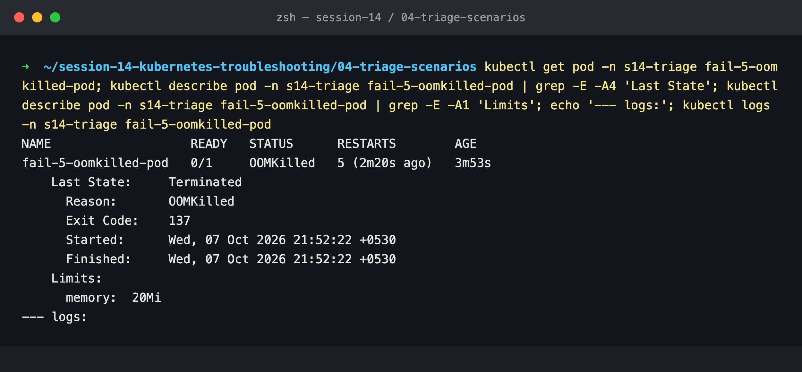

`Reason: OOMKilled`, `Exit Code: 137` (128 + 9, SIGKILL), `Limits: memory: 20Mi`, 5 restarts, and **empty logs**. The process holds 100 × 10 MiB chunks, about 1000 MiB, against a 20 MiB limit, so the kernel's OOM killer ends it. Python block-buffers stdout when it isn't a TTY, and SIGKILL gives it no chance to flush, which is why not even the first `print` appears. **Root cause:** memory limit far below the workload's real need.

### Step 14: Fix and verify

[`fixed.yaml`](manifests/scenario-5-oomkilled/fixed.yaml): `requests` = `limits` = `1200Mi` (fits ~1 GiB with headroom, and the scheduler reserves it), and `restartPolicy: OnFailure`, since this is a one-shot task. The other valid fix is in the code: don't keep every chunk.

```bash
kubectl replace --force -n s14-triage -f manifests/scenario-5-oomkilled/fixed.yaml
kubectl get pod -n s14-triage fail-5-oomkilled-pod
kubectl logs -n s14-triage fail-5-oomkilled-pod
```

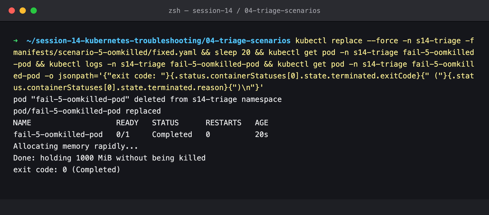

`Done: holding 1000 MiB without being killed`, `exit code: 0 (Completed)`, 0 restarts.

---

### Step 15: All five fixed

```bash
kubectl get pods -n s14-triage -l tier=triage-gauntlet -o wide
```

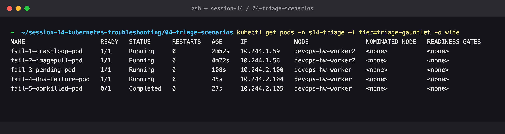

Four `Running` with 0 restarts, and the one-shot memory job `Completed`.

## Cleanup

### Step 16

```bash
kubectl delete namespace s14-triage
```

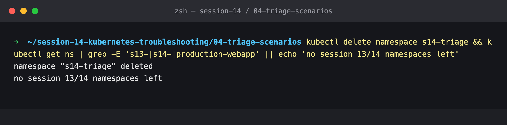
