# Session 15 — Helm Commands

## Name

Himanshu Rathi

## Roll No

`24BCS10365`

---

**Source folder:** `session-15-helm/01-what-is-helm` … `07-install-upgrade`  
**Reference README:** the upstream lab READMEs in [`Nency-Ravaliya/devops-heros`](https://github.com/Nency-Ravaliya/devops-heros)

Every Helm command from the session (`repo`, `search`, `create`, `install`, `list`, `status`, `get`, `upgrade`, `history`, `rollback`, `uninstall`, plus `lint`, `template` and `test`), each run against a live cluster on the chart that `helm create` scaffolds ([`mychart/`](./mychart)).

Every command below was run against a live Kubernetes cluster. Each screenshot is the real terminal output of the command shown directly above it. Nothing is mocked or hand-written. Two of the commands genuinely failed during the run, and those failures are documented as they happened rather than retaken.

---

## Environment

| | |
|---|---|
| **Cluster** | `kind` v0.31.0 — 1 control-plane node + 2 worker nodes, running in Docker |
| **Kubernetes** | v1.35.0 |
| **kubectl** | v1.34.1 |
| **Helm** | **v4.1.3** (see the note below) |
| **Host** | macOS (Apple Silicon), Docker Desktop |
| **Namespace** | `s15-cmds` |
| **Date run** | 7 October 2026 |

> **Helm 4, not Helm 3.** The course READMEs were written for Helm 3. Helm 4 is the current release
> and changes three things that show up below. `helm list -a` / `--all` no longer exist, so use
> `--failed`, `--uninstalled` and so on instead. `helm status --show-resources` is gone because
> resources are always shown. `--atomic` is deprecated in favour of `--rollback-on-failure`. Helm 4
> also applies manifests with **server-side apply** (`APPLY_METHOD: server-side apply` in step 15).

---

## Key takeaways

- **Repo → search → install** is the consumer workflow. **create → lint → template → install** is the author workflow. `helm template` renders locally without touching the cluster, so it is the cheapest way to check a chart.
- `helm install --wait` fails the *release* when Pods don't become ready, but it **does not delete what it created**. The release was marked `failed` while its Deployment stayed in the cluster. Running `helm upgrade` on a failed release is the supported way to recover it (step 12).
- **Every** install, upgrade and rollback creates a new numbered revision. A rollback does not rewind history. `rollback demo 3` created revision 5 with the description "Rollback to 3".
- `rollback` restores the whole revision, not just one field: going from rev 4 back to rev 3 reverted the image from `nginx:1.25` to `nginx:1.16.0` **and** the replicas from 3 to 1.
- **Real issue hit #1:** Docker Hub returned `429 Too Many Requests` to the kind nodes' anonymous image pulls, so the first install failed. Fixed by pulling on the host and importing the images into each node (step 11).
- **Latent issue #2:** the `helm create` scaffold's test Pod uses `image: busybox` with **no tag**. That means `:latest`, and Kubernetes forces `imagePullPolicy: Always` for `:latest`, so the copy cached on the node is ignored and **every** `helm test` pulls from the rate-limited registry. In my first run of this lab the pull got `429` and `helm test` hung for 5 minutes. In this recorded run the same pull happened to get through and the test passed (step 16a). The outcome depends on the registry at that moment, which is exactly the problem. I pinned `busybox:1.36` in [`mychart/templates/tests/test-connection.yaml`](./mychart/templates/tests/test-connection.yaml), so the test now uses the cached image.
- `helm uninstall --keep-history` keeps the release record (`helm list --uninstalled`), so it can still be inspected. Helm **test hook Pods are not release resources**, so `uninstall` leaves them behind (step 22).

---

## Commands executed, with output

### Step 1 — helm version

The client is Helm 4.1.3, built against Kubernetes client v1.35, which matches the cluster.

```bash
helm version
```

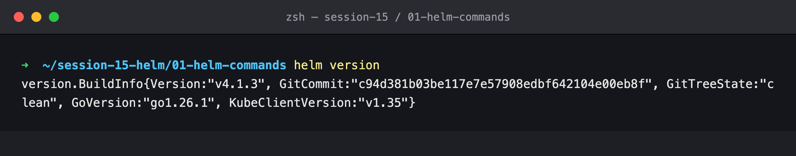

### Step 2 — helm repo add

A chart repository is just an HTTP index of packaged charts. These three are added: Bitnami (general apps), prometheus-community (used in Session 20) and argo (Argo CD, also Session 20).

```bash
helm repo add bitnami https://charts.bitnami.com/bitnami
helm repo add prometheus-community https://prometheus-community.github.io/helm-charts
helm repo add argo https://argoproj.github.io/argo-helm
```

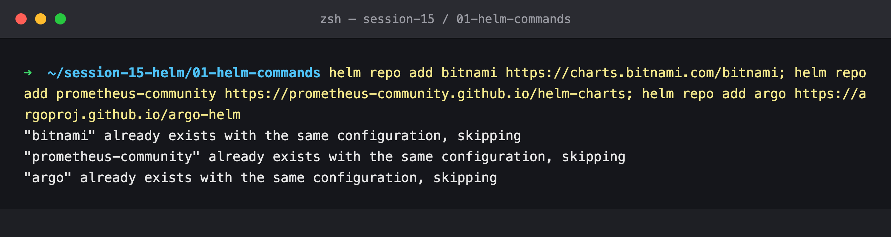

### Step 3 — helm repo list / update

`repo update` downloads the latest `index.yaml` from every repo, the same way `apt update` does before a search or install.

```bash
helm repo list && helm repo update
```

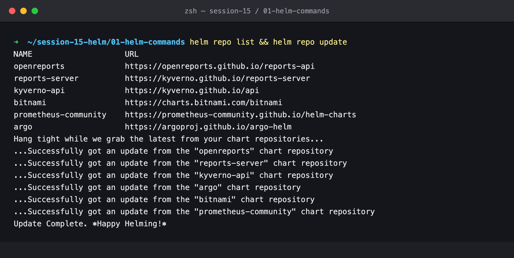

### Step 4 — helm search repo

This searches only the repos added locally. CHART VERSION is the chart's own version, and APP VERSION is the version of the software it deploys (nginx 1.31.6). The two are versioned independently.

```bash
helm search repo nginx --max-col-width 60 | head -8
```

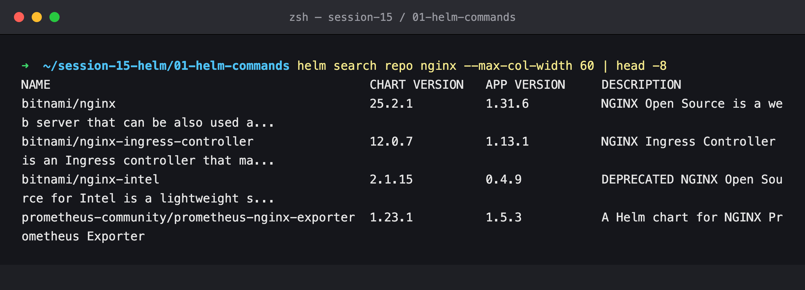

### Step 5 — helm search repo --versions

`--versions` lists every published chart version. This is how a version gets pinned with `--version` (Session 20 installs `kube-prometheus-stack` pinned to 92.1.0).

```bash
helm search repo prometheus-community/kube-prometheus-stack --versions | head -6
```

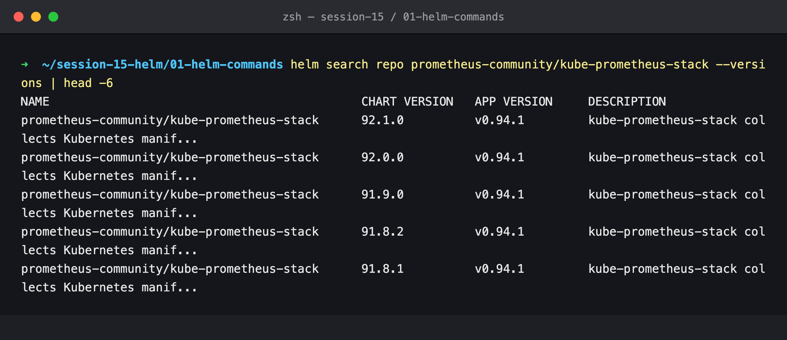

### Step 6 — helm search hub

`search hub` queries Artifact Hub, the public catalogue of charts from every publisher, without adding any repo first.

```bash
helm search hub argo-cd --max-col-width 50 | head -6
```

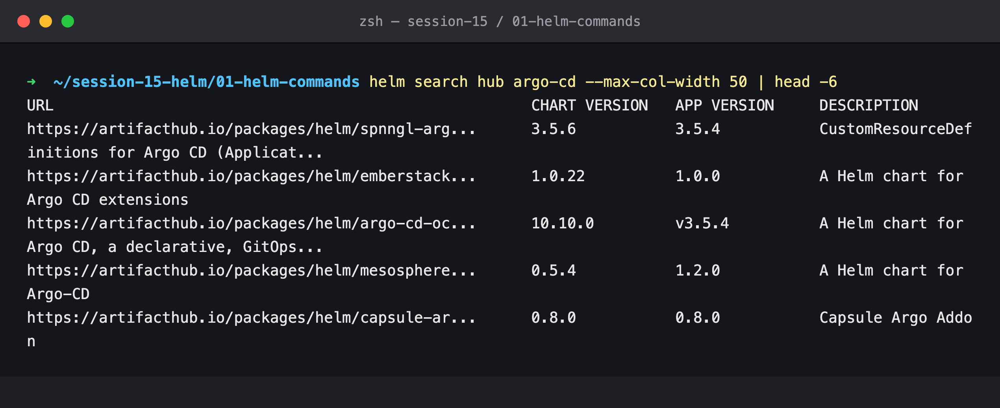

### Step 7 — helm create

`helm create` scaffolds a full, working chart: Deployment, Service, ServiceAccount, optional Ingress, HTTPRoute and HPA, `_helpers.tpl` for shared naming, `NOTES.txt` printed after install, and a test hook.

```bash
helm create mychart && find mychart -type f | sort
```

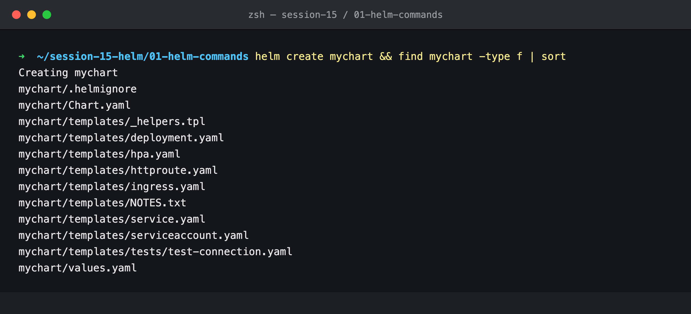

### Step 8 — helm lint and helm template

`lint` checks chart structure and template syntax. `template` renders the YAML locally with no cluster involved, and `-s` limits the output to one file. Every `{{ }}` is replaced, including the standard `app.kubernetes.io/*` labels from `_helpers.tpl`.

```bash
helm lint mychart && helm template demo mychart --namespace s15-cmds -s templates/service.yaml
```

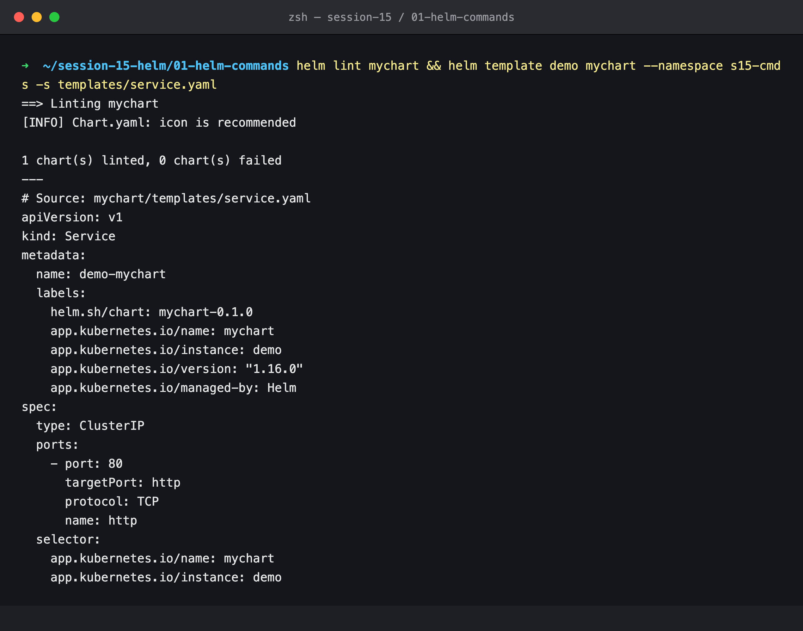

### Step 9 — helm install (failed)

`--wait` makes Helm block until the resources are ready. After the 5-minute default timeout the Deployment still had 0/1 available, so the install failed.

```bash
helm install demo ./mychart -n s15-cmds --set service.type=ClusterIP --wait
```

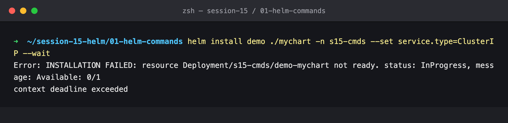

### Step 10 — helm list --failed

Helm recorded revision 1 with STATUS `failed`. (In Helm 4 `-a`/`--all` was removed, so state filters like `--failed` are used instead.)

```bash
helm list -n s15-cmds --failed
```

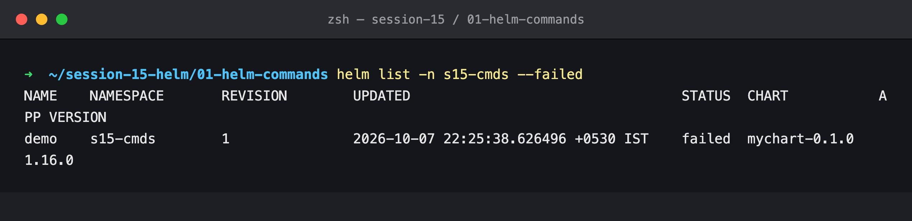

### Step 11 — Root cause, and the fix

The Pod events show the real cause: `429 Too Many Requests` from `registry-1.docker.io`. Docker Hub rate-limits anonymous pulls, and the nodes had been pulling a lot. The chart was fine. The fix was to pull each image once on the host and import it into every node's containerd (`docker save … | docker exec -i <node> ctr -n k8s.io images import -`). The image `nginx:1.16.0` has a fixed tag, so the default `IfNotPresent` pull policy now finds it locally. After deleting the stuck Pod, its replacement starts immediately.

```bash
kubectl get events -n s15-cmds --field-selector reason=Failed -o custom-columns=MESSAGE:.message | head -2 | cut -c1-200
kubectl get pods -n s15-cmds
```

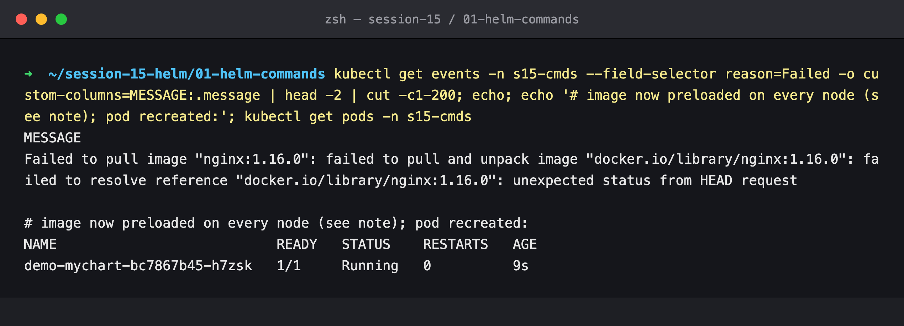

### Step 12 — helm upgrade recovers a failed release

The workload is now healthy, but Helm still records the release as `failed`. `helm upgrade` against a failed release is the supported recovery path. Revision 2 is `deployed`.

```bash
helm upgrade demo ./mychart -n s15-cmds --set service.type=ClusterIP --wait --timeout 2m && helm list -n s15-cmds
```

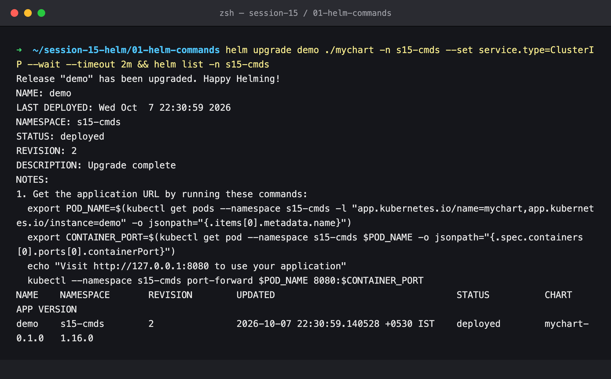

### Step 13 — helm status

`status` shows the release state, its resources (always included in Helm 4), the most recent test-suite result and the rendered `NOTES.txt`. This was captured after step 16a, which is why it already shows the test suite (`Phase: Succeeded`).

```bash
helm status demo -n s15-cmds
```

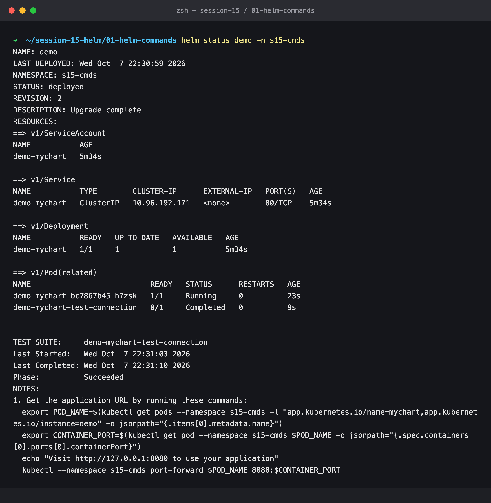

### Step 14 — helm get values

`get values` returns only the values *supplied by the user* (`service.type: ClusterIP`). `--all` merges them with the chart's defaults to show what was actually used for rendering.

```bash
helm get values demo -n s15-cmds
helm get values demo -n s15-cmds --all | head -15
```

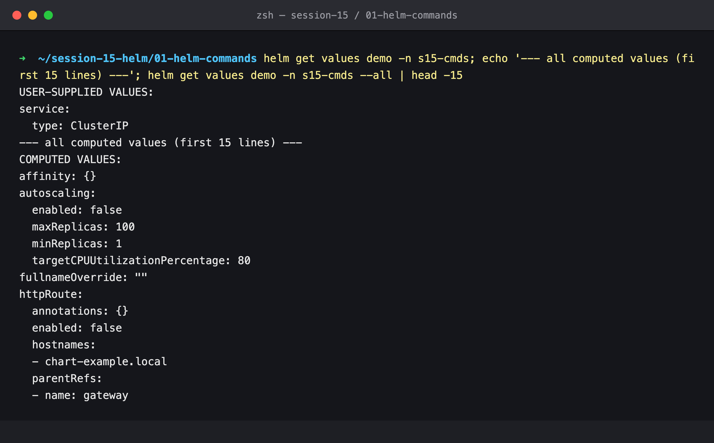

### Step 15 — helm get manifest / metadata

`get manifest` is the exact YAML Helm applied for this revision, filtered here to the object kinds and names. `get metadata` shows the release bookkeeping, including `APPLY_METHOD: server-side apply`, which is new in Helm 4.

```bash
helm get manifest demo -n s15-cmds | grep -E '^(# Source|kind:|  name:)'
helm get metadata demo -n s15-cmds
```

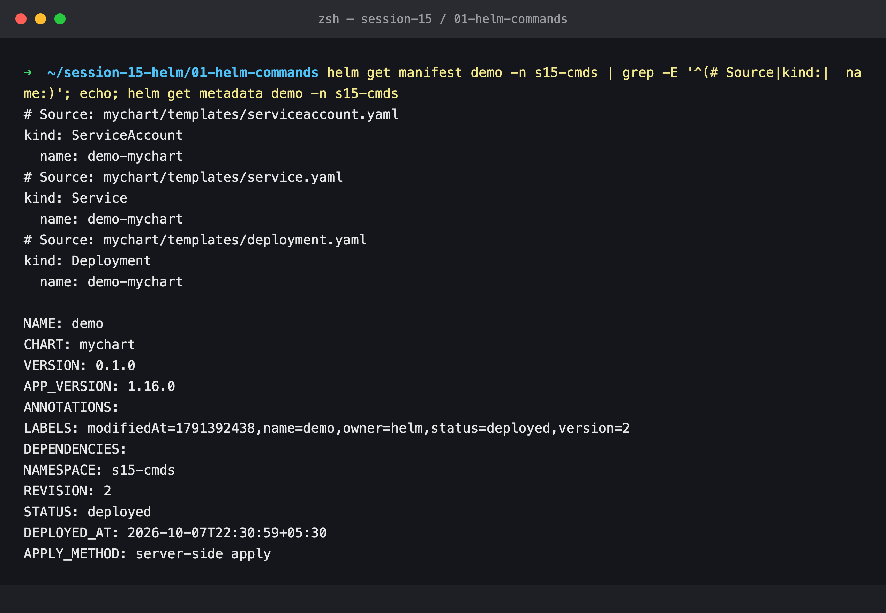

### Step 16a — helm test with the scaffold's unpinned image

`helm test` runs the chart's `helm.sh/hook: test` Pod (a busybox `wget` against the Service). In this run the test passed in 7 seconds. (In my first, unrecorded run of this lab the same command hung for 5 minutes and failed, because the busybox pull got `429 Too Many Requests`. See step 16b for why.)

```bash
helm test demo -n s15-cmds
```

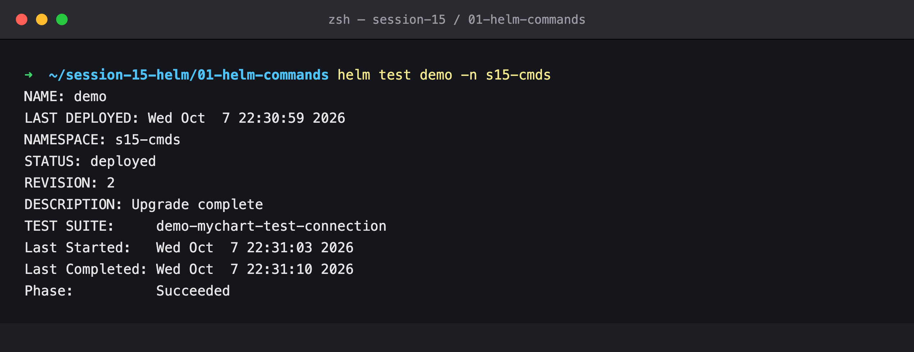

### Step 16b — Why that test is fragile

The scaffold writes `image: busybox` with no tag. No tag means `:latest`, and for `:latest` Kubernetes sets `imagePullPolicy: Always`, so the kubelet ignores any copy already on the node and contacts the registry on **every** test run. The output confirms both points: `Image: busybox` and the policy `Always`. (This time there are no `Failed` pull events, because the pull succeeded.) With Docker Hub rate-limiting these nodes (steps 9–11), whether `helm test` passes is down to luck.

```bash
kubectl describe pod demo-mychart-test-connection -n s15-cmds | grep -E 'Image:|Policy|Failed ' | cut -c1-160
kubectl get pod demo-mychart-test-connection -n s15-cmds -o jsonpath='{.spec.containers[0].imagePullPolicy}'
```

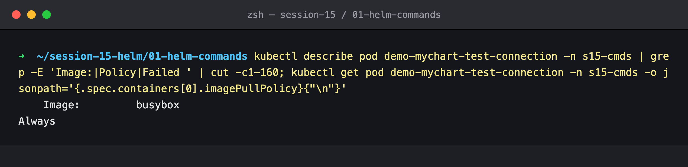

### Step 17 — Pin the image, upgrade, helm test passes

With `busybox:1.36` pinned in the test template (a fixed tag defaults to `IfNotPresent`, so the copy imported onto the node is used), the upgrade creates revision 3 and the test Pod connects to `demo-mychart:80` and downloads the nginx page. Phase: `Succeeded`. `--logs` prints the test Pod's output.

```bash
grep -n 'image:' mychart/templates/tests/test-connection.yaml
helm upgrade demo ./mychart -n s15-cmds --set service.type=ClusterIP --wait >/dev/null && helm test demo -n s15-cmds --logs
```

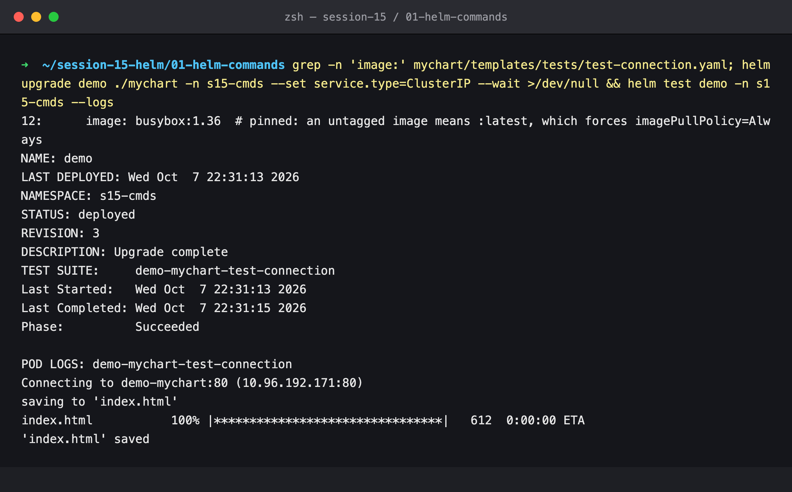

### Step 18 — helm upgrade

The upgrade scales to 3 replicas and changes the image tag in one step. `--reuse-values` keeps the values supplied earlier (`service.type=ClusterIP`) and layers the new `--set` flags on top. Revision 4 runs `nginx:1.25` with 3/3 ready.

```bash
helm upgrade demo ./mychart -n s15-cmds --reuse-values --set replicaCount=3 --set image.tag=1.25 --wait | head -6
kubectl get deploy demo-mychart -n s15-cmds -o wide
```

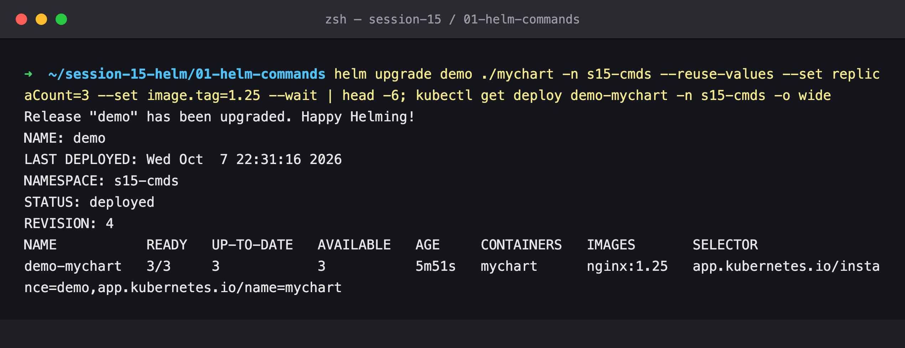

### Step 19 — helm history

This is the full audit trail: the failed install (rev 1), the recovery (2), the test fix (3) and the scale-up with the new image (4). Only the latest revision is `deployed`. All the others are `superseded`.

```bash
helm history demo -n s15-cmds
```

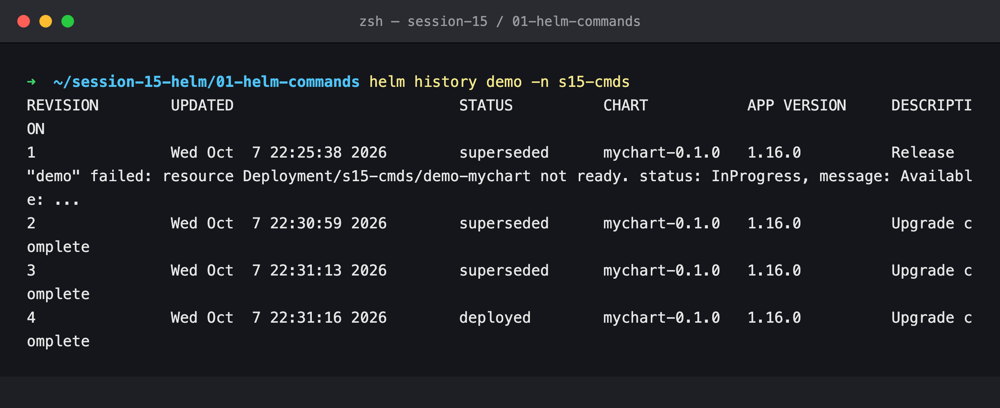

### Step 20 — helm rollback

Rolling back to revision 3 re-applies rev 3's stored manifest. The Deployment returns to `nginx:1.16.0` **and** to 1 replica. The rollback itself is recorded as revision 5, "Rollback to 3".

```bash
helm rollback demo 3 -n s15-cmds --wait && kubectl get deploy demo-mychart -n s15-cmds -o wide && helm history demo -n s15-cmds
```

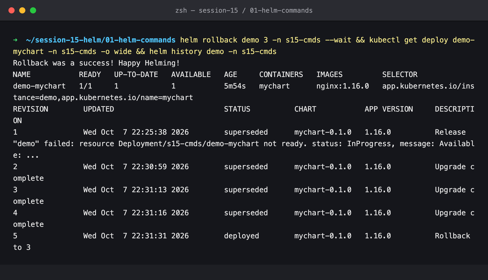

### Step 21 — helm uninstall --keep-history

The workload is removed, but the release record is kept with STATUS `uninstalled`, so `helm history` still works and a rollback is still possible.

```bash
helm uninstall demo -n s15-cmds --keep-history && helm list -n s15-cmds --uninstalled && helm history demo -n s15-cmds | tail -2
```

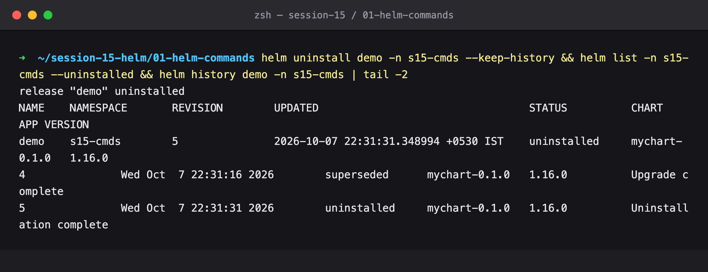

### Step 22 — helm uninstall (purge)

Running `helm uninstall demo -n s15-cmds` again purges the kept record:

```bash
helm uninstall demo -n s15-cmds
```

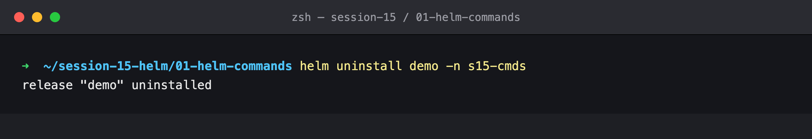

The check below confirms that the history is gone (`release: not found`) and that no uninstalled releases remain. One thing **was** left behind: the `demo-mychart-test-connection` Pod. Test hooks are not part of the release's resources, so `uninstall` doesn't delete them.

```bash
helm history demo -n s15-cmds | tail -1
helm list -n s15-cmds --uninstalled
kubectl get all -n s15-cmds
```

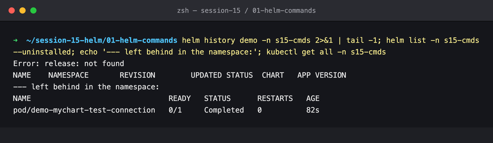

### Step 23 — Cleanup

```bash
kubectl delete pod demo-mychart-test-connection -n s15-cmds; kubectl delete ns s15-cmds
```

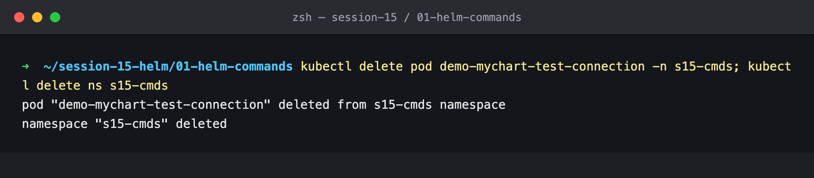

---

## Cleanup

The release was purged, the leftover test Pod deleted and the `s15-cmds` namespace removed. The three Helm repos stay configured on the host, and Session 20 uses them.
