# Session 15 — Helm Rollback Workflow

## Name

Himanshu Rathi

## Roll No

`24BCS10365`

---

**Source folder:** `session-15-helm/07-install-upgrade` and `08-rollback`  
**Reference README:** the upstream lab READMEs in [`Nency-Ravaliya/devops-heros`](https://github.com/Nency-Ravaliya/devops-heros)

The full workflow the assignment asks for: **Install → Upgrade → Verify → Upgrade again → Verify → Rollback → Verify**. Then automatic rollback on a failed upgrade, which turned up a real bug: the way most charts handle ConfigMaps lets a **failed** upgrade change what the **healthy** Pods serve. That bug was fixed.

Every command below was run against a live Kubernetes cluster. Each screenshot is the real terminal output of the command shown directly above it. Nothing is mocked or hand-written.

---

## Environment

| | |
|---|---|
| **Cluster** | `kind` v0.31.0 — 1 control-plane node + 2 worker nodes, running in Docker |
| **Kubernetes** | v1.35.0 |
| **Helm** | v4.1.3 |
| **Host** | macOS (Apple Silicon), Docker Desktop |
| **Namespace** | `s15-rollback` |
| **Date run** | 7 October 2026 |

---

## How "which revision is live" is proven

The course's `app-chart` only changes an image tag, so the only way to check a rollback is to read the Deployment spec. That shows what Kubernetes was *asked* to run, not what is actually *serving*. For this lab I wrote a small chart, [`versioned-web/`](./versioned-web), whose nginx page is rendered from values:

```html
<h1 style="color:{{ .Values.release.color }}">versioned-web {{ .Values.release.version }}</h1>
<p>{{ .Values.release.message }}</p>
<!-- helm revision {{ .Release.Revision }} -->
```

[`verify.sh`](./verify.sh) then prints three independent views of the release:

1. **helm**: the revision Helm believes is deployed.
2. **deploy**: the image in the Deployment spec and the ready count.
3. **Four real HTTP requests through the Service, from a Pod inside the cluster**. The `Server:` header is the nginx binary that is actually running, and the `<h1>` and the revision comment are the page content that is actually being served.

| Release | Values file | Image | Replicas | Page |
|---|---|---|---|---|
| v1 | `versioned-web/values.yaml` | `nginx:1.24` | 2 | blue, "first release" |
| v2 | [`values-v2.yaml`](./values-v2.yaml) | `nginx:1.25` | 2 | green, "second release" |
| v3 | [`values-v3.yaml`](./values-v3.yaml) | `nginx:1.26` | 3 | red, "the one we will roll back" |

---

## Key takeaways

- All three views agree at every step. Upgrading changed the running nginx binary (1.24.0 → 1.25.5 → 1.26.3) and the served page, and **rolling back to revision 2 brought back nginx 1.25.5, the green v2 page and 2 replicas**. The served page even reads `helm revision 2`, which proves Helm re-applied revision 2's *stored manifest* and did not re-render the chart.
- A rollback is a new revision. `rollback web 2` created **revision 4** ("Rollback to 2"), and history was never rewritten.
- `helm upgrade` *without* `--wait` reports success as soon as the API accepts the objects, even if the new Pods can't pull their image. `--rollback-on-failure` (Helm 4's name for `--atomic`) waits, and if the release isn't healthy before `--timeout` it rolls back on its own: revision 7 `failed`, then revision 8 "Rollback to 6".
- **Bug found:** the ConfigMap holding the page has the same name in every revision, so it is **shared by the old and the new ReplicaSet**. When the broken upgrade updated it, the kubelet synced the new content into the *old, healthy* Pods' mounted volume. For as long as the bad release was live, healthy `nginx/1.25.5` Pods were serving revision 9's content (step 16). Adding a `checksum/` annotation, the usual fix, doesn't help here, because it only restarts Pods of the *new* ReplicaSet.
- **Fix:** each revision gets its own ConfigMap, named after a hash of its content and marked `immutable: true` ([`versioned-web-fixed/`](./versioned-web-fixed)). Old Pods keep their own ConfigMap, so the same failing upgrade no longer reaches them (step 18).
- One trade-off remains even after the fix: Helm deletes the previous ConfigMap as soon as the new revision is applied (step 18 lists only the new one). The running Pods keep serving their already-mounted copy, and `--rollback-on-failure` recreates the ConfigMap (step 19). An old Pod that *restarted* in that window would fail to mount it, though. Kustomize's `configMapGenerator` behaves the same way. The way to remove that gap is `helm.sh/resource-policy: keep` combined with garbage collection.

---

## Commands executed, with output

### Step 1 — The chart and the two upgrade values files

```bash
find versioned-web -type f | sort; cat values-v2.yaml; cat values-v3.yaml
```

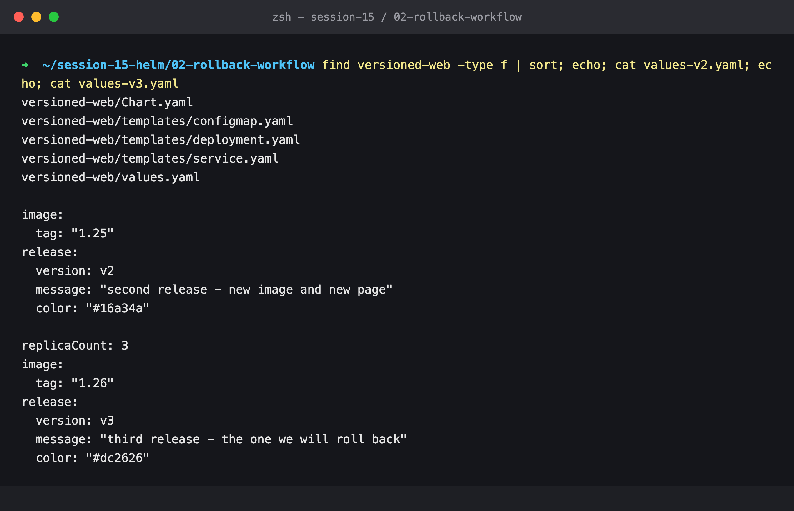

### Step 2 — Install (v1)

```bash
helm install web ./versioned-web -n s15-rollback --wait
```

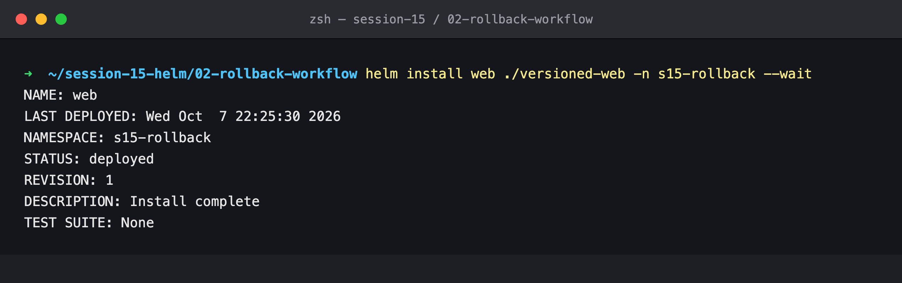

### Step 3 — Verify v1

Revision 1, `nginx:1.24`, 2/2 ready. Every request is answered by **nginx/1.24.0** with the blue `v1` page, rendered at revision 1.

```bash
./verify.sh
```


### Step 4 — Upgrade (v2)

```bash
helm upgrade web ./versioned-web -n s15-rollback -f values-v2.yaml --wait
```

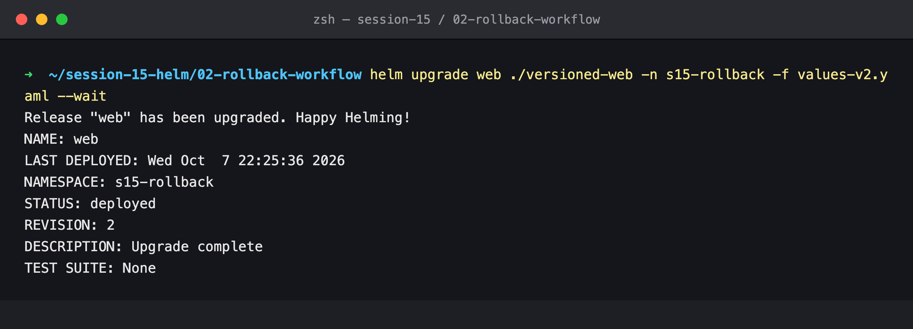

### Step 5 — Verify v2

Revision 2. Every request now hits **nginx/1.25.5** and gets the green `v2` page. No request returned v1 content, because the `checksum/page` annotation rolled the Pods.

```bash
./verify.sh
```


### Step 6 — Upgrade again (v3)

Both files are passed with `-f`. Later files override earlier ones, so v3 is v2 plus its own changes (3 replicas, nginx 1.26, red page).

```bash
helm upgrade web ./versioned-web -n s15-rollback -f values-v2.yaml -f values-v3.yaml --wait
```

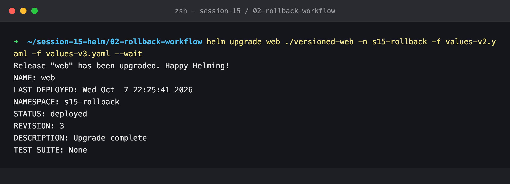

### Step 7 — Verify v3

Revision 3, `nginx:1.26`, **3/3** ready, and every request is served by **nginx/1.26.3** with the red `v3` page.

```bash
./verify.sh
```

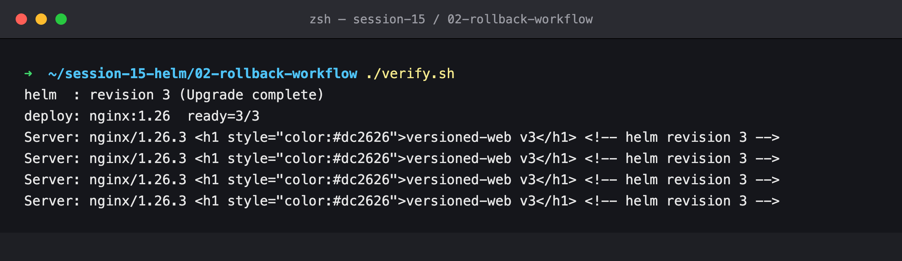

### Step 8 — History before the rollback

```bash
helm history web -n s15-rollback
```

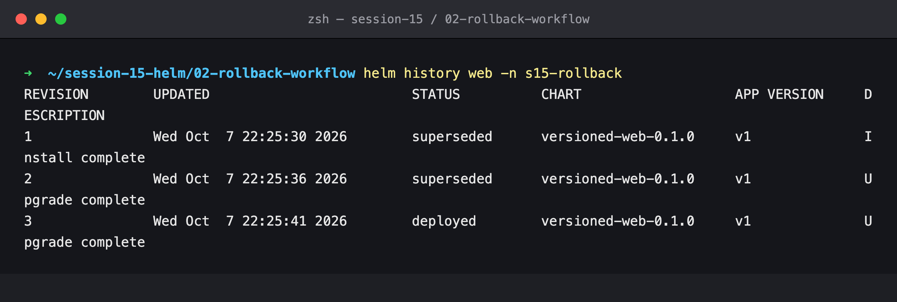

### Step 9 — Rollback to revision 2

```bash
helm rollback web 2 -n s15-rollback --wait
```

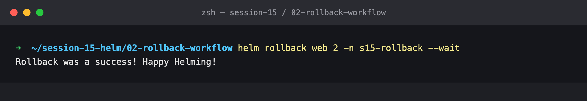

### Step 10 — Verify after the rollback

Helm is at **revision 4 ("Rollback to 2")**. The Deployment is back on `nginx:1.25` with **2** replicas (the third replica added in v3 is gone), and the live traffic is **nginx/1.25.5** with the green v2 page. The comment still reads `helm revision 2`: a rollback reuses the manifest stored for revision 2 and doesn't render the chart again.

```bash
./verify.sh
```

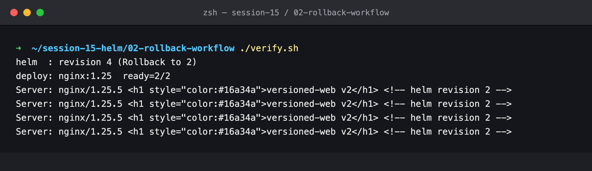

### Step 11 — History and values after the rollback

The history now has 4 revisions, and the user-supplied values are v2's again.

```bash
helm history web -n s15-rollback; helm get values web -n s15-rollback
```

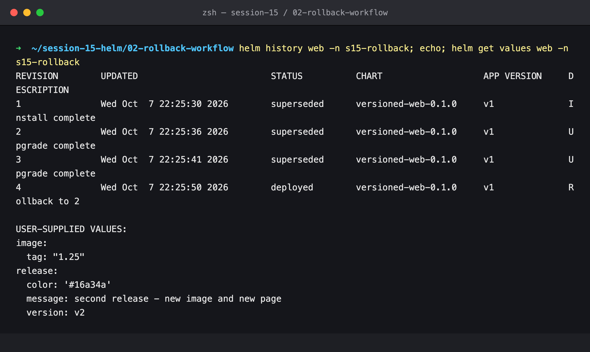

---

### Automatic rollback

### Step 12 — `--atomic` (deprecated in Helm 4)

The image tag doesn't exist. Helm 4 still accepts `--atomic` but prints `Flag --atomic has been deprecated, use --rollback-on-failure instead`. It waited for the default 5 minutes, then rolled back by itself (rev 5 failed → rev 6 "Rollback to 4").

```bash
helm upgrade web ./versioned-web -n s15-rollback --reuse-values --set image.tag=does-not-exist --atomic
```

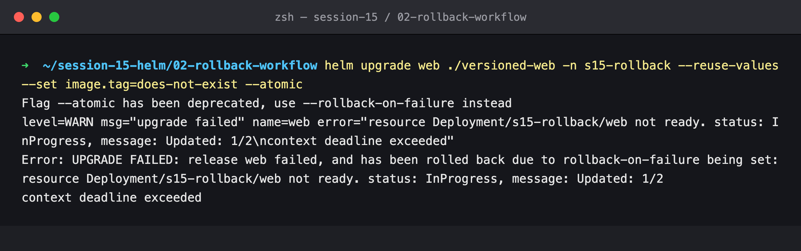

### Step 13 — `--rollback-on-failure` with a shorter timeout

The same broken upgrade, this time with the Helm 4 flag and a 45-second timeout.

```bash
helm upgrade web ./versioned-web -n s15-rollback --reuse-values --set image.tag=does-not-exist --rollback-on-failure --timeout 45s
```

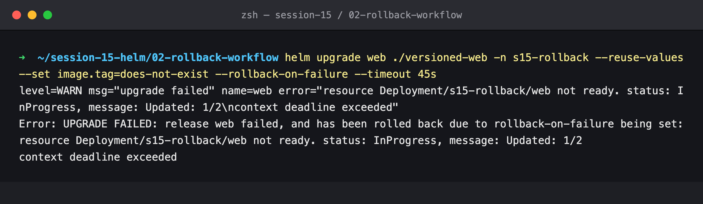

### Step 14 — Verify, and an anomaly

The history is correct (rev 7 `failed`, rev 8 "Rollback to 6"), and the binary is still nginx/1.25.5. **But the page comments say `helm revision 7` and `helm revision 5`**, and those are the revisions of the two *failed* upgrades. Pods that never restarted were serving content from releases that never succeeded.

```bash
helm history web -n s15-rollback | tail -3; ./verify.sh
```

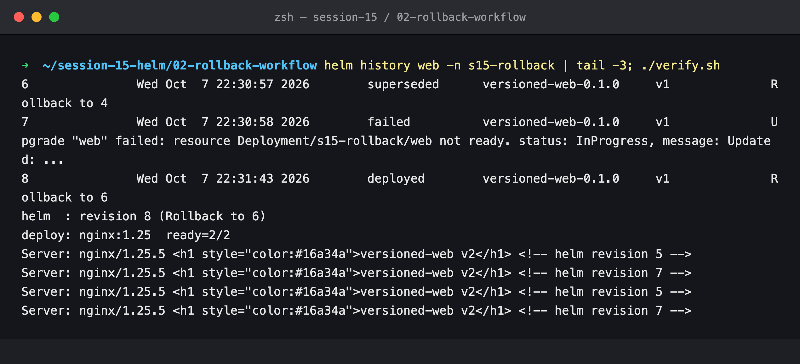

### Step 15 — Why: one ConfigMap shared by every ReplicaSet

Five ReplicaSets have existed (one per pod template), and only the nginx:1.25 one has Pods. There is a single ConfigMap, `web-page`, and **every** ReplicaSet mounts it by that name. When a failed upgrade rewrites it, the kubelet pushes the new file into the volumes of the healthy Pods as well (ConfigMap volumes are updated live, within about a minute). Helm's rollback then writes the old content back. In between, the healthy Pods serve the broken release's page. About a minute later, once the rollback's content had synced, `verify.sh` showed all four requests back on `helm revision 2`. I ran that check but didn't screenshot it. Step 16 reproduces the whole effect on camera.

```bash
kubectl get rs -n s15-rollback -o custom-columns='RS:.metadata.name,DESIRED:.spec.replicas,IMAGE:.spec.template.spec.containers[0].image'
kubectl get cm -n s15-rollback
```

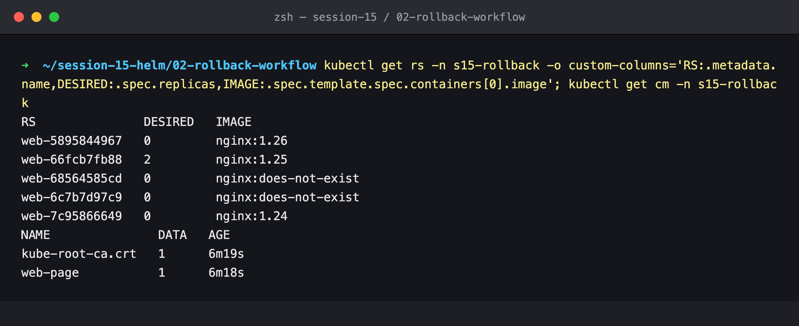

### Step 16 — Reproducing the leak on purpose

The failing upgrade runs in the background, and `verify.sh` runs 80 seconds in. Only the *old* ReplicaSet's Pods are ready (the Deployment's image is already `does-not-exist`, but `ready=2/2` counts the old Pods). Those healthy **nginx/1.25.5** Pods answer with `helm revision 9`, which is the failing upgrade's page.

```bash
helm upgrade web ./versioned-web -n s15-rollback --reuse-values --set image.tag=does-not-exist \
  --set release.message='BROKEN v4 - should never be served' --rollback-on-failure --timeout 100s >/tmp/s15-up.log 2>&1 &
sleep 80; ./verify.sh; wait; tail -2 /tmp/s15-up.log
```

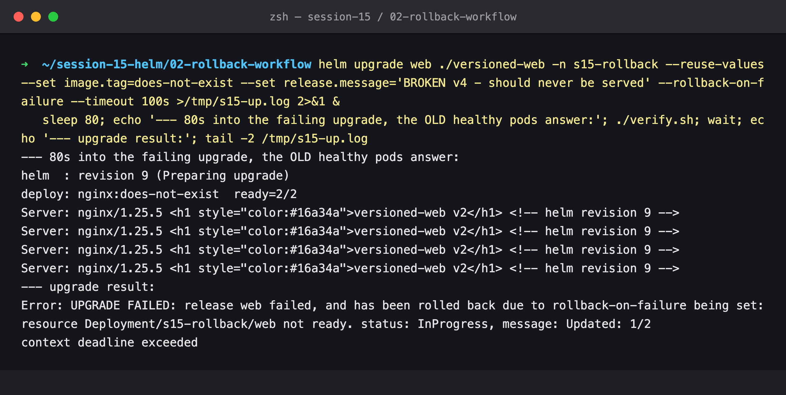

### The fix — one immutable ConfigMap per revision

[`versioned-web-fixed/`](./versioned-web-fixed) (chart 0.2.0) moves the page into a named template in `_helpers.tpl` and names the ConfigMap after its content hash:

```yaml
# templates/_helpers.tpl
{{- define "versioned-web.pageName" -}}
{{ .Release.Name }}-page-{{ include "versioned-web.page" . | sha256sum | trunc 8 }}
{{- end }}

# templates/configmap.yaml
metadata:
  name: {{ include "versioned-web.pageName" . }}
immutable: true

# templates/deployment.yaml (volume)
configMap:
  name: {{ include "versioned-web.pageName" . }}
```

When the content changes, the ConfigMap name changes, which changes the Pod template, so the Deployment rolls (the `checksum/page` annotation is no longer needed). Old Pods keep pointing at their old ConfigMap, and nothing can change it in place because it is immutable.

### Step 17 — Upgrade to the fixed chart

Revision 11 creates `web-page-315692cd` and serves v2.

```bash
helm upgrade web ./versioned-web-fixed -n s15-rollback -f values-v2.yaml --wait | grep -E 'STATUS|REVISION'
kubectl get cm -n s15-rollback; ./verify.sh
```

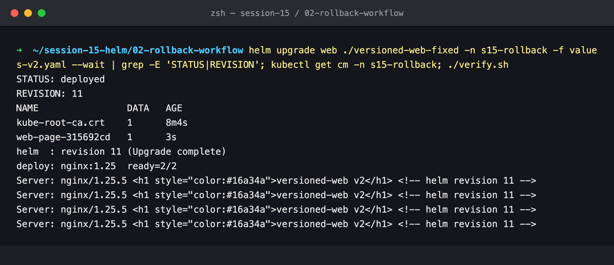

### Step 18 — Same failing upgrade, now contained

The test is identical to step 16. 80 seconds into the failing revision 12, which has its own ConfigMap (`web-page-6a2bedce`), the healthy Pods still serve **`helm revision 11`**. The broken release never reached them, and Helm rolled back to 11 automatically (revision 13).

```bash
helm upgrade web ./versioned-web-fixed -n s15-rollback --reuse-values --set image.tag=does-not-exist \
  --set release.message='BROKEN v4 - should never be served' --rollback-on-failure --timeout 100s >/tmp/s15-up.log 2>&1 &
sleep 80; kubectl get cm -n s15-rollback; ./verify.sh; wait; tail -2 /tmp/s15-up.log; helm history web -n s15-rollback | tail -3
```

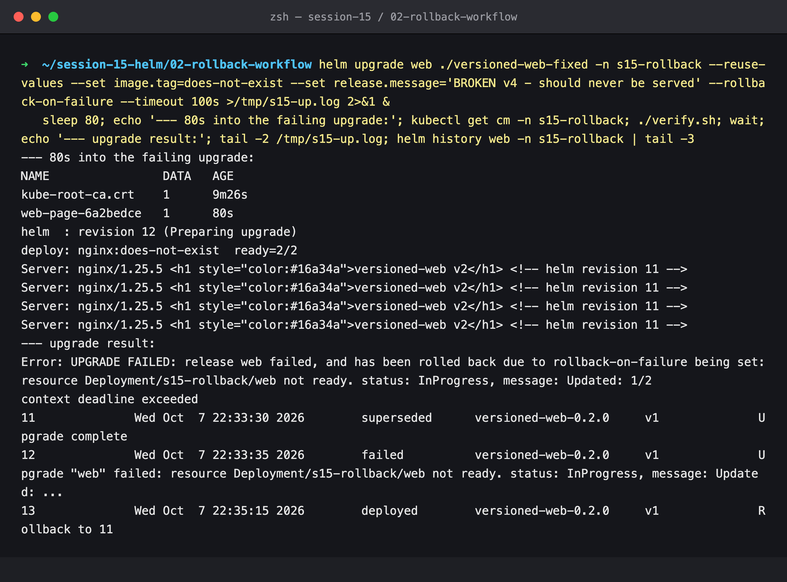

### Step 19 — After the automatic rollback

The rollback recreated revision 11's ConfigMap (`web-page-315692cd`, 2 seconds old), and the service is unchanged from step 17.

```bash
kubectl get cm -n s15-rollback; ./verify.sh
```

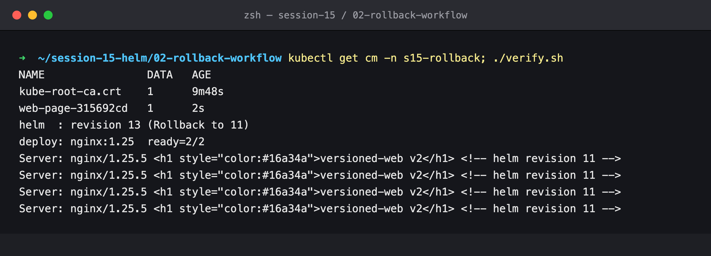

### Step 20 — Cleanup

```bash
helm uninstall web -n s15-rollback && kubectl delete ns s15-rollback
```

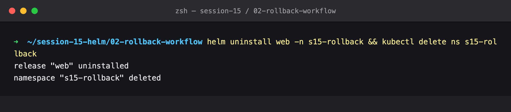

---

## Cleanup

The release was uninstalled and the `s15-rollback` namespace deleted.
