# Session 15 — Mini Project: Notes App Helm Chart

## Name

Himanshu Rathi

## Roll No

`24BCS10365`

---

**Source folder:** `session-15-helm/mini-project`  
**Reference README:** the upstream lab README in [`Nency-Ravaliya/devops-heros`](https://github.com/Nency-Ravaliya/devops-heros)

The Notes App chart ([`notes-chart/`](./notes-chart)), packaged, linted, rendered, installed with development values, upgraded to production values, broken on purpose and rolled back. Running it surfaced two real bugs in the course chart, and both were fixed in chart version **0.1.1** (full diff: [`chart-fixes.diff`](./chart-fixes.diff)).

Every command below was run against a live Kubernetes cluster. Each screenshot is the real terminal output of the command shown directly above it. Nothing is mocked or hand-written.

---

## Environment

| | |
|---|---|
| **Cluster** | `kind` v0.31.0 — 1 control-plane node + 2 worker nodes, running in Docker |
| **Kubernetes** | v1.35.0 |
| **Helm** | v4.1.3 |
| **Host** | macOS (Apple Silicon), Docker Desktop |
| **Namespace** | `s15-notes` |
| **Date run** | 7 October 2026 |

---

## The chart

```text
notes-chart/
├── Chart.yaml            name notes-chart, version 0.1.1 (0.1.0 as shipped), appVersion 1.0
├── values.yaml           development: 1 replica, nginx:1.24, ENVIRONMENT=development
├── values-prod.yaml      production:  3 replicas, nginx:1.25, ENVIRONMENT=production
└── templates/
    ├── configmap.yaml    APP_NAME / ENVIRONMENT from .Values.app
    ├── deployment.yaml   nginx, envFrom the ConfigMap
    └── service.yaml      NodePort
```

| Value | `values.yaml` (dev) | `values-prod.yaml` | Why it differs |
|---|---|---|---|
| `replicaCount` | 1 | 3 | prod needs redundancy |
| `image.tag` | `1.24` | `1.25` | prod is promoted to the newer tested build |
| `app.environment` | development | production | injected into the container as `$ENVIRONMENT` |
| `service.nodePort` | `""` (auto) | `""` (auto) | was hard-coded to 30090 in both — see bug 2 |

[`show-pods.sh`](./show-pods.sh) runs `kubectl exec` in every running Pod and prints the `$ENVIRONMENT` that the container actually received and the nginx version it actually runs. That is what each step below verifies.

---

## Key takeaways

- One chart covers both environments: `-f values-prod.yaml` turned 1 dev Pod on nginx 1.24.0 into 3 production Pods on nginx 1.25.5 with `ENVIRONMENT=production`, and no template was edited.
- `helm upgrade` without `--wait` called the broken-image release "deployed". Only the Pods showed `ImagePullBackOff`. The old ReplicaSet kept serving, and `helm rollback notes-dev 2` restored the release as revision 4.
- **Bug 1: config-only upgrades never reach the Pods.** `envFrom` is read only when a container starts. Changing only `app.environment` updated the ConfigMap to `staging`, but the pod template was unchanged, so nothing restarted and all three Pods kept `ENVIRONMENT=production` (step 10). **Fix:** a `checksum/config` annotation on the pod template (step 14).
- **Bug 2: the hard-coded `nodePort: 30090` makes the chart single-use per cluster.** NodePorts are cluster-wide, so installing `notes-prod` next to `notes-dev` failed with `provided port is already allocated` (step 11). **Fix:** `nodePort` is now optional (`{{- with }}`) and defaults to empty, so Kubernetes assigns a free port (step 15).
- A failed `helm install` is **not** rolled back: the failed `notes-prod` left its ConfigMap and a 3-replica Deployment in the cluster, already starting Pods (step 12). Recover with `helm upgrade` or remove with `helm uninstall`. Don't just retry `helm install`.

---

## Commands executed, with output

### Step 1 — Chart files, dev vs prod values

```bash
find notes-chart -type f | sort
diff -y -W 70 notes-chart/values.yaml notes-chart/values-prod.yaml
```

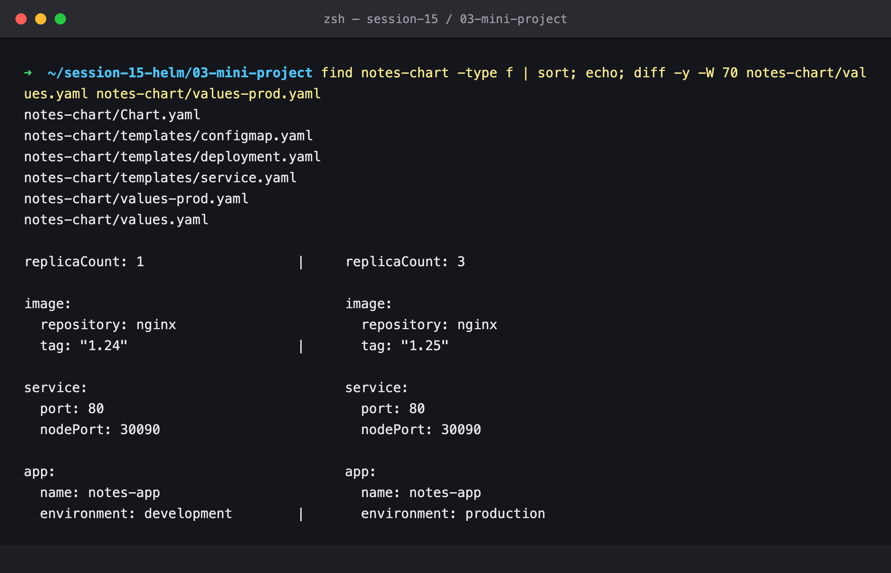

### Step 2 — Lint

```bash
helm lint notes-chart
```

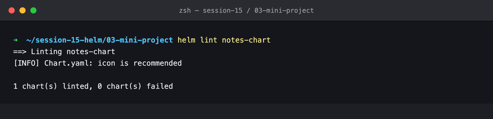

### Step 3 — Render locally

Every `{{ }}` is resolved, and the ConfigMap name `notes-dev-config` matches the Deployment's `configMapRef`.

```bash
helm template notes-dev notes-chart -n s15-notes
```

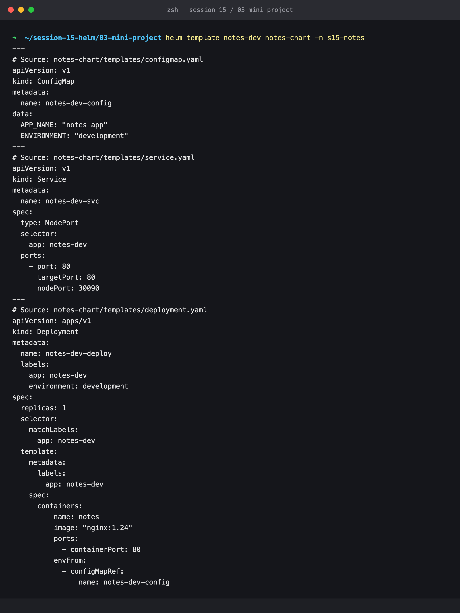

### Step 4 — Install (development)

```bash
helm install notes-dev notes-chart -n s15-notes --wait | head -7
kubectl get pods,svc,cm -n s15-notes
```

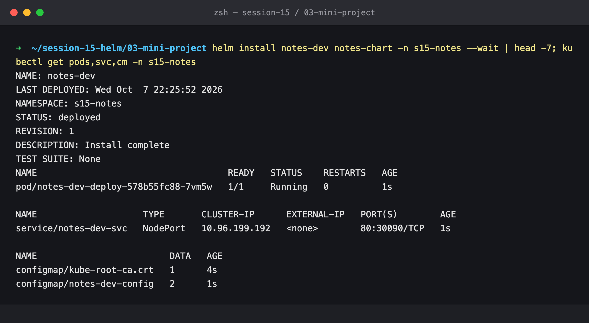

### Step 5 — Verify development

The container has `APP_NAME=notes-app` and `ENVIRONMENT=development` from the ConfigMap and runs nginx 1.24.0. NodePort 30090 answers `200 OK` on a node.

```bash
P=$(kubectl get pod -n s15-notes -l app=notes-dev -o jsonpath='{.items[0].metadata.name}')
kubectl exec -n s15-notes $P -- sh -c 'echo APP_NAME=$APP_NAME ENVIRONMENT=$ENVIRONMENT; nginx -v'
docker exec devops-hw-worker curl -sI localhost:30090 | head -2
```

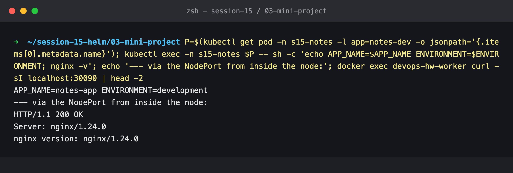

### Step 6 — Upgrade to production values

Revision 2: three Pods, each with `ENVIRONMENT=production` and nginx 1.25.5.

```bash
helm upgrade notes-dev notes-chart -n s15-notes -f notes-chart/values-prod.yaml --wait | grep -E 'STATUS|REVISION'
./show-pods.sh
```

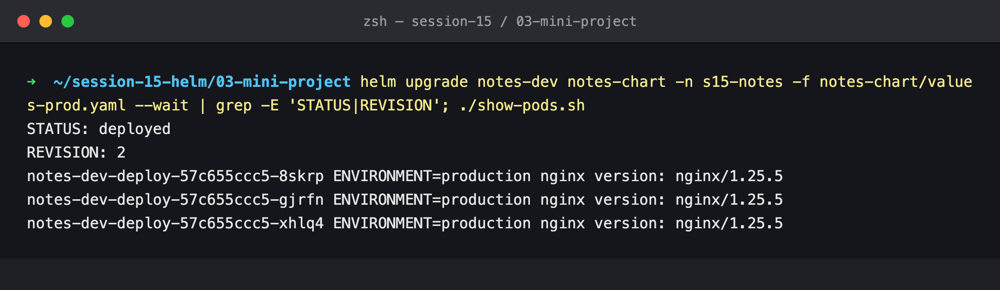

### Step 7 — History

```bash
helm history notes-dev -n s15-notes
```

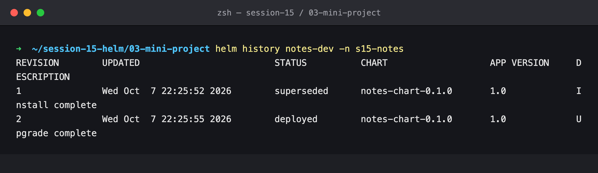

### Step 8 — Simulate a bad upgrade

Helm reports revision 3 as "Upgrade complete". It didn't wait, so it doesn't know that the new Pod is in `ImagePullBackOff`. The three old Pods keep serving, because a RollingUpdate won't remove old Pods until new ones are ready.

```bash
helm upgrade notes-dev notes-chart -n s15-notes --reuse-values --set image.tag=broken-tag-does-not-exist
sleep 20; kubectl get pods -n s15-notes
```

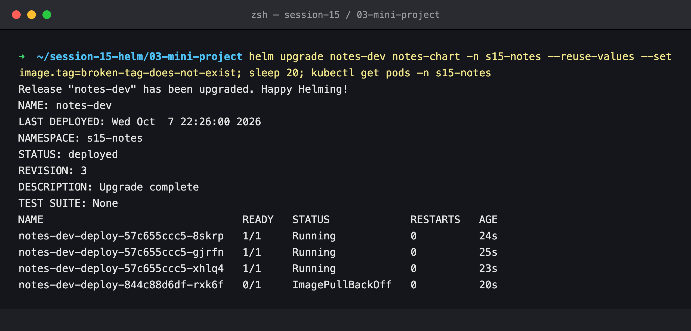

### Step 9 — Rollback to revision 2

The broken Pod terminates, the three healthy Pods stay, and the rollback is recorded as revision 4.

```bash
helm rollback notes-dev 2 -n s15-notes --wait && kubectl get pods -n s15-notes && helm history notes-dev -n s15-notes
```

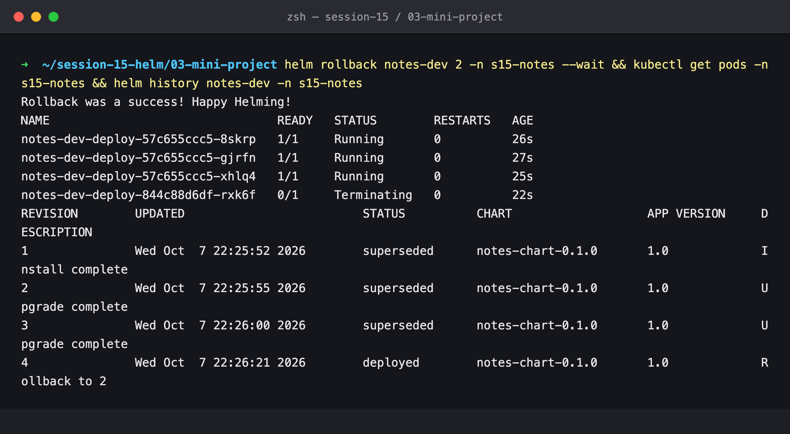

---

### Bugs found while running the course chart

### Step 10 — Bug 1: a config-only upgrade doesn't reach the Pods

The only change is `app.environment=staging`. Helm creates revision 5, and the ConfigMap now says `staging`, **but every Pod still has `ENVIRONMENT=production`, with the same Pod names as before**. Environment variables from `envFrom` are fixed when the container starts, and nothing in the pod template changed, so the Deployment had no reason to roll.

```bash
helm upgrade notes-dev notes-chart -n s15-notes --reuse-values --set app.environment=staging --wait | grep REVISION
kubectl get cm notes-dev-config -n s15-notes -o jsonpath='ConfigMap says: {.data.ENVIRONMENT}'
./show-pods.sh
```

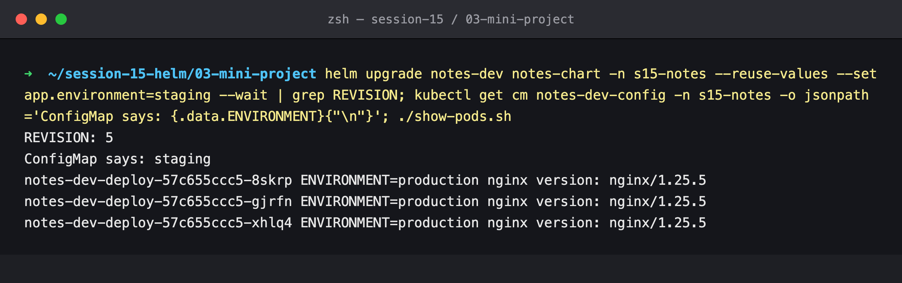

### Step 11 — Bug 2: a second release can't be installed

Installing the production release next to dev fails. `nodePort: 30090` is hard-coded in both values files, and a NodePort is reserved across the whole cluster.

```bash
helm install notes-prod notes-chart -n s15-notes -f notes-chart/values-prod.yaml
```

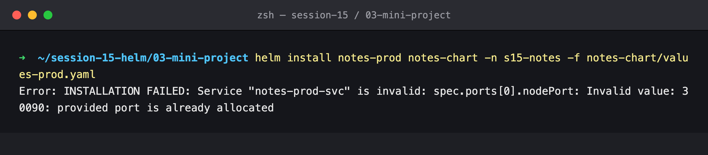

### Step 12 — A failed install leaves resources behind

Helm marks `notes-prod` as `failed`, but the ConfigMap and the Deployment it applied before the Service was rejected are still there. The Deployment is one second old, with 3 Pods being created (`UP-TO-DATE 3`, `0/3` ready so far), and it would have come fully up if left alone.

```bash
helm list -n s15-notes --failed
kubectl get deploy,cm -n s15-notes -l app=notes-prod; kubectl get cm notes-prod-config -n s15-notes
```

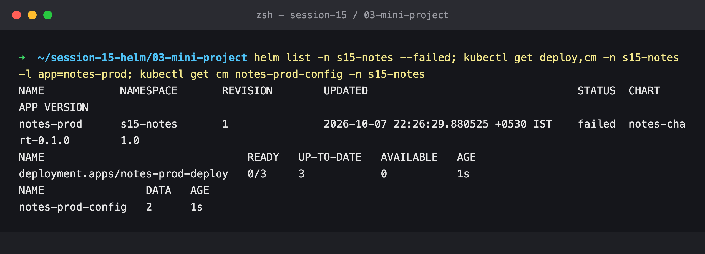

### Step 13 — The fix (chart 0.1.1)

The full diff is in [`chart-fixes.diff`](./chart-fixes.diff):

```yaml
# templates/deployment.yaml — pod template
      annotations:
        checksum/config: {{ include (print $.Template.BasePath "/configmap.yaml") . | sha256sum }}

# templates/service.yaml
      {{- with .Values.service.nodePort }}
      nodePort: {{ . }}
      {{- end }}

# values.yaml and values-prod.yaml
  nodePort: ""      # auto-assign; pin with --set service.nodePort=30090 only when needed
```

```bash
cat chart-fixes.diff | grep -E '^[-+]' | grep -v '^[-+]{3}'
```

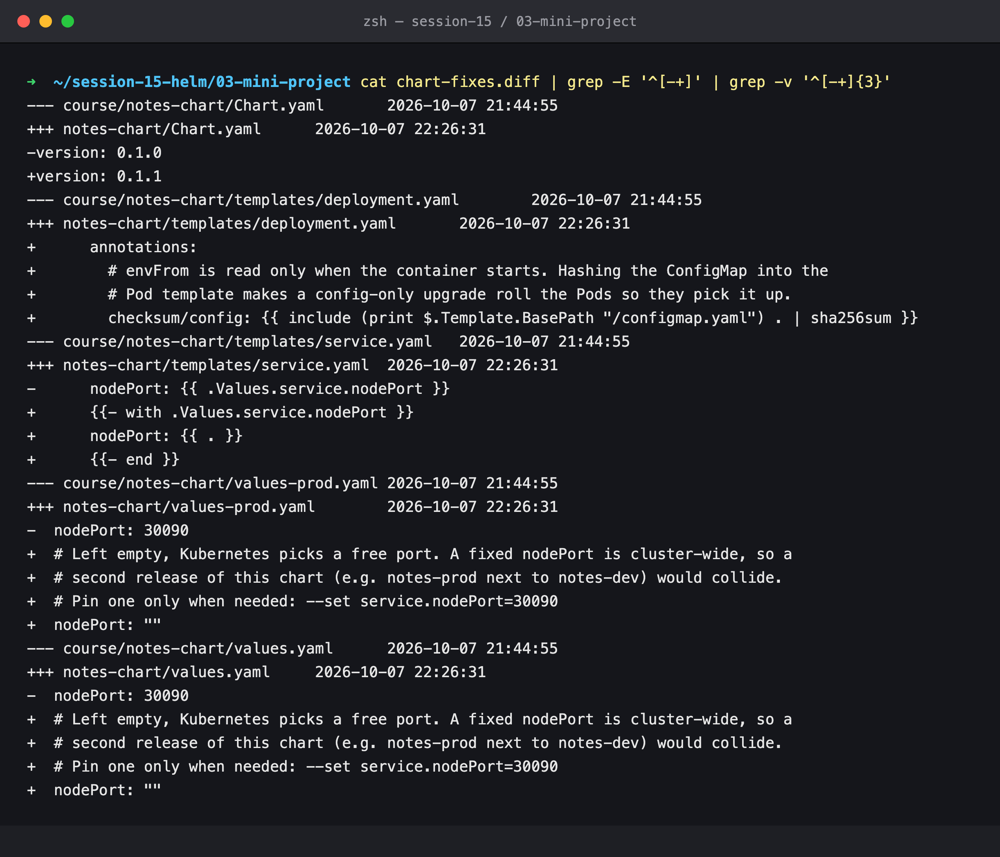

### Step 14 — Bug 1 fixed: config change now rolls the Pods

Revision 6, with the same `staging` change. The hash of the ConfigMap changed, which changed the pod template, so **three new Pods** were created, and each one reports `ENVIRONMENT=staging`.

```bash
helm upgrade notes-dev notes-chart -n s15-notes -f notes-chart/values-prod.yaml --set app.environment=staging --wait | grep REVISION
kubectl get cm notes-dev-config -n s15-notes -o jsonpath='ConfigMap says: {.data.ENVIRONMENT}'
./show-pods.sh
```

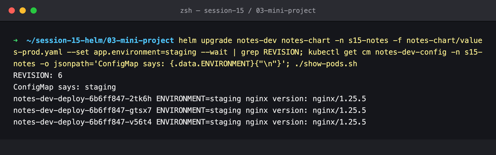

### Step 15 — Bug 2 fixed: two releases side by side

`helm upgrade` recovers the failed `notes-prod` release. Both releases are now `deployed` on chart 0.1.1. `notes-dev` keeps its existing port, 30090, and `notes-prod` gets an auto-assigned one, **31820**.

```bash
helm upgrade notes-prod notes-chart -n s15-notes -f notes-chart/values-prod.yaml --wait | grep -E 'STATUS|REVISION'
helm list -n s15-notes; kubectl get svc -n s15-notes
```

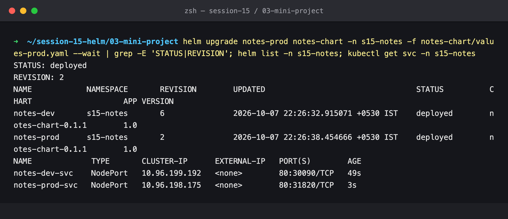

### Step 16 — Cleanup

```bash
helm uninstall notes-dev notes-prod -n s15-notes && kubectl delete ns s15-notes && helm list -A
```

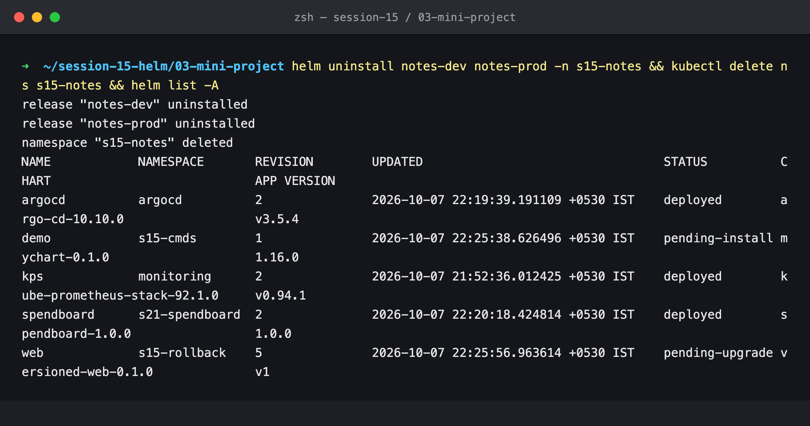

---

## What was practiced

```text
[PASS] Created a Helm chart (Chart.yaml, values.yaml, values-prod.yaml, 3 templates)
[PASS] Linted and rendered it locally
[PASS] Installed with development values, verified inside the container
[PASS] Upgraded to production values, verified 3 Pods / nginx 1.25.5 / ENVIRONMENT=production
[PASS] Simulated a bad upgrade and rolled back to a healthy revision
[FIX ] Config-only upgrades now roll the Pods (checksum/config)
[FIX ] Chart can be installed more than once per cluster (optional nodePort)
[PASS] Cleaned up with helm uninstall
```

## Cleanup

Both releases were uninstalled and the `s15-notes` namespace deleted. `helm list -A` in step 16 also shows `demo` and `web`. Those are the Lab 1 and Lab 2 releases, which were being replayed at the same moment in their own namespaces and cleaned up by those labs' own final steps. The others (`argocd`, `kps`, `spendboard`) belong to other sessions.
