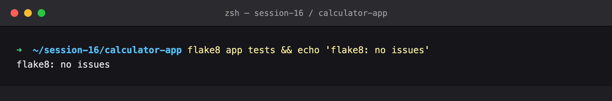
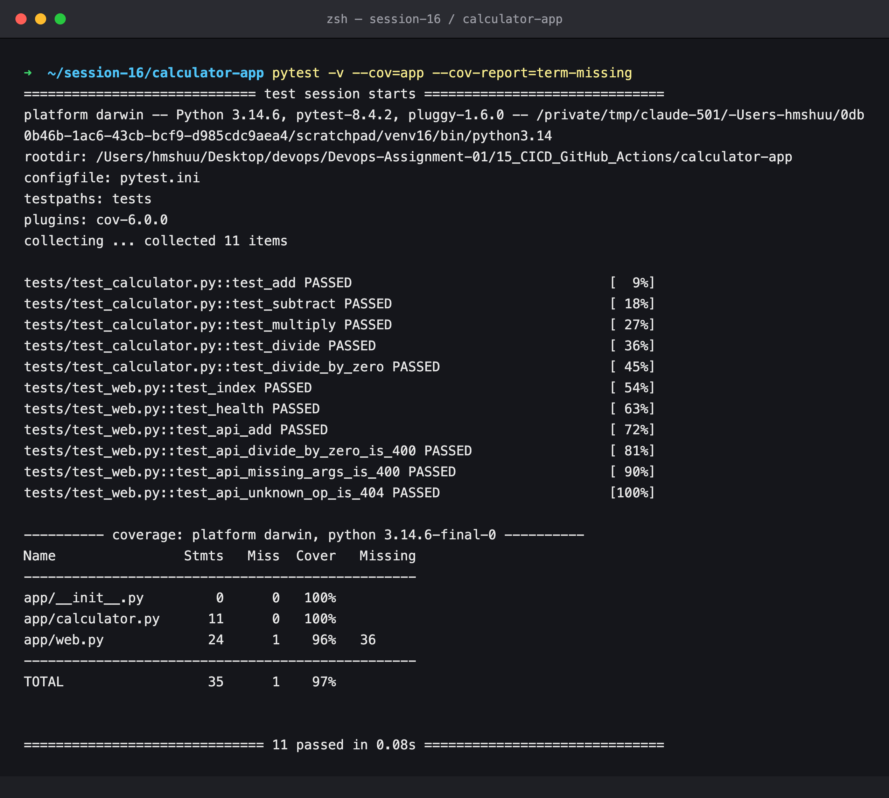
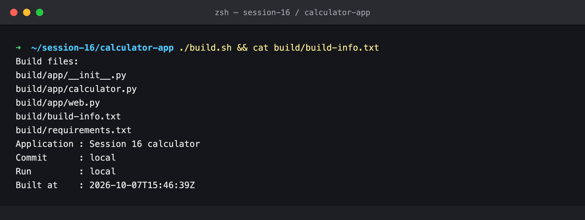
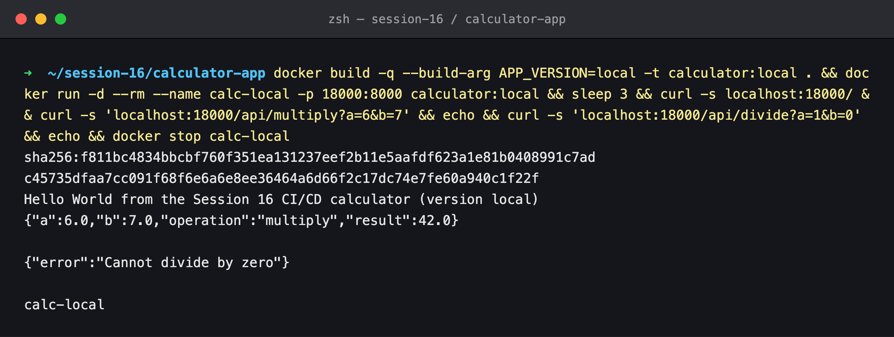
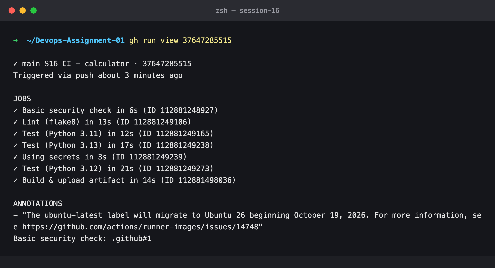
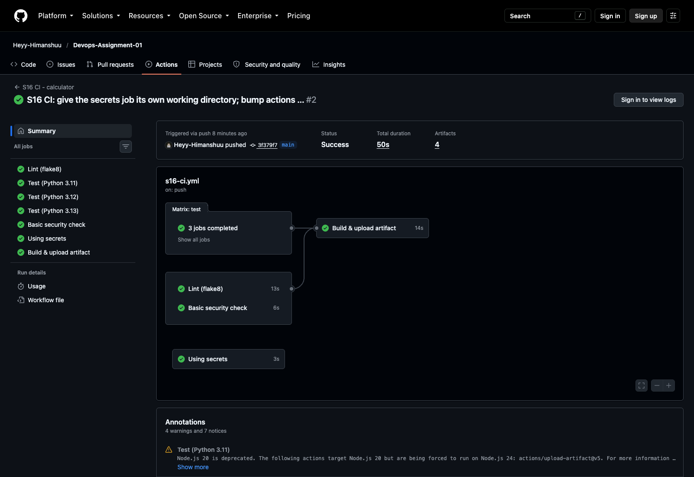
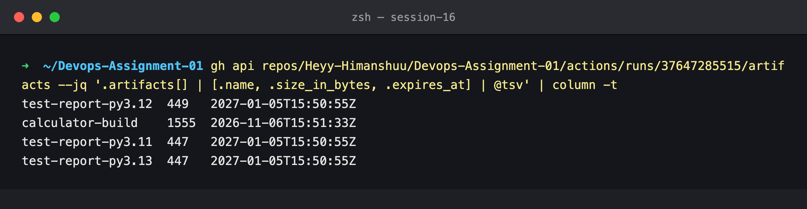
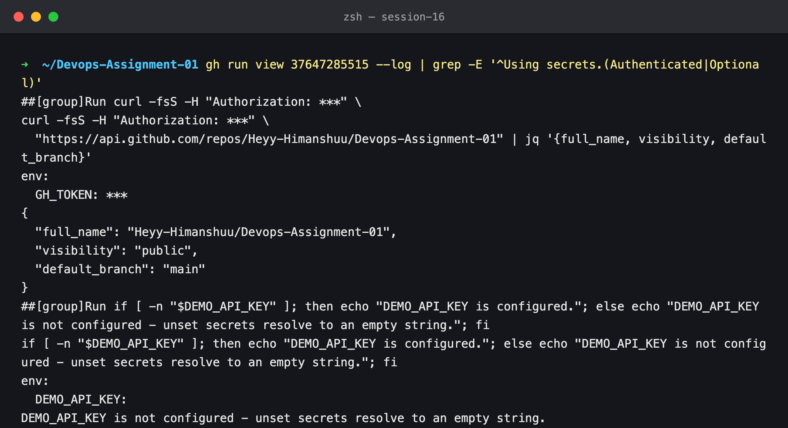

# Session 16 — CI Pipeline — Lint, Test Matrix, Secrets, Build & Artifacts

## Name

Himanshu Rathi

## Roll No

`24BCS10365`

---

**Source folder:** `session-16-github-actions/10-final-cicd-pipeline` (course repo [`Nency-Ravaliya/devops-heros`](https://github.com/Nency-Ravaliya/devops-heros))
**Workflow:** [`.github/workflows/s16-ci.yml`](../../.github/workflows/s16-ci.yml)
**Green run:** [#37647285515](https://github.com/Heyy-Himanshuu/Devops-Assignment-01/actions/runs/37647285515)

The course pipeline has `test`, `build` and `security-check` jobs over a calculator module. I kept
that shape and extended it into something that can be deployed:

- a Flask HTTP layer (`app/web.py`) and 6 HTTP tests on top of the 5 unit tests
- a `flake8` lint job
- a **matrix** that runs the tests on three Python versions in parallel
- a job that uses secrets correctly
- a `build` job that packages the app, uploads it as an artifact, and builds and curls the Docker image

---

## Environment

| | |
|---|---|
| **Runner** | GitHub-hosted `ubuntu-latest` (`ubuntu-24.04`, image `20260927.320.1`, runner `2.337.0`) |
| **Python (CI)** | 3.11, 3.12, 3.13 (matrix) |
| **Local** | macOS (Apple Silicon), Python 3.14.6, Docker 29.2.0, `gh` 2.93.0 |
| **Date run** | 7 October 2026 |

---

## Key takeaways

- **A workflow is a graph of jobs, and each job gets a fresh VM.** `lint`, `test`, `security-check` and `secrets-demo` start at the same moment. `build` waits on `needs: [lint, test, security-check]`. Jobs share nothing on disk, so each one checks out the code itself, and output moves between jobs only through artifacts or `outputs:`.
- **One matrix job became three runners.** `strategy.matrix.python: ["3.11","3.12","3.13"]` tests every supported interpreter for the price of one job definition, and `build` waits for all three.
- **Artifacts outlive the runner.** The run uploaded 4: the packaged app (`calculator-build`) and one JUnit report per Python version. The test reports upload with `if: always()`, so they exist exactly when you need them, after a failure.
- **Secrets are used, never printed.** `GITHUB_TOKEN` authenticates an API call and the log shows it only as `***`. An unset secret is just an empty string, so the workflow checks for it explicitly.
- **`paths:` filters keep this workflow quiet.** It only runs when `15_CICD_GitHub_Actions/calculator-app/**` or the workflow file changes, so pushes to other assignment folders don't trigger it.

---

## The workflow

```yaml
on:
  push:
    branches: [main]
    paths: ["15_CICD_GitHub_Actions/calculator-app/**", ".github/workflows/s16-ci.yml"]
  pull_request:
    paths: ["15_CICD_GitHub_Actions/calculator-app/**"]
  workflow_dispatch:

jobs:
  lint:            # flake8 app tests
  test:            # matrix: python 3.11 / 3.12 / 3.13 -> pytest + coverage -> upload JUnit artifact
  security-check:  # fail if a .env / *.pem / *.key file is committed
  secrets-demo:    # use GITHUB_TOKEN (and optional DEMO_API_KEY) without echoing them
  build:           # needs: [lint, test, security-check]
                   # ./build.sh -> upload "calculator-build" -> docker build + run + curl
```

The full file is at [`.github/workflows/s16-ci.yml`](../../.github/workflows/s16-ci.yml).

---

## Commands executed, with output

### Step 1 — Lint locally

Before pushing, I ran the same lint as CI.

```bash
flake8 app tests
```



### Step 2 — Test locally

11 tests: 5 against the pure calculator functions and 6 against the HTTP API through Flask's test
client (happy paths, divide-by-zero → 400, missing parameter → 400, unknown operation → 404).
Coverage is 97%. The only uncovered line is the `__main__` dev-server entry point, which gunicorn
never runs.

```bash
pytest -v --cov=app --cov-report=term-missing
```



### Step 3 — Build locally

`build.sh` is the build step CI runs. It copies the app into `build/` and writes `build-info.txt`
with the commit and run number. In CI those values come from `GITHUB_SHA` and `GITHUB_RUN_NUMBER`.

```bash
./build.sh && cat build/build-info.txt
```



### Step 4 — Docker image locally

The same Dockerfile CI and CD use: `python:3.12-slim` running gunicorn as `nobody`.

```bash
docker build --build-arg APP_VERSION=local -t calculator:local .
docker run -d --rm --name calc-local -p 18000:8000 calculator:local
curl localhost:18000/ ; curl 'localhost:18000/api/multiply?a=6&b=7' ; curl 'localhost:18000/api/divide?a=1&b=0'
```



### Step 5 — The pipeline on GitHub

Pushing to `main` triggered **S16 CI**. All 7 jobs passed: the three matrix legs, lint, the
security check and the secrets job ran in parallel, and `build` started only when its three
dependencies were green.

```bash
gh run view 37647285515
```



The same run in the Actions UI. The graph shows the fan-out and the `needs:` edge into `Build & upload artifact`:



### Step 6 — Artifacts

Four artifacts were attached to the run. `calculator-build` is retained for 30 days
(`retention-days: 30`); the test reports keep the repository default of 90 days.

```bash
gh api repos/Heyy-Himanshuu/Devops-Assignment-01/actions/runs/37647285515/artifacts \
  --jq '.artifacts[] | [.name, .size_in_bytes, .expires_at] | @tsv' | column -t
```



### Step 7 — Secrets in the log

The job's log from the run. The token appears only as `***` everywhere, including the
`Authorization` header and the `env:` block. The authenticated API call still worked.
`DEMO_API_KEY` is not set on the repository, so it resolves to an empty string and the step
reports that instead of failing obscurely.

```bash
gh run view 37647285515 --log | grep -E '^Using secrets.(Authenticated|Optional)'
```



> **Note on custom secrets.** The `gh` CLI on this machine is signed in to a different GitHub
> account, which has read-only access to this repository, so `gh secret set DEMO_API_KEY` was not
> possible from here. That's why the demo relies on the automatic `GITHUB_TOKEN`. To see the
> repository-secret branch, add `DEMO_API_KEY` under *Settings → Secrets and variables → Actions*
> and re-run the workflow. The step will print `DEMO_API_KEY is configured.`
