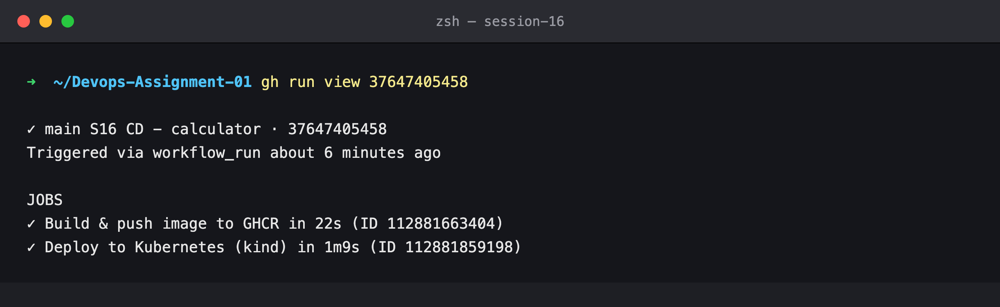
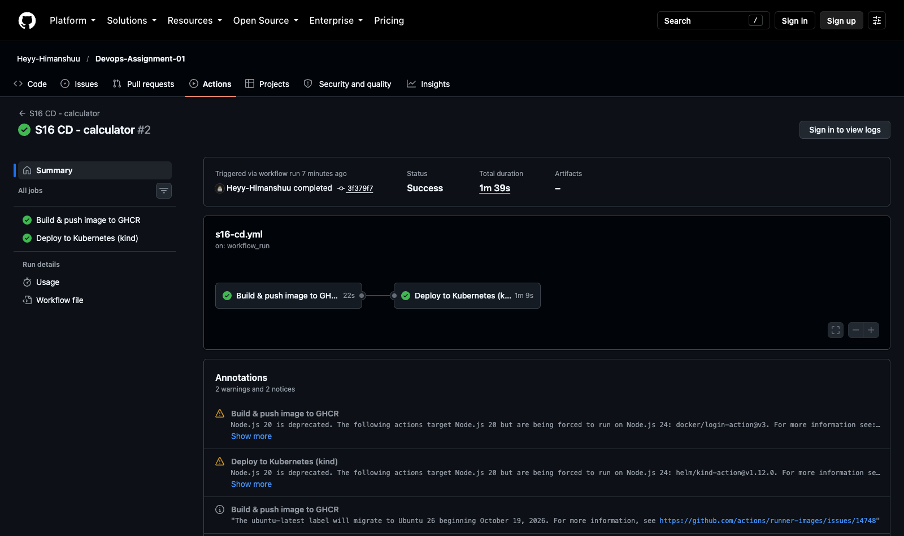
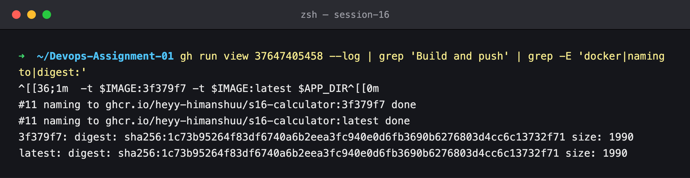
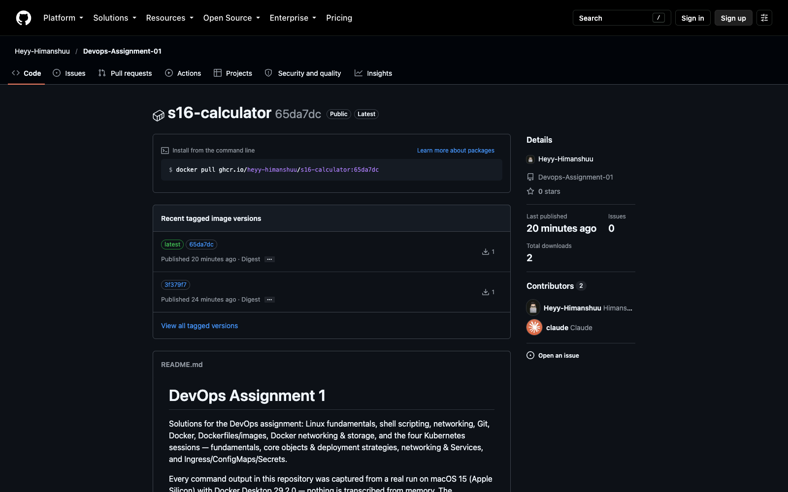
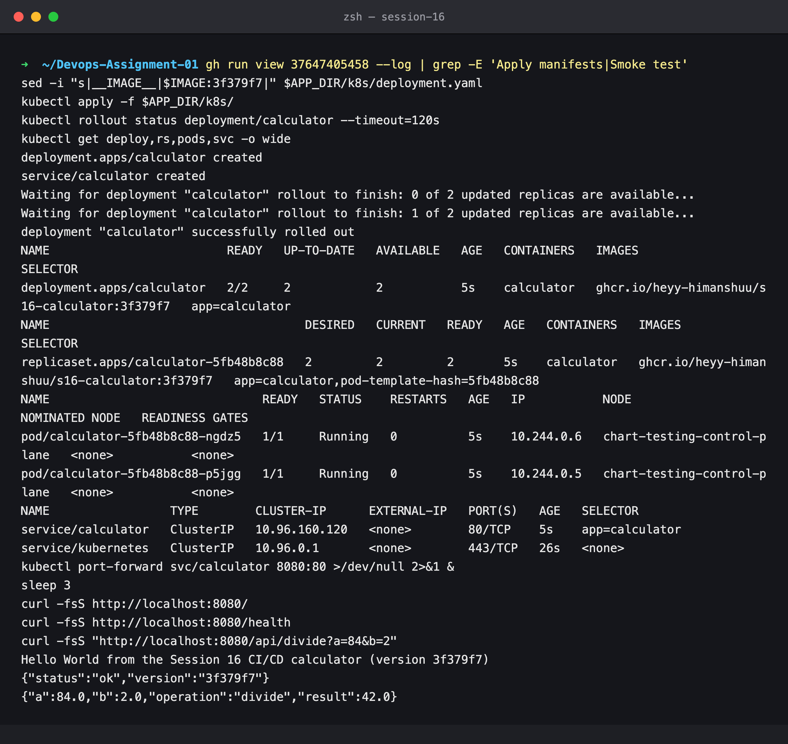

# Session 16 — CD Pipeline — GHCR Image and a Kubernetes Deploy on Every Green CI

## Name

Himanshu Rathi

## Roll No

`24BCS10365`

---

**Workflow:** [`.github/workflows/s16-cd.yml`](../../.github/workflows/s16-cd.yml)
**Run:** [#37647405458](https://github.com/Heyy-Himanshuu/Devops-Assignment-01/actions/runs/37647405458) (triggered by CI run [#37647285515](https://github.com/Heyy-Himanshuu/Devops-Assignment-01/actions/runs/37647285515))
**Image:** [`ghcr.io/heyy-himanshuu/s16-calculator`](https://github.com/Heyy-Himanshuu/Devops-Assignment-01/pkgs/container/s16-calculator)

CI ends with "this commit is good". CD takes that exact commit and ships it. It:

1. builds the image and tags it with the short commit SHA
2. pushes it to GitHub Container Registry
3. deploys that tag to Kubernetes
4. checks through the Service that the new version answers

---

## Environment

| | |
|---|---|
| **Runner** | GitHub-hosted `ubuntu-latest` (`ubuntu-24.04`) |
| **Registry** | GitHub Container Registry (`ghcr.io`), authenticated with the run's `GITHUB_TOKEN` |
| **Cluster** | `kind` created on the runner by `helm/kind-action` (`kindest/node:v1.32.0`, kubectl v1.31.4) |
| **Date run** | 7 October 2026 |

> **Why a cluster on the runner?** A GitHub-hosted runner can't reach the kind cluster on my laptop,
> and the course has no shared cluster. So the deploy job creates a throwaway single-node kind cluster
> and deploys into that. The deploy steps (`kubectl create secret`, `kubectl apply`,
> `kubectl rollout status`, a Service smoke test) are the same ones you would run against EKS, GKE or
> AKS. Only the cluster's lifetime differs.

---

## Key takeaways

- **CD is chained to CI, not run alongside it.** `on: workflow_run: workflows: ["S16 CI - calculator"], types: [completed]`, plus `if: conclusion == 'success'` on the first job. A red CI produces a *skipped* CD run, as shown in [lab 3](../03-failure-and-fix/submission.md).
- **Deploy the commit that was tested, not whatever is on `main` now.** `workflow_run` jobs check out `github.event.workflow_run.head_sha`. Without that, a commit pushed while CI was running would be deployed untested.
- **Immutable tags.** The deployment pins `s16-calculator:3f379f7`, not `:latest`. The ReplicaSet records exactly which build is running, and rolling back is just applying the previous SHA.
- **`GITHUB_TOKEN` is enough for GHCR.** It needs `permissions: packages: write`, and nothing has to be stored in the repo. The same token becomes the cluster's `imagePullSecret`.
- **"Deployed" means "answering", not "applied".** `kubectl apply` returning 0 proves nothing. The job waits for `rollout status` (readiness probe on `/health`) and then curls three endpoints through the Service. The page reports `version 3f379f7`, the same SHA that was pushed.

---

## Commands executed, with output

### Step 1 — CD triggered by the successful CI run

```bash
gh run view 37647405458
```





### Step 2 — Build and push to GHCR

The image is tagged with the commit SHA and `latest`, and both tags resolve to the same digest.

```bash
gh run view 37647405458 --log | grep 'Build and push' | grep -E 'docker|naming to|digest:'
```



The package on GitHub, linked to this repository:



### Step 3 — Deploy, roll out and smoke test

The deploy job did the following:

1. created the pull secret from `GITHUB_TOKEN`
2. replaced the `__IMAGE__` placeholder in [`k8s/deployment.yaml`](../calculator-app/k8s/deployment.yaml) with the pushed tag
3. applied the manifests
4. waited for 2/2 replicas to pass their readiness probe
5. curled `/`, `/health` and `/api/divide` through the `calculator` Service

```bash
gh run view 37647405458 --log | grep -E 'Apply manifests|Smoke test'
```



`Hello World ... (version 3f379f7)` is the proof that the code running in the cluster came from
the commit CI tested: `APP_VERSION` is baked in at `docker build` time from the SHA.
