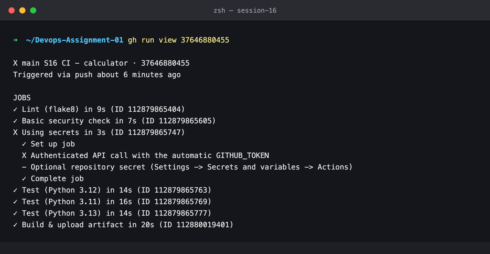
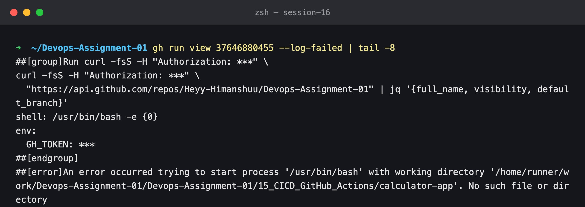
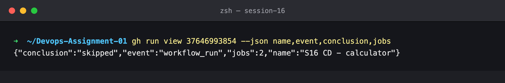
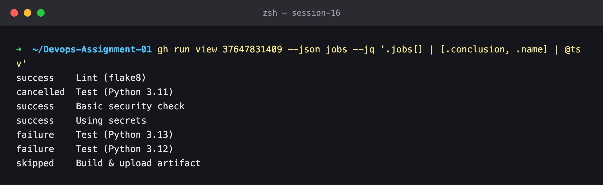
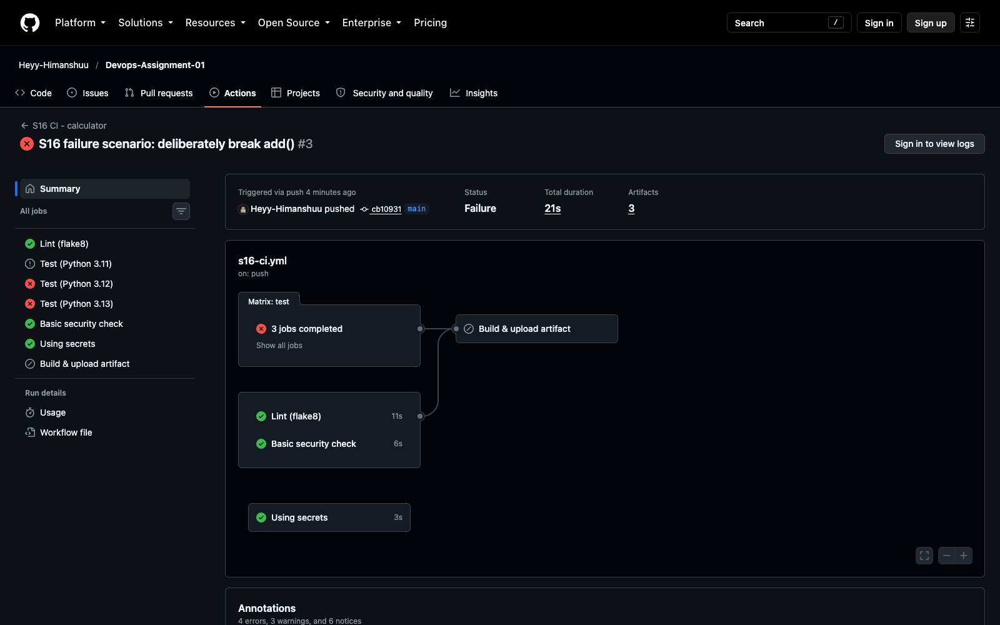
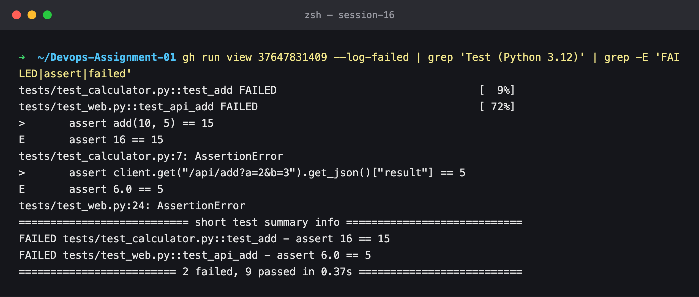
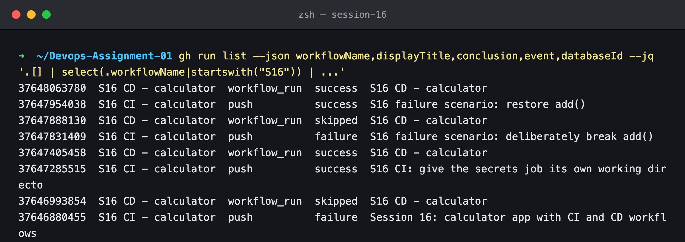

# Session 16 — Failure & Fix — What a Red Pipeline Stops

## Name

Himanshu Rathi

## Roll No

`24BCS10365`

---

A pipeline earns its keep when something is wrong. This lab has two real failures:

1. **An unplanned one.** My first version of the workflow failed on its very first run. The bug is the kind that only shows up on a real runner.
2. **The course's failure scenario.** `add()` is deliberately broken, which proves the `needs:` gate stops the build and a failed CI never reaches CD.

| Run | Commit | Result |
| --- | --- | --- |
| [#37646880455](https://github.com/Heyy-Himanshuu/Devops-Assignment-01/actions/runs/37646880455) | `020854b` first version of the workflows | ❌ CI — `Using secrets` job could not start bash |
| [#37646993854](https://github.com/Heyy-Himanshuu/Devops-Assignment-01/actions/runs/37646993854) | (CD for the above) | ⏭ skipped |
| [#37647285515](https://github.com/Heyy-Himanshuu/Devops-Assignment-01/actions/runs/37647285515) | `3f379f7` working-directory fix | ✅ CI → [CD ✅](https://github.com/Heyy-Himanshuu/Devops-Assignment-01/actions/runs/37647405458) |
| [#37647831409](https://github.com/Heyy-Himanshuu/Devops-Assignment-01/actions/runs/37647831409) | `cb10931` `add()` returns `a + b + 1` | ❌ CI — tests fail, build skipped |
| [#37647888130](https://github.com/Heyy-Himanshuu/Devops-Assignment-01/actions/runs/37647888130) | (CD for the above) | ⏭ skipped |
| [#37647954038](https://github.com/Heyy-Himanshuu/Devops-Assignment-01/actions/runs/37647954038) | `65da7dc` `add()` restored | ✅ CI → [CD ✅](https://github.com/Heyy-Himanshuu/Devops-Assignment-01/actions/runs/37648063780) |

---

## Key takeaways

- **The workflow-level `defaults.run.working-directory` applies to every job, including jobs that never check out the code.** On those runners the directory does not exist, and the step dies before your command runs. Locally this can't be reproduced, because the folder exists on my machine.
- **`needs:` is the gate.** When `test` failed, `build` was **skipped**. It never ran, so no artifact or image was produced from broken code.
- **Matrix fail-fast.** When the 3.12 and 3.13 legs failed, GitHub **cancelled** the still-running 3.11 leg (`strategy.fail-fast` defaults to `true`). That saves runner minutes, at the cost of not knowing whether 3.11 would also have failed.
- **Jobs without `needs:` still run.** `lint`, `security-check` and `secrets-demo` passed in the broken run, so the failure is narrowed to the tests.
- **A red CI stops CD too.** CD is triggered by `workflow_run` on every CI completion, but its `if: conclusion == 'success'` turns both red runs into *skipped* CD runs. Nothing was pushed or deployed.

---

## Failure 1 — a real bug in my workflow

### What happened

Every job passed except `Using secrets`, and that job died in its first step:

```bash
gh run view 37646880455
```



```bash
gh run view 37646880455 --log-failed | tail -8
```



### Root cause

`s16-ci.yml` sets `defaults.run.working-directory: 15_CICD_GitHub_Actions/calculator-app` for the
whole workflow, so every `run:` step starts in the app folder. The `secrets-demo` job only calls the
GitHub API, so it has no `actions/checkout` step. On that fresh runner the folder doesn't exist, and
the runner can't even start `/usr/bin/bash` in it.

### Fix

The job now overrides the default (commit `3f379f7`):

```yaml
  secrets-demo:
    defaults:
      run:
        working-directory: .   # no checkout in this job, so the app folder does not exist here
```

CD noticed the red CI and skipped itself:

```bash
gh run view 37646993854 --json name,event,conclusion,jobs
```



---

## Failure 2 — the course scenario: break the application

### Break it

```python
def add(a, b):
    return a + b + 1
```

Pushed as `cb10931`. The run graph shows the gate working: both failing test legs are red, 3.11 was
cancelled by fail-fast, and **Build & upload artifact** was skipped.

```bash
gh run view 37647831409 --json jobs --jq '.jobs[] | [.conclusion, .name] | @tsv'
```





The test log points straight at the regression. Both the unit test and the HTTP test caught it:

```bash
gh run view 37647831409 --log-failed | grep 'Test (Python 3.12)' | grep -E 'FAILED|assert|failed'
```



### Fix it

`return a + b` was restored and pushed as `65da7dc`. CI went green and, because it succeeded, CD
started on its own, pushed `s16-calculator:65da7dc` and deployed it.

### The whole history

```bash
gh run list --json workflowName,displayTitle,conclusion,event,databaseId \
  --jq '.[] | select(.workflowName|startswith("S16")) | ...'
```



Read it from the bottom up. Each red CI is immediately followed by a *skipped* CD, and each green
CI by a *successful* CD.
