# Session 17 — The DevSecOps Pipeline, Stage by Stage

## Name

Himanshu Rathi

## Roll No

`24BCS10365`

---

**Workflow:** [`.github/workflows/s17-devsecops.yml`](../../.github/workflows/s17-devsecops.yml)
**Green runs:** [#37649386486](https://github.com/Heyy-Himanshuu/Devops-Assignment-01/actions/runs/37649386486) (`841874b`, used for the stage screenshots below) and [#37650186661](https://github.com/Heyy-Himanshuu/Devops-Assignment-01/actions/runs/37650186661) (`e409d3f`, after the remediation in lab 2)

All ten jobs passed and the image was deployed. Each screenshot below is a slice of that run's log,
fetched with `gh run view --log` and filtered to the lines that matter.

---

## Environment

| | |
|---|---|
| **Runner** | GitHub-hosted `ubuntu-latest` (`ubuntu-24.04`) |
| **App** | Flask 3.1.3 on gunicorn 23.0.0, `python:3.12-slim` (Debian 13.7) |
| **Scanners** | Bandit 1.8.6 · pip-audit 2.9.0 · Trivy 0.67.2 · Gitleaks 8.28.0 |
| **Registry** | `ghcr.io/heyy-himanshuu/s17-devsecops-app` via `GITHUB_TOKEN` |
| **Cluster** | `kind` created on the runner by `helm/kind-action` (`kindest/node:v1.32.0`) |
| **Date run** | 7 October 2026 |

---

## Key takeaways

- **Fail early and cheaply.** Build and unit tests take about 20 s. Nothing is scanned until they pass, and no image is built until the scanners pass.
- **Scan what you ship.** The image is built once, saved with `docker save`, and passed as an artifact to the image-scan job and then the push job. The digest pushed to GHCR is the one Trivy approved.
- **A gate is a job, not a log line.** `8. Security gate` runs with `if: always()`, so it reports even when upstream jobs fail. It writes a results table to the run summary and exits non-zero unless all seven upstream jobs are `success`. `push` depends on it, so a closed gate means no image leaves the runner.
- **"Clean" needs a definition.** The image *does* contain 44 HIGH CVEs in Debian packages, none of which has a fixed version yet. The policy is: fail on HIGH/CRITICAL **that can be fixed**. An unfixable finding can only be accepted or mitigated, and failing the build on it would just teach everyone to ignore the gate. Lab 2 shows how this policy was first set wrong.

---

## Stage by stage

### Run overview

```bash
gh run view 37649386486
```

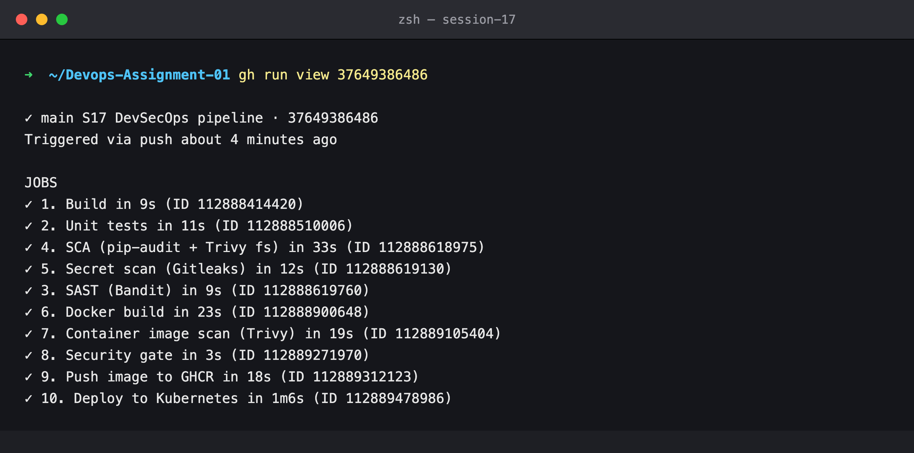

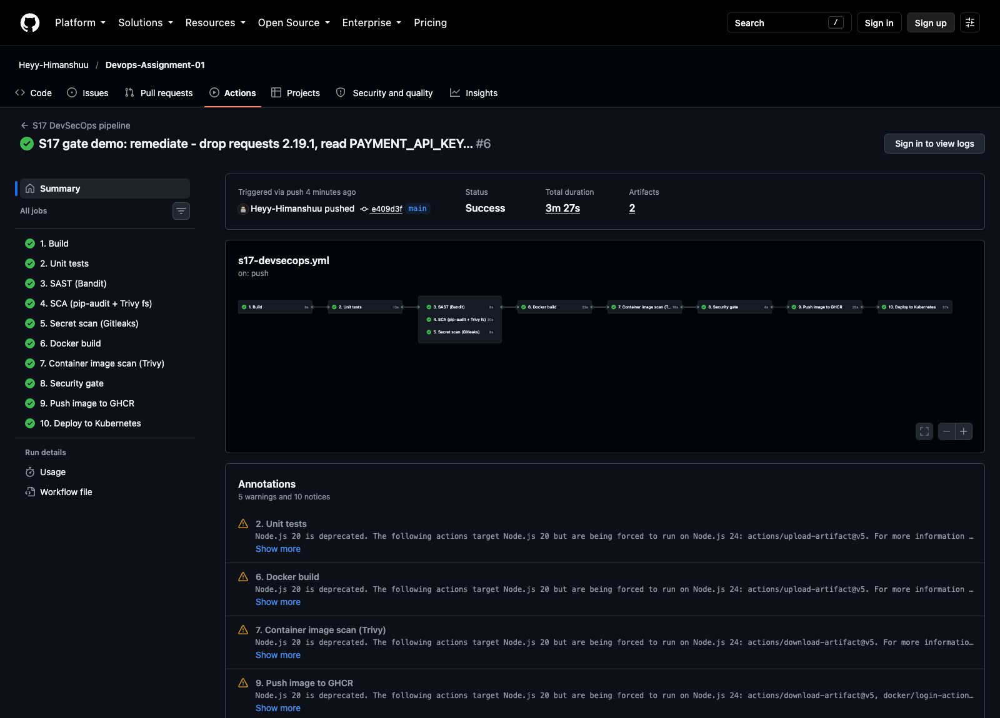

### 1. Build

Install the runtime dependencies, then byte-compile the package and import it. A syntax error or a
missing dependency fails here, before any test or scanner time is spent.

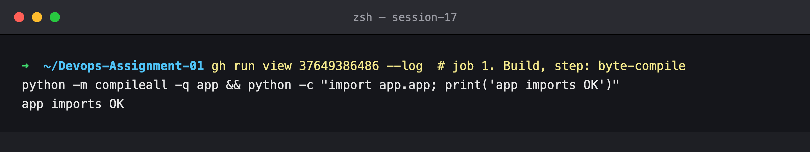

### 2. Unit tests

8 tests (pages, health, greet, add, validation errors, calculator, divide-by-zero, status). The
JUnit report is uploaded as the `unit-test-report` artifact. The deprecation warnings
(`datetime.utcnow()`) come from the course code. They are not failures, so I left them alone.

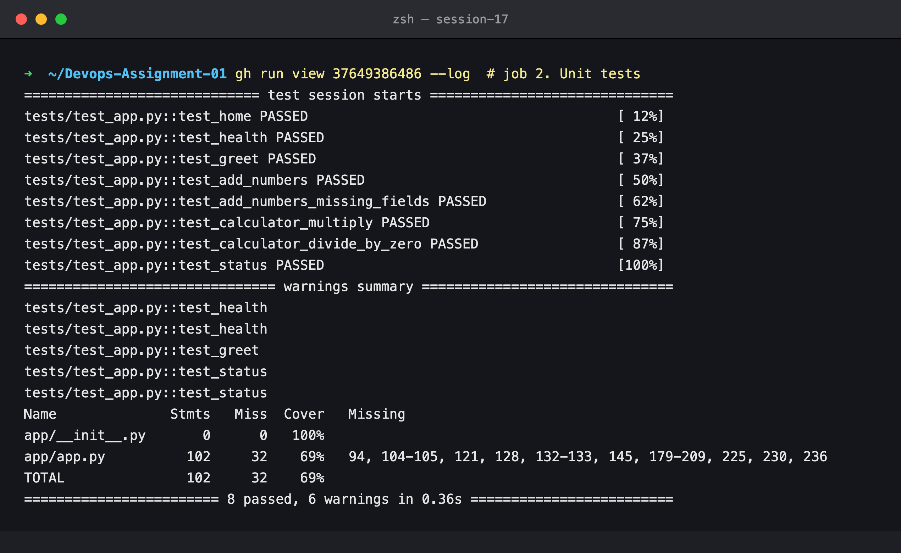

### 3. SAST — Bandit

Bandit reads the Python source and flags dangerous patterns: `eval`, shell injection,
`debug=True`, weak crypto, hardcoded bind-all and so on. Config: [`security/bandit.yaml`](../devsecops-app/security/bandit.yaml)
skips B311 (`random` is only used to pick a greeting), with the reason written next to it. The gate
step fails on HIGH severity. After the B201 fix from lab 2 there are no findings at any severity.

```bash
bandit -c security/bandit.yaml -r app --severity-level high
```

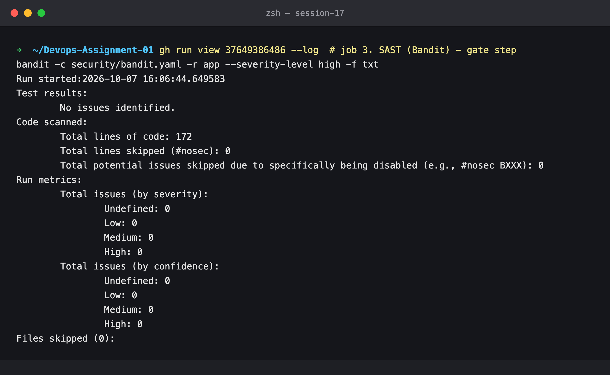

### 4. SCA — pip-audit + Trivy fs

**Software Composition Analysis** checks the code you *didn't* write. pip-audit resolves
`requirements.txt`, including transitive dependencies, and looks every version up in the PyPA/OSV
advisory database. Trivy `fs` checks the same manifests against its own database.

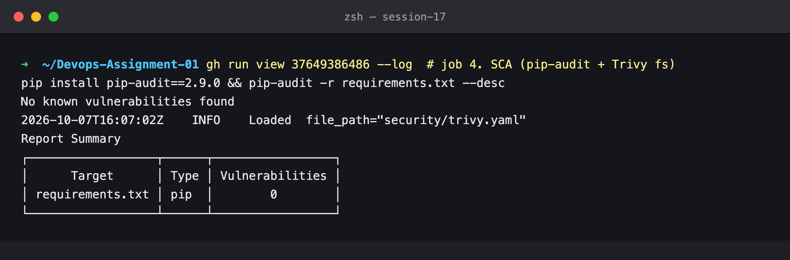

### 5. Secret scanning — Gitleaks

Gitleaks runs with `fetch-depth: 0` and walks every commit that ever touched `16_DevSecOps/devsecops-app`,
not just the current files. A key deleted in a later commit is still in history and can still be
used. Output is `--redact`ed, so a real hit would never print the secret into a public log.

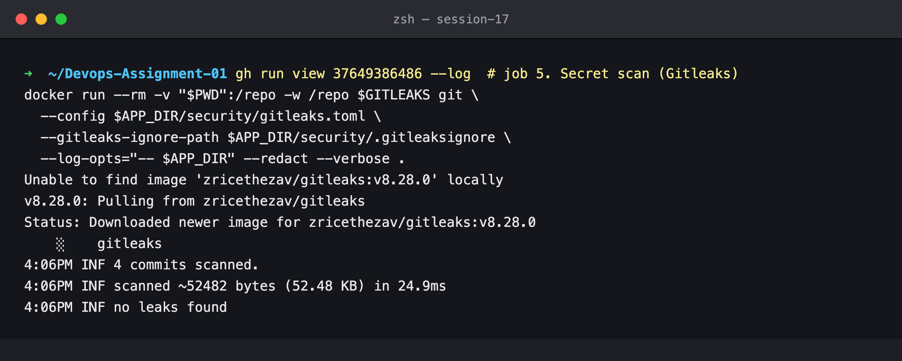

### 6. Docker build → 7. Image scan

The image is built as `s17-devsecops-app:<sha>` and saved to `image.tar`. Trivy scans that tarball
(`--input`) for OS packages (Debian 13.7, 87 packages) and Python packages. Zero findings remain
once the policy only counts HIGH/CRITICAL with an available fix.

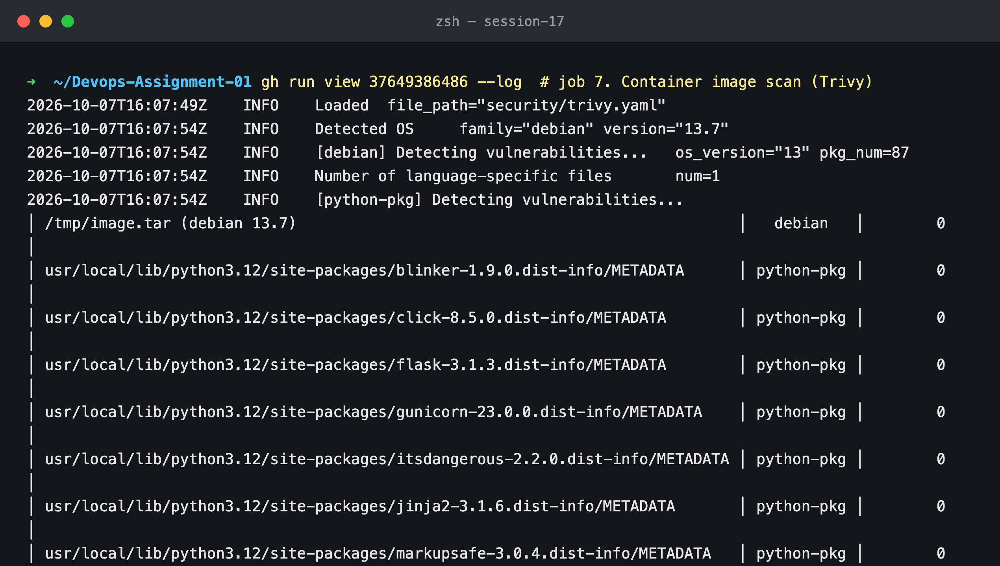

### 8. Security gate

```bash
gh run view 37649386486 --log | grep '^8. Security gate'
```

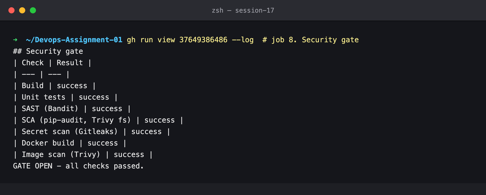

### 9. Push to GHCR

The scanned tarball is loaded, tagged `:latest` as well, and pushed. Both tags share one digest.

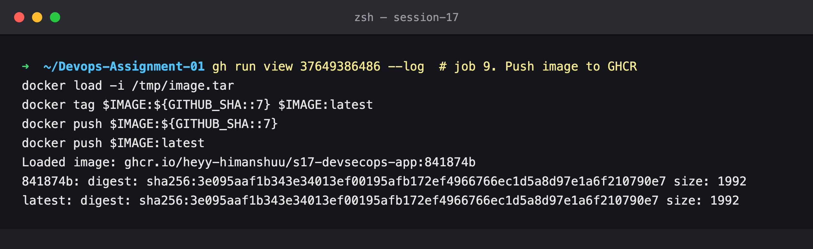

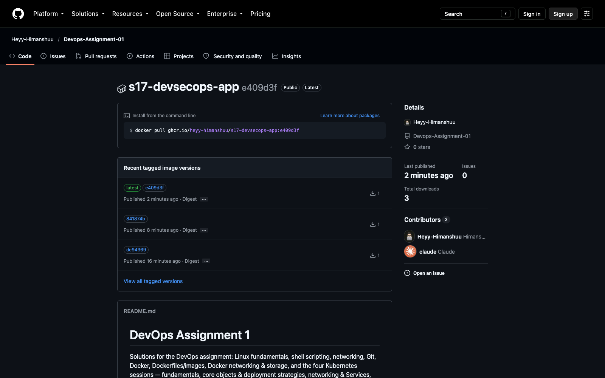

### 10. Deploy to Kubernetes

The job does the following:

1. creates a kind cluster on the runner
2. creates the `ghcr-pull` secret from `GITHUB_TOKEN`
3. pins the Deployment to the pushed SHA
4. waits for 2/2 Pods to pass their readiness probe
5. curls `/health`, `/api/status` and a `POST /api/calculate` through the Service

The image line `ghcr.io/heyy-himanshuu/s17-devsecops-app:841874b` ties the running Pods back to the
commit and to the digest that was scanned.

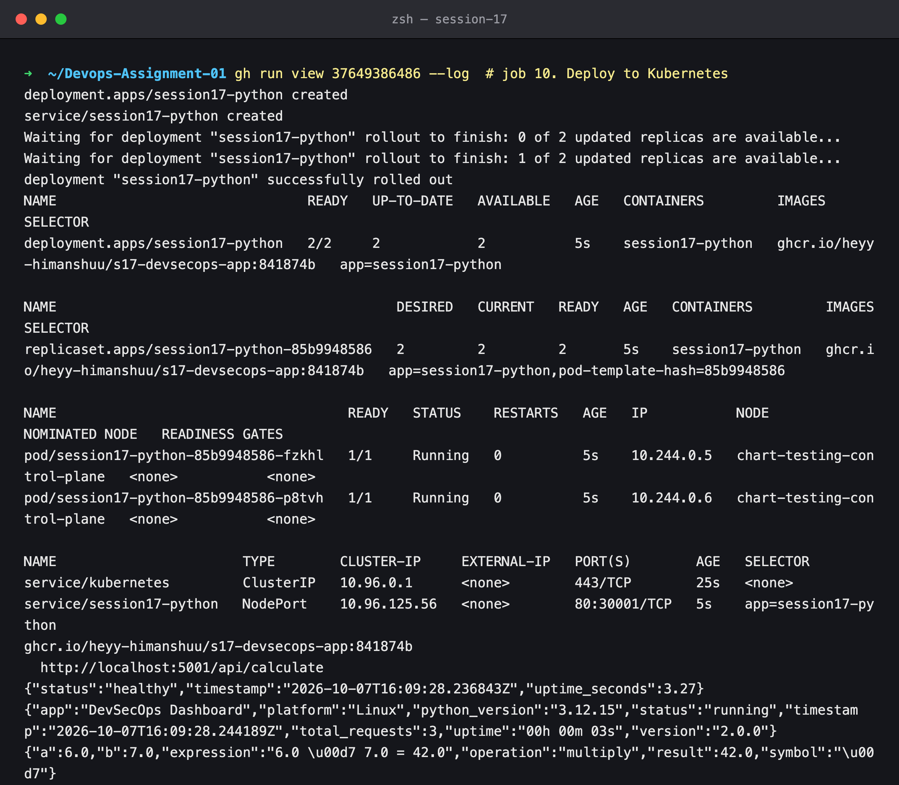
