# Session 17 — Security Gates in Action — Four Blocked Runs, Four Fixes

## Name

Himanshu Rathi

## Roll No

`24BCS10365`

---

A gate you have never seen close is just a log line. This is the complete history of the pipeline,
with nothing removed. It was blocked four times, three of them by problems I didn't plant:

| # | Run | Commit | Stopped at | Cause | Fix |
| --- | --- | --- | --- | --- | --- |
| 1 | [#37647476334](https://github.com/Heyy-Himanshuu/Devops-Assignment-01/actions/runs/37647476334) | `96efe0d` | ❌ **3. SAST** | Course code runs Flask with `debug=True` (Bandit B201, HIGH) | gunicorn; debug opt-in |
| 2 | [#37647693380](https://github.com/Heyy-Himanshuu/Devops-Assignment-01/actions/runs/37647693380) | `97611e8` | ❌ **7. Image scan** | `ignore-unfixed` in the wrong place in `trivy.yaml`, so 44 unfixable CVEs failed the gate | nest it under `vulnerability:` |
| 3 | [#37648279300](https://github.com/Heyy-Himanshuu/Devops-Assignment-01/actions/runs/37648279300) | `de94369` | ❌ **10. Deploy** | `runAsNonRoot` can't verify `USER nobody` | `USER 65534:65534` |
| 4 | [#37649386486](https://github.com/Heyy-Himanshuu/Devops-Assignment-01/actions/runs/37649386486) | `841874b` | ✅ all 10 jobs | — | — |
| 5 | [#37649904251](https://github.com/Heyy-Himanshuu/Devops-Assignment-01/actions/runs/37649904251) | `da56969` | ❌ **4. SCA + 5. Secret scan** | *deliberate:* `requests==2.19.1` + a hardcoded API key | remove the dependency; key from env; triage the fingerprint |
| 6 | [#37650186661](https://github.com/Heyy-Himanshuu/Devops-Assignment-01/actions/runs/37650186661) | `e409d3f` | ✅ all 10 jobs | — | — |

```bash
gh run list -w 'S17 DevSecOps pipeline' --json databaseId,conclusion,displayTitle
```

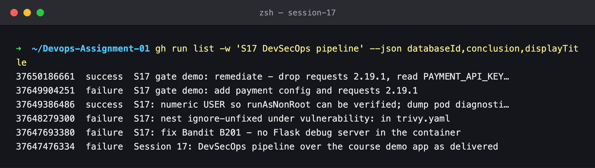

---

## Key takeaways

- **The course demo ships a remote-code-execution hole.** `app.run(debug=True)` inside a container started with `python app/app.py` serves the Werkzeug debugger: anyone who triggers an error gets a Python console. SAST caught it on the very first run. That's the strongest case for running SAST on code you were *handed*.
- **Check that your security config is actually applied.** Trivy logged `Loaded file_path="security/trivy.yaml"` and then silently ignored a top-level `ignore-unfixed:`. Nothing warned me. Only comparing the exit code with and without the CLI flag proved it.
- **Hardening has to be verifiable.** `runAsNonRoot: true` makes the kubelet check that the container's user is not root, and it can only check a *numeric* UID. A named user like `nobody` gets `CreateContainerConfigError`, even though `nobody` isn't root.
- **One bad change can trip several gates in one run.** The scanners run in parallel, so the vulnerable dependency (SCA) and the leaked key (Gitleaks) were both reported, and Docker build, image scan, push and deploy were all skipped.
- **Deleting a leaked secret doesn't un-leak it.** After removal the key is still in git history, and a history-wide scan keeps failing until the finding is triaged: revoke or rotate it, move it to a secret store, then record its fingerprint (or rewrite history).

---

## Run 1 — SAST blocks the course code (Bandit B201)

The first push contained the demo app exactly as the course provides it. Build and tests passed, then:

```bash
gh run view 37647476334 --json jobs --jq '.jobs[] | [.conclusion, .name] | @tsv'
```

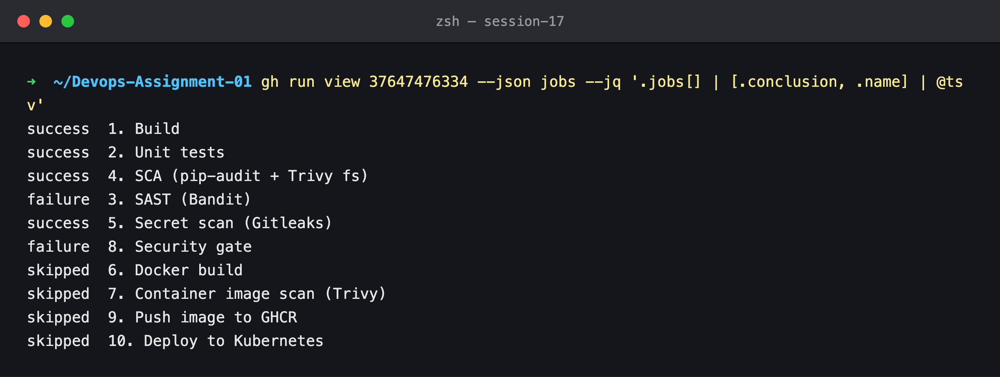

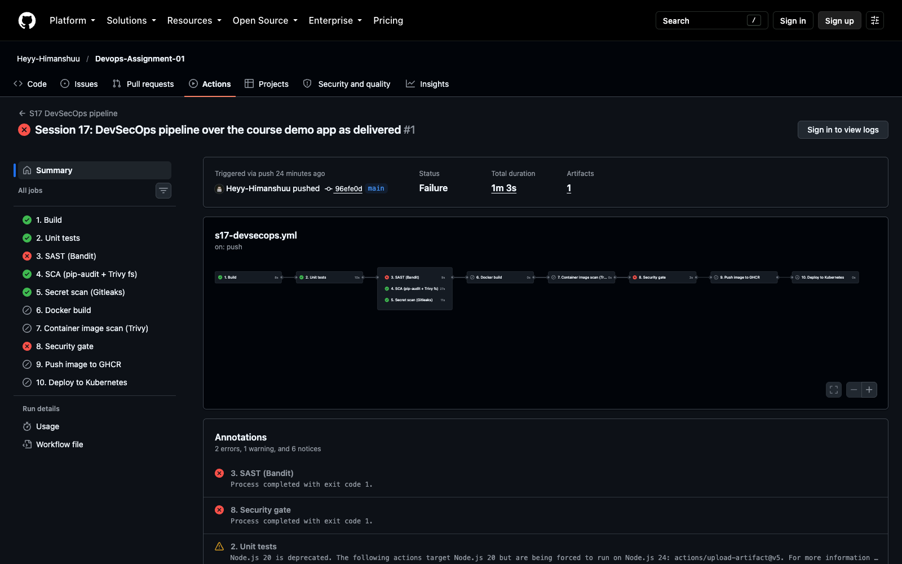

The SCA and secret scans passed. SAST failed, so `6. Docker build` and everything after it was
skipped, and the gate closed. The finding:

```bash
gh run view 37647476334 --log  # job 3. SAST (Bandit) - gate step
```

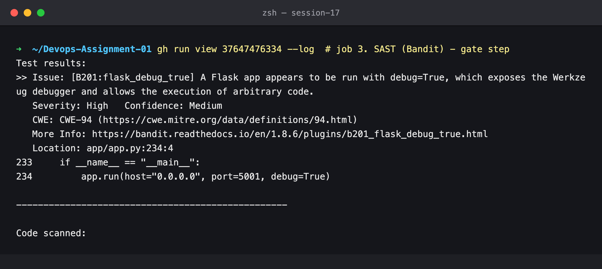

**Why it matters.** This line is only meant for local development, but the course Dockerfile's
`CMD ["python", "app/app.py"]` runs exactly this code path in the container. The deployed Pod would
expose the Werkzeug interactive debugger on port 5001.

**Fix** (`97611e8`):

```python
    app.run(
        host=os.environ.get("HOST", "127.0.0.1"),
        port=int(os.environ.get("PORT", "5001")),
        debug=os.environ.get("FLASK_DEBUG") == "1",
    )
```

```dockerfile
USER nobody
CMD ["gunicorn", "--bind", "0.0.0.0:5001", "--workers", "2", "app.app:app"]
```

SAST passed after that, and so did every other check, up to the image scan.

---

## Run 2 — The image scan fails on 44 CVEs nobody can fix yet

```bash
gh run view 37647693380 --json jobs --jq '.jobs[] | [.conclusion, .name] | @tsv'
```

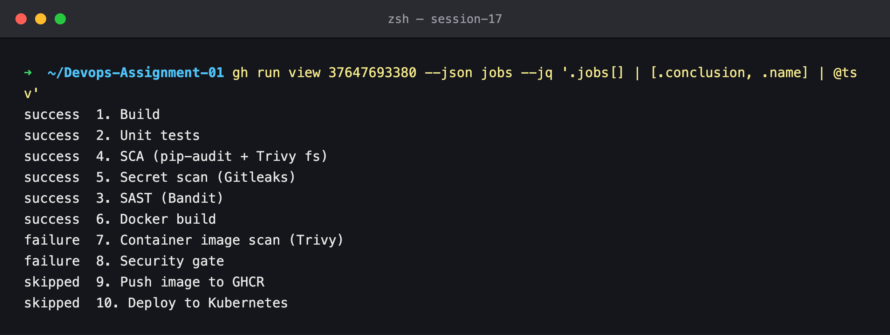

Trivy reported 44 HIGH vulnerabilities in the Debian base image (`util-linux`, `ncurses`, `perl`
and others). Every one has the status `affected` or `fix_deferred`: Debian has no patched package
yet.

```bash
gh run view 37647693380 --log  # job 7 - Trivy image scan
```

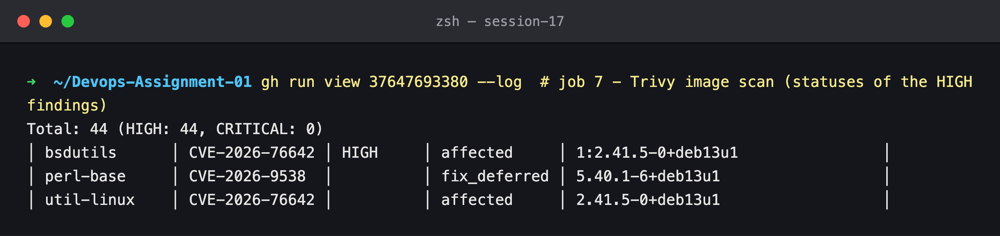

**Root cause.** My policy was "HIGH/CRITICAL *that has a fix*", and I had written `ignore-unfixed: true`
at the top level of `trivy.yaml`. Trivy loaded the file (the log says so), but that key is only read
under `vulnerability:`. Proof, run locally against the same image:

```bash
trivy image --severity HIGH,CRITICAL -f json s17:fixed | jq '<count by fix status>'
trivy image --config old-trivy.yaml s17:fixed        # ignore-unfixed at top level
trivy image --config security/trivy.yaml s17:fixed   # vulnerability.ignore-unfixed
```

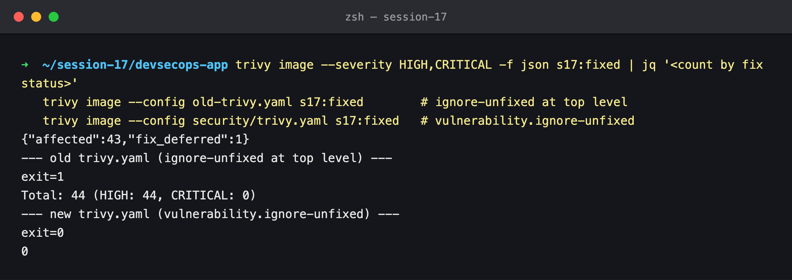

All 44 findings are unfixed (`affected: 43`, `fix_deferred: 1`). The old config fails the scan
(exit 1), and the corrected one passes (exit 0). **Fix** (`de94369`):

```yaml
vulnerability:
  # Must be nested here: a top-level `ignore-unfixed:` key is silently ignored
  ignore-unfixed: true
```

> Not failing on unfixable CVEs is a deliberate policy, not a way of hiding them. A gate that fails
> on things nobody can act on gets disabled within a week. The findings are still in the report, and
> they'll fail the gate as soon as Debian ships a fix and the base image hasn't been rebuilt.

---

## Run 3 — Every gate passed, then the deploy timed out

Security gate open, image pushed, and then `10. Deploy` waited 180 s for Pods that never became ready:

```bash
gh run view 37648279300 --json jobs ...; gh run view 37648279300 --log-failed | grep -E 'Waiting|error'
```

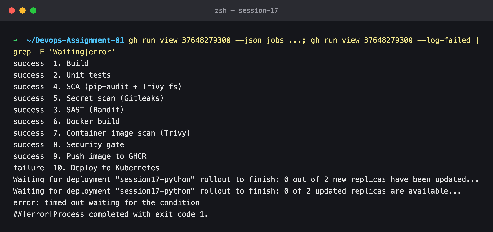

The CI log only says "timed out", so I reproduced it on my local kind cluster with the same image
and manifest:

```bash
kubectl -n s17-debug get pods
kubectl -n s17-debug get events --field-selector type=Warning
```

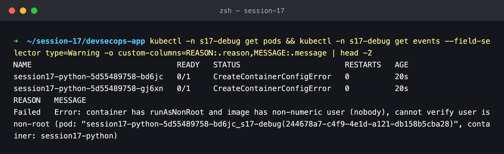

**Root cause.** The Deployment sets `securityContext.runAsNonRoot: true`. The kubelet enforces it by
reading the image's `USER`. `nobody` is a *name*, and resolving it would mean trusting the image's
own `/etc/passwd`, so the kubelet refuses: *"image has non-numeric user (nobody), cannot verify user
is non-root"*.

**Fix** (`841874b`): use the numeric UID/GID of `nobody` in the Dockerfile. Verified locally before pushing:

```bash
kubectl -n s17-debug rollout status deploy/session17-python
kubectl -n s17-debug exec deploy/session17-python -- id
```

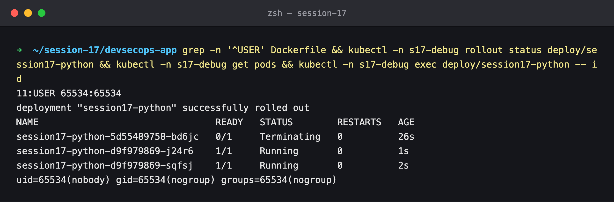

I also added a `Diagnostics if the rollout failed` step (`if: failure()`). It runs `kubectl describe`
and prints the events, so the next failure of this kind explains itself in the CI log.

Run 4 ([#37649386486](https://github.com/Heyy-Himanshuu/Devops-Assignment-01/actions/runs/37649386486))
was then green end to end. It is documented stage by stage in [lab 1](../01-pipeline/submission.md).

---

## Run 5 — A bad change, blocked on two fronts

This is a deliberate test of the gates, shaped like a typical bad pull request: a "payment config"
module with the API key pasted in, and a new dependency pinned to an old version.

```python
# app/config.py  (the key is fabricated - it was never a valid credential)
PAYMENT_API_KEY = "pk_8Gx2Qm7Vt4Rz9Lw3Nb6Hc1Ys5Dk0Fj"
```

```text
# requirements.txt
requests==2.19.1
```

```bash
gh run view 37649904251 --json jobs --jq '.jobs[] | [.conclusion, .name] | @tsv'
```

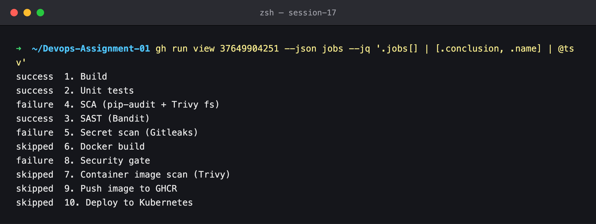

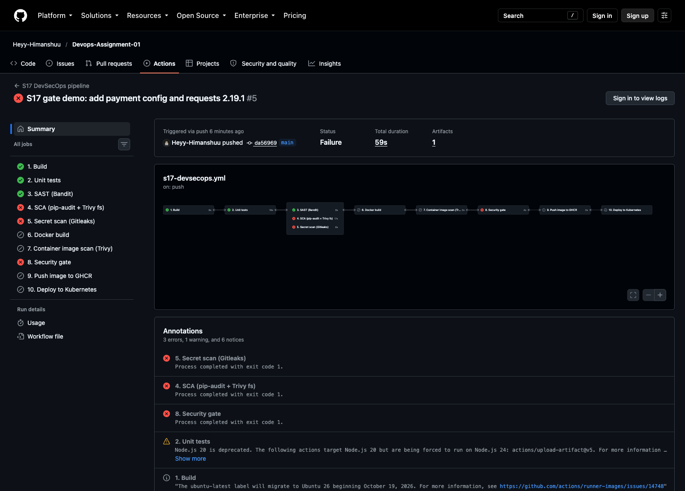

**SCA:** pip-audit found 19 known vulnerabilities, not only in `requests 2.19.1` but in the old
`idna` and `urllib3` it pulls in. That is the point of SCA: one bad pin brought in two more
vulnerable packages.

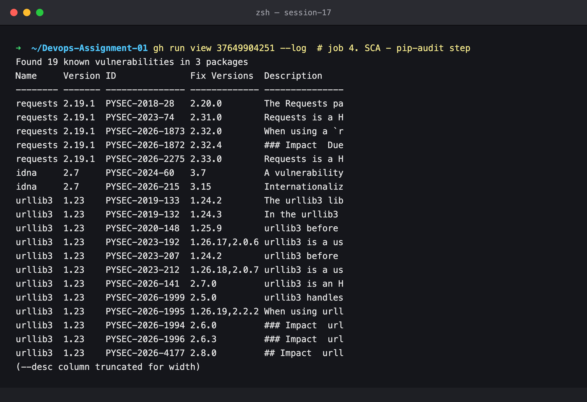

**Secret scan:** Gitleaks' `generic-api-key` rule matched the assignment (the variable name contains
`api_key` and the value has entropy 4.98), with the value redacted in the log:

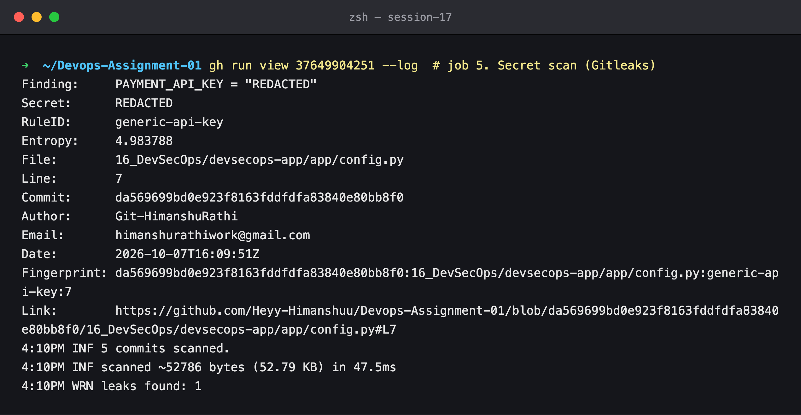

**Gate:** two failures, Docker build and image scan skipped, gate closed, nothing pushed or deployed:

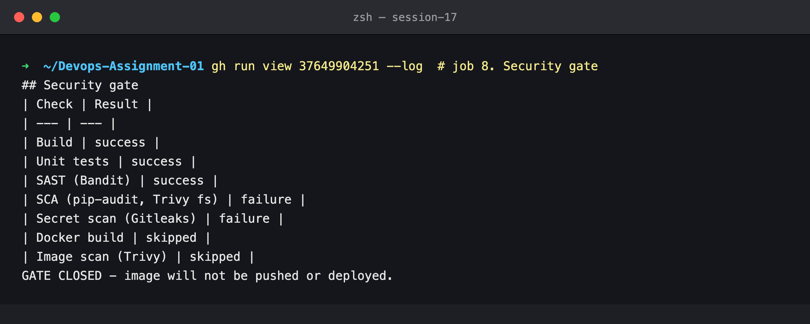

### Remediation (`e409d3f`)

1. **Dependency:** the app doesn't need `requests`, so it was removed. If it were needed, the fix would be pinning `>= 2.33.0`, the highest "Fix Versions" value pip-audit listed.
2. **Secret, in the right order:**
   1. *Revoke/rotate* the key at the provider. Anyone who cloned the repo or read the commit already has it. (Here the key was fabricated, so there was nothing to revoke.)
   2. *Move it out of the code:* `PAYMENT_API_KEY = os.environ.get("PAYMENT_API_KEY", "")`. In Kubernetes it would come from a `Secret` via `envFrom`.
   3. *Triage the history.* The value is still in commit `da56969`, and the full-history scan would fail forever. Its reviewed fingerprint goes into [`security/.gitleaksignore`](../devsecops-app/security/.gitleaksignore), with a comment saying why. (The alternative, rewriting public history with `git filter-repo`, breaks every clone and doesn't help once the key is revoked.)

```text
da569699bd0e923f8163fddfdfa83840e80bb8f0:16_DevSecOps/devsecops-app/app/config.py:generic-api-key:7
```

## Run 6 — Green again

Gitleaks scanned 6 commits and found nothing new (the triaged fingerprint is skipped), pip-audit is
clean again, the gate opened, and `e409d3f` was pushed and deployed:

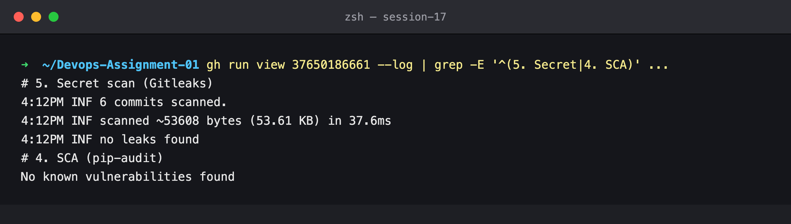

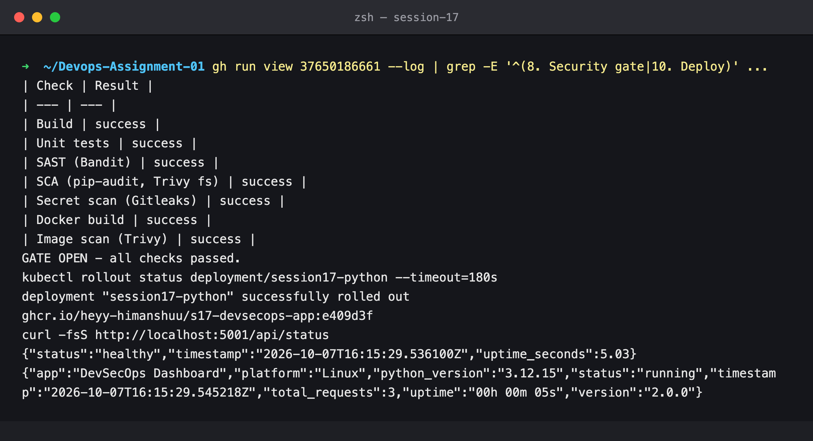
