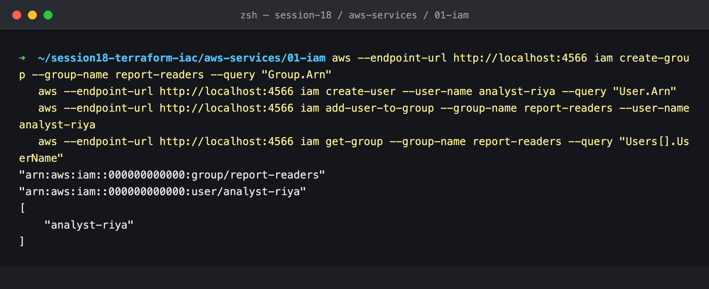
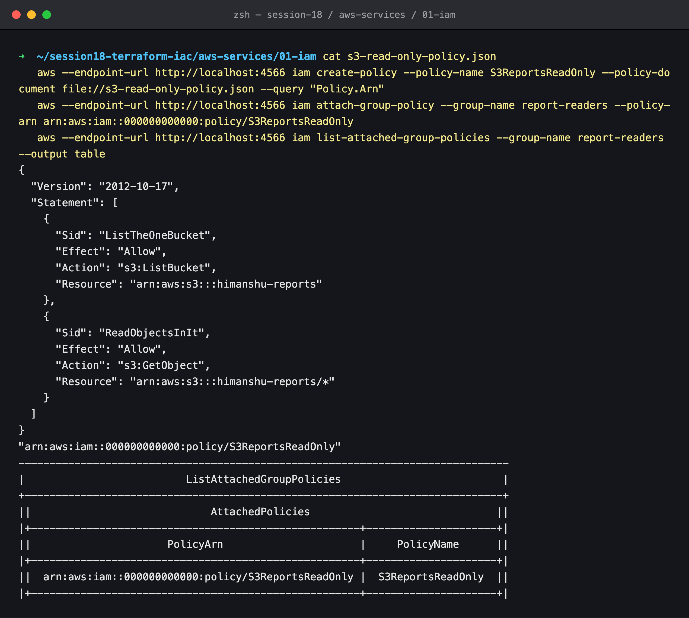
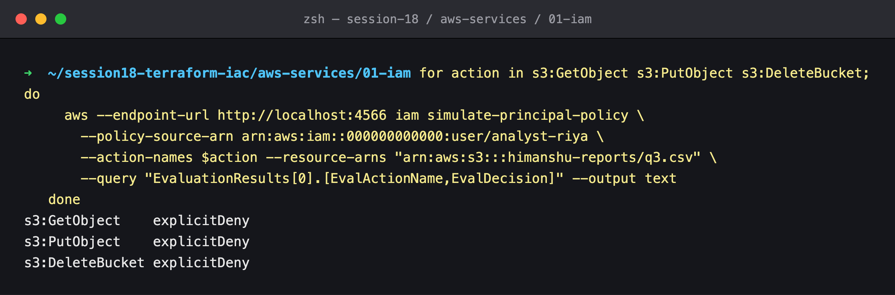
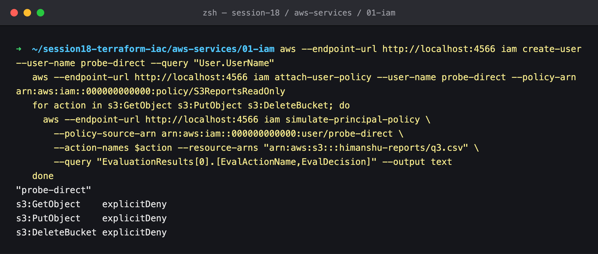
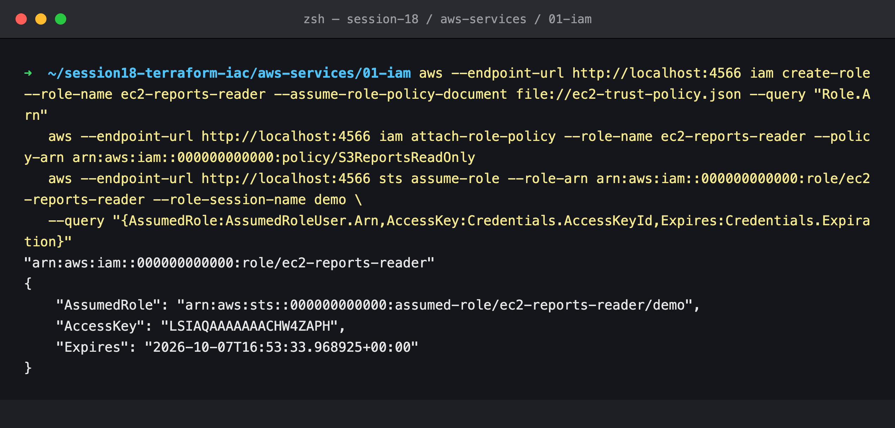
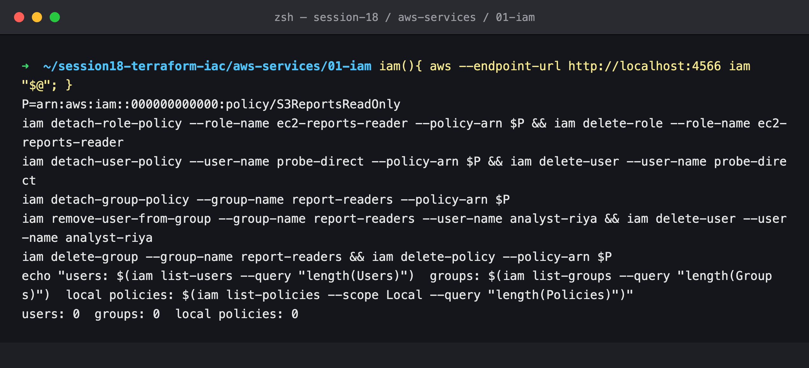

# 01: IAM (Governance)

## Name

Himanshu Rathi

## Roll No

`24BCS10365`

---

## What is IAM?

**AWS Identity and Access Management** decides *who* can do *what* on *which* resource, under *which* conditions. Every AWS API call, whether from the console, the CLI, Terraform or an SDK, is signed by some identity, and IAM evaluates that request before AWS acts on it.

IAM is **global**: users, roles and policies are not tied to a region. It costs nothing.

```
Principal (user / role / service) ──signs──▶ API request ──▶ IAM policy evaluation ──▶ Allow / Deny
```

## Users

An **IAM user** is a long-lived identity for one person or application. A user can have:

- a **console password**, optionally with MFA
- up to two **access keys** (`AKIA…` + secret) for the CLI and SDKs

Access keys never expire on their own, which makes them the most-leaked AWS credential. Modern practice is to give people federated/SSO access (IAM Identity Center) and give workloads roles. Plain IAM users are kept for the few cases that really need them.

The **root user** (the account's email login) bypasses IAM entirely. Lock it with MFA and never use it day to day.

## Groups

A **group** is a set of users that share permissions. Attach policies to the group and every member inherits them. Groups cannot be nested and cannot be a principal in a policy. They are only a way to manage permissions in bulk.

`developers`, `readonly-auditors`, `billing`: when someone joins or leaves, you change their group membership instead of editing policies.

## Roles

A **role** is an identity with permissions but **no long-term credentials**. Something *assumes* it, and STS issues temporary credentials (an access key, secret and session token) that expire, by default after 1 hour.

A role has two policies:

| Policy | Question it answers |
| --- | --- |
| **Trust policy** | *Who* may assume this role? e.g. `ec2.amazonaws.com`, another account, a GitHub OIDC identity |
| **Permissions policy** | *What* may the role do once assumed? |

Roles are how EC2 instances, Lambda functions, EKS pods (IRSA/Pod Identity), CI pipelines (OIDC) and other AWS accounts get access without a stored secret.

## Policies

A **policy** is a JSON document of statements:

```json
{
  "Version": "2012-10-17",
  "Statement": [{
    "Sid": "ReadObjectsInIt",
    "Effect": "Allow",
    "Action": "s3:GetObject",
    "Resource": "arn:aws:s3:::himanshu-reports/*",
    "Condition": { "Bool": { "aws:SecureTransport": "true" } }
  }]
}
```

| Element | Meaning |
| --- | --- |
| `Effect` | `Allow` or `Deny` |
| `Action` | API operations, `service:Operation`, wildcards allowed |
| `Resource` | ARNs the statement applies to |
| `Condition` | Optional extra checks: source IP, MFA present, tags, TLS, time… |
| `Principal` | Only in *resource-based* policies (bucket policies, trust policies): who the statement is about |

Types of policy:

- **AWS-managed**, e.g. `ReadOnlyAccess`. Convenient, but usually broader than you need.
- **Customer-managed**: your own reusable, versioned policies.
- **Inline**: embedded in one user, group or role and deleted with it.
- **Resource-based**: attached to the resource, e.g. an S3 bucket policy or KMS key policy.
- **Permission boundaries** and **SCPs** (Organizations) set a *ceiling* on what identity policies can grant.

## Permissions: how a request is evaluated

1. Everything starts as an **implicit deny**.
2. If any applicable policy has an explicit **Deny** → **denied**. An explicit deny always wins.
3. Otherwise, if some policy **Allows** it, and no SCP, permission boundary or session policy blocks it → **allowed**.
4. Otherwise → denied, by the implicit deny.

So permissions only add up, and a single explicit deny overrides any number of allows.

## Least privilege

Grant only the actions and resources a job needs, and nothing more:

- Use specific actions (`s3:GetObject`) rather than `s3:*`.
- Use specific resource ARNs (`arn:aws:s3:::himanshu-reports/*`) rather than `*`.
- Add conditions: require MFA, restrict source VPC or IP, require TLS.
- Start narrow and widen only when a real `AccessDenied` shows it's needed. IAM Access Analyzer can generate a policy from CloudTrail activity.
- Review regularly. *Last accessed* data shows permissions nobody uses.

## IAM best practices

1. Lock the root user: turn on MFA, create no access keys and don't use it day to day.
2. Use federation/SSO for humans and roles for workloads. Avoid long-lived access keys.
3. Require MFA, especially for privileged actions.
4. Manage permissions through groups or roles, not per-user policies.
5. Prefer customer-managed policies with least privilege over broad AWS-managed ones.
6. Rotate any access keys that must exist, and delete unused users and keys.
7. Use permission boundaries and SCPs as guardrails in multi-account setups.
8. Turn on CloudTrail so every IAM decision can be audited.
9. Never commit credentials to Git. Use OIDC for CI (e.g. GitHub Actions → `AssumeRoleWithWebIdentity`).

## Common use cases

- An EC2 instance reading one S3 bucket through an **instance profile** (role), with no keys on disk.
- **GitHub Actions deploying to AWS** with OIDC and a role, with no stored secret.
- **Cross-account access**: a role in the prod account that the CI account can assume.
- **Read-only auditors**: a group with `ReadOnlyAccess` or `SecurityAudit`.
- **Break-glass admin**: an MFA-protected role that is rarely assumed and audited.

---

## Hands-on (LocalStack)

> **The AWS API is emulated by LocalStack 4.9.2 (community)** on `localhost:4566`, the same setup as [`../../terraform-s3-demo`](../../terraform-s3-demo/README.md). IAM objects are created and returned exactly as AWS would. **However, the community edition does not enforce or evaluate IAM policies** (step 3 shows this).

Policy files: [`s3-read-only-policy.json`](./s3-read-only-policy.json) and [`ec2-trust-policy.json`](./ec2-trust-policy.json).

### 1. Group and user



### 2. Least-privilege customer-managed policy, attached to the group



The policy allows exactly two actions on exactly one bucket: `ListBucket` on the bucket and `GetObject` on its objects. Nothing else. It is attached to the **group**, so `analyst-riya` inherits it.

### 3. Policy simulation: the emulator's limit



On real AWS, `iam simulate-principal-policy` would return `s3:GetObject → allowed`, through the group policy, and `implicitDeny` for `PutObject` and `DeleteBucket`, since nothing allows them. LocalStack returns `explicitDeny` for **everything**.

To rule out group inheritance as the cause, I attached the policy straight to a fresh user. The result was still `explicitDeny`:



**Conclusion:** the community edition stores IAM objects but does not run the IAM policy evaluator. That is consistent with LocalStack's documented behaviour: IAM enforcement is a Pro feature (`ENFORCE_IAM=1`). Use the real IAM Policy Simulator for actual answers.

### 4. A role for EC2: trust policy, then assume it



The trust policy names `ec2.amazonaws.com` as the principal allowed to assume the role. `sts assume-role` returns an `assumed-role/ec2-reports-reader/demo` session with a **temporary** access key and an `Expiration` time. This is the mechanism an instance profile uses behind the scenes.

### 5. Cleanup



Policies must be **detached** before a user, group, role or policy can be deleted. IAM refuses to leave dangling attachments.
