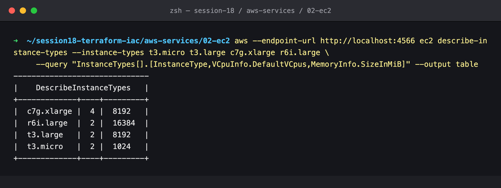
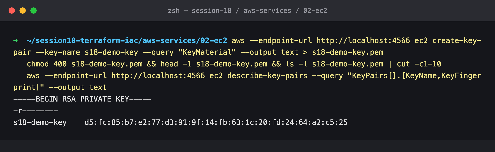
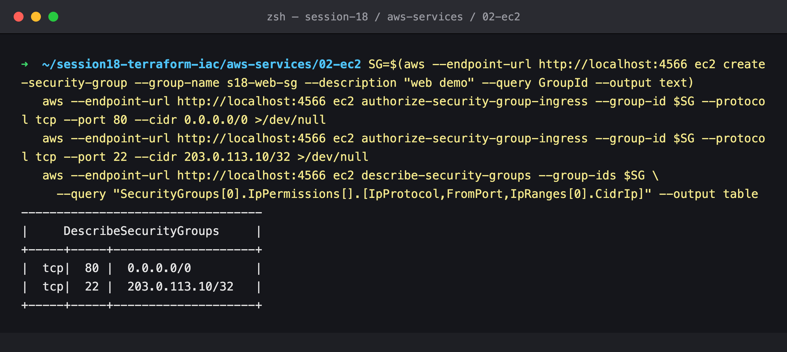
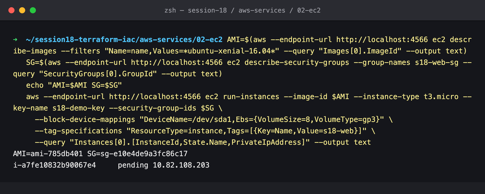
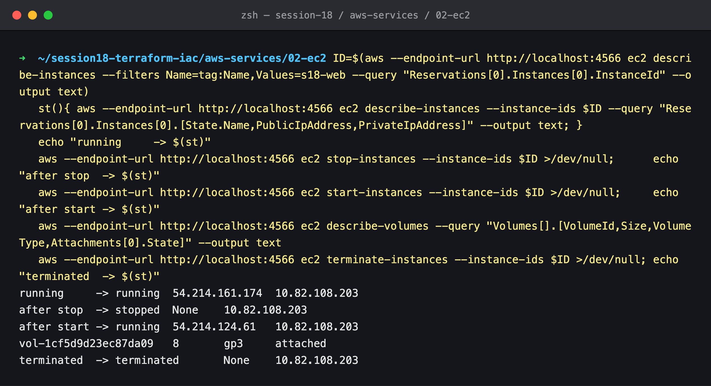
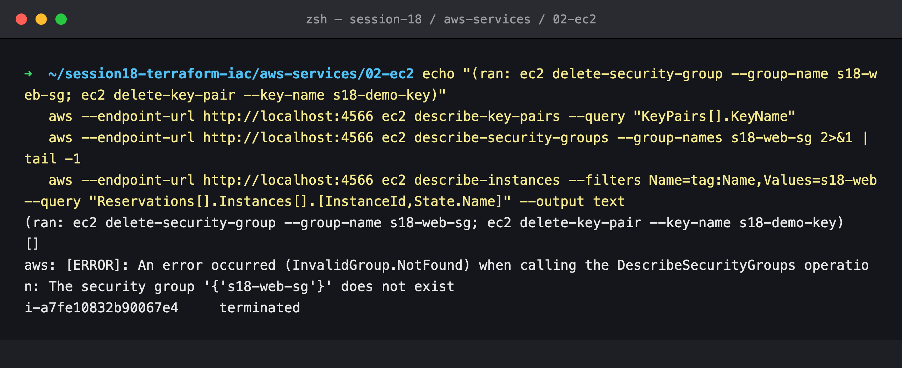

# 02: EC2 (Compute)

## Name

Himanshu Rathi

## Roll No

`24BCS10365`

---

## What is EC2?

**Elastic Compute Cloud** rents virtual machines, called *instances*, by the second. You pick an OS image, a size, a network and storage, and AWS runs the VM on its hardware in the Availability Zone you choose. It is the **IaaS** layer of AWS: you manage the OS and everything above it, and AWS manages the hardware, hypervisor and data centre.

## AMI (Amazon Machine Image)

An **AMI** is the template an instance boots from. It contains:

- a root-volume snapshot with the OS and any pre-installed software
- launch permissions (public, private, or shared with specific accounts)
- block-device mappings (which volumes to attach at launch)

AMIs are **regional**: an AMI ID such as `ami-0abc…` exists in one region only. Copy it to use it elsewhere. Sources include AWS (Amazon Linux, Windows), vendors (Canonical's Ubuntu, Red Hat), the Marketplace, and your own *golden images* baked with Packer.

In Terraform, look AMIs up with a `data "aws_ami"` filter instead of hard-coding IDs, because IDs differ per region and change with every patch release.

## Instance types

The name encodes the family, generation, options and size:

```
 c  7  g  .  xlarge
 │  │  │      └─ size: nano, micro, small, medium, large, xlarge, 2xlarge …
 │  │  └──────── options: g = Graviton (ARM), i = Intel, a = AMD, d = local NVMe, n = network-optimised
 │  └─────────── generation
 └────────────── family
```

| Family | Optimised for | Example use |
| --- | --- | --- |
| `t` (burstable) | Cheap baseline CPU plus credits to burst | Dev boxes, small web apps (`t3.micro` is free-tier) |
| `m` (general purpose) | Balanced CPU and memory | App servers, mid-size databases |
| `c` (compute) | High CPU-to-memory ratio | Batch, encoding, high-traffic APIs |
| `r` / `x` (memory) | High memory-to-CPU ratio | In-memory caches, large databases |
| `g` / `p` (accelerated) | GPUs | ML training and inference, rendering |
| `i` / `d` (storage) | Fast local NVMe | NoSQL, data warehousing |

Each size up roughly doubles vCPU, memory and price.

## Key pairs

EC2 uses **SSH key pairs** for Linux login. AWS keeps the **public** key and injects it into `~/.ssh/authorized_keys` at first boot. You download the **private** key once, at creation, and AWS never stores it. Lose it and you lose SSH access, though you can still recover through SSM Session Manager or by detaching the volume.

Better still, skip SSH keys and inbound port 22 entirely and connect with **SSM Session Manager**. It needs only an IAM role, and every session is logged.

## Security groups

A **security group** is a *stateful* virtual firewall attached to an instance's network interface:

- **Allow rules only.** Anything not allowed is denied.
- **Stateful**: if inbound traffic is allowed, the reply is automatically allowed out, and the other way round.
- Rules can reference **other security groups** instead of IPs. For example, "the DB SG allows 5432 from the app SG" keeps working as instances come and go.
- Changes apply immediately, without a reboot.
- Default: no inbound, all outbound.

Security groups act at the instance level. Network ACLs act at the subnet level and are covered in [04-vpc](../04-vpc/README.md).

## EBS (Elastic Block Store)

**EBS volumes** are network-attached block disks:

- They live in **one AZ** and attach to instances in that AZ.
- **Persistence** is independent of the instance. A volume survives stop/start. The root volume is deleted on termination by default (`DeleteOnTermination`), and data volumes are kept.
- **Snapshots** are incremental, stored in S3, and can be copied across regions. They are used for backups and to create AMIs.
- Volume types: **gp3** (general-purpose SSD, IOPS and throughput tuned separately from size; the default choice), **io2** (provisioned IOPS for databases), **st1/sc1** (throughput HDD for big sequential reads).
- Encryption with KMS is transparent and should be on by default.

**Instance store** is the opposite: local NVMe that is very fast and very temporary. It is wiped on stop or termination.

## Public vs private IP

| | Private IP | Public IP (auto-assigned) | Elastic IP |
| --- | --- | --- | --- |
| From | The subnet's CIDR | AWS's pool | Allocated to your account |
| Reachable from | Inside the VPC (or peered/VPN networks) | The internet (if the subnet routes to an IGW and the SG allows it) | The internet |
| On stop/start | **Kept** | **Released, and a new one is assigned on start** | **Kept** |
| Cost | Free | Charged per hour (since 2024) | Charged per hour |

The instance's OS only ever sees its private IP. The public IP is a 1:1 NAT performed by the Internet Gateway. Step 5 below shows the public IP changing across a stop/start while the private IP stays the same.

## Instance lifecycle

```
            launch
              │
              ▼
          pending ──────▶ running ◀─────────── start
                            │  │                  │
                     reboot │  │ stop             │
                (same host, │  ▼                  │
                 same IPs)  │ stopping ──▶ stopped ┘   (EBS root kept; billing for compute stops;
                            │                            new public IP on start)
                            │ terminate
                            ▼
                      shutting-down ──▶ terminated     (gone; root EBS deleted by default)
```

- **Stop** is only possible with an EBS root volume. You pay for storage, not compute, while stopped.
- **Hibernate** saves RAM to EBS for a fast resume.
- **Terminate** is permanent. Turn on *termination protection* for important instances.

## Common use cases

- Web and application servers, often in an Auto Scaling group behind a load balancer.
- Self-managed databases or software that needs OS-level control.
- Batch and HPC jobs on Spot instances, at up to ~90% discount, interruptible.
- CI build runners and bastion/jump hosts.
- Kubernetes worker nodes (EKS managed node groups are EC2 underneath).
- GPU instances for ML training and inference.

---

## Hands-on (LocalStack)

> **The AWS API is emulated by LocalStack 4.9.2 (community)** on `localhost:4566`. EC2 calls return realistic IDs, IPs and states, but **no virtual machine is started**. The "instance" is a record in the emulator's database. Everything below shows the API behaviour, not a bootable VM.

### 1. Compare instance types



vCPU and memory for four families. Note that `r6i.large` has the same 2 vCPU as `t3.large` but twice the RAM.

### 2. Create a key pair



The private key is returned **once** and saved as a `chmod 400` `.pem` file. AWS keeps only the fingerprint and public key. The demo key was deleted afterwards and is not committed.

### 3. Security group: HTTP from anywhere, SSH from one IP



Port 80 is open to `0.0.0.0/0`. Port 22 is open only to a single `/32`, using a documentation-range IP standing in for "my IP".

### 4. Launch an instance



The AMI is found with a `describe-images` name filter, not hard-coded. The instance gets an 8 GiB **gp3** root volume and starts in the `pending` state.

### 5. Lifecycle: running → stopped → running → terminated



Each line prints the state, public IP and private IP:

- **running**: public `54.214.161.174`, private `10.82.108.203`
- **stopped**: the public IP is **gone** (`None`). The private IP is kept.
- **started again**: a **different** public IP, `54.214.124.61`, with the same private IP. This is why anything long-lived needs an Elastic IP or, better, a load balancer or DNS name.
- The 8 GiB gp3 EBS volume stays `attached` throughout.
- **terminated**: final state.

### 6. Cleanup



The security group and key pair were deleted (`ec2 delete-security-group --group-name s18-web-sg` and `ec2 delete-key-pair --key-name s18-demo-key`). The checks confirm no key pairs remain, the SG no longer exists (`InvalidGroup.NotFound`) and the instance is `terminated`.
