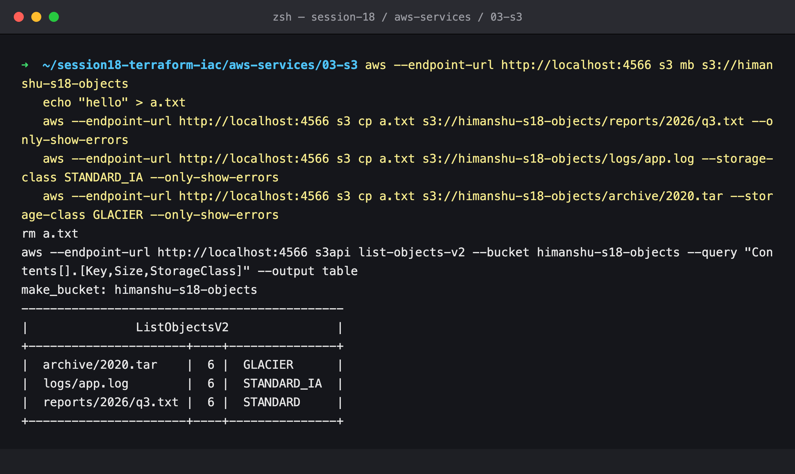
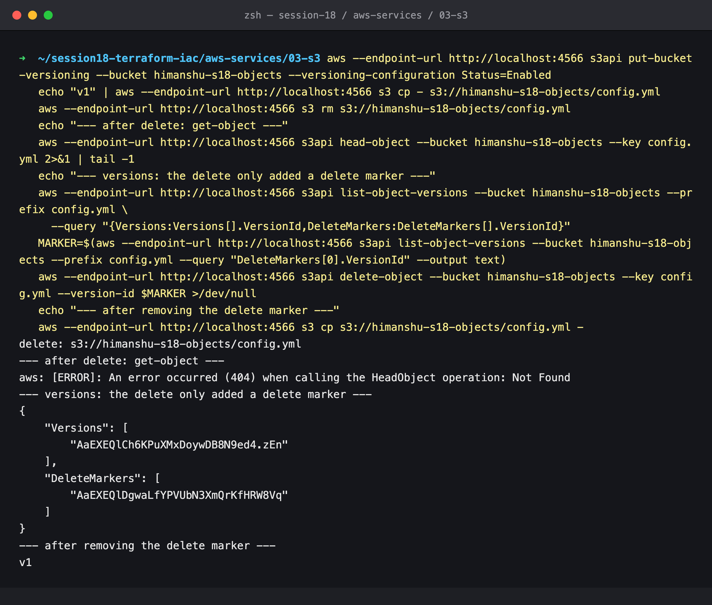
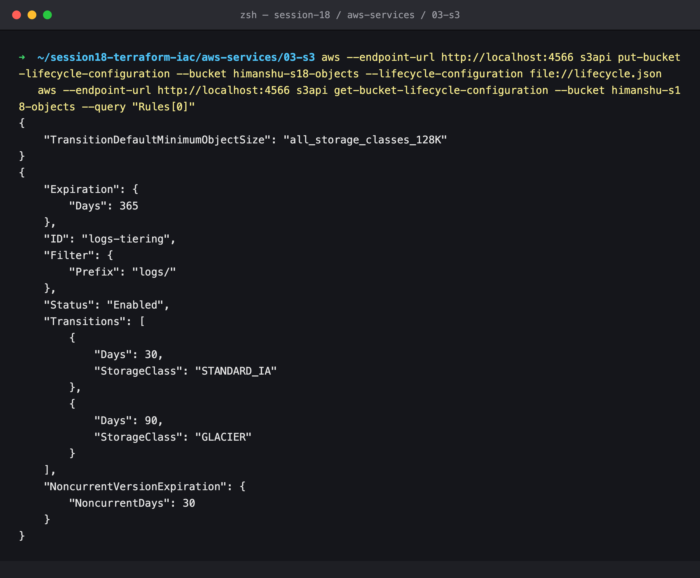
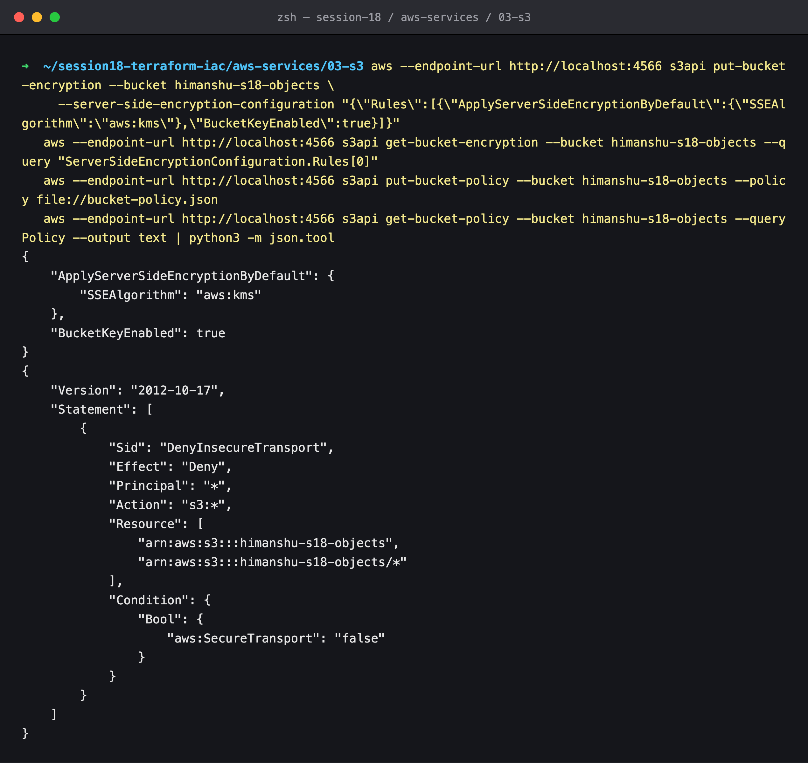
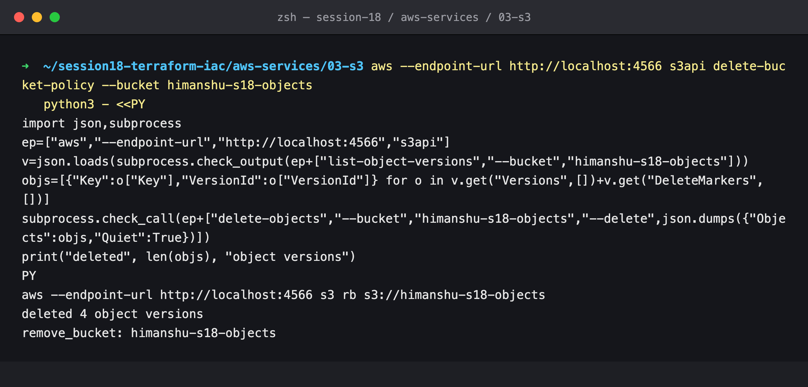

# 03: S3 (Storage)

## Name

Himanshu Rathi

## Roll No

`24BCS10365`

---

## What is S3?

**Simple Storage Service** is AWS's object store: an effectively unlimited place to put files, called *objects*, over HTTPS. It is designed for **11 nines (99.999999999%) of durability**, because data is copied across at least three Availability Zones. Since December 2020 it is **strongly consistent**: once a write succeeds, every read sees it.

S3 is *object* storage, not a file system or a block disk. You `PUT` and `GET` whole objects by key. There are no partial in-place edits, no real directories and no locks.

## Buckets

A **bucket** is the top-level container:

- Its name is **globally unique** across every AWS account: 3–63 characters, lowercase letters, digits, dots and hyphens.
- It is created in **one region**, and the data stays there unless you replicate it.
- Settings such as versioning, encryption, lifecycle, policy, logging and public-access block are configured per bucket.
- By default an account can have up to 10,000 buckets, and a bucket can hold unlimited objects.

ARN: `arn:aws:s3:::bucket-name`. There is no region or account in it, because names are global.

## Objects

An **object** is made of:

| Part | Detail |
| --- | --- |
| **Key** | Its full name, e.g. `reports/2026/q3.txt`. The `/` is only a character. "Folders" in the console are key *prefixes*. |
| **Value** | The bytes: 0 B up to 5 TB. Use multipart upload above ~100 MB, as the CLI does automatically. |
| **Metadata** | System metadata (`Content-Type`, `ETag`, size, last modified) plus your own `x-amz-meta-*` |
| **Version ID** | When versioning is on |
| **Tags** | Up to 10 key/value pairs, usable in lifecycle rules and IAM conditions |

## Storage classes

Pick per object, trading storage price against retrieval cost and speed:

| Class | Use for | Notes |
| --- | --- | --- |
| **S3 Standard** | Frequently accessed data | Default; ≥3 AZs, millisecond access |
| **S3 Intelligent-Tiering** | Unknown or changing access patterns | Moves objects between tiers automatically for a small monitoring fee |
| **S3 Standard-IA** | Infrequent access, needs fast retrieval | Cheaper storage, per-GB retrieval fee, 30-day minimum |
| **S3 One Zone-IA** | Re-creatable infrequent data | Single AZ: lost if that AZ is lost |
| **S3 Glacier Instant Retrieval** | Archive read about once a quarter | Millisecond access, 90-day minimum |
| **S3 Glacier Flexible Retrieval** | Archives | Minutes to hours to restore |
| **S3 Glacier Deep Archive** | Compliance archives kept for 7–10 years | Cheapest; ~12 hours to restore, 180-day minimum |
| **S3 Express One Zone** | Ultra-low-latency hot data | Single-AZ "directory buckets" |

## Versioning

When enabled, S3 keeps **every version** of every object:

- Overwriting a key adds a new version. The old one becomes *noncurrent* but is kept.
- **Deleting** a key without a version ID adds a **delete marker**. The data is still there, and removing the marker brings it back. Step 2 shows this.
- Permanent deletion needs the specific version ID.
- Once enabled, versioning can only be *suspended*, not turned off.
- Pair it with lifecycle rules to expire old versions, otherwise storage grows forever. Pair it with **MFA Delete** or **Object Lock** (WORM) for ransomware and compliance protection.

## Lifecycle policies

Rules that act on objects automatically as they age, filtered by prefix or tag:

- **Transitions**: e.g. Standard → Standard-IA after 30 days → Glacier after 90.
- **Expiration**: delete current versions after N days, and noncurrent versions N days after they became noncurrent.
- **Clean-up**: abort incomplete multipart uploads and remove expired delete markers.

Typical use: logs that are hot for a week, read rarely for a quarter and kept a year for audit.

## Encryption

| Where | Option | Key managed by |
| --- | --- | --- |
| At rest, server-side | **SSE-S3** (AES-256) | S3. The default for all new objects since January 2023 |
| | **SSE-KMS** | AWS KMS, with key policies, CloudTrail audit of every use and rotation. Use **S3 Bucket Keys** to cut KMS request costs |
| | **DSSE-KMS** | Two layers of KMS encryption, for compliance |
| | **SSE-C** | You supply the key on every request |
| Client-side | Encrypt before upload | You |
| In transit | TLS (HTTPS) | Enforce it with a bucket policy on `aws:SecureTransport` |

## Bucket policies

A **resource-based** JSON policy attached to the bucket, with a `Principal`. It can grant access to other accounts or services, or deny access under conditions:

```json
{ "Effect": "Deny", "Principal": "*", "Action": "s3:*",
  "Resource": ["arn:aws:s3:::my-bucket", "arn:aws:s3:::my-bucket/*"],
  "Condition": { "Bool": { "aws:SecureTransport": "false" } } }
```

It is evaluated together with IAM identity policies, and an explicit deny in either one wins. **Block Public Access** (account- and bucket-level) overrides any policy or ACL that would make data public, and should stay on unless you are deliberately hosting public content. Since April 2023 **ACLs are disabled by default** (Object Ownership = bucket owner enforced). Policies are the way to control access.

## Common use cases

- Static website and asset hosting, usually behind CloudFront.
- Backups and disaster recovery: EBS snapshots, database dumps, cross-region replication.
- Data lakes queried in place by Athena, EMR or Redshift Spectrum.
- Application uploads (images, documents) through **pre-signed URLs**.
- Log archives (CloudTrail, ALB, VPC Flow Logs) with lifecycle to Glacier.
- Terraform remote state, with versioning and locking (`use_lockfile` in Terraform 1.10+).
- Build artifacts and container image layers.

---

## Hands-on (LocalStack)

> **The AWS API is emulated by LocalStack 4.9.2 (community)** on `localhost:4566`. S3 is one of its most complete services. Note that it **stores storage classes and lifecycle rules but does not actually run transitions**, and it **does not enforce bucket policies** (see step 4). The Terraform-managed bucket with versioning, SSE and public-access block is in [`../../terraform-s3-demo`](../../terraform-s3-demo/README.md).

Config files: [`lifecycle.json`](./lifecycle.json) and [`bucket-policy.json`](./bucket-policy.json).

### 1. Bucket, prefixed keys and storage classes



There are three keys under three "folder" prefixes, each uploaded with a different `--storage-class`. `list-objects-v2` reports the class per object.

### 2. Versioning: undeleting a file



1. With versioning on, I uploaded `config.yml` and then deleted it.
2. `head-object` now returns **404**: as far as normal reads are concerned, the object is gone.
3. But `list-object-versions` shows the original version **and** a **delete marker** on top of it.
4. Deleting the *delete marker*, by its version ID, makes the object readable again (`v1`).

### 3. Lifecycle policy



For keys under `logs/`: Standard-IA after 30 days, Glacier after 90, expiry after 365, and noncurrent versions expire 30 days after being replaced.

### 4. Default SSE-KMS encryption and a bucket policy



Default encryption was switched to **SSE-KMS with a Bucket Key**. The policy **denies every request not made over TLS**.

Notice that the very next command, `get-bucket-policy`, went over plain `http://localhost:4566` and **succeeded**. On real S3 that request would have been denied by the policy just applied. LocalStack community stores bucket policies but doesn't enforce them. This is another reason to test access control against real AWS.

### 5. Cleanup



A versioned bucket can't be removed until **every version and delete marker** is gone. `aws s3 rm --recursive` only adds more delete markers. The cleanup lists all versions and deletes them by version ID (4 versions), then removes the bucket.
