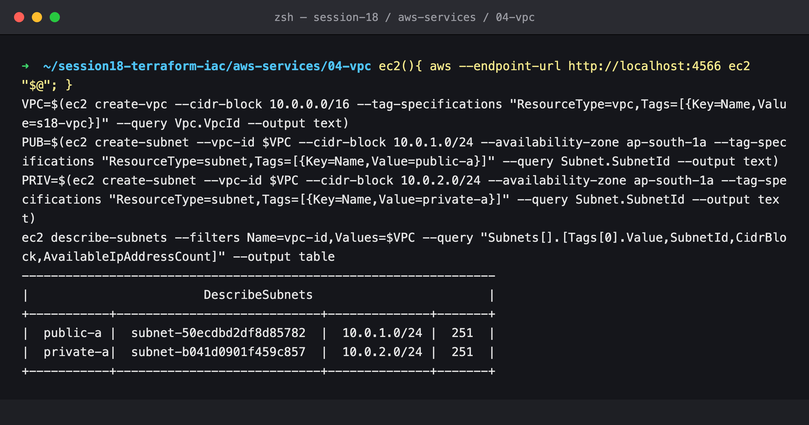
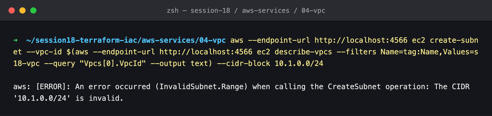
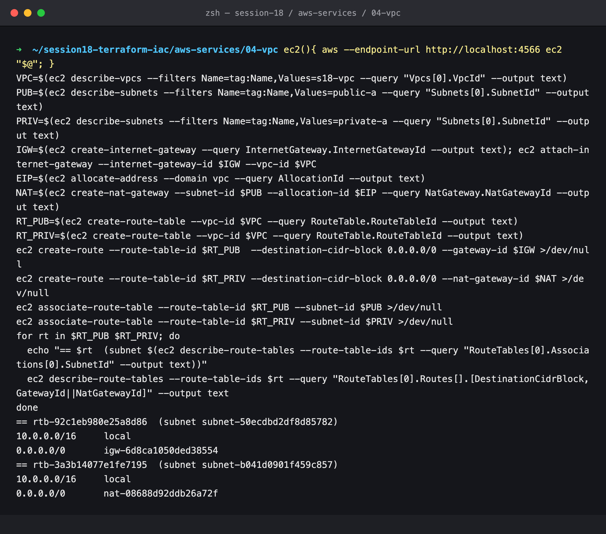
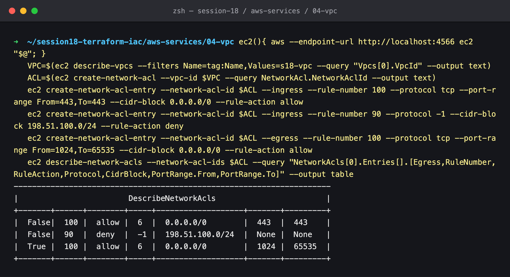
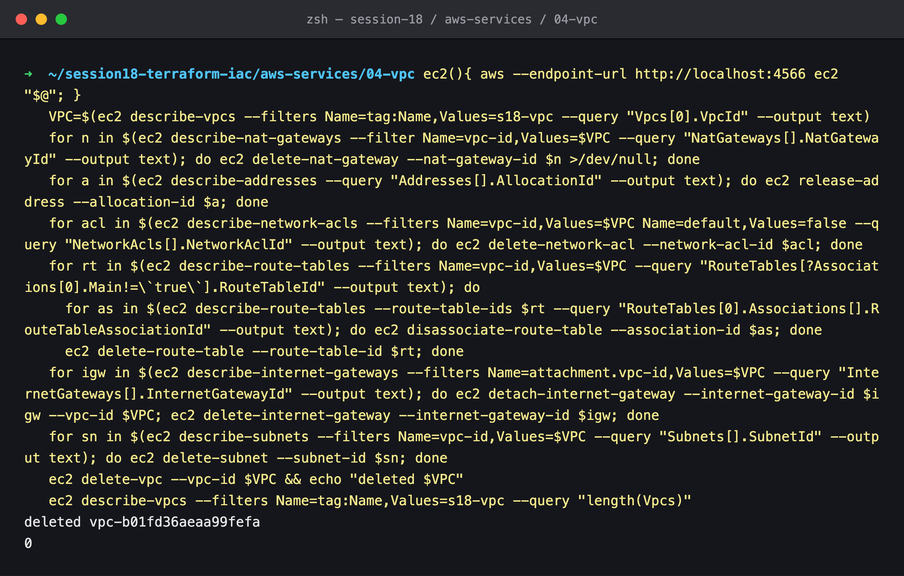

# 04: VPC (Networking)

## Name

Himanshu Rathi

## Roll No

`24BCS10365`

---

## What is a VPC?

A **Virtual Private Cloud** is your own logically isolated network inside an AWS region. You choose its IP range, split it into subnets, decide how traffic is routed and filtered, and decide what (if anything) connects it to the internet or to on-premises networks. EC2 instances, RDS databases, load balancers, EKS nodes and Lambda functions with VPC access all live in a VPC.

- A VPC is **regional** and spans all AZs in its region. **Subnets** are zonal.
- Every region has a **default VPC** (`172.31.0.0/16`, a public subnet per AZ) for quick starts. Real workloads should use a custom VPC.

```
Region ap-south-1
└── VPC 10.0.0.0/16
    ├── AZ ap-south-1a
    │   ├── public subnet  10.0.1.0/24  ── route 0.0.0.0/0 → Internet Gateway
    │   └── private subnet 10.0.2.0/24  ── route 0.0.0.0/0 → NAT Gateway (in the public subnet)
    └── AZ ap-south-1b …  (repeat for high availability)
```

## CIDR

**Classless Inter-Domain Routing** notation writes an IP range as `base/prefix`. The prefix is how many leading bits are fixed:

| CIDR | Addresses | Typical use |
| --- | --- | --- |
| `10.0.0.0/16` | 65,536 | A VPC (allowed sizes are `/16` to `/28`) |
| `10.0.1.0/24` | 256 | A subnet |
| `10.0.1.0/28` | 16 | The smallest subnet AWS allows |
| `203.0.113.10/32` | 1 | One host, e.g. "SSH from my IP" |
| `0.0.0.0/0` | All IPv4 | "Anywhere": the default route, or open-to-the-world rules |

Use RFC 1918 private ranges (`10.0.0.0/8`, `172.16.0.0/12`, `192.168.0.0/16`), and plan them so VPCs you might later peer or connect over VPN **don't overlap**. Overlapping ranges can't be routed between.

## Subnets

A **subnet** is a slice of the VPC's CIDR in **one Availability Zone**. AWS reserves **5 addresses** in every subnet: the network address, `.1` for the VPC router, `.2` for DNS, `.3` reserved, and the last address. That is why the `/24` subnets in the demo show **251** available addresses, not 256.

Spread each tier across at least two AZs so that losing one data centre doesn't take the application down.

## Route tables

A **route table** is a set of `destination CIDR → target` rules, associated with one or more subnets:

| Destination | Target | Meaning |
| --- | --- | --- |
| `10.0.0.0/16` | `local` | Always present: anything inside the VPC is routed directly |
| `0.0.0.0/0` | `igw-…` | Internet via the Internet Gateway, which makes the subnet **public** |
| `0.0.0.0/0` | `nat-…` | Outbound-only internet via NAT, typical of a **private** subnet |
| `10.1.0.0/16` | `pcx-…` / `tgw-…` | Another VPC through peering or a Transit Gateway |

The most specific prefix wins. A subnet without an explicit association uses the VPC's **main** route table.

## Internet Gateway (IGW)

A horizontally scaled, highly available VPC component that:

1. lets subnets that route `0.0.0.0/0` to it reach the internet, and
2. performs the **1:1 NAT** between an instance's private IP and its public or Elastic IP.

There is one IGW per VPC. It costs nothing in itself, though data transfer is billed.

## NAT Gateway

Lets instances in **private** subnets make **outbound** connections (OS updates, external APIs, pulling images) while staying **unreachable** from the internet:

- It lives in a **public** subnet and needs an **Elastic IP**.
- Private subnets route `0.0.0.0/0` to it.
- It is zonal, so use one per AZ for high availability, otherwise an AZ outage cuts every private subnet off.
- It is billed per hour and per GB processed, and is often a surprisingly large line on the bill. Gateway VPC endpoints for S3 and DynamoDB are free and remove that traffic from the NAT.

## Security Groups

Stateful, **allow-only** firewalls on each network interface (instance level). Return traffic is automatic, and rules can reference other security groups. See [02-ec2](../02-ec2/README.md#security-groups) for details.

## Network ACLs

Stateless firewalls at the **subnet** boundary:

| | Security Group | Network ACL |
| --- | --- | --- |
| Applies to | Instance (ENI) | Whole subnet |
| Rules | Allow only | **Allow and Deny** |
| State | **Stateful**: replies allowed automatically | **Stateless**: return traffic needs its own rule (ephemeral ports 1024–65535) |
| Evaluation | All rules together | **In rule-number order; first match wins** |
| Default | Deny in, allow out | Default NACL allows all; a **custom NACL denies all** until you add rules |

NACLs are a coarse second layer. A typical use is **blocking** a known-bad CIDR for a whole subnet, which a security group can't do because it has no deny.

## Public vs private subnet

There is no "public" checkbox. What makes a subnet public is its **route table**:

| | Public subnet | Private subnet |
| --- | --- | --- |
| Default route | `0.0.0.0/0 → igw-…` | `0.0.0.0/0 → nat-…`, or none at all |
| Instances get public IPs | Usually (`map_public_ip_on_launch`) | No |
| Reachable from the internet | Yes, if the SG allows it | **No** |
| Put here | Load balancers, NAT gateways, bastion hosts | App servers, databases, caches, EKS nodes |

The standard pattern is **public ALB → private app tier → private DB tier**, with only the load balancer facing the internet.

---

## Hands-on (LocalStack)

> **The AWS API is emulated by LocalStack 4.9.2 (community)** on `localhost:4566`. VPC objects, IDs, routes and rules behave like the real API, but **no packets flow**: LocalStack models the configuration, not a network. The Terraform version of a public VPC with an EC2 instance is the Session 19 project: [`../../../18_Cloud_Terraform`](../../../18_Cloud_Terraform/README.md).

### 1. VPC with a public and a private subnet



Two `/24`s carved from `10.0.0.0/16`, each showing **251** usable IPs because AWS reserves 5 per subnet.

### 2. A subnet outside the VPC's CIDR is rejected



`10.1.0.0/24` is not inside `10.0.0.0/16`, so the API rejects it with `InvalidSubnet.Range`.

### 3. IGW, NAT Gateway and two route tables



Both tables have the implicit `10.0.0.0/16 → local` route. The only difference is the default route:

- the public subnet's table: `0.0.0.0/0 → igw-…`
- the private subnet's table: `0.0.0.0/0 → nat-…`, where the NAT gateway sits in the *public* subnet with an Elastic IP

That one line is the entire difference between "public" and "private".

### 4. A custom Network ACL with an explicit deny



- inbound rule **90**: **deny** everything from `198.51.100.0/24`. It is evaluated before rule 100 because the lower number is checked first.
- inbound rule **100**: allow TCP 443 from anywhere
- outbound rule **100**: allow TCP 1024–65535, the **ephemeral ports**. Because NACLs are stateless, the HTTPS *replies* need this explicit rule.

(Real AWS also lists the implicit catch-all `*` deny rule, number 32767, on custom NACLs. LocalStack's output leaves it out.)

### 5. Cleanup, in dependency order



A VPC can't be deleted while anything is still inside it. The script removes resources in reverse dependency order: NAT gateway → Elastic IP → custom NACL → route-table associations and tables → detach and delete the IGW → subnets → VPC. This is exactly the ordering problem `terraform destroy` solves automatically from its dependency graph.
