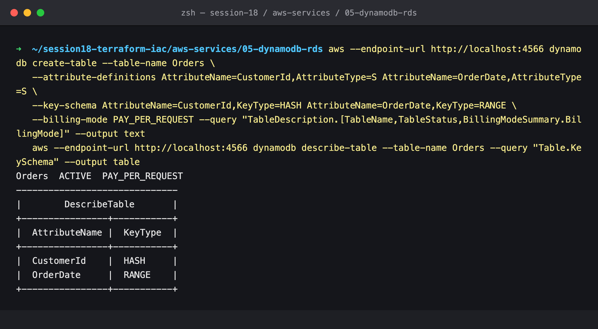
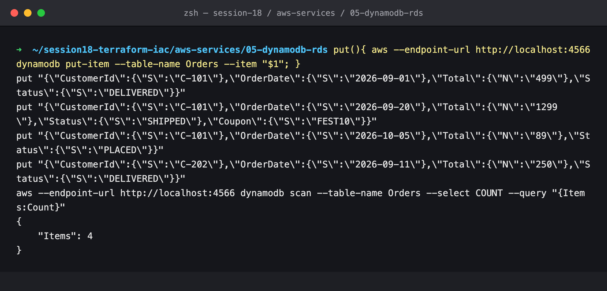
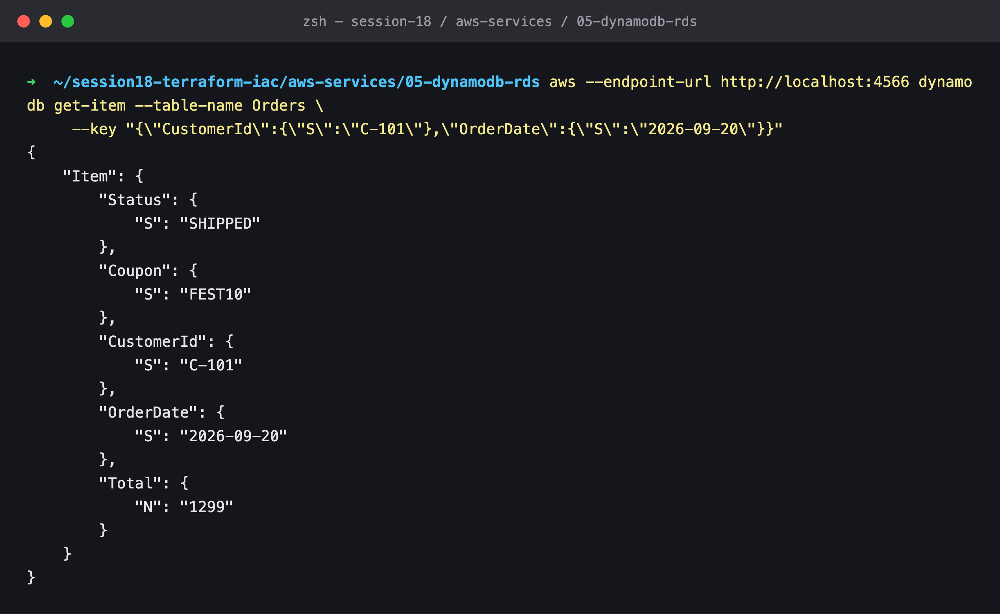
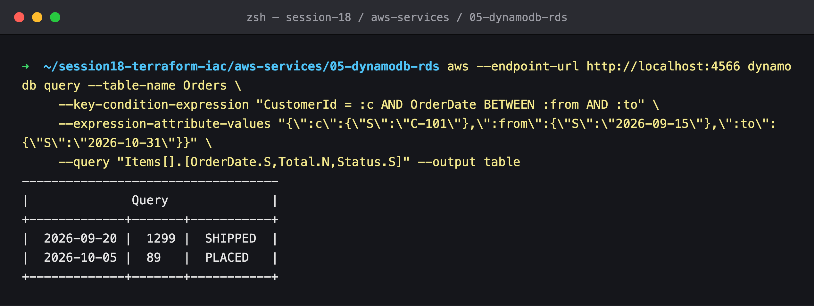
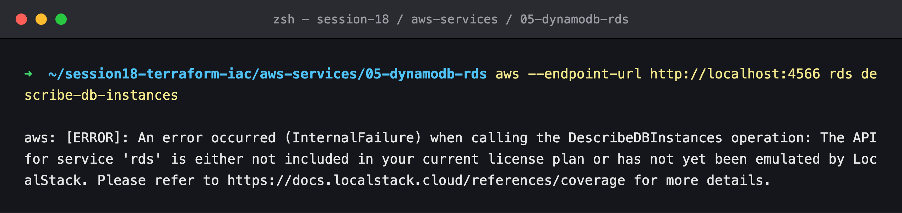
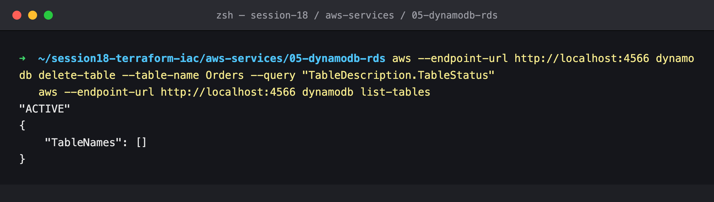

# 05: DynamoDB & RDS (Database Services)

## Name

Himanshu Rathi

## Roll No

`24BCS10365`

---

AWS offers both styles of database as managed services. **DynamoDB** is a serverless NoSQL key-value and document store. **RDS** runs a traditional relational engine for you.

| | DynamoDB | RDS |
| --- | --- | --- |
| Model | Key-value / document (NoSQL) | Relational tables (SQL) |
| Schema | Only the key is fixed; items can differ | Fixed schema, migrations |
| Queries | By key (and indexes); no joins | Full SQL, joins, aggregates |
| Scaling | Horizontal, automatic, effectively unlimited | Vertical (bigger instance) plus read replicas |
| Servers | None (serverless) | You pick an instance class |
| Latency | Single-digit ms at any scale | Depends on the instance and query |

---

# DynamoDB

## NoSQL

DynamoDB has **no fixed schema**: apart from the primary key, every item in a table can have different attributes, as the `Coupon` attribute in the demo shows. It gives up joins and arbitrary queries in exchange for **predictable single-digit-millisecond performance at any scale**. Data is spread across partitions by key and replicated across three AZs. It is fully managed: no servers, patching or capacity planning in on-demand mode.

The design rule that follows: **model the table around your access patterns** ("get all orders for a customer in a date range"), not around entities. Single-table design is common.

## Tables

A **table** is a collection of items with a defined primary key. Capacity modes:

- **On-demand** (`PAY_PER_REQUEST`): pay per read and write, scales instantly. The default choice for unknown or spiky traffic.
- **Provisioned**: set read/write capacity units, optionally with auto scaling. Cheaper for steady, predictable load.

Optional features include Streams (change data capture), TTL (auto-expire items), Global Tables (multi-region active-active), point-in-time recovery and encryption at rest (always on).

## Items

An **item** is one record, like a row. It can be up to **400 KB** and is identified by its primary key.

## Attributes

An **attribute** is a named value on an item. Types include scalars (`S` string, `N` number, `B` binary, `BOOL`, `NULL`), documents (`M` map, `L` list) and sets (`SS`, `NS`, `BS`). On the wire every value is tagged with its type, e.g. `{"Total": {"N": "1299"}}`. Numbers are sent as strings to keep precision.

## Partition key

The **partition key** (`HASH`) is hashed to choose the physical partition an item lives on:

- A **simple primary key** is the partition key alone, and it must be unique.
- Pick a **high-cardinality**, evenly accessed key (`CustomerId`, `UserId`). A low-cardinality key (`Status`, `Country`) creates *hot partitions* that throttle.

## Sort key

The optional **sort key** (`RANGE`) makes a **composite primary key**: many items share one partition key and are stored **sorted** by the sort key. That allows efficient range queries within a partition: `BETWEEN`, `begins_with`, `<`, `>`. The (partition key, sort key) pair must be unique.

Secondary indexes (**GSI** with a different partition and sort key, **LSI** with the same partition key and a different sort key) add more access patterns.

## Use cases

- User profiles, sessions and shopping carts: get and put by ID at any scale.
- Gaming leaderboards and player state.
- IoT and time-series events: device ID plus timestamp sort key, with TTL.
- Serverless backends (API Gateway + Lambda + DynamoDB).
- Terraform state locking (the classic `dynamodb_table` lock, now superseded by S3 native locking).
- Idempotency keys and rate limiting.

---

# RDS

## Relational database

**Relational Database Service** runs a SQL database engine for you. AWS handles provisioning, OS and engine patching, backups, replication and failover. You keep the schema, queries, indexes and tuning. You get full ACID transactions, joins, constraints and the ecosystem of your chosen engine, without operating the server.

## Supported engines

| Engine | Notes |
| --- | --- |
| **PostgreSQL** | Most popular open-source choice |
| **MySQL** | |
| **MariaDB** | |
| **Oracle** | Licence included or bring your own |
| **Microsoft SQL Server** | Express, Web, Standard, Enterprise |
| **IBM Db2** | Since 2023 |
| **Amazon Aurora** (MySQL- and PostgreSQL-compatible) | AWS's cloud-native engine: storage replicated 6 ways across 3 AZs, up to 15 low-lag replicas, Serverless v2 option |

## DB instances

A **DB instance** is the managed database server. You choose:

- an **instance class**: `db.t4g.micro` (burstable, free tier), `db.m7g.*` (general), `db.r7g.*` (memory-optimised)
- **storage**: gp3 or io2, with storage autoscaling
- engine version, parameter group (engine settings) and option group

You connect through a DNS **endpoint** (`mydb.xxxx.ap-south-1.rds.amazonaws.com:5432`), never an IP, because the endpoint follows the primary across failovers.

## Security

- **Network**: place instances in **private subnets** (a *DB subnet group* spanning at least 2 AZs), with `publicly_accessible = false`. A security group allows the DB port only **from the app tier's security group**.
- **Encryption at rest**: KMS, chosen at creation. It covers storage, snapshots, backups and replicas. An unencrypted instance can't be encrypted later; you have to snapshot, copy with encryption and restore.
- **In transit**: TLS. Enforce it with `rds.force_ssl` (PostgreSQL) or `require_secure_transport` (MySQL).
- **Authentication**: the master password stored in **Secrets Manager** with automatic rotation (`manage_master_user_password`), or **IAM database authentication** with short-lived tokens instead of passwords.
- **Auditing**: CloudWatch Logs exports, Database Activity Streams and Performance Insights.

## Backups

- **Automated backups**: daily snapshots plus transaction logs, kept 1–35 days, enabling **point-in-time recovery** to any second in the window. A restore creates a *new* instance.
- **Manual snapshots**: kept until you delete them. Use them before risky changes. They can be copied across regions and accounts.
- **AWS Backup** offers central policies and cross-region vaults.

## Multi-AZ

High availability, **not** scaling:

- **Multi-AZ instance deployment**: a synchronous standby in another AZ. It doesn't serve traffic. On failure or maintenance, RDS flips the endpoint's DNS to the standby in about 60–120 seconds.
- **Multi-AZ DB cluster** (MySQL/PostgreSQL): one writer and **two readable** standbys in three AZs, with faster (~35 s) failover.
- Aurora is multi-AZ at the storage layer by design.

## Read replicas

**Scaling reads**, not HA (although a replica *can* be promoted):

- **Asynchronous** replication, so replicas may lag slightly.
- Up to 15 per source (engine-dependent), in the same region or **cross-region** for DR and local reads.
- Each replica has its own endpoint. The application sends read-only queries (reports, analytics) to replicas and writes to the primary.

## Use cases

- Classic web and business applications with relational data: users, orders, invoices, inventory.
- Anything needing **transactions**: payments, bookings, ledgers.
- Lift-and-shift of existing MySQL, PostgreSQL, Oracle or SQL Server databases.
- Reporting and analytics on read replicas.
- SaaS backends (Aurora Serverless v2 for variable load).

---

## Hands-on (LocalStack)

> **The AWS API is emulated by LocalStack 4.9.2 (community)** on `localhost:4566`. DynamoDB is fully supported. **RDS is not included in the community edition** (step 5), so the RDS section above is documentation only.

### 1. Table with a composite primary key

`Orders` uses partition key `CustomerId` (`HASH`) and sort key `OrderDate` (`RANGE`), billed on demand. Only the key attributes are declared. Every other attribute is schemaless.

### 2. Put items

Three orders for customer `C-101` share one partition and are sorted by date. One order for `C-202` goes to another partition. Only one item carries a `Coupon` attribute, which is legal because there is no fixed schema.

### 3. Get one item by its full primary key

`get-item` needs **both** key parts and is an O(1) lookup. Every attribute comes back with its type tag (`S`, `N`).

### 4. Range query within a partition, using the sort key

"Orders for `C-101` between 2026-09-15 and 2026-10-31" returns exactly 2 of that customer's 3 orders, in date order. This is a `query`, which reads only the matching slice of one partition, not a `scan` of the whole table. The sort key is what makes it possible.

### 5. RDS: not emulated in LocalStack community

`The API for service 'rds' is either not included in your current license plan or has not yet been emulated by LocalStack.` RDS needs LocalStack Pro or a real AWS account.

### 6. Cleanup

