# Terraform S3 Demo

## Name

Himanshu Rathi

## Roll No

`24BCS10365`

---

This lab creates an S3 bucket with Terraform and takes it through the whole lifecycle: `init`, `fmt`, `validate`, `plan`, `apply`, `show`, `output` and `destroy`. Every step is checked independently with the `aws` CLI. The bucket is versioned, encrypted at rest and blocks public access, and the lab shows those settings working, not just declared.

> **The AWS API here is emulated by [LocalStack](https://github.com/localstack/localstack)** (community edition) running in Docker on `localhost:4566`. No real AWS account is involved. Terraform and the `aws` CLI make the same API calls they would make against AWS, and LocalStack answers them. The provider block in [`provider.tf`](./provider.tf) is the only LocalStack-specific code. Remove its `access_key`/`secret_key`, `skip_*` flags and `endpoints` and the same configuration targets real AWS.

Every screenshot below is the real terminal output of the command shown in it. Nothing is mocked or typed from memory.

---

## Environment

| Component | Version / value |
| --- | --- |
| Host | macOS (Apple Silicon), Docker Desktop 29.2.0 |
| Terraform | v1.16.4 |
| AWS provider | `hashicorp/aws` v6.67.0 (constraint `~> 6.0`) |
| AWS API | LocalStack **4.9.2** community, `localstack/localstack:4.9` |
| Region | `ap-south-1` (Mumbai) |
| Credentials | LocalStack dummies `test` / `test`. `AWS_CONFIG_FILE` and `AWS_SHARED_CREDENTIALS_FILE` point to `/dev/null`, so nothing in `~/.aws` is read |

> **Why the image is pinned to `:4.9`:** `localstack/localstack:latest` (2026.9.x) now exits on startup with `License activation failed … set the LOCALSTACK_AUTH_TOKEN`. The 4.9 tag is the last community build that runs without an account.

```bash
docker run -d --name localstack -p 4566:4566 localstack/localstack:4.9
export AWS_ACCESS_KEY_ID=test AWS_SECRET_ACCESS_KEY=test AWS_DEFAULT_REGION=ap-south-1
export AWS_CONFIG_FILE=/dev/null AWS_SHARED_CREDENTIALS_FILE=/dev/null
```

---

## Project structure

```
terraform-s3-demo/
├── provider.tf         <- terraform{} block (version pins) + aws provider pointed at LocalStack
├── variables.tf        <- aws_region, localstack_endpoint, bucket_name (validated), environment
├── terraform.tfvars    <- the values for this run
├── main.tf             <- bucket + versioning + SSE encryption + public access block
├── outputs.tf          <- bucket_name, bucket_arn, bucket_region, versioning_status
├── .terraform.lock.hcl <- pins the exact provider build (committed, as Terraform recommends)
├── README.md
└── screenshots/
```

`.terraform/`, `*.tfstate*` and plan files are git-ignored (see [`../.gitignore`](../.gitignore)). State can contain secrets and belongs in a remote backend, not in Git.

### What `main.tf` creates

| Resource | Why |
| --- | --- |
| `aws_s3_bucket.demo` | The bucket itself, with `force_destroy = true` so `destroy` can remove it even when it holds objects |
| `aws_s3_bucket_versioning.demo` | Keeps every version of every object, so an overwrite or delete can be undone |
| `aws_s3_bucket_server_side_encryption_configuration.demo` | SSE-S3 (AES-256) encryption at rest by default |
| `aws_s3_bucket_public_access_block.demo` | Stops the bucket from ever being made public by an ACL or policy |

Since AWS provider v4, versioning, encryption and the access block are **separate resources** instead of blocks inside `aws_s3_bucket`. Each one is a separate S3 API call, and Terraform gives each its own state entry.

---

## Key takeaways

1. **Plan, then apply the saved plan.** `terraform plan -out=s3.tfplan` followed by `terraform apply s3.tfplan` applies exactly what was reviewed. There is no second diff and no prompt.
2. **`terraform plan` also detects drift.** Right after a successful apply, `plan` showed the bucket's tags missing. The cause was an emulator gap, covered in step 9. Terraform caught it because every plan refreshes state against the real API first.
3. **Verify outside Terraform.** Terraform reporting "Apply complete" is not proof. `aws s3api` showed versioning, encryption and the access block really in place, and showed the tags really missing.
4. **`destroy` follows the dependency graph in reverse.** The three child resources go first and the bucket goes last.

---

## Workflow

### 1. LocalStack is up, and Terraform is installed

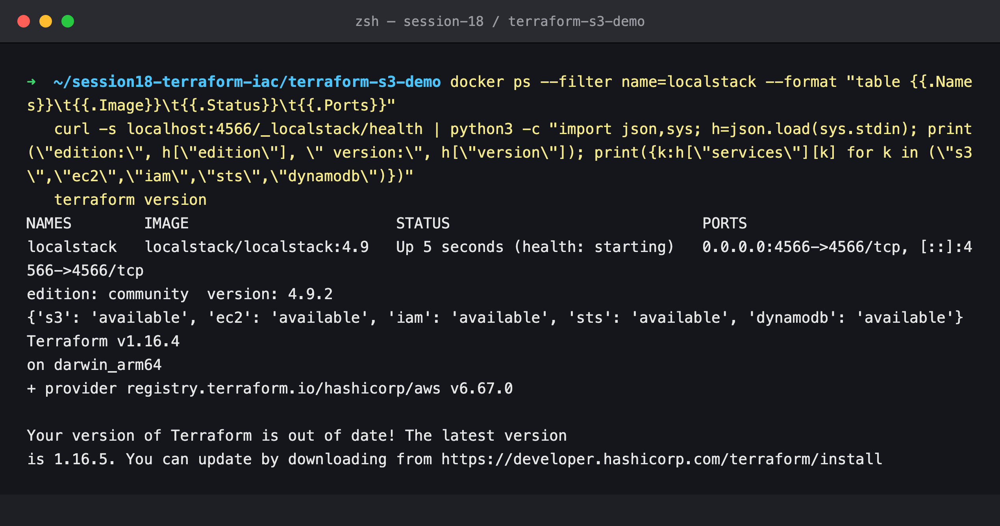

The health endpoint confirms the S3, EC2, IAM, STS and DynamoDB APIs are available on the community edition.

### 2. Starting point: no buckets

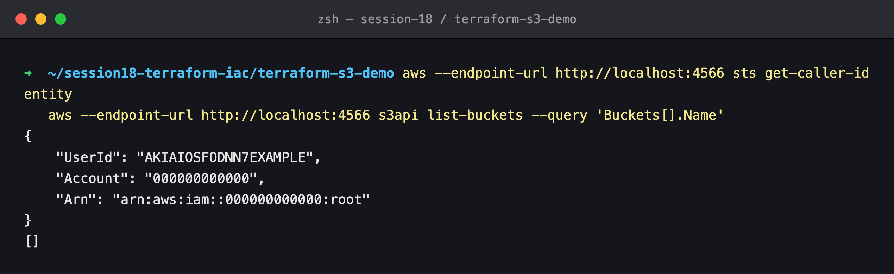

`sts get-caller-identity` returns LocalStack's fixed account `000000000000`. That is how you can tell these calls never reach real AWS.

### 3. `terraform init`

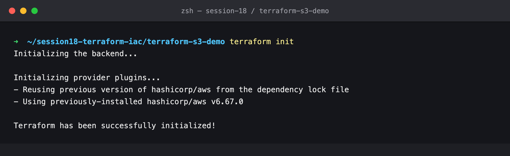

`init` downloads the AWS provider into `.terraform/` and writes `.terraform.lock.hcl`, which pins the exact provider build and its checksums. It also configures the backend (local state by default). Run it once per working directory, and again whenever providers or modules change.

### 4. `terraform fmt`

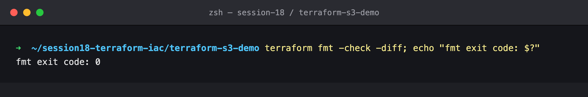

`fmt -check -diff` exits `0` when every file is already in canonical style. In CI this is the useful form, because it fails the build instead of silently rewriting files.

### 5. `terraform validate`

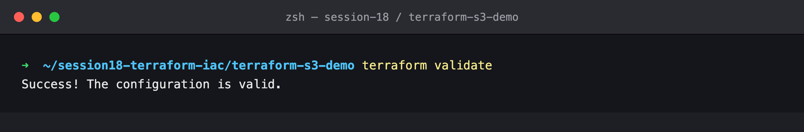

`validate` checks syntax, types and references without calling AWS. The custom `validation` block on `bucket_name` (S3 naming rules) also runs at this stage.

### 6. `terraform plan`

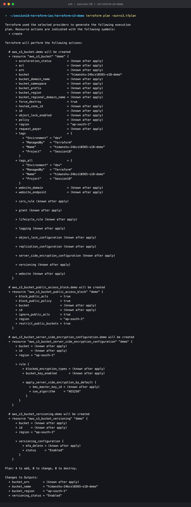

**4 to add, 0 to change, 0 to destroy.** Values Terraform can't know yet, such as the ARN, show as `(known after apply)`. `-out=s3.tfplan` saves the plan so the apply can't drift from what was reviewed.

### 7. `terraform apply`

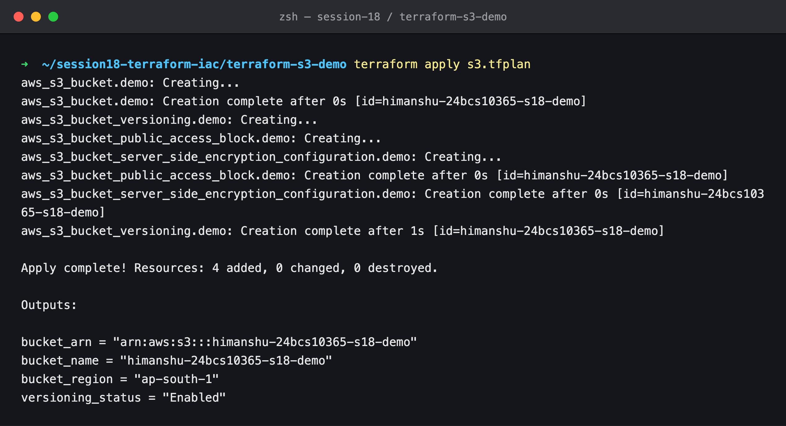

The bucket is created first. The other three resources reference `aws_s3_bucket.demo.id`, so Terraform creates them after the bucket, and in parallel with each other.

### 8. Verify with the AWS CLI

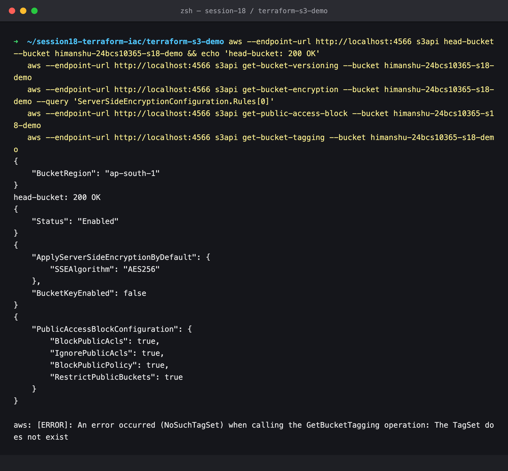

Versioning is `Enabled`, encryption is `AES256` and all four public-access blocks are `true`. **But `get-bucket-tagging` fails with `NoSuchTagSet`:** the four tags in `main.tf` are missing.

### 9. Drift: `plan` notices the missing tags

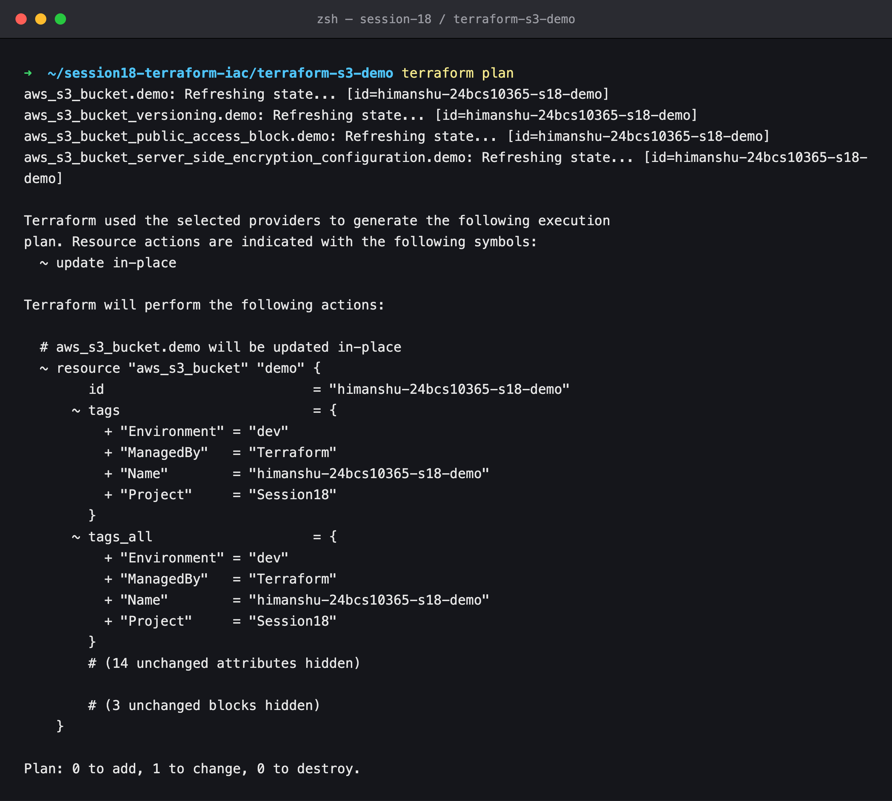

Nothing in the code changed, yet `plan` wants to update the bucket in place and add the four tags. Terraform refreshed the bucket from the API, saw no tags, and compared that with the configuration.

**Root cause.** I ran `apply` with `TF_LOG=DEBUG` and checked the requests it sent. AWS provider v6 sends the tags *inside* the `CreateBucket` request body, as a `<Tags>` element in `CreateBucketConfiguration`. This is a newer S3 API feature, and LocalStack 4.9 ignores it. Real S3 would have stored the tags. On an update, the provider uses the older `PutBucketTagging` call, which LocalStack does support.

While investigating I also found a second LocalStack bug: tags survive a bucket's deletion. A new bucket with the same name inherits the old tag set. Because of that, I restarted LocalStack and ran this whole lab again from a clean state, so the screenshots show the real behaviour.

### 10. Apply again to reconcile

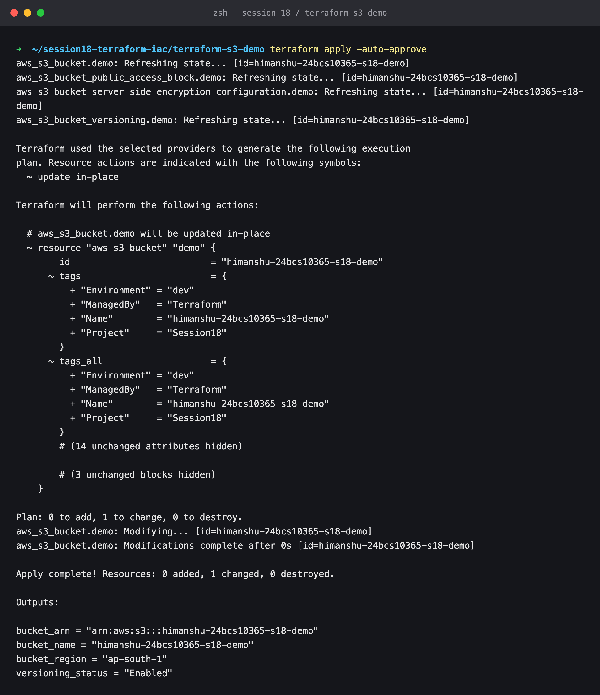

### 11. Converged: no changes, tags present

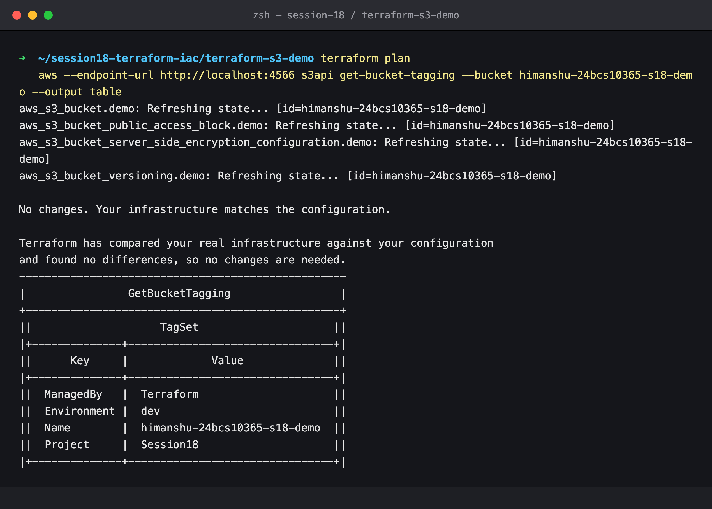

A clean `plan` ("No changes. Your infrastructure matches the configuration.") is the real definition of done.

### 12. Versioning and encryption in action

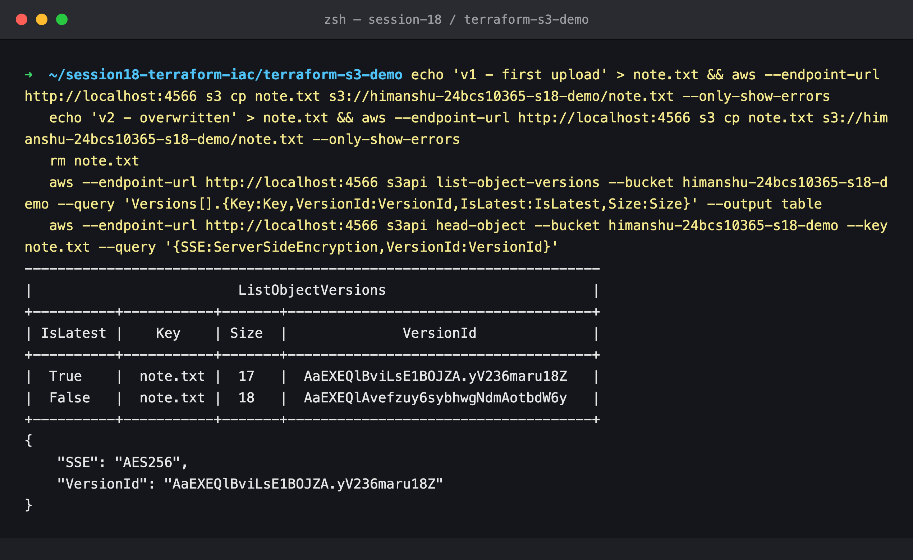

I uploaded the same key twice. Both versions are kept: only one `IsLatest` is `True`, and the 18-byte original is still there. `head-object` shows the object was encrypted with `AES256` without asking for it, because of the bucket's default encryption.

### 13. `terraform show`

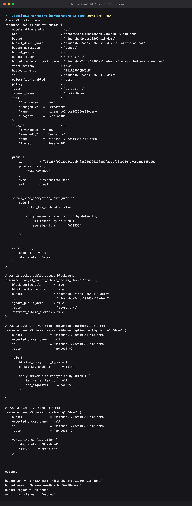

`show` prints everything Terraform knows about the managed resources, including computed attributes such as `arn`, `bucket_regional_domain_name` and `hosted_zone_id`.

### 14. `terraform output`

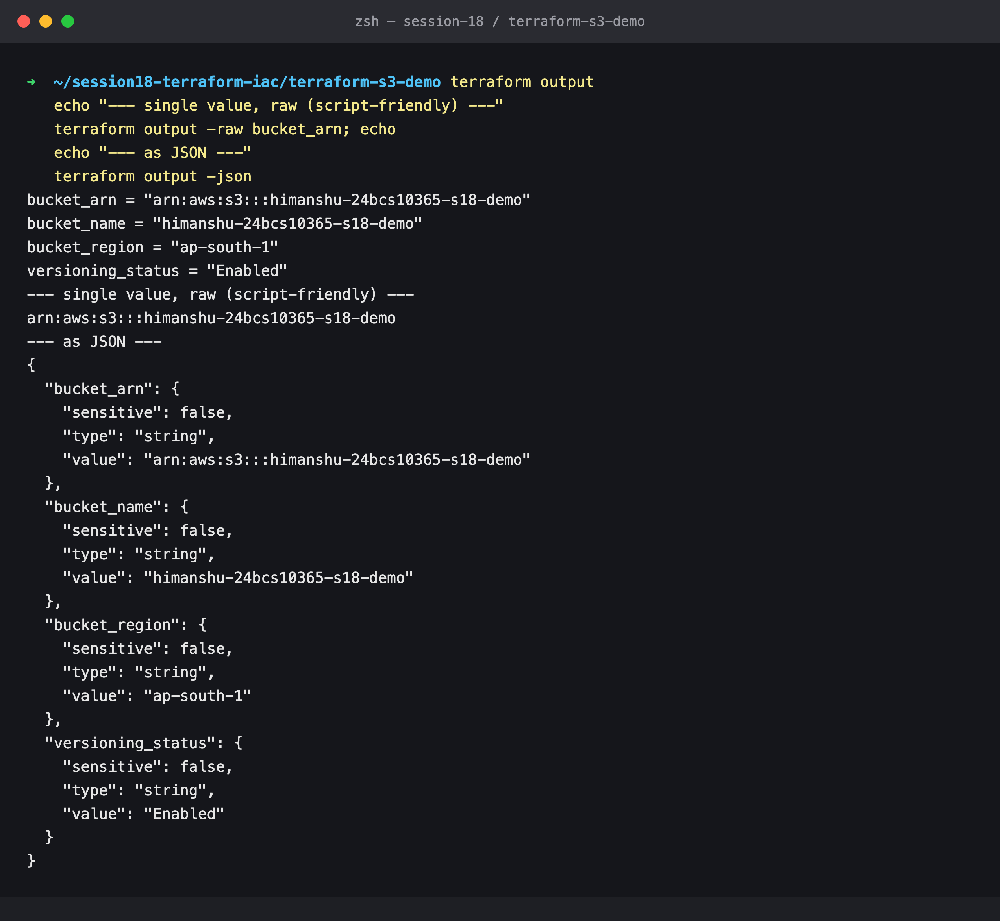

The `-raw` form prints a bare string for shell scripts, for example `aws s3 ls s3://$(terraform output -raw bucket_name)`. `-json` gives typed output for other tooling.

### 15. `terraform state`

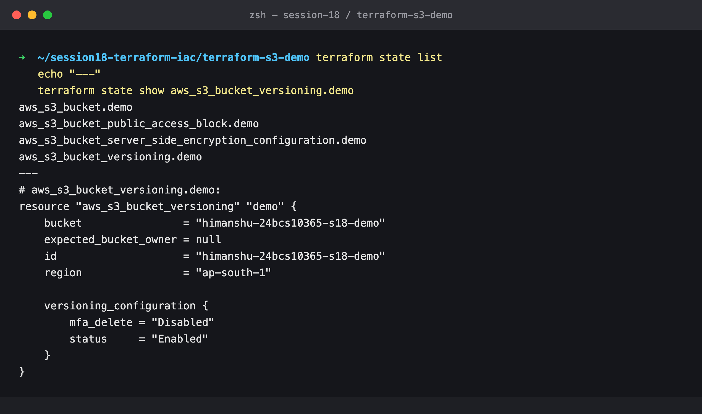

`state list` shows four resources. `state show` prints one resource's recorded attributes.

### 16. `terraform plan -destroy`

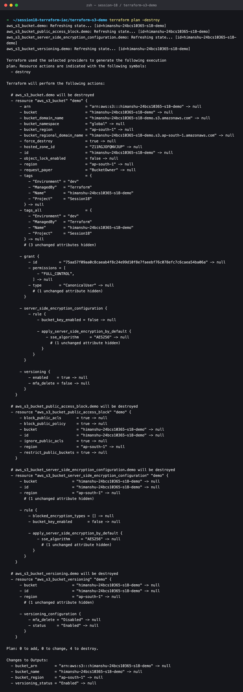

**0 to add, 0 to change, 4 to destroy.** A destroy plan previews the teardown before anything is deleted.

### 17. `terraform destroy`

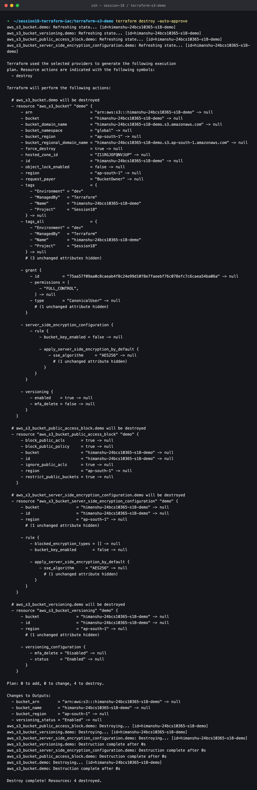

The child resources are destroyed first and the bucket last, which is the dependency order reversed. The bucket still held two object versions from step 12, and `force_destroy = true` let Terraform empty it. Without that flag, AWS refuses to delete a non-empty bucket.

### 18. Verify it is gone

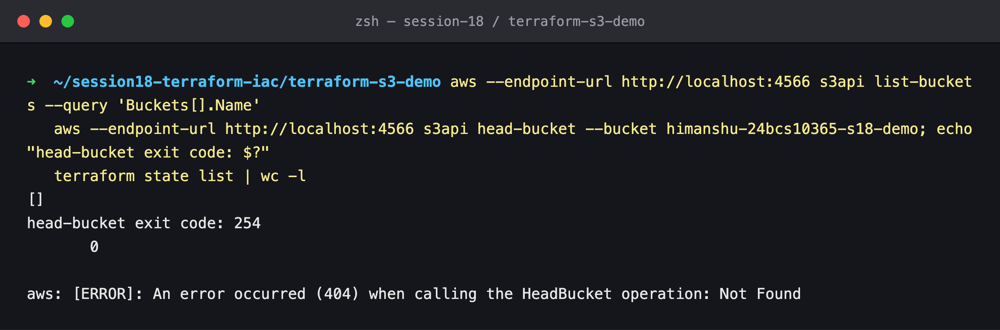

`list-buckets` is empty, `head-bucket` returns `404` and the state holds zero resources.

---

## Command summary

```bash
terraform init
terraform fmt -check -diff
terraform validate
terraform plan -out=s3.tfplan
terraform apply s3.tfplan
terraform plan                 # drift check: should say "No changes"
terraform show
terraform output
terraform output -raw bucket_arn
terraform state list
terraform state show aws_s3_bucket_versioning.demo
terraform plan -destroy
terraform destroy -auto-approve
```

## Cleanup

`terraform destroy` (step 17) removes everything this lab created. To stop the emulator:

```bash
docker rm -f localstack
```
