# Session 19: Cloud & Terraform in Action

## Name

Himanshu Rathi

## Roll No

`24BCS10365`

---

This is an end-to-end Terraform project that builds a small but complete web stack on AWS. It has a VPC with a public subnet, an Internet Gateway and a route table; a least-open security group; an EC2 web server with an IAM instance profile; and an S3 bucket that holds the site content the server pulls at boot. The infrastructure goes through plan → apply → verify → change → destroy, and each step is checked against the API.

> **The AWS API is emulated by [LocalStack](https://github.com/localstack/localstack) 4.9.2 (community edition)** running in Docker on `localhost:4566`. No real AWS account is involved. Terraform makes the same API calls it would make against AWS. **The EC2 instance is a mocked API record, not a real VM**: it gets realistic IDs, IPs and states, but nothing boots and `user_data` never runs, so the `web_url` output is not reachable. Everything about the *infrastructure definition* (dependencies, state, plans, diffs) is real Terraform behaviour. The provider block in [`terraform/versions.tf`](./terraform/versions.tf) is the only LocalStack-specific code.

Every screenshot is the real terminal output of the command shown in it. Nothing is mocked or typed from memory.

Adapted from the course repo [`Nency-Ravaliya/devops-heros`](https://github.com/Nency-Ravaliya/devops-heros) (`session19-cloud-terraform/08-mini-project`). That project stops at VPC + subnet + IGW + route table + SG and leaves EC2 as an "optional extension". This version adds the EC2 instance, the S3 bucket and the IAM role that connects them.

---

## Environment

| Component | Version / value |
| --- | --- |
| Host | macOS (Apple Silicon), Docker Desktop 29.2.0 |
| Terraform | v1.16.4 |
| AWS provider | `hashicorp/aws` v6.67.0 (constraint `~> 6.0`, pinned by the committed `.terraform.lock.hcl`) |
| AWS API | LocalStack 4.9.2 community (`localstack/localstack:4.9`; `:latest` now needs an auth token) |
| Region | `ap-south-1` |
| Credentials | LocalStack dummies `test`/`test`; `~/.aws` is never read |

---

## Architecture

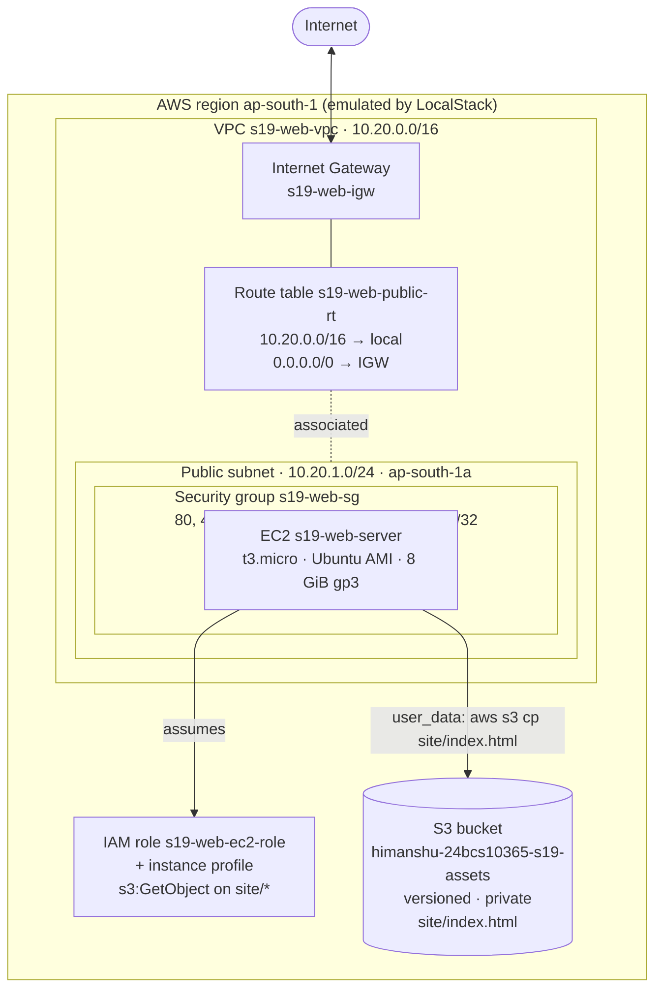

### Dependency graph (generated by `terraform graph | dot`)

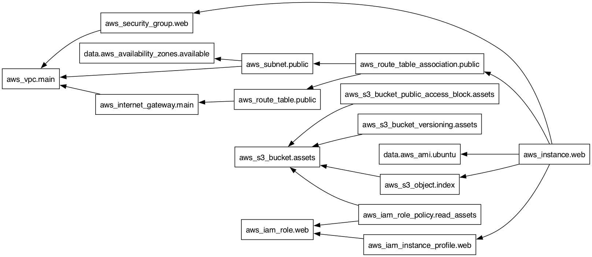

An arrow means "depends on". Terraform creates resources from right to left (VPC, IAM role and bucket first, in parallel) and destroys them in the opposite order.

---

## Project structure

```
18_Cloud_Terraform/
├── README.md                <- this write-up
├── dependency-graph.png     <- rendered from `terraform graph`
├── .gitignore               <- .terraform/, *.tfstate*, *.tfplan
├── screenshots/
└── terraform/
    ├── versions.tf          <- terraform{} version pins + aws provider (LocalStack endpoints, default_tags)
    ├── variables.tf         <- 8 input variables, 2 with validation rules
    ├── terraform.tfvars     <- values for this environment
    ├── network.tf           <- AZ data source, VPC, subnet, IGW, route table + association, SG
    ├── storage.tf           <- S3 bucket, versioning, public-access block, index.html object
    ├── compute.tf           <- AMI data source, IAM role + policy + instance profile, EC2 instance
    ├── outputs.tf           <- 7 outputs
    └── .terraform.lock.hcl
```

## How each required concept shows up

| Concept | Where |
| --- | --- |
| **Providers** | `versions.tf`: `hashicorp/aws ~> 6.0`, region from a variable, `default_tags` applied to every resource, endpoints pointed at LocalStack |
| **Variables** | `variables.tf` + `terraform.tfvars`: region, CIDRs, instance type, SSH CIDR, bucket name. `vpc_cidr` must be a valid CIDR, and `ssh_allowed_cidr` **refuses `0.0.0.0/0`** (step 4) |
| **Resources** | 14 managed resources across VPC networking, IAM, S3 and EC2 |
| **Data sources** | `aws_availability_zones` (no hard-coded AZ) and `aws_ami` (newest matching Ubuntu image, no hard-coded AMI ID) |
| **Outputs** | `vpc_id`, `public_subnet_id`, `security_group_id`, `instance_id`, `instance_public_ip`, `web_url`, `assets_bucket` |
| **Implicit dependencies** | Any reference creates an edge: `aws_subnet.public` uses `aws_vpc.main.id`, and `aws_iam_role_policy` interpolates `aws_s3_bucket.assets.arn`, so the bucket is created first |
| **Explicit `depends_on`** | `aws_instance.web` → `aws_route_table_association.public` and `aws_s3_object.index`. Nothing in the instance's arguments references the route association, so without it Terraform could boot the server before its subnet has an internet route, and `user_data`'s `apt-get` and `aws s3 cp` would fail. The same goes for the page object it downloads. |
| **State** | `terraform.tfstate` (local, git-ignored), inspected with `state list` and `state show`; serial and lineage shown in step 9 |
| **plan / apply / destroy** | Steps 5, 7, 14–15 and 17 |

---

## Key takeaways

1. **Reference values instead of hard-coding them.** The AZ and AMI come from data sources, and every ID comes from another resource's attribute. Those references *are* the dependency graph, so ordering takes care of itself.
2. **`depends_on` is for dependencies that only exist at runtime.** The instance needs the route to exist *while it boots*, and no attribute expresses that. Use `depends_on` there, and only there.
3. **Validation turns policy into a build failure.** Opening SSH to the internet isn't left to a reviewer to catch. `plan` refuses to run (step 4).
4. **Read every plan.** Changing `instance_type` is an **in-place update** with the same instance ID. The plan predicts a new public IP, and step 15 shows it happen.
5. **`plan -detailed-exitcode` turns drift detection into a script.** Exit 0 means converged and exit 2 means changes are pending, which is what a scheduled CI drift check runs.

---

## Workflow

### 1. Starting point: an empty (emulated) account

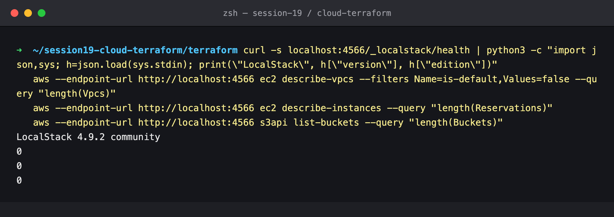

There are no custom VPCs, no instances and no buckets.

### 2. `terraform init`

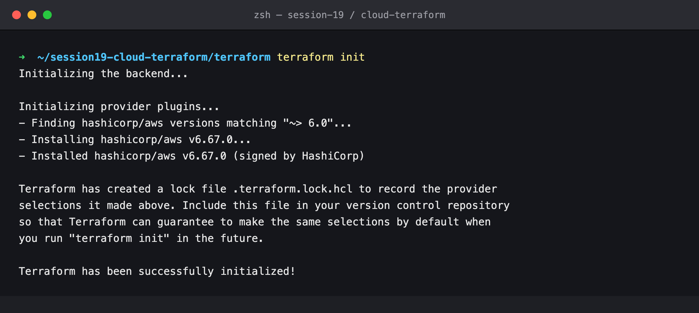

### 3. `terraform fmt` + `terraform validate`

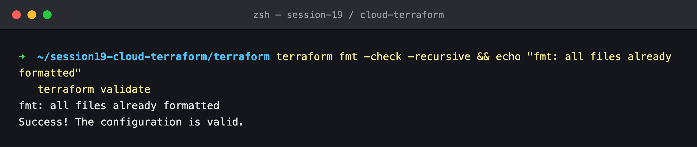

### 4. The variable validation guard in action

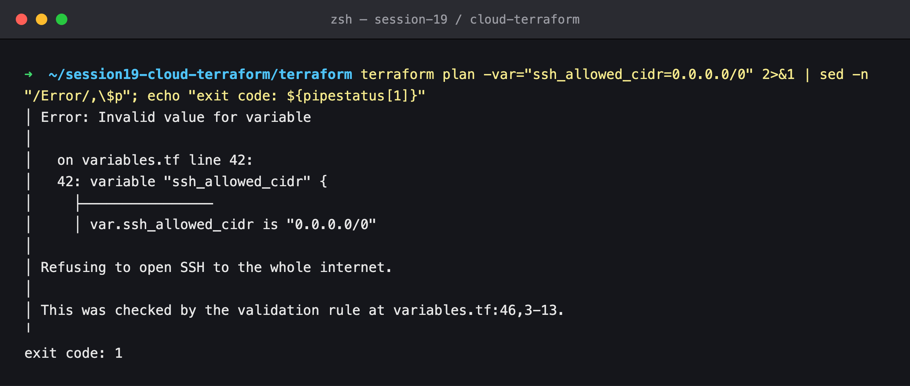

`-var="ssh_allowed_cidr=0.0.0.0/0"` is rejected with the custom error message *"Refusing to open SSH to the whole internet."* and exit code 1. No resource is touched.

### 5. `terraform plan`


**Plan: 14 to add, 0 to change, 0 to destroy.** The two data sources are read during planning: the AZ resolves to `ap-south-1a` and the AMI to `ami-785db401`. The plan is saved with `-out=s19.tfplan`. *(The screenshot is long because it is the complete, unfiltered plan.)*

### 6. Dependencies: `terraform graph`

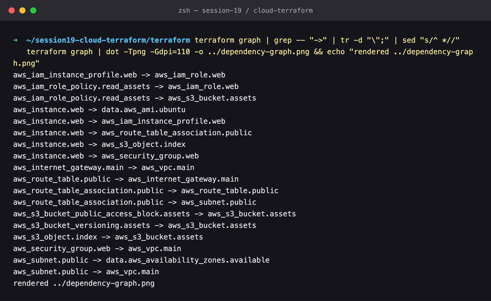

Each line is `resource -> what it depends on`. `aws_instance.web -> aws_route_table_association.public` and `-> aws_s3_object.index` are the two `depends_on` edges. All the others come from references. Terraform drops edges that are already implied: the instance's direct dependency on `aws_subnet.public` isn't printed because it is already reached through the route-table association. The same output, piped through Graphviz, produced [`dependency-graph.png`](./dependency-graph.png).

### 7. `terraform apply`

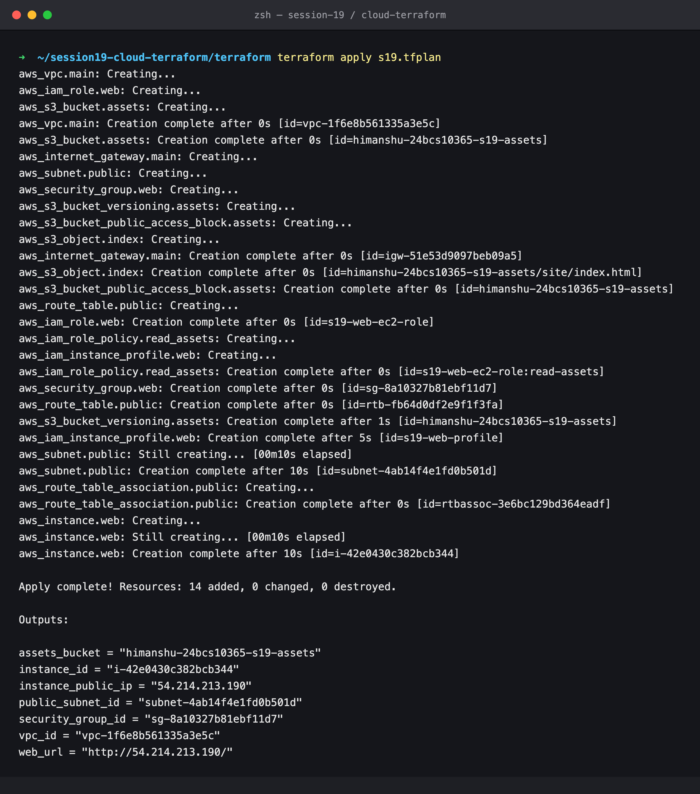

**Apply complete! Resources: 14 added.** The order matches the graph:

- **Wave 1, in parallel:** the VPC, IAM role and S3 bucket.
- **Wave 2:** IGW, subnet, security group and the bucket's children. The route table must wait for the IGW.
- **Wave 3:** the route-table association waits for the subnet, which took 10 s.
- **Wave 4:** the instance is created **last**, only after the association, as `depends_on` requires.

### 8. `terraform output`

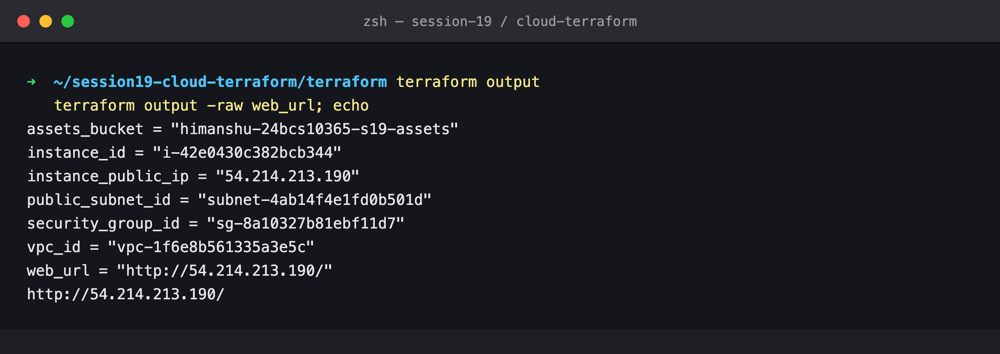

### 9. Terraform state

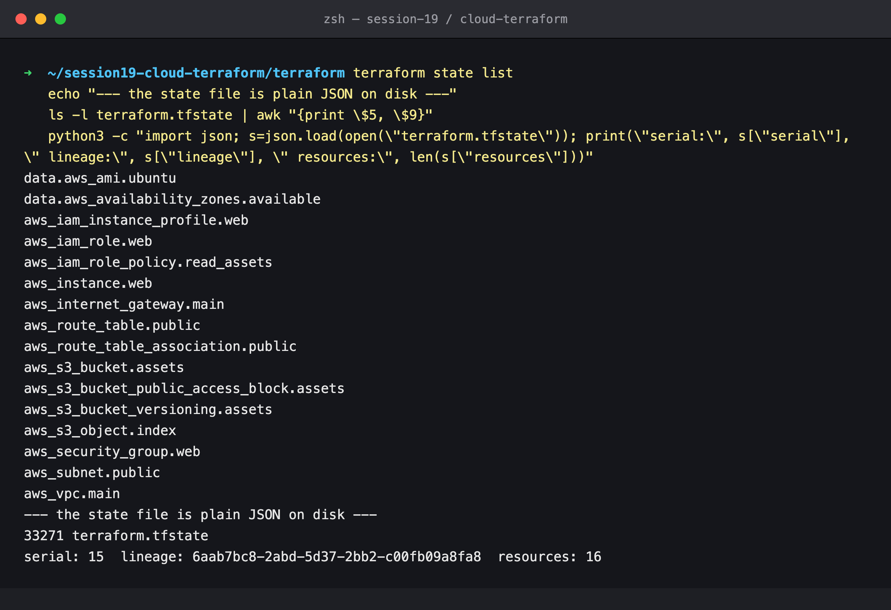

`state list` shows 2 data sources and 14 resources. The state file is plain JSON (33 KB). Its **serial** (15) goes up on every write, and its **lineage** UUID identifies this particular state, so Terraform refuses to overwrite it with a state from a different lineage. Because it holds every attribute, sometimes including secrets, it is git-ignored. A team would keep it in a remote backend such as S3 with locking.

### 10. `terraform state show aws_instance.web`

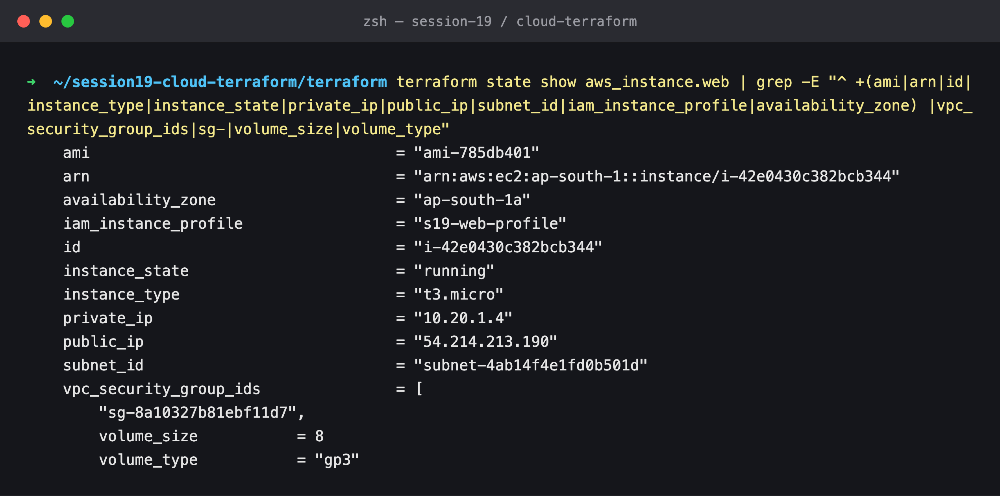

Terraform recorded the instance with its AMI, type, subnet, security group, instance profile, private IP `10.20.1.4` (inside `10.20.1.0/24`), public IP and 8 GiB gp3 root volume.

### 11. Verify the network with the AWS CLI

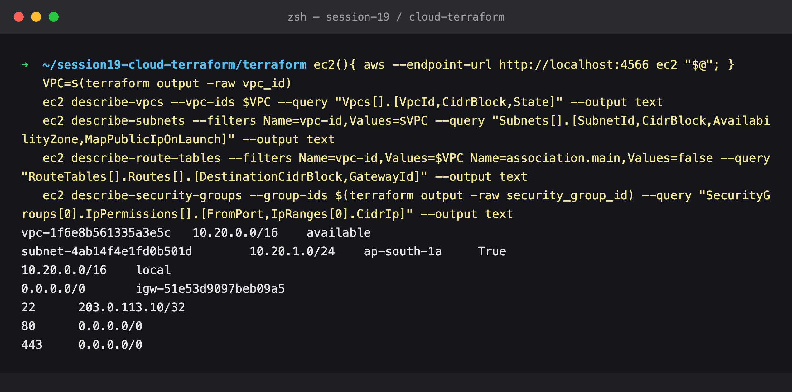

The checks are independent of Terraform:

- The VPC `10.20.0.0/16` is `available`.
- The subnet is `10.20.1.0/24` in `ap-south-1a` with `MapPublicIpOnLaunch=True`.
- The route table has `local` plus `0.0.0.0/0 → igw-…`.
- The SG allows 22 only from `203.0.113.10/32`, and 80/443 from anywhere.

### 12. Verify EC2 and S3 with the AWS CLI

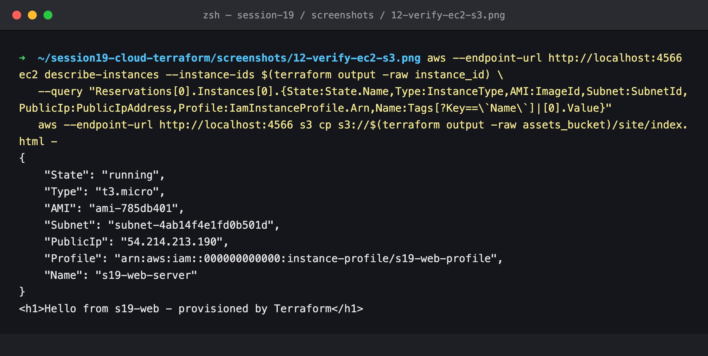

The instance is `running`, `t3.micro`, in the right subnet, with the instance profile attached and the `Name` tag from Terraform. The page `user_data` would serve is in the bucket.

### 13. A drift check right after apply

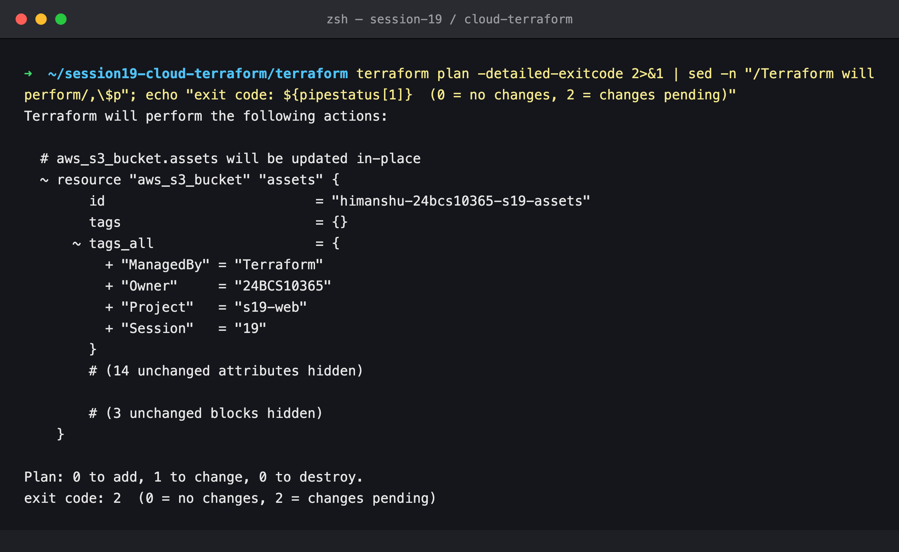

`plan -detailed-exitcode` returns **2**: the bucket's `default_tags` are missing. This is the same LocalStack gap found in [Session 18](../17_Terraform_IaC/terraform-s3-demo/README.md#9-drift-plan-notices-the-missing-tags). AWS provider v6 sends tags inside the `CreateBucket` request, and LocalStack 4.9 ignores them. Every other resource took its tags at creation. The next apply reconciles the bucket.

### 14. Change the infrastructure: plan a resize

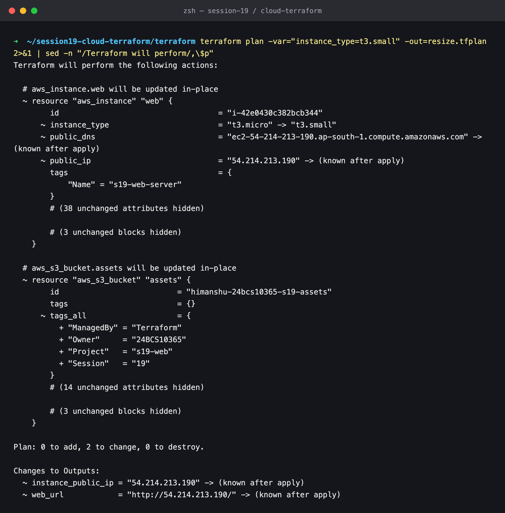

`-var="instance_type=t3.small"` plans **`~ update in-place`**: the instance keeps its ID, and `public_ip` becomes `(known after apply)`. AWS has to stop the instance to resize it, and a stopped instance loses its auto-assigned public IP. The bucket's tag reconciliation from step 13 rides along. The result is **0 to add, 2 to change, 0 to destroy**.

### 15. Apply the change

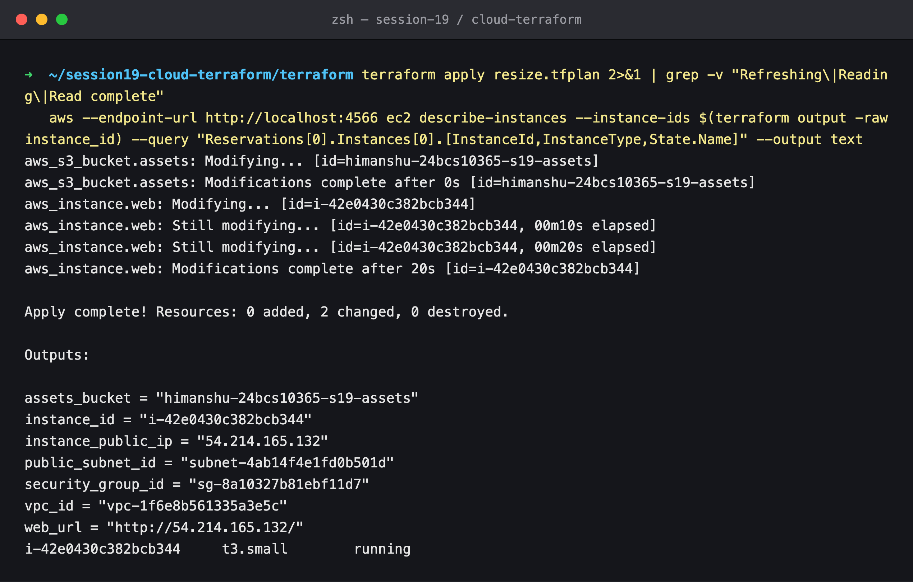

The instance `i-42e0430c382bcb344` is the **same instance**, now `t3.small` and running, with a **new** public IP (`54.214.213.190` → `54.214.165.132`), exactly as the plan predicted. Anything pointing at the old IP would now be broken. That is why real deployments put a load balancer or Elastic IP in front.

### 16. Converged

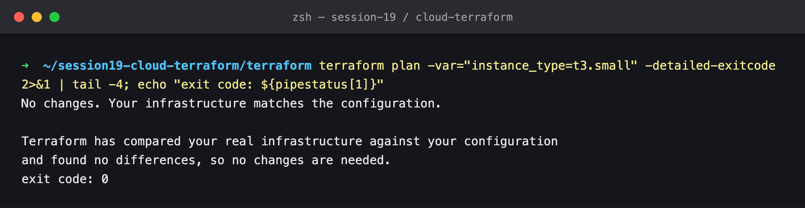

"No changes", exit code 0. Code, state and the API agree.

### 17. `terraform destroy`

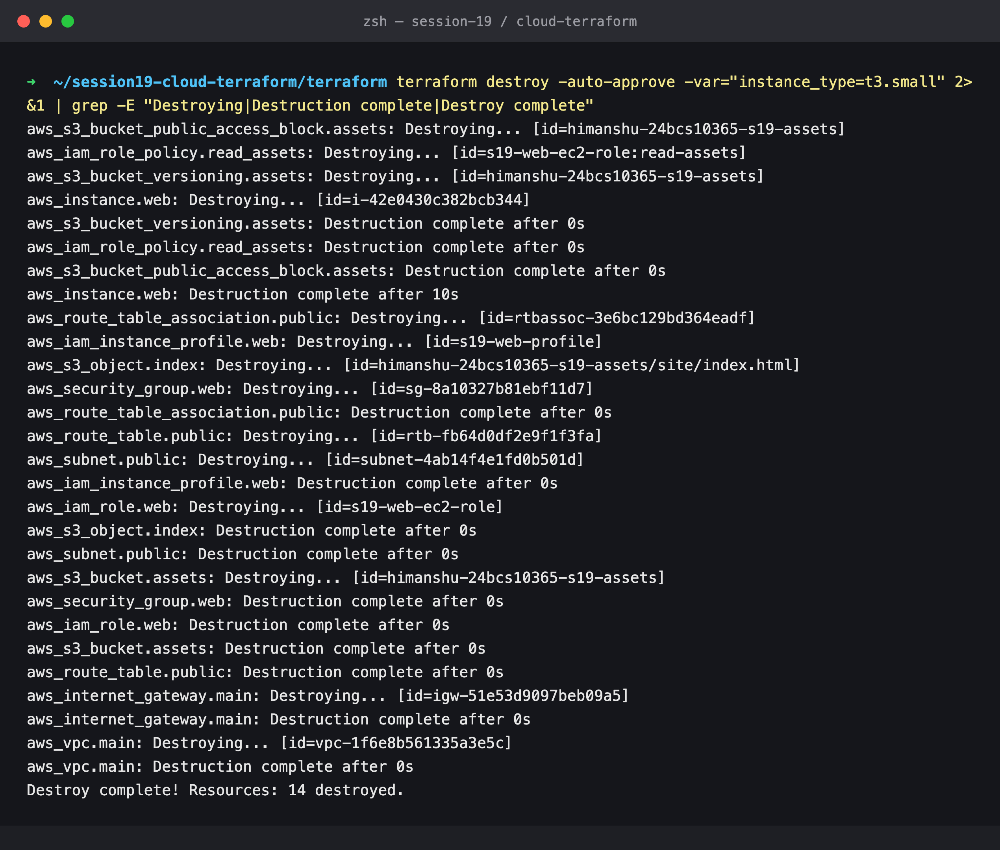

**Destroy complete! Resources: 14 destroyed.** The graph runs in reverse: the instance goes first (10 s), then the route association, profile, SG and S3 object, then the subnet, route table, role and bucket, then the IGW, and the VPC last.

### 18. Verify nothing is left

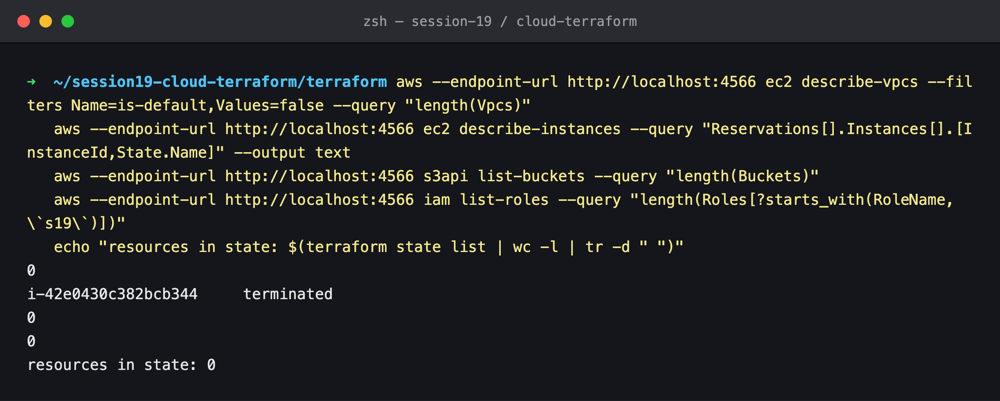

0 custom VPCs, 0 buckets, 0 `s19*` roles and 0 resources in state. The instance is listed as `terminated`, which is how AWS also keeps showing terminated instances for about an hour.

---

## Command summary

```bash
cd terraform
terraform init
terraform fmt -check -recursive
terraform validate
terraform plan -out=s19.tfplan
terraform graph | dot -Tpng -o ../dependency-graph.png
terraform apply s19.tfplan
terraform output
terraform state list
terraform state show aws_instance.web
terraform plan -detailed-exitcode            # 0 = converged, 2 = drift / pending changes
terraform plan  -var="instance_type=t3.small" -out=resize.tfplan
terraform apply resize.tfplan
terraform destroy -auto-approve -var="instance_type=t3.small"
```

## Cleanup

`terraform destroy` (step 17) removes all 14 resources, and step 18 confirms it. To stop the emulator: `docker rm -f localstack`.
