# Session 20 — Monitoring: Prometheus, Grafana & Alertmanager

## Name

Himanshu Rathi

## Roll No

`24BCS10365`

---

**Source folder:** `session20-monitoring-observability-gitops/01`–`04` (monitoring, metrics/logs/traces, Prometheus, Grafana)  
**Reference README:** the upstream lab READMEs in [`Nency-Ravaliya/devops-heros`](https://github.com/Nency-Ravaliya/devops-heros)

A full monitoring stack running *inside* the cluster (`kube-prometheus-stack`: Prometheus, Alertmanager, Grafana, node-exporter, kube-state-metrics and the Prometheus Operator) watching a real application. The demo covers each item the assignment lists: **metrics, logs, alerts, CPU utilisation, memory utilisation and application health**. Each one is shown with live data, and two alerts are taken all the way from healthy → firing → resolved.

Every terminal screenshot is the real output of the command shown above it. The UI screenshots are headless-Chrome captures of the real Prometheus, Alertmanager and Grafana UIs (reached via `kubectl port-forward`) taken while the scenario was running. Nothing is mocked.

---

## Environment

| | |
|---|---|
| **Cluster** | `kind` v0.31.0 — 1 control-plane + 2 workers (Kubernetes v1.35.0) |
| **Stack** | `kube-prometheus-stack` chart 92.1.0 — Prometheus v3.15.0, Alertmanager v0.34.1, Grafana 13.2.3, Prometheus Operator v0.94.1 |
| **Values** | [`monitoring-values.yaml`](./monitoring-values.yaml) |
| **App** | [`podinfo`](https://github.com/stefanprodan/podinfo) 6.15.0 — exposes `/metrics`, `/healthz`, `/readyz`, JSON logs |
| **Manifests** | [`manifests/app.yaml`](./manifests/app.yaml) (Deployment, Service, ServiceMonitor), [`alerts.yaml`](./manifests/alerts.yaml), [`load.yaml`](./manifests/load.yaml), [`dashboard.json`](./manifests/dashboard.json) |
| **Port-forwards** | Prometheus `19090`, Grafana `19300`, Alertmanager `19093` |
| **Date run** | 7 October 2026 |

> The course runs Prometheus and Grafana with `docker compose` next to the cluster. Here they run
> **inside** Kubernetes through the Prometheus Operator, which is how clusters are monitored in
> practice. Scrape targets are then declared as `ServiceMonitor` objects and alert rules as
> `PrometheusRule` objects, versioned with the app, and Prometheus doesn't need to be edited or
> restarted.

---

## How the pieces fit

```text
 podinfo Pods ──/metrics──┐                                   ┌──> Grafana (dashboards)
 kubelet/cAdvisor ────────┤   scrape every 15s                │
 node-exporter ───────────┼─────────────────────> Prometheus ─┤
 kube-state-metrics ──────┤   (targets found via              │
 control plane ───────────┘    ServiceMonitors)               └──> rules ──> Alertmanager
                                                                 (PrometheusRule)   (route/notify)
 kubectl logs  <── container stdout (JSON)                  kubectl top <── metrics-server
```

| Signal | Where it comes from here |
|---|---|
| App metrics (requests, status codes, latency) | podinfo's own `/metrics` (`http_request_duration_seconds_*`) |
| CPU / memory per container | kubelet's cAdvisor (`container_cpu_usage_seconds_total`, `container_memory_working_set_bytes`), and metrics-server for `kubectl top` |
| Node CPU | node-exporter (`node_cpu_seconds_total`) |
| Health and desired state | kube-state-metrics (`kube_deployment_status_replicas_available`, restarts), scrape health `up`, the `/healthz` and `/readyz` probes |
| Logs | container stdout, read with `kubectl logs` |
| Alerts | `PrometheusRule` → Prometheus evaluates → Alertmanager |

---

## Key takeaways

- A **fresh install of kube-prometheus-stack on kind starts out with alerts pending**: 6 control-plane targets are `DOWN` because kind binds the scheduler, controller-manager, kube-proxy and etcd metrics to `127.0.0.1`. That was fixed for real by rebinding three of them to `0.0.0.0` (all 27 targets `up` afterwards). etcd was deliberately left alone, for the reason given below, and `NodeClockNotSynchronising` was disabled as a kind-specific false positive.
- **Health and errors are different signals.** Disabling readiness on one Pod raised `PodinfoReplicasUnavailable` (Pod `0/1 Running`, removed from the Service's ready endpoints). Turning 10% of the traffic into HTTP 500s raised `PodinfoHighErrorRate` at exactly **10.03%**. Both fired, reached Alertmanager, and **resolved by themselves** once the cause was removed.
- **Bug found in my own alert rule:** `sum(...) / sum(...)` drops *every* label, so `PodinfoHighErrorRate` fired with **no `namespace` label**, and the dashboard's "firing alerts in s20-app" panel counted only 1 of the 2 alerts. Changing it to `sum by (namespace)` fixed it (steps 19–21).
- **Logs survive a crash only once:** after `/panic`, `kubectl logs --previous` shows the last line before the process died (`Panic command received`). Plain `kubectl logs` shows only the new container.
- **Utilisation "from requests" is meaningless without requests:** Grafana showed the namespace at **959% of requested CPU**, because the load generator sets no CPU request and was using 0.89 cores. Every Pod that should be measured against a budget needs `resources.requests`.

---

## Commands executed, with output

### Step 1 — Install the stack

The chart was first installed with the same settings passed as `--set` flags. It was then upgraded to the values file, which is why this shows revision 2. `--wait` returns only once every component is running.

```bash
helm upgrade --install kps prometheus-community/kube-prometheus-stack -n monitoring --version 92.1.0 \
  -f monitoring-values.yaml --wait --timeout 10m
kubectl get pods -n monitoring
```

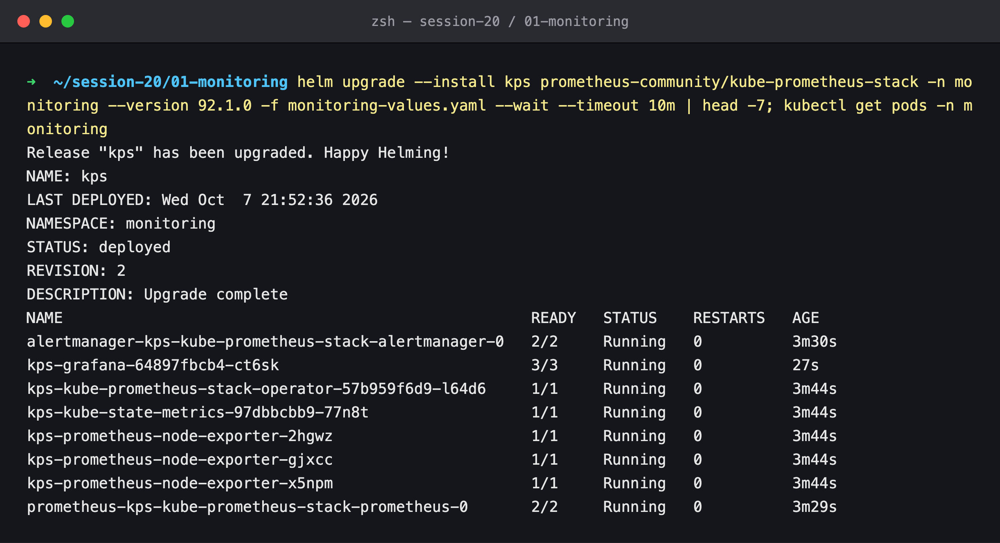

### Step 2 — First look: targets and alerts (before any fixes)

Right after the first install, 6 targets are `down` and 22 alert series are `pending`. They would fire once their `for:` window passes. The etcd, controller-manager, scheduler, kube-proxy, `TargetDown` and `NodeClockNotSynchronising` alerts are false positives caused by kind (steps 3–6). The rest (`KubePodNotReady`, `KubeContainerWaiting`, `KubeCPUOvercommit`/`KubeMemoryOvercommit`) are real: other labs were running workloads on this shared cluster at the same time.

```bash
curl -s localhost:19090/api/v1/targets | jq -r '.data.activeTargets[] | "\(.health) \(.labels.job)"' | sort | uniq -c
curl -s localhost:19090/api/v1/alerts  | jq -r '.data.alerts[] | "\(.state) \(.labels.alertname)"' | sort | uniq -c
```

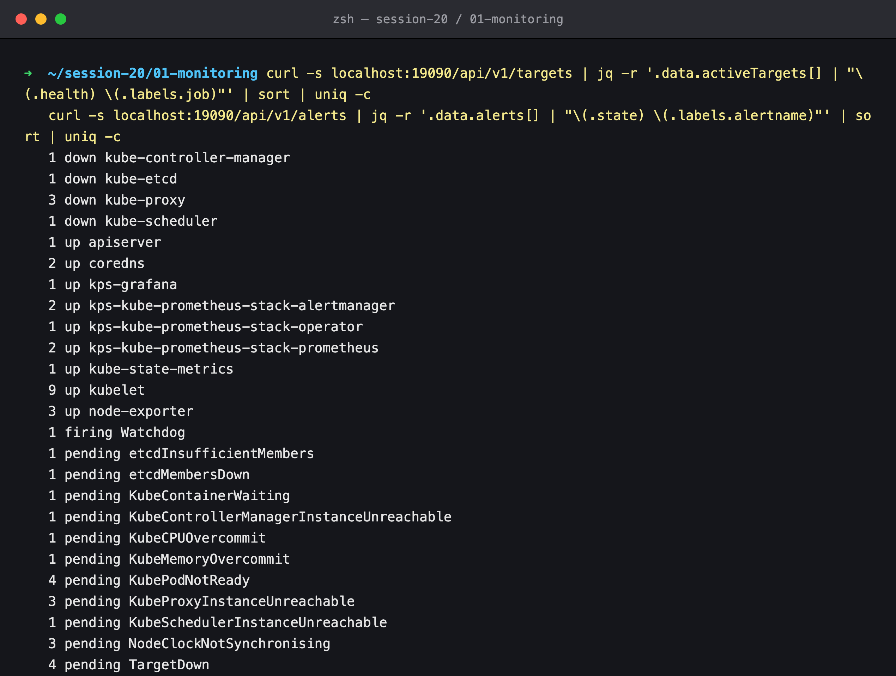

### Step 3 — Prometheus → Status → Target health, DOWN only

Every failure has the same cause: `connection refused` on the node IP.

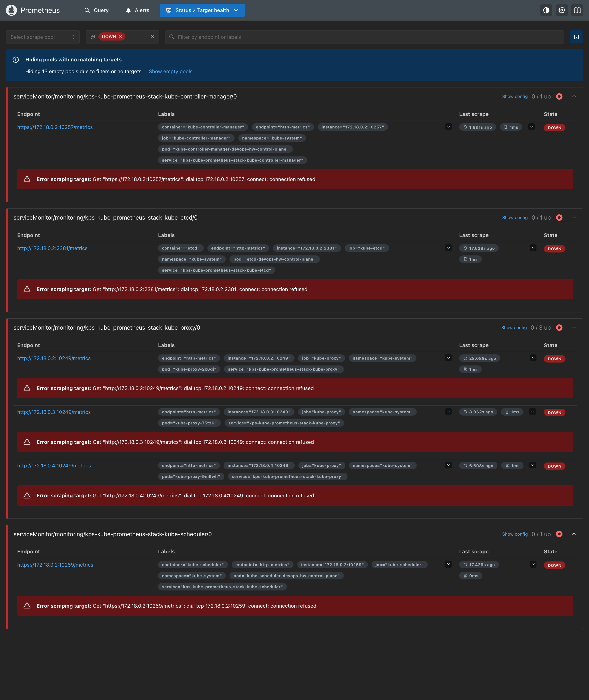

### Step 4 — Root cause: control-plane metrics bound to loopback

On the control-plane node, kube-proxy (`10249`), kube-scheduler (`10259`), kube-controller-manager (`10257`) and etcd (`2381`) all listen on **127.0.0.1** only, and kube-proxy's `metricsBindAddress` is empty (which means localhost). Prometheus runs in a Pod, so it can never reach them.

```bash
docker exec devops-hw-control-plane sh -c 'ss -ltnp | grep -E ":(10257|10259|2381|10249) "'
kubectl -n kube-system get cm kube-proxy -o jsonpath='{.data.config\.conf}' | grep metricsBindAddress
```

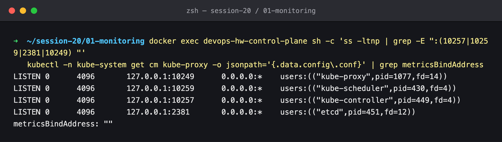

### Step 5 — Fix kube-proxy

```bash
kubectl -n kube-system get cm kube-proxy -o yaml | sed 's/metricsBindAddress: ""/metricsBindAddress: 0.0.0.0:10249/' | kubectl apply -f -
kubectl -n kube-system rollout restart ds kube-proxy && kubectl -n kube-system rollout status ds kube-proxy
```

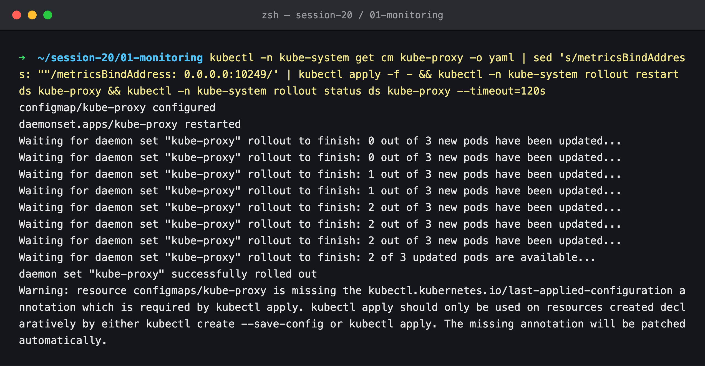

### Step 6 — Fix kube-scheduler and kube-controller-manager

These are static Pods. The kubelet watches `/etc/kubernetes/manifests` and restarts a component as soon as its manifest changes. After the restart all three ports listen on `*`.

```bash
docker exec devops-hw-control-plane sh -c 'sed -i s/--bind-address=127.0.0.1/--bind-address=0.0.0.0/ \
  /etc/kubernetes/manifests/kube-scheduler.yaml /etc/kubernetes/manifests/kube-controller-manager.yaml'
docker exec devops-hw-control-plane sh -c 'ss -ltnp | grep -E ":(10257|10259|10249) "'
```

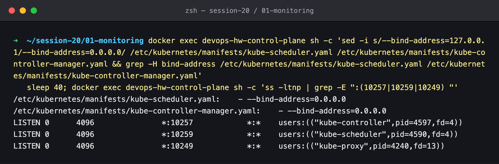

**Why not etcd too?** The same edit to `etcd.yaml` restarts the cluster's *only* etcd member, which takes the API server down for the duration. This cluster is shared with other running labs, so its scrape was disabled in [`monitoring-values.yaml`](./monitoring-values.yaml) (`kubeEtcd.enabled: false`). On a real cluster, the fix is to set `--listen-metrics-urls=http://0.0.0.0:2381` when the cluster is created, for example through kind's `kubeadmConfigPatches`. The same values file disables `NodeClockNotSynchronising`, because kind nodes are containers with no NTP daemon, so `node_timex_sync_status` is always 0 even though the host clock is correct.

### Step 7 — Every target up

All 27 targets are now `up`. (The step 1 upgrade, which removed the etcd scrape, was run between steps 6 and 7.)

```bash
curl -s localhost:19090/api/v1/targets | jq -r '.data.activeTargets[] | "\(.health) \(.labels.job)"' | sort | uniq -c
```

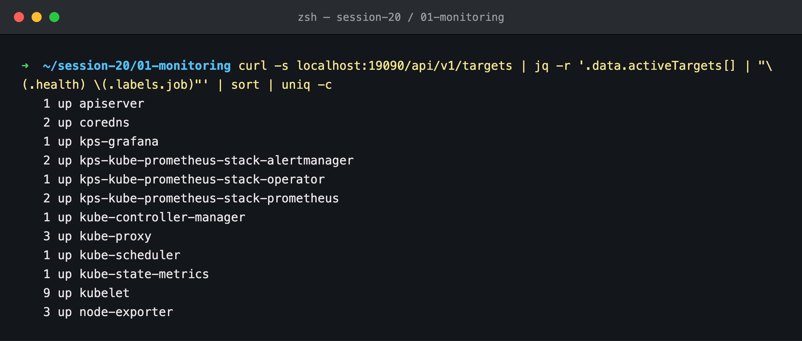

### Step 8 — Deploy the application, its ServiceMonitor and its alert rules

podinfo runs with 2 replicas, CPU and memory requests and limits, a liveness probe on `/healthz` and a readiness probe on `/readyz`. The `ServiceMonitor` tells the operator to scrape `/metrics` every 15s, and the `PrometheusRule` holds three alerts ([`alerts.yaml`](./manifests/alerts.yaml)).

```bash
kubectl apply -f manifests/app.yaml -f manifests/alerts.yaml
kubectl -n s20-app rollout status deploy/podinfo
kubectl get pods,svc,servicemonitor,prometheusrule -n s20-app
```

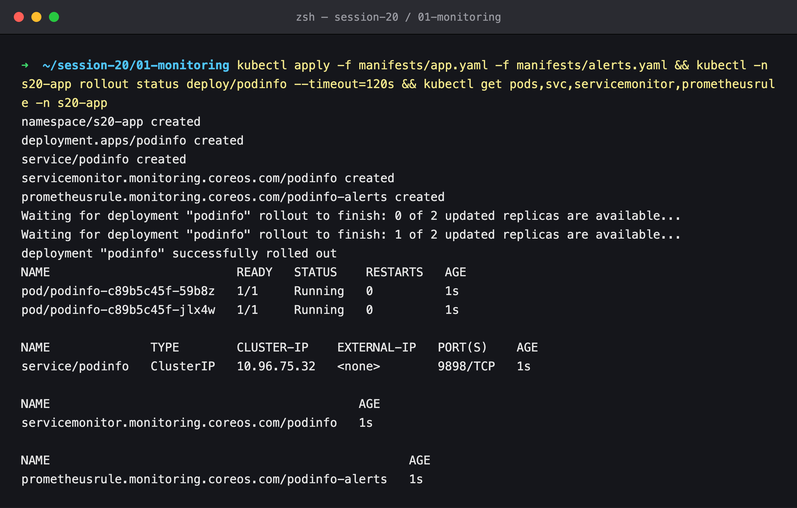

| Alert | Expression (summary) | Signal |
|---|---|---|
| `PodinfoReplicasUnavailable` | available replicas < desired, for 1m | application health |
| `PodinfoHighErrorRate` | 5xx / all requests > 5%, for 1m | errors |
| `PodinfoHighCPU` | container CPU > 80% of its limit, for 1m | saturation |

### Step 9 — Start traffic and load the dashboard

The traffic comes from [`manifests/load.yaml`](./manifests/load.yaml), applied with `kubectl apply -f manifests/load.yaml`: one curl loop against the Service, with `ERROR_EVERY=0` (no errors yet). The Grafana dashboard ([`dashboard.json`](./manifests/dashboard.json)) is shipped as a ConfigMap labelled `grafana_dashboard: "1"`. Grafana's sidecar watches for that label and loads the dashboard without anyone clicking through the UI.

```bash
kubectl get pods -n s20-app -o wide
kubectl apply -f manifests/dashboard-configmap.yaml
```

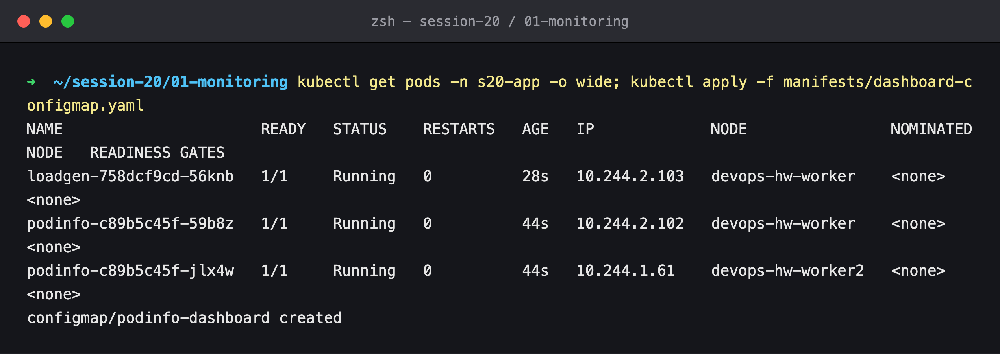

### Step 10 — Metrics: request rate and latency

[`promql.sh`](./promql.sh) sends a PromQL query to Prometheus's HTTP API. About 196 req/s spread across both Pods, all `200`. The single `500` series comes from one manual `/status/500` test made while checking the endpoints, so its current rate is 0. p95 latency is 4.75 ms.

```bash
./promql.sh 'sum by (pod, status) (rate(http_request_duration_seconds_count{namespace="s20-app"}[1m]))'
./promql.sh 'histogram_quantile(0.95, sum by (le) (rate(http_request_duration_seconds_bucket{namespace="s20-app"}[1m])))'
```

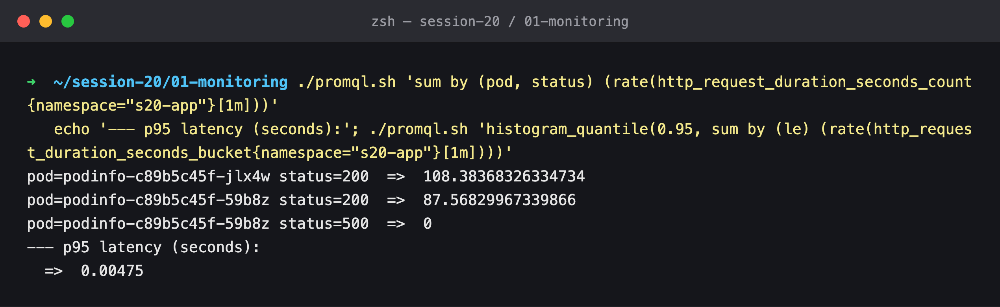

### Step 11 — CPU and memory utilisation

`kubectl top` (from metrics-server) and PromQL (from cAdvisor) measure the same thing from two sources. Each podinfo Pod uses about 25 MiB, 77% of its 32 Mi request. The load generator is the busiest container. Node CPU is 7–19%.

```bash
kubectl top pods -n s20-app
./promql.sh 'sum by (pod) (rate(container_cpu_usage_seconds_total{namespace="s20-app",container!=""}[1m]))'
./promql.sh 'sum by (pod) (container_memory_working_set_bytes{namespace="s20-app",container!=""}) / 2^20'
./promql.sh '100 * (1 - avg by (instance) (rate(node_cpu_seconds_total{mode="idle"}[2m])))'
```

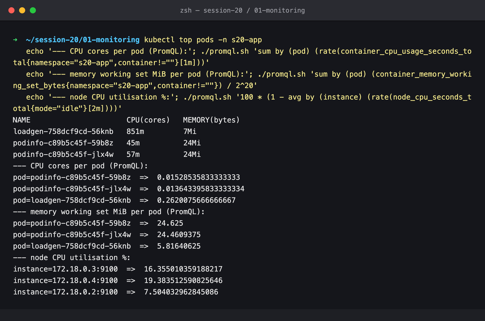

### Step 12 — Application health

Health has four layers: Prometheus can scrape both Pods (`up = 1`), 2 of 2 replicas are available, there are 0 restarts, and the probe endpoints themselves return `{"status":"OK"}`.

```bash
./promql.sh 'up{namespace="s20-app"}'
./promql.sh 'sum by (deployment) (kube_deployment_status_replicas_available{namespace="s20-app"})'
./promql.sh 'sum by (deployment) (kube_deployment_spec_replicas{namespace="s20-app"})'
./promql.sh 'sum by (pod) (kube_pod_container_status_restarts_total{namespace="s20-app"})'
kubectl -n s20-app exec deploy/podinfo -- sh -c 'wget -qO- localhost:9898/healthz; wget -qO- localhost:9898/readyz'
```

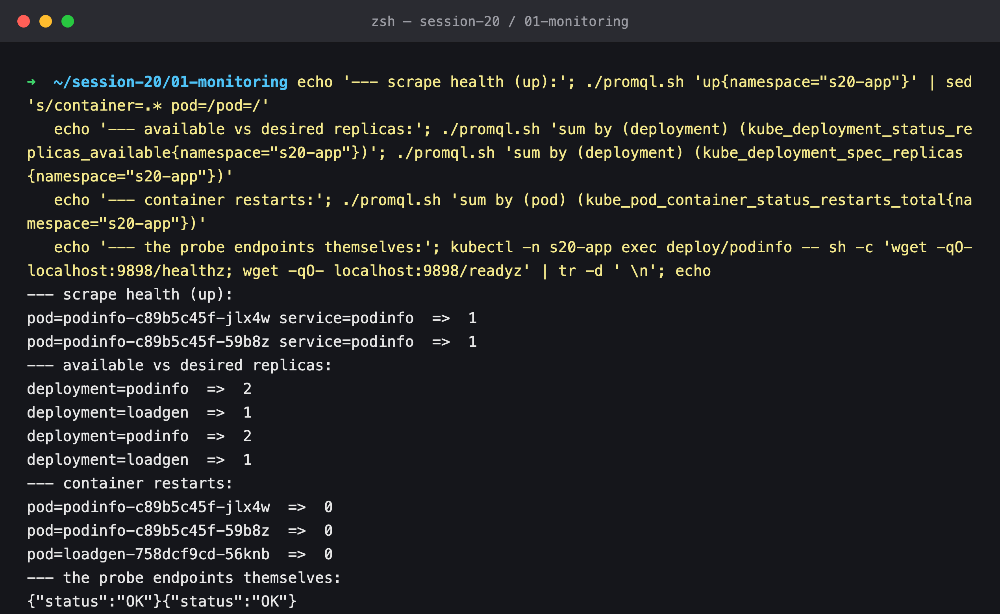

### Step 13 — Logs, including the logs of a crashed container

podinfo writes structured JSON logs. Hitting `/panic` kills the process. The kubelet restarts the container (`RESTARTS 1`), and `--previous` retrieves the dead container's last lines, ending in `"msg":"Panic command received"`. Plain `kubectl logs` would show only the fresh container's startup lines.

```bash
kubectl logs -n s20-app $P
kubectl exec -n s20-app $P -- wget -qO- localhost:9898/panic
kubectl get pod -n s20-app $P
kubectl logs -n s20-app $P --previous | tail -4
```

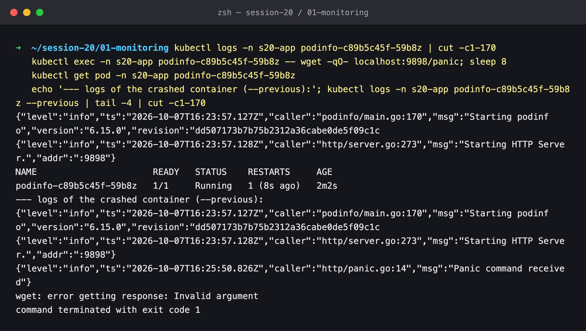

---

### Alerts: break it, watch it fire, fix it

### Step 14 — Inject two faults

1. Every 10th request from the load generator now goes to `/status/500`.
2. One Pod's readiness is turned off (`POST /readyz/disable`). It stays `Running` but becomes `0/1` ready, and the Service stops sending it traffic. The EndpointSlice still *lists* its address, flagged `ready: false`, which `kubectl get` doesn't show.

```bash
kubectl set env -n s20-app deploy/loadgen ERROR_EVERY=10
kubectl exec -n s20-app $P -- wget -qO- --post-data='' localhost:9898/readyz/disable
kubectl get pods -n s20-app -l app=podinfo
```

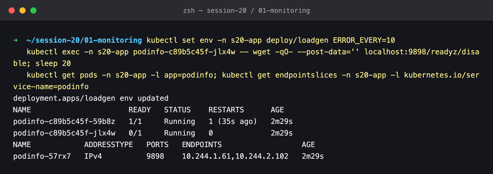

### Step 15 — Both alerts fire and reach Alertmanager

After the 1-minute `for:` window, both rules move from `pending` to `firing`. The error ratio is exactly the injected **10.03%**. Alertmanager receives them with their severities. `Watchdog` is always firing by design, as a heartbeat that proves the alerting pipeline itself works. Two built-in alerts (`KubePodNotReady`, `KubeDeploymentReplicasMismatch`) are `pending` on the same readiness fault. They use 15-minute windows, which is why custom rules are written with tighter thresholds for a specific app.

```bash
curl -s localhost:19090/api/v1/alerts | jq -r '.data.alerts[] | "\(.state)\t\(.labels.alertname)\t\(.annotations.summary)"'
curl -s localhost:19093/api/v2/alerts | jq -r '.[] | "\(.status.state)\t\(.labels.alertname)\t\(.labels.severity)"'
```

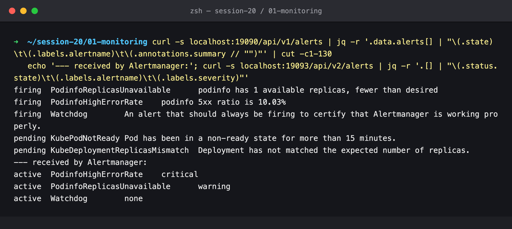

### Step 16 — Prometheus → Alerts (firing)

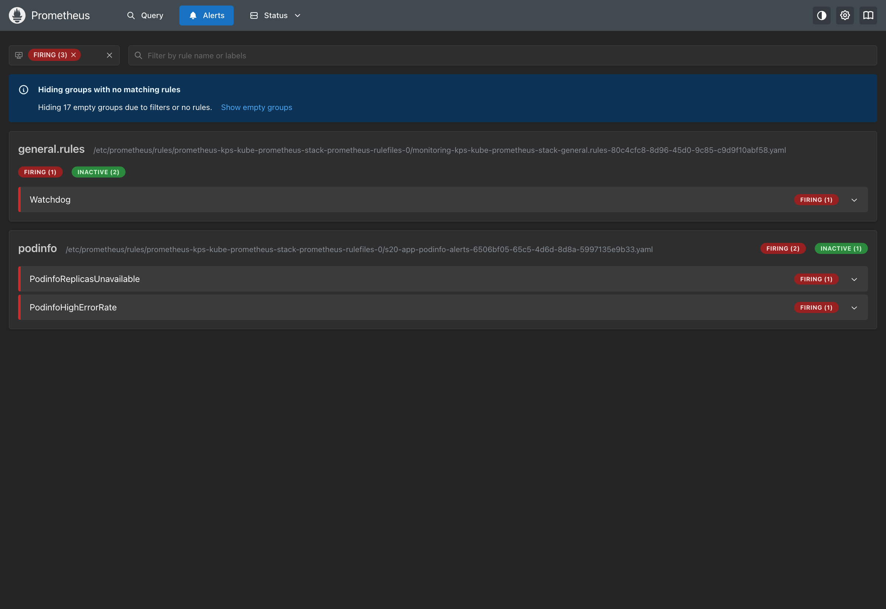

### Step 17 — Alertmanager UI

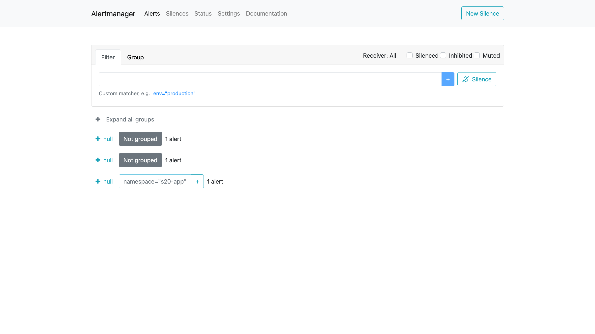

### Step 18 — Grafana: the podinfo dashboard during the incident

Ready replicas has dropped to **1** (orange), the 5xx ratio is **10.0%** (red), and the request-rate panel shows the `500` series appear next to `200`. The CPU panel shows the unready Pod's CPU falling to almost zero once it stopped receiving traffic. **But "Firing alerts (s20-app)" reads 1, not 2**, which led to the next step.

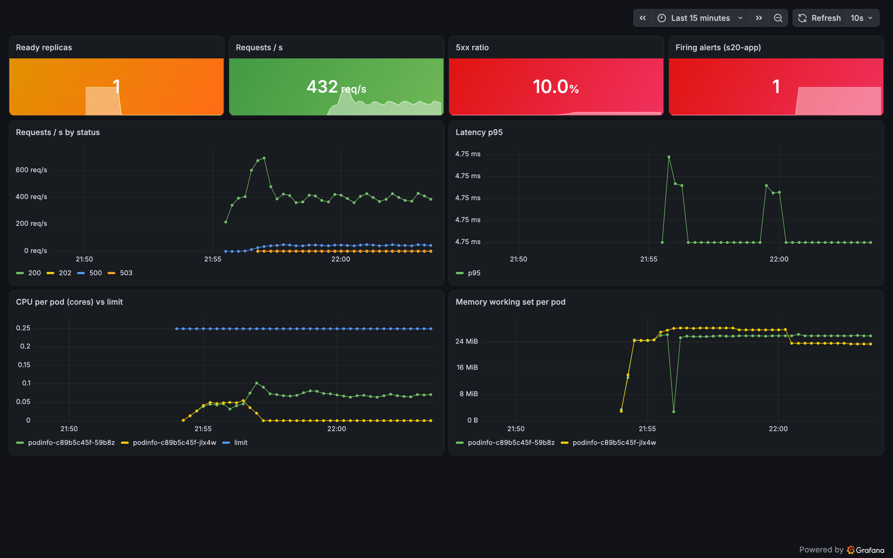

### Step 19 — Bug: the error-rate alert has no namespace

`PodinfoReplicasUnavailable` carries `namespace=s20-app` because it comes from kube-state-metrics series. `PodinfoHighErrorRate` has only `alertname` and `severity`, because `sum(...)` with no `by` throws away every label. Anything that selects alerts by namespace, such as this dashboard panel, an Alertmanager route or a team's inbox, silently misses it.

```bash
./promql.sh 'ALERTS{alertname=~"Podinfo.*",alertstate="firing"}'
```

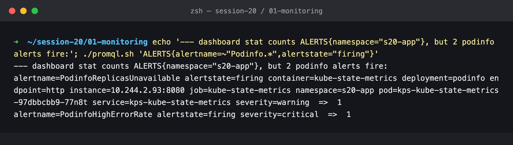

### Step 20 — Fix: aggregate `by (namespace)`

```yaml
expr: |
  sum by (namespace) (rate(http_request_duration_seconds_count{namespace="s20-app",status=~"5.."}[1m]))
    / sum by (namespace) (rate(http_request_duration_seconds_count{namespace="s20-app"}[1m])) > 0.05
```

The fixed rule had been applied, together with a dashboard tweak (the latency axis now starts at 0), as soon as the bug was found. This screenshot is a re-run of the apply, so it reports `unchanged`, and the query shows the re-evaluated alert now carrying `namespace=s20-app`.

```bash
kubectl apply -f manifests/alerts.yaml -f manifests/dashboard-configmap.yaml
./promql.sh 'ALERTS{alertname=~"Podinfo.*",alertstate="firing"}'
```

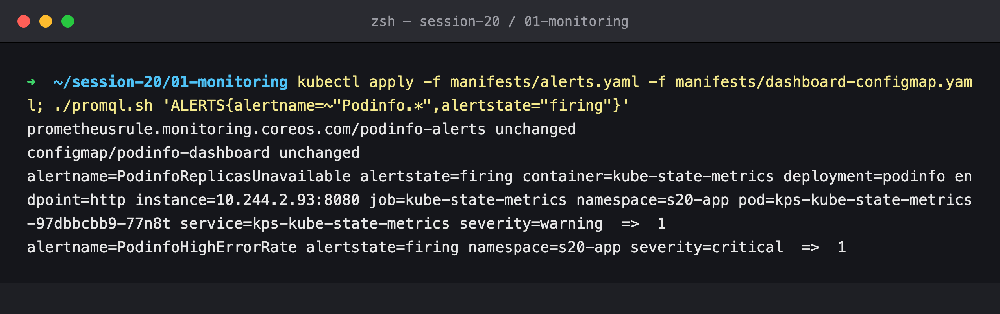

### Step 21 — Grafana after the fix

The firing-alerts panel now counts **2**.

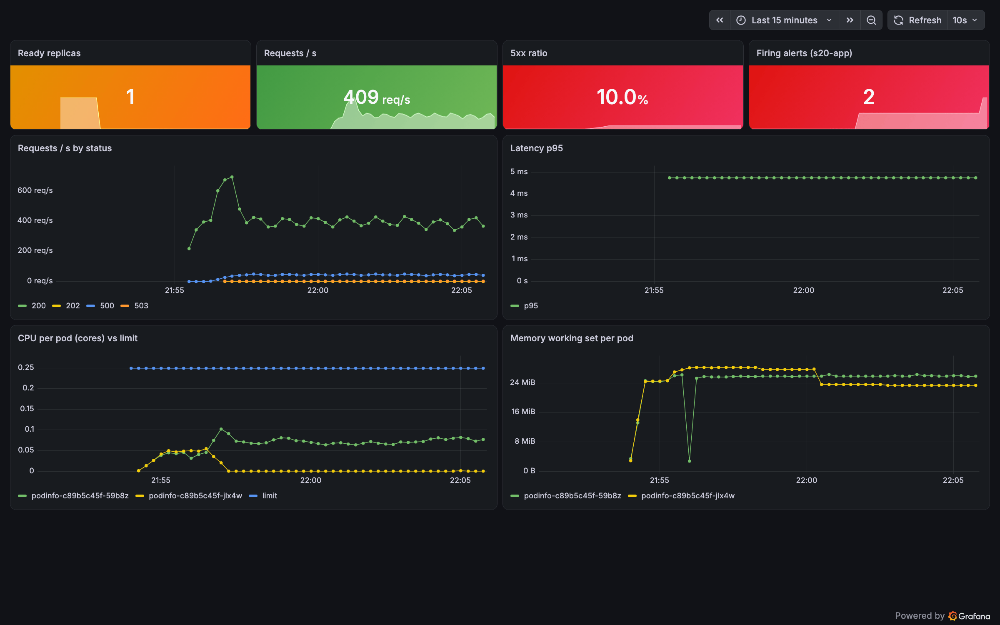

### Step 22 — Built-in dashboard: Kubernetes / Compute Resources / Namespace (Pods)

This is CPU and memory utilisation against requests and limits, per Pod, from the dashboards the chart ships. Two real observations:

- **"CPU Utilisation (from requests)" = 959%**. The load generator has no CPU request, and it uses 0.89 cores, so the namespace's usage is divided by a total request that leaves it out. A container without requests is invisible to every "% of request" calculation, and also to the scheduler's capacity planning.
- The unready podinfo Pod (`jlx4w`) uses only 0.0005 cores. Readiness removed it from the Service, so it gets no traffic.

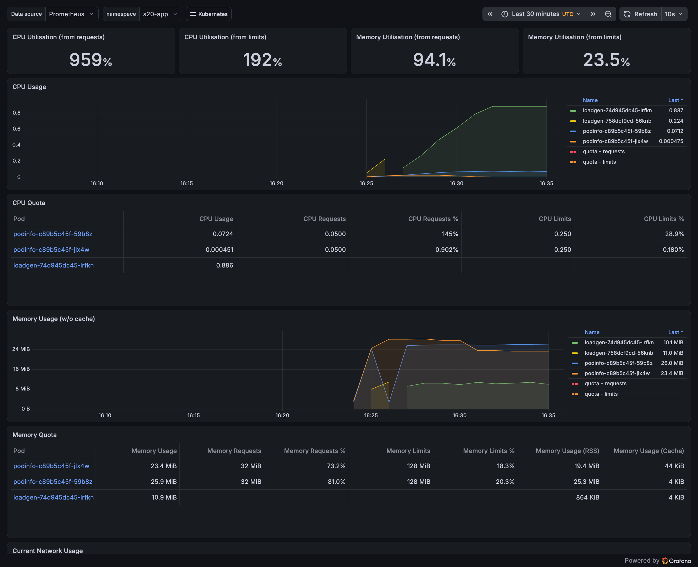

### Step 23 — Recover, and the alerts resolve themselves

The load generator is set back to `ERROR_EVERY=0` and readiness re-enabled (`POST /readyz/enable`). Both Pods are `1/1` again, no podinfo alerts are pending or firing, and Alertmanager holds only `Watchdog`. The 5xx ratio, 4.1% here, is still falling as the 1-minute `rate()` window moves past the errors. It was already below the 5% threshold, which is why the alert resolved.

```bash
kubectl get pods -n s20-app -l app=podinfo
./promql.sh 'ALERTS{alertname=~"Podinfo.*"}'
./promql.sh 'sum by (namespace) (rate(...{status=~"5.."}[1m])) / sum by (namespace) (rate(...[1m]))'
curl -s localhost:19093/api/v2/alerts | jq -r '.[] | "\(.status.state)\t\(.labels.alertname)"'
```

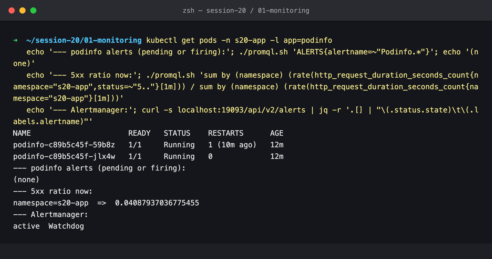

`PodinfoHighCPU` never fired in this run. Each podinfo Pod peaked at about 0.07 of its 0.25-core limit (29%), well under the 80% threshold. The rule is deployed and evaluated (health `ok`), but this demo didn't push the app hard enough to trip it.

### Step 24 — Cleanup

```bash
kubectl delete -f manifests/load.yaml -f manifests/alerts.yaml -f manifests/app.yaml
kubectl delete -f manifests/dashboard-configmap.yaml
```

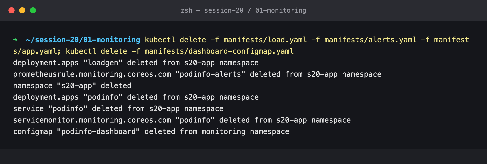

---

## Cleanup

The `s20-app` namespace (app, load generator, ServiceMonitor, rules) and the dashboard ConfigMap were deleted. **The `kps` monitoring stack is left installed in the `monitoring` namespace**, and so are the kube-proxy, scheduler and controller-manager metric rebinds, so later labs and the final project can use the monitoring. Remove everything with `helm uninstall kps -n monitoring`.
