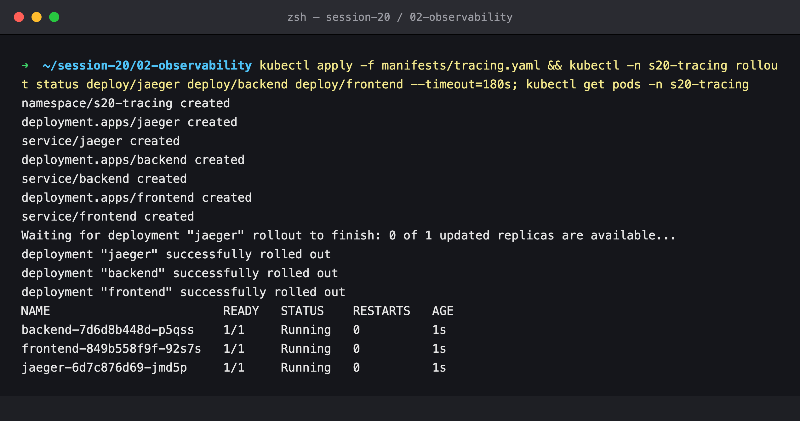
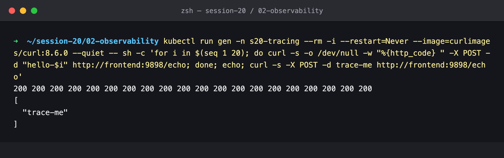
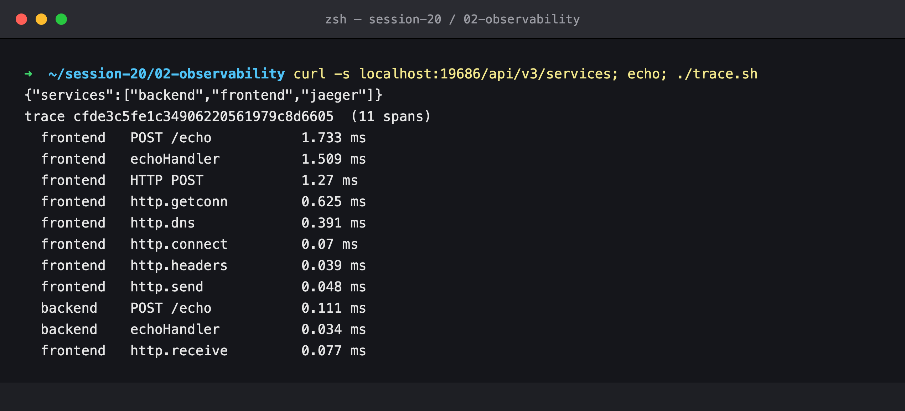
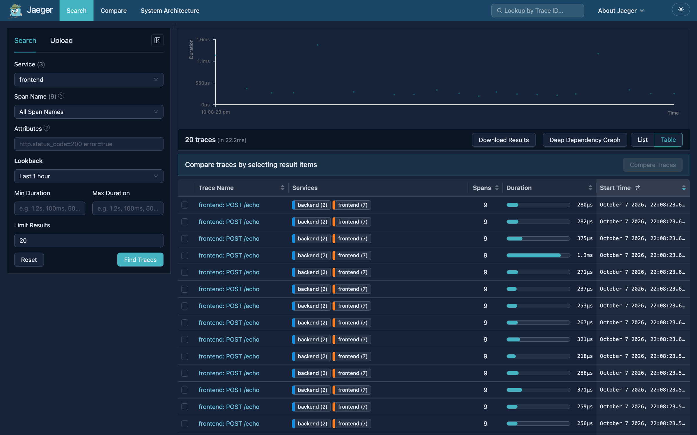
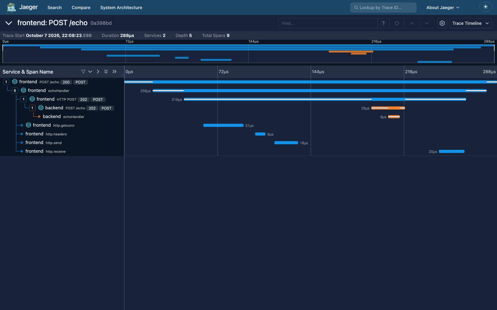
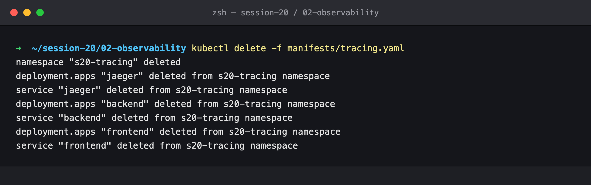

# Session 20 — Observability: Metrics, Logs & Traces

## Name

Himanshu Rathi

## Roll No

`24BCS10365`

---

**Source folder:** `session20-monitoring-observability-gitops/01-monitoring-vs-observability`, `02-metrics-logs-traces`  
**Reference README:** the upstream lab READMEs in [`Nency-Ravaliya/devops-heros`](https://github.com/Nency-Ravaliya/devops-heros)

This document covers what each of the three pillars means, why observability is needed, the common tools, and how it all applies to Kubernetes. **Metrics** and **logs** were demonstrated live in [`01-monitoring`](../01-monitoring/submission.md). The third pillar, **traces**, is demonstrated live below with OpenTelemetry and Jaeger: a request that crosses two services and is recorded as one trace.

---

## Monitoring vs observability

| | Monitoring | Observability |
|---|---|---|
| Question it answers | "Is something wrong?" | "*Why* is it wrong, and where?" |
| Works from | Known failure modes, decided in advance (dashboards, thresholds) | Rich telemetry you can slice in ways you didn't plan for |
| Typical output | An alert: *5xx ratio 10% > 5%* | The answer: *the 500s come from path X, on pod Y, after deploy Z, inside call W* |
| Relationship | A subset of observability | Includes monitoring |

Monitoring tells you that `PodinfoHighErrorRate` is firing ([01-monitoring step 15](../01-monitoring/submission.md)). Observability is being able to go from there to the exact request, Pod and code path without shipping new instrumentation first.

---

## The three pillars

| Pillar | What it is | Shape of the data | Good at | Bad at | Seen in this repo |
|---|---|---|---|---|---|
| **Metrics** | Numeric measurements sampled over time, with labels | `http_request_duration_seconds_count{status="500",pod="…"} 1234` | Trends, rates, percentiles, alerting. Very cheap to store and query at scale | Explaining a single request. High-cardinality labels (user ID, request ID) blow up storage | Prometheus queries for req/s, p95 latency, CPU and memory ([01 steps 10–12](../01-monitoring/submission.md)) |
| **Logs** | Timestamped records of discrete events | `{"level":"info","ts":"…","msg":"Panic command received"}` | Full detail of *one* event: error messages, stack traces, audit trails | Aggregation across millions of lines is expensive. Hard to follow one request across services | `kubectl logs`, `--previous` after a crash ([01 step 13](../01-monitoring/submission.md)) |
| **Traces** | The path of *one request* through every service it touches, as a tree of timed **spans** | trace `0a398bd…`: `frontend POST /echo` → `HTTP POST` → `backend POST /echo` | Where time goes in a distributed call, and which hop failed | Usually sampled. Require instrumentation of the code | Jaeger, below |

**How they work together.** A metric alert says *something is slow*. A trace shows *which service and which call* is slow. The logs for that span show *what exactly happened*. Correlating them needs shared identifiers: the same `pod`/`namespace` labels on metrics and logs, and the **trace ID** written into log lines.

---

## Why observability is needed

- **Distributed systems fail between components.** With one process a stack trace is enough. With ten services, a slow response could come from any hop, any replica, the DNS lookup or the connection pool. In the trace below, even DNS resolution (`http.dns`) and connection setup (`http.connect`) show up as separate timed steps.
- **Containers are short-lived.** A crashed Pod's filesystem is gone, and `kubectl logs --previous` keeps only *one* previous container. Telemetry has to be shipped off the Pod to outlive it.
- **Unknown unknowns.** Dashboards only cover the questions someone thought to ask in advance. During an incident you need to ask new questions of data that already exists.
- **Business impact.** Error budgets and SLOs (for example "99.9% of requests under 300 ms") are measured with metrics. Mean time to resolution depends on how quickly traces and logs lead to the cause.

---

## Common tools

| Pillar | Collect / instrument | Store and query | Visualise |
|---|---|---|---|
| Metrics | Prometheus client libraries, exporters (node-exporter, kube-state-metrics), OpenTelemetry SDK | **Prometheus**, Thanos / Mimir / VictoriaMetrics (long-term) | **Grafana** |
| Logs | stdout + Fluent Bit / Fluentd / Promtail / Vector / OTel Collector | **Loki**, Elasticsearch / OpenSearch | Grafana, Kibana |
| Traces | **OpenTelemetry** SDKs (vendor-neutral standard), OTel Collector | **Jaeger**, Tempo, Zipkin | Jaeger UI, Grafana |
| Alerts | Prometheus rules | — | **Alertmanager** → Slack / PagerDuty / email |
| All-in-one SaaS | agents | Datadog, New Relic, Grafana Cloud, Honeycomb | built-in |

**OpenTelemetry (OTel)** matters because it separates *instrumentation* from the *backend*. The app below emits standard OTLP spans, and switching from Jaeger to Tempo or Datadog only changes the endpoint, not the code.

---

## Kubernetes observability

| Layer | Signal | Source |
|---|---|---|
| Cluster / control plane | API server latency, etcd health, scheduler queue | `apiserver`, `kube-scheduler`, `kube-controller-manager`, `etcd` metrics endpoints (01 steps 3–7 fixed these on kind) |
| Nodes | CPU, memory, disk, network | **node-exporter** |
| Containers | CPU, memory, throttling, restarts | **cAdvisor** inside the kubelet (`container_*`); **metrics-server** for `kubectl top` and HPA |
| Object state | Desired vs available replicas, Pod phase, readiness | **kube-state-metrics** (`kube_deployment_*`, `kube_pod_*`) |
| Application | Request rate, errors, latency (RED) | App's own `/metrics` via a `ServiceMonitor` |
| Events | Scheduling failures, OOMKills, probe failures, image pulls | `kubectl get events` (kept for only about 1 hour by default, so they're usually exported) |
| Logs | stdout/stderr of every container | `kubectl logs`; node-level agent (DaemonSet) → Loki/Elasticsearch |
| Traces | Request path across Services | OTel SDK in the app → OTel Collector / Jaeger |
| Health | Liveness, readiness and startup probes | kubelet acts on them. Readiness also controls whether a Pod gets Service traffic (01 step 14) |

Kubernetes-specific points: label everything consistently (`app`, `namespace`, `pod`) so signals can be joined. Ship logs off the node, because Pods are ephemeral. Set resource **requests**, because every "% utilisation" panel divides by them (01 step 22 showed 959% because one container had none). Prefer the operator pattern (`ServiceMonitor`, `PrometheusRule`) so that monitoring config ships with the app.

---

## Live demo: distributed tracing with OpenTelemetry and Jaeger

Every command below was run against the live cluster, and each terminal screenshot is the real output of the command shown above it. The Jaeger UI was captured with headless Chrome through `kubectl port-forward svc/jaeger 19686:16686`.

| | |
|---|---|
| **Cluster** | `kind` v0.31.0, Kubernetes v1.35.0 |
| **Tracing backend** | Jaeger 2.22.0 (all-in-one: OTLP receiver + in-memory store + UI) |
| **Services** | two `podinfo` 6.15.0 Deployments, `frontend` and `backend`, instrumented with OpenTelemetry (`--otel-service-name`, exporting OTLP gRPC to `jaeger:4317`) |
| **Manifest** | [`manifests/tracing.yaml`](./manifests/tracing.yaml) |
| **Date run** | 7 October 2026 |

```text
curl ──POST /echo──> frontend ──POST /echo──> backend
                        │                        │
                        └──── OTLP spans ────────┴──> Jaeger ──> UI / API
```

`frontend` runs with `--backend-url=http://backend:9898/echo`, so every `POST /echo` it receives is forwarded to `backend`. The OTel SDK propagates the trace context in the `traceparent` HTTP header, so the backend's spans join the *same* trace.

### Step 1 — Deploy Jaeger and the two services

```bash
kubectl apply -f manifests/tracing.yaml
kubectl -n s20-tracing rollout status deploy/jaeger deploy/backend deploy/frontend
kubectl get pods -n s20-tracing
```



### Step 2 — Send 21 requests through the frontend

All 20 return `200`, and the last one echoes its body back from the backend. (The `couldn't attach` warning is a harmless `kubectl run --rm -i` race in which the Pod finished before kubectl attached.)

```bash
kubectl run gen -n s20-tracing --rm -i --restart=Never --image=curlimages/curl:8.6.0 -- sh -c \
  'for i in $(seq 1 20); do curl -s -o /dev/null -w "%{http_code} " -X POST -d "hello-$i" http://frontend:9898/echo; done; \
   curl -s -X POST -d trace-me http://frontend:9898/echo'
```



### Step 3 — One trace, read from Jaeger's API

Jaeger knows three services: `frontend`, `backend` and itself. [`trace.sh`](./trace.sh) fetches one trace and prints its spans in start order. A single request produced **11 spans in 2 services**: the frontend's server span, its handler, the outgoing `HTTP POST` (broken down into `getconn` → `dns` → `connect` → `headers` → `send`), then the **backend's** `POST /echo` and handler nested inside it, and finally `http.receive`. The whole request took 1.7 ms, and the DNS lookup alone was 0.39 ms, more than three times the backend's entire 0.11 ms.

```bash
curl -s localhost:19686/api/v3/services
./trace.sh
```



### Step 4 — Jaeger UI: search

20 traces for `frontend`. Each spans `backend (2)` + `frontend (7)` = 9 spans, at about 250–375 µs. The step 3 trace had **11** spans and 1.7 ms because it was the *first* request of a run: it paid for the DNS lookup and TCP connect. Later requests reuse the pooled keep-alive connection, so the `http.dns` and `http.connect` spans disappear. A detail like that shows up only in traces.



### Step 5 — Jaeger UI: one trace as a waterfall

Duration 288 µs, 2 services, depth 5. The backend's spans (orange) sit inside the frontend's outgoing `HTTP POST`. The backend answered `202` and the frontend returned `200` to the client. Both status codes are recorded as span attributes.



### Step 6 — Cleanup

```bash
kubectl delete -f manifests/tracing.yaml
```


