# Session 20 — GitOps with Argo CD (Mini Project)

## Name

Himanshu Rathi

## Roll No

`24BCS10365`

---

**Source folder:** `session20-monitoring-observability-gitops/05-introduction-to-gitops`, `06-git-as-source-of-truth`, `07-argocd`, `08-mini-project`  
**Reference README:** the upstream lab READMEs in [`Nency-Ravaliya/devops-heros`](https://github.com/Nency-Ravaliya/devops-heros)

The Session 20 mini project, run for real against **this repository**. Argo CD in the cluster watches [`19_Monitoring_Observability_GitOps/03-gitops/app/`](./app) on the `main` branch of `github.com/Heyy-Himanshuu/Devops-Assignment-01`. Git changes reach the cluster with no `kubectl apply`, manual changes to the cluster are reverted, and both behaviours are timed.

Every terminal screenshot is the real output of the command shown above it. The Argo CD UI screenshots are headless-Chrome captures of the real UI through `kubectl port-forward`. The two Git commits that drove the demo are real and are in this repo's history: [`134cf6f`](https://github.com/Heyy-Himanshuu/Devops-Assignment-01/commit/134cf6f) and [`2b0efb5`](https://github.com/Heyy-Himanshuu/Devops-Assignment-01/commit/2b0efb5).

---

## GitOps in brief

**GitOps** means running infrastructure and applications by making a Git repository the single, declarative description of what should be running, and having an agent *inside* the cluster continuously make reality match it.

| Principle | What it means | In this demo |
|---|---|---|
| **Declarative** | Describe the *desired end state* (YAML), not the steps to reach it | [`app/deployment.yaml`](./app/deployment.yaml) says `replicas: 3`. Nobody runs `kubectl scale` |
| **Versioned and immutable (Git as source of truth)** | Every change is a commit: reviewed, attributed, revertible | the scale-up is commit `2b0efb5`, author and message shown in the Argo CD UI |
| **Pulled automatically** | An agent in the cluster *pulls* from Git. CI never needs cluster credentials | Argo CD polls the public repo every 30 s |
| **Continuously reconciled** | The agent compares desired (Git) with actual (cluster) forever and corrects drift | `kubectl scale --replicas=1` was undone within 3 s |

```text
 developer ──git push──> Git (desired state)
                              │  poll / webhook
                              v
                         Argo CD  ──compare──>  Kubernetes (actual state)
                              │                      │
                              └──── reconcile <──────┘   (sync, self-heal, prune)
```

**Push-based CD vs GitOps (pull).** In a push pipeline, CI runs `kubectl apply` or `helm upgrade` against the cluster, so CI holds admin credentials, and a manual change made afterwards stays in place unnoticed. With GitOps, CI only builds the image and commits a new tag to Git. The cluster pulls the change itself and keeps enforcing it.

| Term | Meaning |
|---|---|
| **Desired state** | What Git says should exist (here: namespace, Service, Deployment with N replicas) |
| **Actual state** | What the Kubernetes API reports right now |
| **Sync status** | `Synced` when actual == desired, `OutOfSync` otherwise |
| **Health status** | Whether the synced resources work (e.g. Deployment has all replicas available) |
| **Reconciliation** | The compare-and-correct loop |
| **Self-heal** | Auto-sync triggered by a change in the *cluster* (drift), not in Git |
| **Prune** | Delete cluster objects that were removed from Git |

---

## Environment

| | |
|---|---|
| **Cluster** | `kind` v0.31.0 — 1 control-plane + 2 workers (Kubernetes v1.35.0) |
| **Argo CD** | v3.5.4, installed with the `argo/argo-cd` Helm chart 10.10.0 and [`argocd-values.yaml`](./argocd-values.yaml) |
| **Git source** | `https://github.com/Heyy-Himanshuu/Devops-Assignment-01.git`, `main`, path `19_Monitoring_Observability_GitOps/03-gitops/app` |
| **Application** | [`argocd-application.yaml`](./argocd-application.yaml) — auto-sync, `prune: true`, `selfHeal: true` |
| **Date run** | 7 October 2026 |

> **Lab-only settings in `argocd-values.yaml`:** `timeout.reconciliation: 30s` (the default 180 s
> poll would make every step wait 3 minutes) and `server.disable.auth: true`, so that the UI could be
> screenshotted headlessly. Disabling auth makes anyone who can reach the UI an admin. Auth was
> **re-enabled** (`helm upgrade … --set configs.params.server\.disable\.auth=false`) as soon as the
> demo finished.

---

## Key takeaways

- **Git → cluster in 21 s with no kubectl:** after `git push` of `replicas: 2 → 3`, the Deployment reached 3/3 on its own, and Argo CD reported it synced to exactly that commit (`2b0efb5`).
- **Self-heal undoes drift, but it isn't instant protection.** `kubectl scale --replicas=1` was reverted to 3 within 3 s. In that window, though, the ReplicaSet had *already* killed two Pods, and Argo CD started two **new** ones (the UI shows 2 Pods "a few seconds" old and 1 that is 6 minutes old). GitOps restores the desired state. It doesn't stop the change.
- **Self-heal restores the spec, not the identity.** A deleted Service came back within 5 s, but with a **new ClusterIP** (`10.96.47.76` → `10.96.101.150`). Clients that use the DNS name don't notice. Anything that cached the IP breaks.
- **Course bug 1:** the mini project puts `argocd-application.yaml` *inside* `app/` while its README says to keep it *outside* that path. If it is inside, Argo CD renders the Application as one of its own workload's manifests. Here it lives one level up, outside the watched path.
- **Course bug 2:** the course's cleanup step (`kubectl delete -f argocd-application.yaml`) **does not delete the application.** The Application has no `resources-finalizer.argocd.argoproj.io` finalizer, so deleting it removes only the Argo CD object, and the Deployment, Service and 3 Pods kept running, orphaned (step 11). Adding the finalizer makes deletion cascade (step 13).

---

## Commands executed, with output

### Step 1 — Install Argo CD

```bash
helm upgrade --install argocd argo/argo-cd -n argocd --create-namespace --version 10.10.0 -f argocd-values.yaml --wait
kubectl get pods -n argocd
```

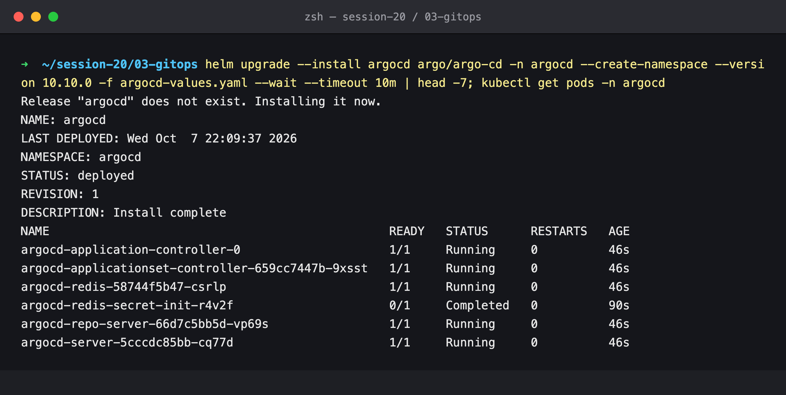

### Step 2 — Put the desired state in Git

The three workload manifests are committed and pushed. This is the only way they ever reach the cluster. (The commit also carries the `Co-Authored-By` trailer used throughout this repo.)

```bash
git add app && git commit -m 'Session 20 GitOps: app manifests watched by Argo CD (replicas: 2)' && git log --oneline -1 --stat
git push origin main
```

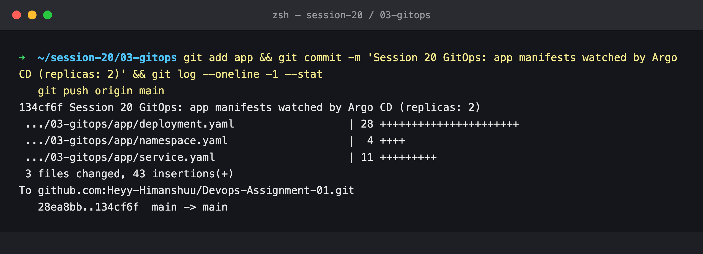

### Step 3 — Create the Application (once, by hand)

This is the only manual `kubectl apply` in the lab. It tells Argo CD *where to look*. Captured a moment after creation, the Application has no status yet and the namespace doesn't exist.

```bash
kubectl apply -f argocd-application.yaml
kubectl get application session20-mini -n argocd -o wide; kubectl get all -n s20-gitops
```

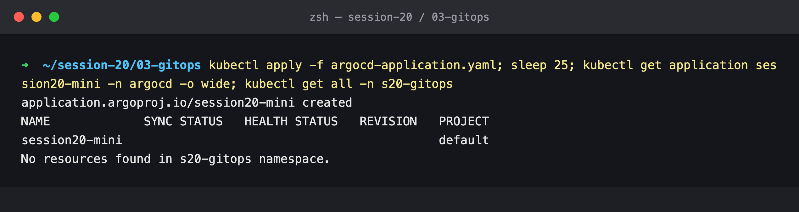

### Step 4 — Argo CD syncs from Git

Seconds later the first reconciliation has run: namespace, Service and Deployment are created from Git (the sync result lists them), and 2/2 Pods are up.

```bash
kubectl get application session20-mini -n argocd -o wide; kubectl get all -n s20-gitops
kubectl get application session20-mini -n argocd -o jsonpath='{range .status.operationState.syncResult.resources[*]}{.message}{"\n"}{end}'
```

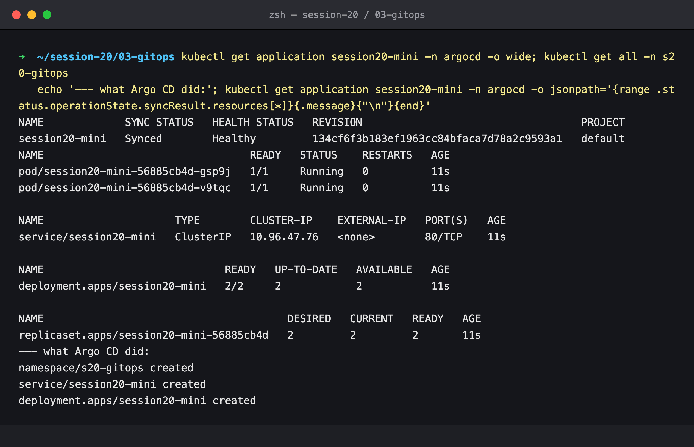

### Step 5 — Argo CD UI: Synced and Healthy at `134cf6f`

The tree shows Application → Namespace, Service, Deployment → ReplicaSet → 2 Pods. The header names the Git commit, its author and its message.

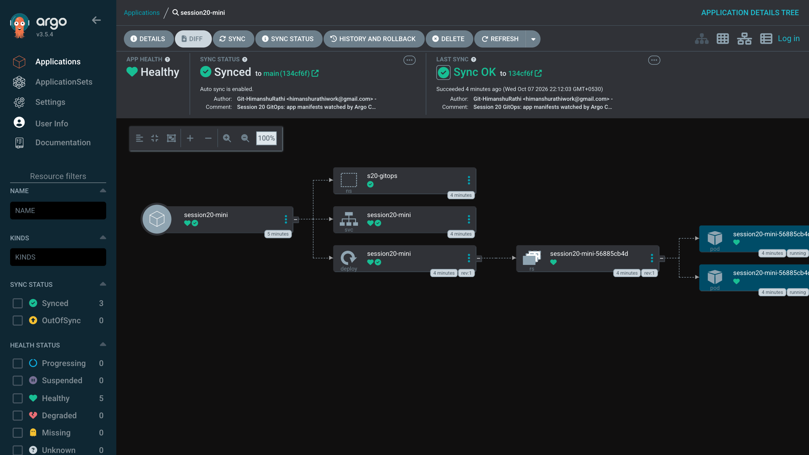

### Step 6 — Change Git, and only Git

`replicas: 2 → 3` is committed and pushed. [`wait-for-replicas.sh`](./wait-for-replicas.sh) only *reads* the cluster. It polls until 3 replicas are ready and reports the elapsed time: **21 s** after the push (up to 30 s of polling interval plus the Pod start), synced to `2b0efb5`.

```bash
sed -i '' 's/replicas: 2/replicas: 3/' app/deployment.yaml && git diff app/
git commit -m 'Scale application to three replicas' app/deployment.yaml && git push && git log --oneline -1
./wait-for-replicas.sh 3
```

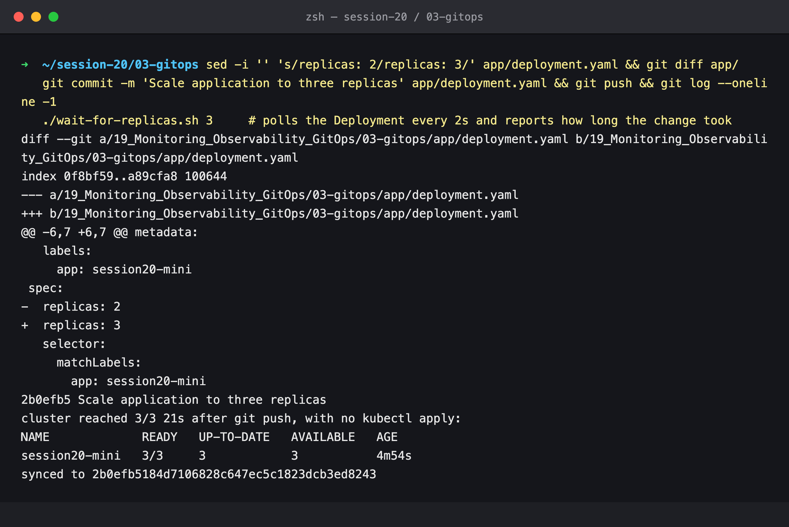

### Step 7 — Self-heal: manual scale is reverted

Someone runs `kubectl scale --replicas=1`. Straight away `READY` reads `3/1`: the spec says 1 while 3 Pods still exist. At +3 s Argo CD has already set the spec back to 3. The Application's sync history shows only the two Git revisions. Self-heal re-applies the *current* revision and doesn't create a new one.

```bash
kubectl scale deployment session20-mini -n s20-gitops --replicas=1; kubectl get deploy session20-mini -n s20-gitops
for i in 1 2 3 4 5 6; do sleep 3; kubectl get deploy session20-mini -n s20-gitops -o jsonpath='spec.replicas={.spec.replicas} ready={.status.readyReplicas}'; done
kubectl get application session20-mini -n argocd -o jsonpath='{range .status.history[*]}{.id} {.revision} {.deployedAt}{"\n"}{end}'
```

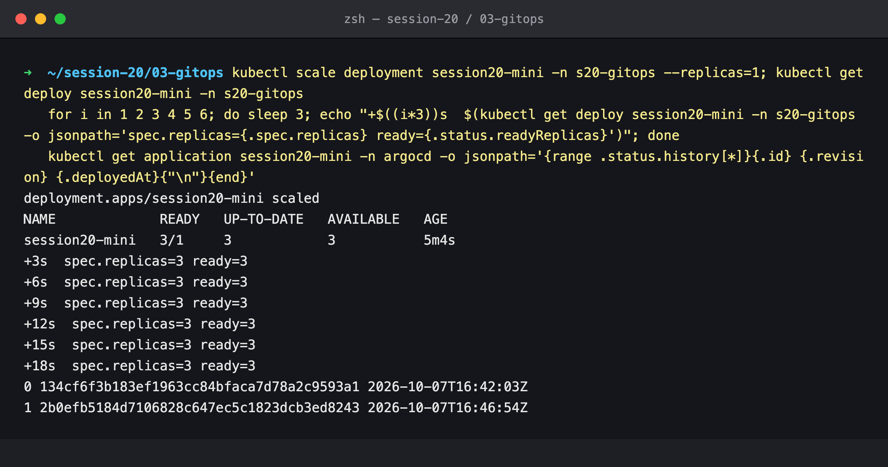

### Step 8 — Self-heal: a deleted Service is recreated

The Service was deleted and is back 5 s later. The controller log shows the automated sync to the same Git revision. **Note the ClusterIP:** it was `10.96.47.76` in step 4 and is now `10.96.101.150`.

```bash
kubectl delete svc session20-mini -n s20-gitops; sleep 5; kubectl get svc -n s20-gitops
kubectl logs -n argocd argocd-application-controller-0 --since=60s | grep -iE 'Initiated automated sync' | tail -3
```

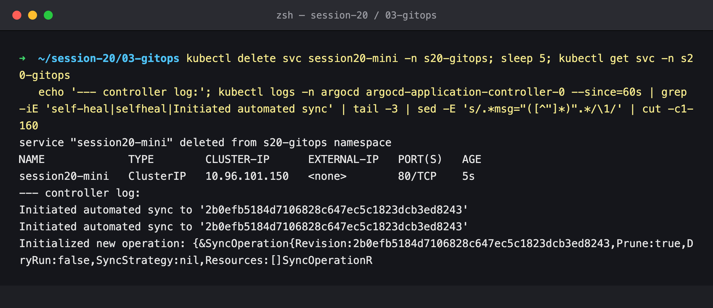

### Step 9 — Argo CD UI after the Git change and both drifts

Synced to `2b0efb5` ("Scale application to three replicas"), 3 Pods. Two of the Pods and the Service are "a few seconds" old: they are the replacements created during steps 7 and 8.

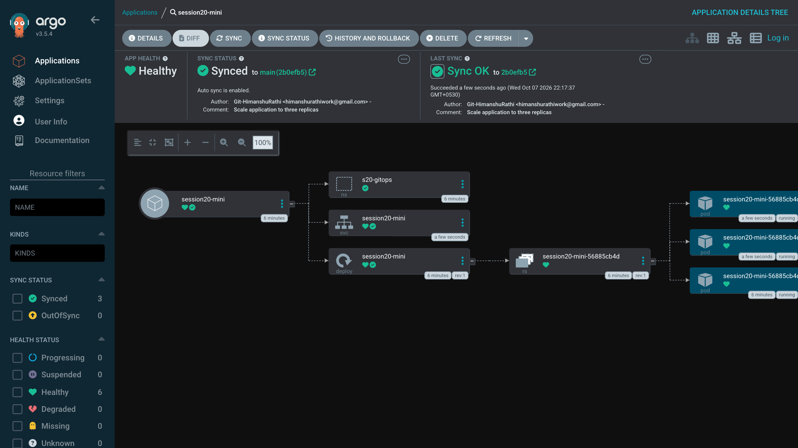

### Step 10 — Observe the system

The course's "observe" step: Application status, Pods across both workers, and the app's logs.

```bash
kubectl get application session20-mini -n argocd
kubectl get pods -n s20-gitops -o wide
kubectl logs deployment/session20-mini -n s20-gitops --tail=3
```

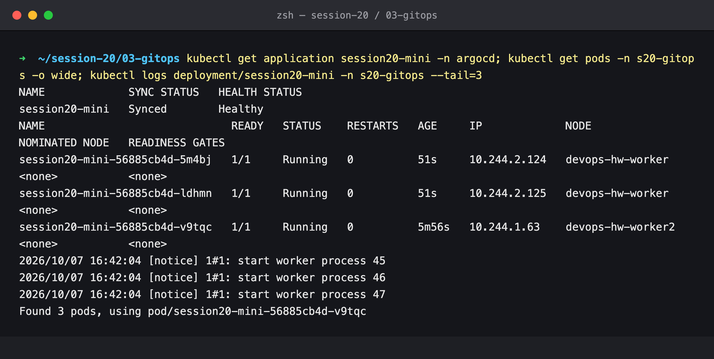

### Step 11 — Course cleanup leaves the app running

The Application has **no finalizers**. Deleting it, as the course's cleanup step does, removes the Argo CD object only. Ten seconds later, the Deployment, the Service and all 3 Pods are still running, now unmanaged by anything.

```bash
kubectl get application session20-mini -n argocd -o jsonpath='finalizers: {.metadata.finalizers}'
kubectl delete -f argocd-application.yaml; sleep 10; kubectl get all -n s20-gitops
```

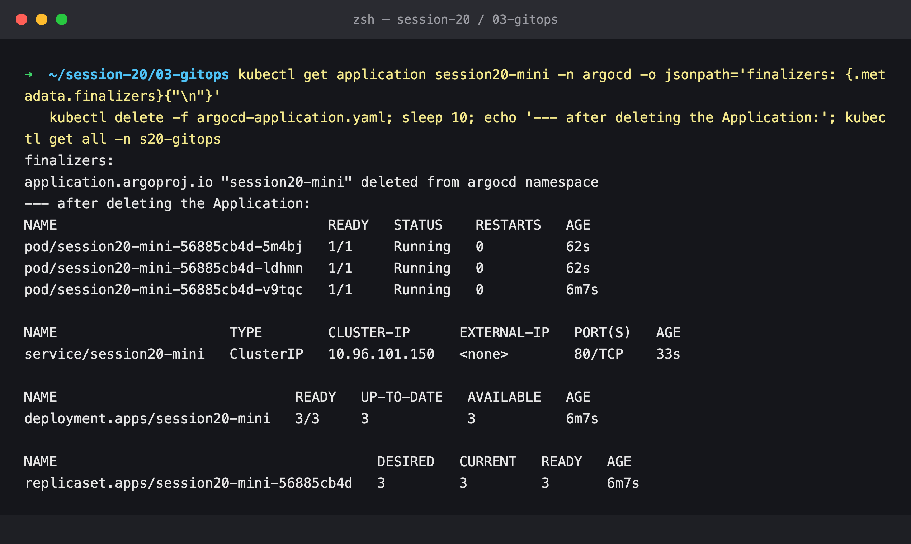

### Step 12 — Fix: the resources finalizer

The finalizer is added to [`argocd-application.yaml`](./argocd-application.yaml) and the Application re-created. Argo CD **adopts** the orphaned resources (they still match Git) and reports `Synced / Healthy` without recreating anything (the Deployment is still 6m33s old).

```yaml
metadata:
  finalizers:
    - resources-finalizer.argocd.argoproj.io
```

```bash
kubectl apply -f argocd-application.yaml; sleep 15
kubectl get application session20-mini -n argocd -o jsonpath='{.status.sync.status} / {.status.health.status}  finalizers={.metadata.finalizers}'
kubectl get deploy -n s20-gitops
```

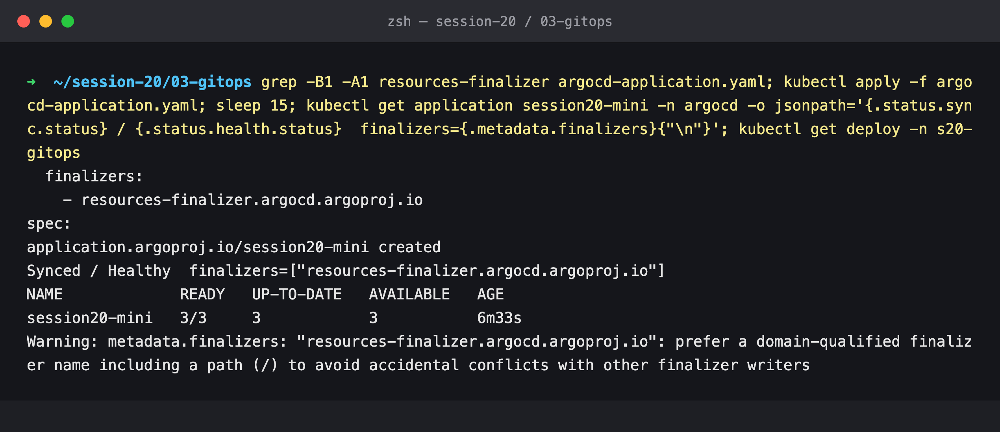

### Step 13 — Cascading delete (this is the cleanup)

Now `kubectl delete` blocks until Argo CD has deleted everything it manages, **including the `s20-gitops` namespace**, which came from Git as `app/namespace.yaml`.

```bash
kubectl delete -f argocd-application.yaml --wait=true
kubectl get application -n argocd; kubectl get all -n s20-gitops; kubectl get ns s20-gitops
```

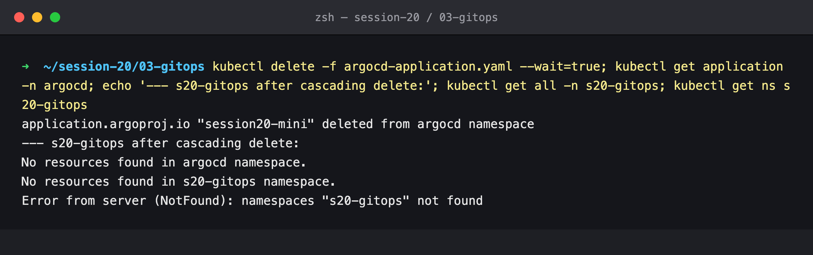

---

## Viva questions (from the course mini project)

1. **Monitoring vs observability.** Monitoring checks known conditions and alerts ("error rate > 5%"). Observability is being able to explain *any* behaviour from metrics, logs and traces, including problems nobody predicted. See [02-observability](../02-observability/README.md).
2. **Metrics vs logs vs traces.** Metrics are numbers over time (cheap, good for alerting). Logs are individual events with full detail. Traces follow one request across services as timed spans.
3. **Prometheus.** A pull-based time-series database. It scrapes `/metrics` endpoints, stores the samples, answers PromQL queries and evaluates alert rules.
4. **Grafana.** A visualisation layer that queries Prometheus (and Loki, Tempo, …) and draws dashboards. It stores no metrics of its own.
5. **GitOps.** Git holds the declarative desired state, and an in-cluster agent continuously pulls it and reconciles the cluster to it.
6. **Why Git is the source of truth.** It is versioned, reviewed, attributed and revertible, and it is the *only* input the reconciler trusts. Anything not in Git gets reverted (step 7).
7. **What Argo CD does.** It watches Git, renders manifests, diffs them against the live cluster, syncs the differences, reports sync and health status, and with `selfHeal`/`prune` keeps them equal.
8. **Desired state.** What the manifests in Git declare: here, `replicas: 3`.
9. **Actual state.** What the Kubernetes API reports right now: for example `spec.replicas=1` right after the manual scale.
10. **Reconciliation.** The compare-and-correct loop between those two states.
11. **Self-healing.** Auto-sync triggered by *drift in the cluster*: steps 7 and 8 reverted a scale and a deletion within seconds.
12. **When replicas change from 2 to 3 in Git.** Argo CD sees the new commit on its next poll, marks the app `OutOfSync`, applies the Deployment, and the ReplicaSet creates a third Pod. Measured here: **21 s** from push to 3/3 (step 6).

---

## Cleanup

The Application was deleted with a cascading finalizer, which removed the Deployment, the Service and the `s20-gitops` namespace. **Argo CD itself is left installed in the `argocd` namespace with authentication re-enabled.** Remove it with `helm uninstall argocd -n argocd`.
