# Final Troubleshooting Challenge

## Name

Himanshu Rathi

## Roll No

`24BCS10365`

---

Six faults were introduced on purpose into the running SpendBoard release (namespace `s21-spendboard`,
kind cluster `devops-hw`). Each one was taken through the same loop: **identify → investigate →
root cause → fix → verify**. Every screenshot is the real terminal output of the command shown at the
top of it.

| # | Fault introduced | Symptom | Root cause | Fix |
| --- | --- | --- | --- | --- |
| 1 | Release pinned to an image tag that was never built | `ErrImagePull` / `ImagePullBackOff`, `helm upgrade` fails | the registry has no `:1f0c9e2` | `helm rollback` |
| 2 | Service selector edited by hand (`backend` → `api`) | Ingress returns **503** for `/api/*` | the Service selects zero Pods, so its EndpointSlice is empty | re-apply the chart with `--force-conflicts` |
| 3 | DB password "rotated" only in the Secret | new Pods stuck in `Init:0/1`, rollout hangs | Postgres only reads `POSTGRES_PASSWORD` when it first initialises the data dir | change the role password in the database to match |
| 4 | Readiness probe pointed at `/readyz` | new Pod `Running` but `0/1`, rollout hangs | the API only serves `/ready`; the probe gets 404 | `helm rollback` |
| 5 | Frontend HPA targeting a Deployment that doesn't exist | HPA `TARGETS <unknown>`, `AbleToScale False` | `scaleTargetRef.name: spendboard-web` | point it at `spendboard-frontend` |
| 6 | The course chart's Ingress, ported 1:1 | `/` works, `/api` returns **503** | Ingress points at port **8080**; the Service listens on **8000** | reference the Service port **by name** |

The theme across all six: **Kubernetes kept the app up while the change was broken.** In issues 1, 3
and 4 the rolling update refused to remove an old Pod until a new one was Ready, so users kept getting
`HTTP 200` the whole time. The two outages (2 and 6) were both in the *routing* layer, where there is no
readiness gate to stop them.

---

## Issue 1 — image tag that does not exist (ImagePullBackOff)

**Identify.** An upgrade pinned to a tag nobody had pushed. `helm --wait` timed out and both new Pods
were stuck pulling:

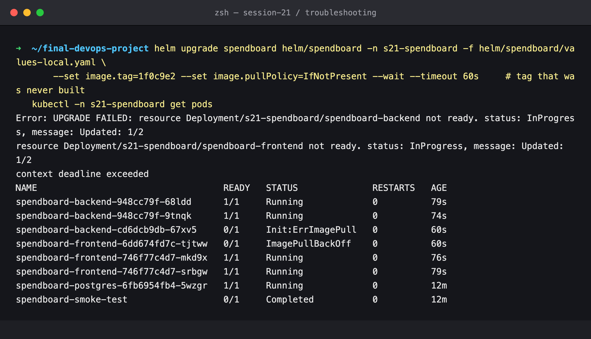

**Investigate.** The users never noticed: the old ReplicaSet was still serving, because with two
replicas `maxUnavailable` (25%) rounds down to 0. The `Failed` events give the reason, and Helm
recorded revision 3 as `failed`:

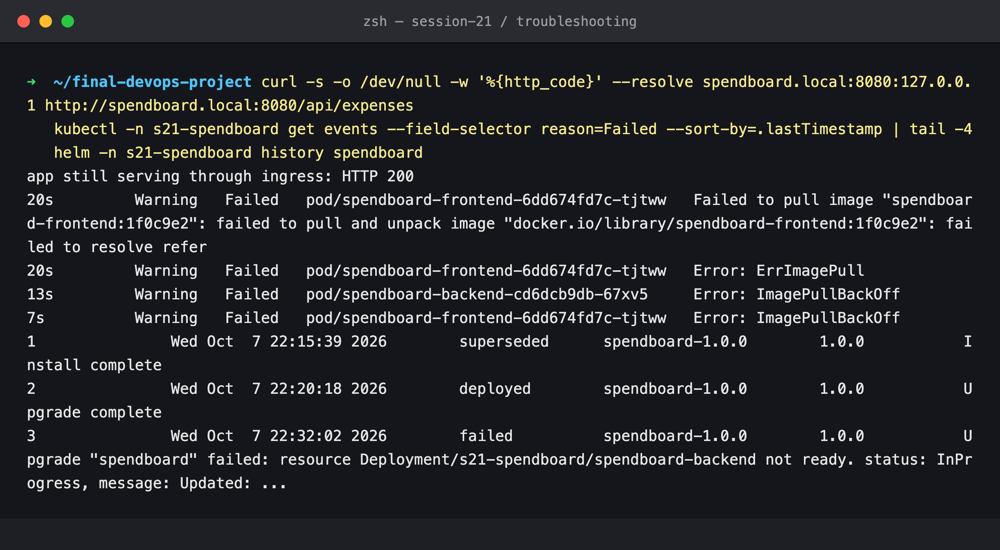

**Root cause.** `failed to resolve reference "docker.io/library/spendboard-frontend:1f0c9e2"`: that
tag does not exist. The backend Pod fails in its **init container**, because `migrate` uses the same
image (`Init:ErrImagePull`).

**Fix + verify.** `helm rollback spendboard 2` gives revision 4, and the broken Pods are terminated:

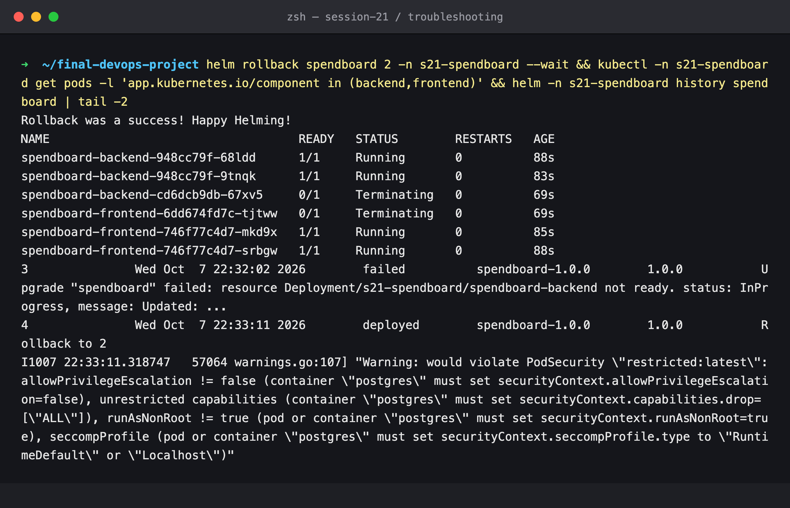

**Prevention.** The pipeline only ever deploys the tag it has just pushed (`image.tag` is the short
SHA output of the push job), and the chart refuses to render without a tag (`required`).

---

## Issue 2 — Service selector that matches nothing

**Identify.** Someone hand-edited the backend Service's selector:

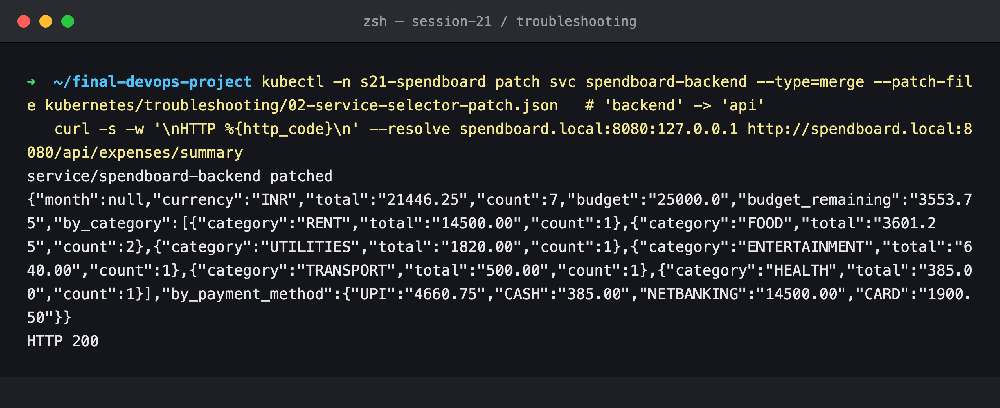

The first request straight after the patch still returned **200**: ingress-nginx had not yet received
the EndpointSlice update. A few seconds later it returned **503**, and the controller logged that the
Service *"does not have any active Endpoint"*:

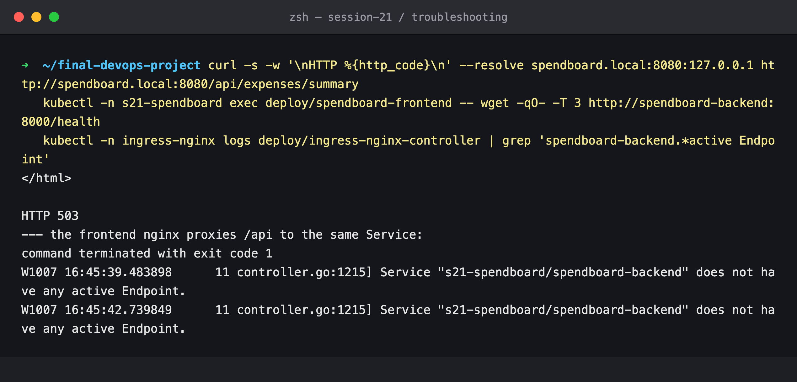

**Investigate.** The EndpointSlice is empty. The selector says `component=api`, but the Pods are labelled
`component=backend`:

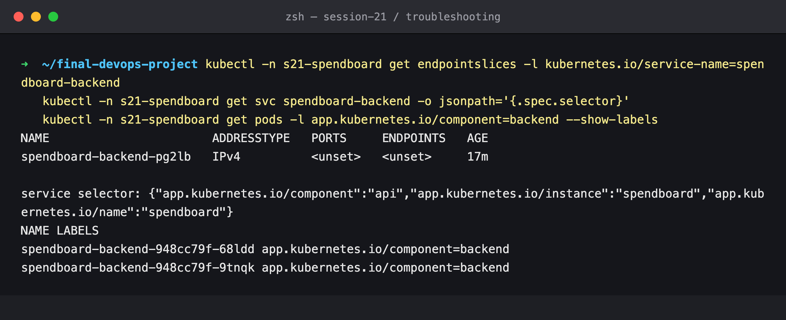

**Root cause.** A Service routes to whatever Pods its label selector matches. Here it matches none, so
it has no endpoints and nginx has nowhere to send `/api`.

**First fix attempt failed (a real finding).** A plain `helm upgrade` did **not** put the selector back.
Helm 4 uses **server-side apply**, and the `kubectl patch` had taken ownership of `.spec.selector`
(field manager `kubectl-patch`). Helm therefore refused with a conflict and marked revision 5 `failed`:

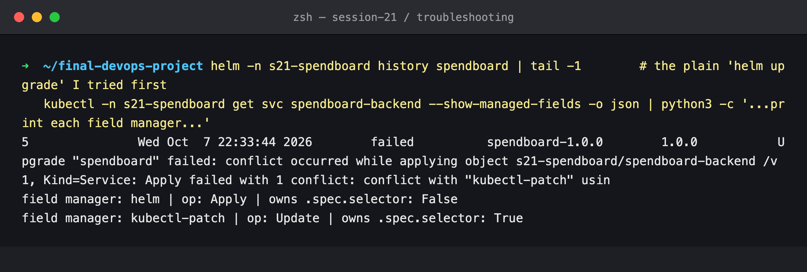

**Fix + verify.** `--force-conflicts` lets Helm take the field back. The selector returns to
`backend`, the EndpointSlice is repopulated, and the API is back:

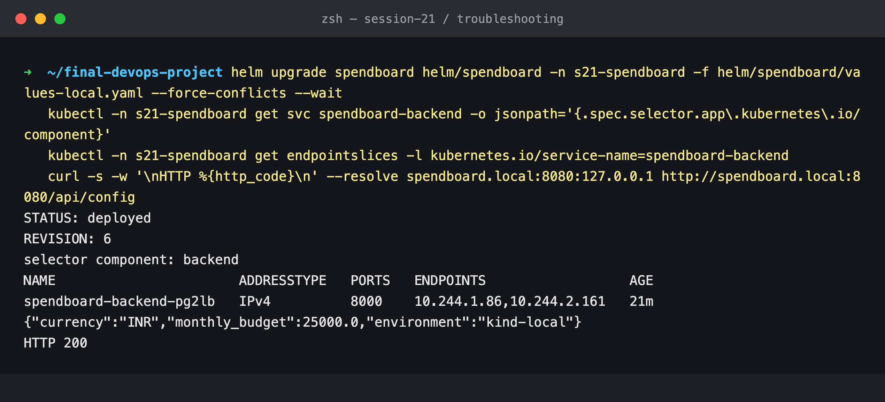

**Lesson.** Helm only corrects drift when you run it, and SSA ownership can block even that. Argo CD's
`selfHeal` (see [`gitops/`](../../gitops/README.md)) reverts this kind of edit within seconds.

---

## Issue 3 — wrong database secret

**Identify.** The password in the Secret was "rotated" and the backend restarted. The new Pod never got
past its init container:

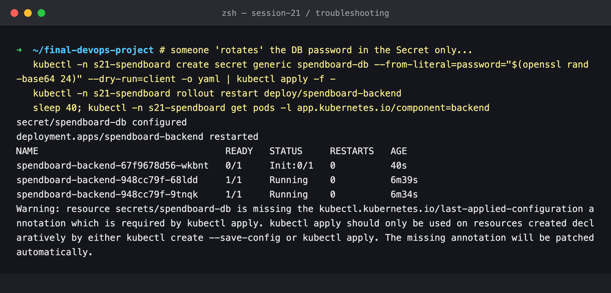

**Investigate.** The `migrate` init container loops on `password authentication failed`. Postgres logs
the same from its side, the rollout is stuck, and the old Pods (which still hold the old password in
their environment) keep serving `HTTP 200`:

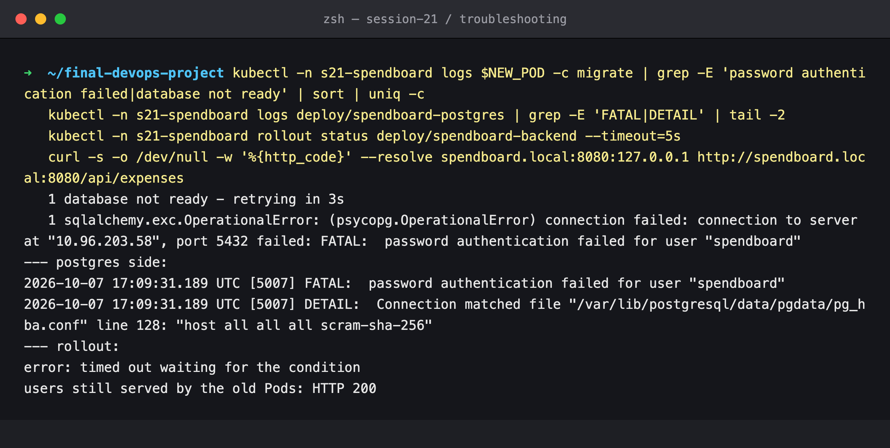

**Root cause.** The official Postgres image only applies `POSTGRES_PASSWORD` when it **initialises an
empty data directory**. After that, the password lives in the database, on the PVC. Changing the
Secret changed what the clients send, but not what the server expects.

**Fix + verify.** A correct rotation changes both sides. `ALTER ROLE` is run through the Postgres Pod's
local socket, with the new value read from the Secret and never printed. The stuck Pod then passes
`migrate`, the rollout completes, and the data is intact (7 expenses):

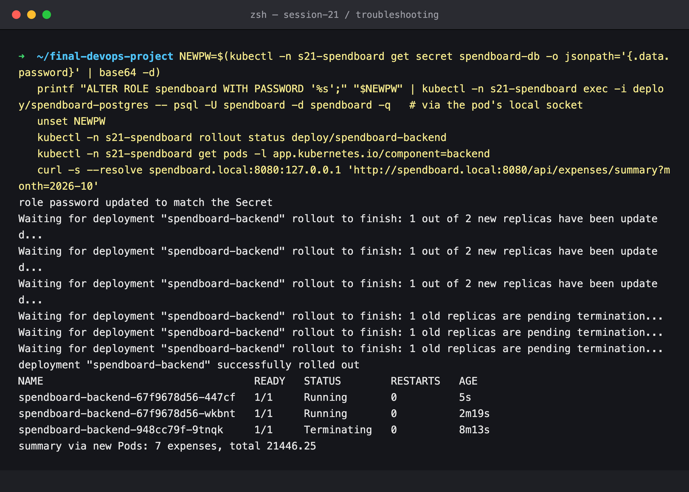

---

## Issue 4 — readiness probe on the wrong path

**Identify.** A values typo, `readinessPath=/readyz`. The new Pod is `Running` but never `1/1`, and
`helm --wait` fails:

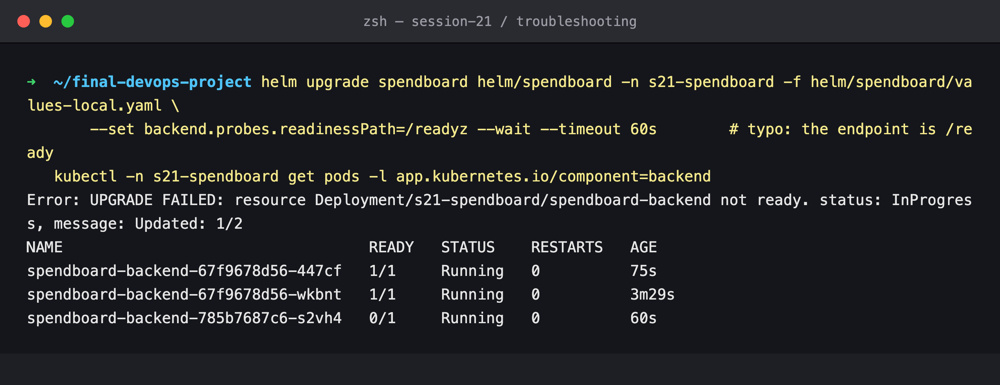

**Investigate.** `describe` shows `Readiness probe failed: HTTP probe failed with statuscode: 404`, and
uvicorn's access log shows the kubelet's `GET /readyz` getting 404. In the EndpointSlice the new Pod is
`ready=false`, so it never receives traffic:

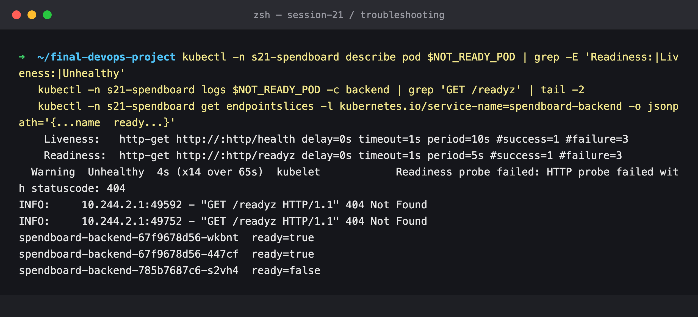

**Root cause.** The API exposes `/ready` (which checks the DB) and `/health` (liveness only). `/readyz`
does not exist.

**Fix + verify.** `helm rollback` with no revision returns to the previous one, and the probe path is
`/ready` again:

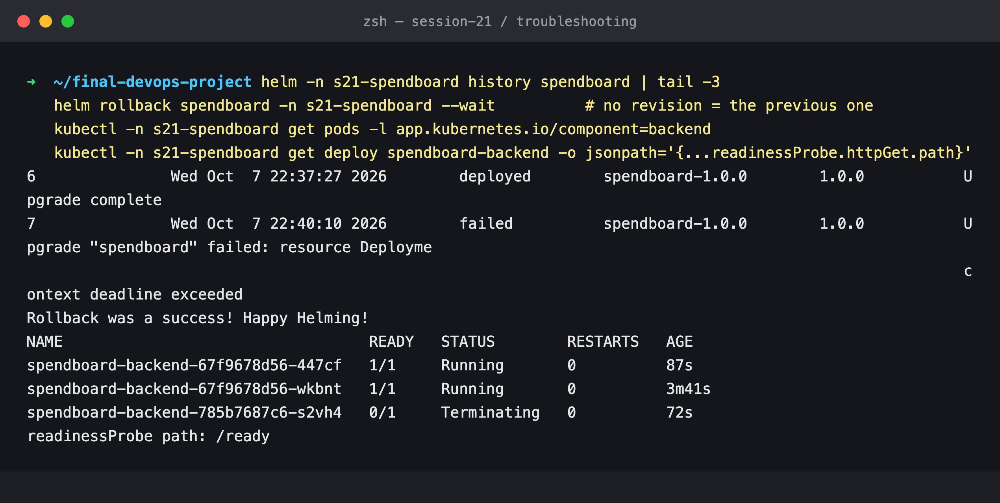

**Why it was harmless.** A readiness failure removes the Pod from the Service and never restarts it.
If the same typo had been in the *liveness* probe, the kubelet would have restarted the container in a
loop.

---

## Issue 5 — HPA with a bad scale target

**Identify / investigate.** [`05-frontend-hpa-broken.yaml`](05-frontend-hpa-broken.yaml) gives the
frontend an HPA, but `scaleTargetRef` names `spendboard-web`. The result is `TARGETS <unknown>`,
`REPLICAS 0`, `AbleToScale False / FailedGetScale ... "spendboard-web" not found`:

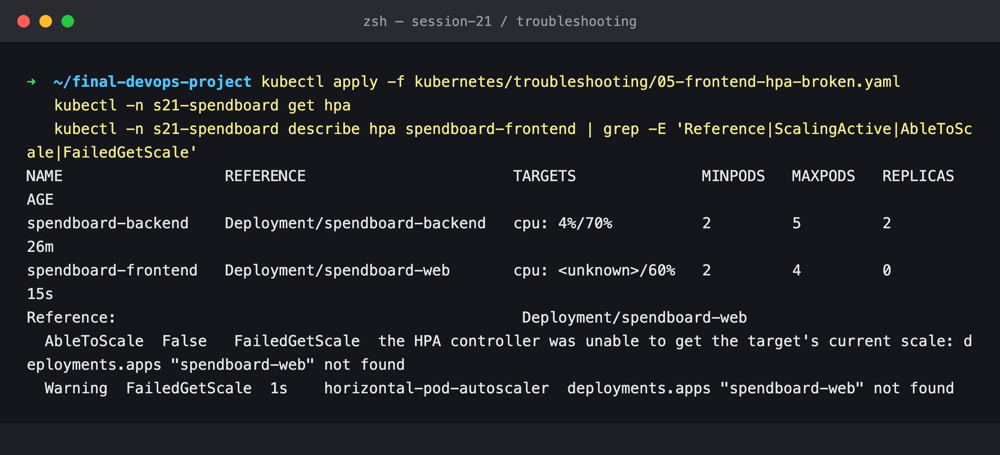

**Fix + verify.** [`05-frontend-hpa-fixed.yaml`](05-frontend-hpa-fixed.yaml) names the real
Deployment. After the first metrics scrape the HPA reports `cpu: 4%/60%`, `AbleToScale True`,
`ScalingActive True / ValidMetricFound`:

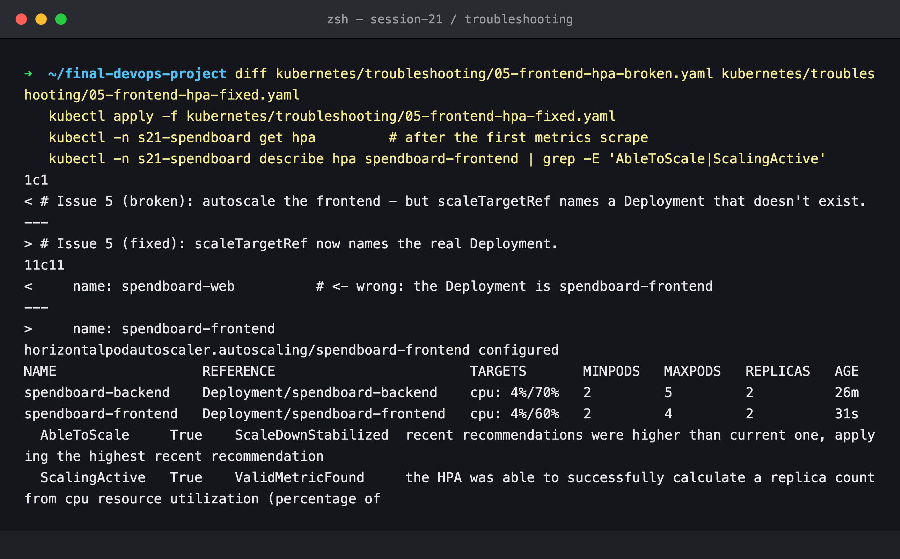

---

## Issue 6 — the course chart's Ingress (wrong Service port)

The course's TaskBoard chart routes `/api` to `taskboard-backend` on **port 8080**. That chart's
backend Service is actually called `<release>-taskboard-backend` and listens on **8000**, so `/api`
could never have worked. Ported 1:1 ([`06-course-ingress-broken.yaml`](06-course-ingress-broken.yaml)):

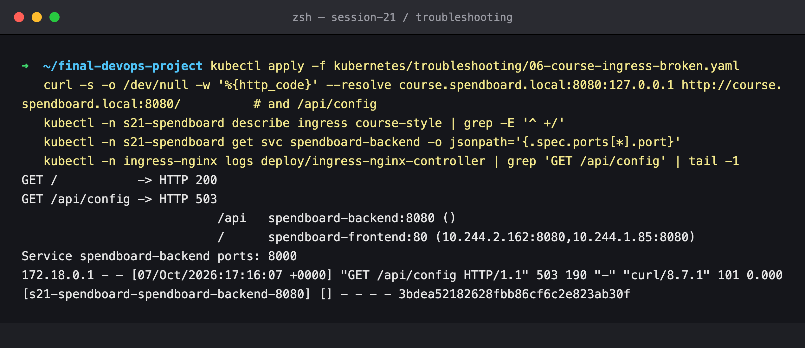

`describe ingress` shows `spendboard-backend:8080 ()`, meaning no endpoints. The Service only exposes
8000, and the ingress-nginx access log shows the request going to upstream
`s21-spendboard-spendboard-backend-8080` with no address (`-`), answered with 503.

**Fix + verify.** [`06-course-ingress-fixed.yaml`](06-course-ingress-fixed.yaml) references the port
**by name** (`port: { name: http }`), which is what this project's chart does. The endpoints appear and
`/api/config` returns 200:

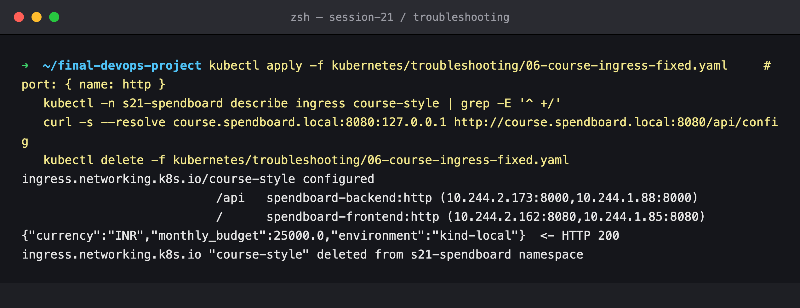

---

## Cleanup

The troubleshooting HPA and Ingress were deleted as the last command of their own screenshots. The
release ended on a healthy revision (`helm -n s21-spendboard history spendboard`).
