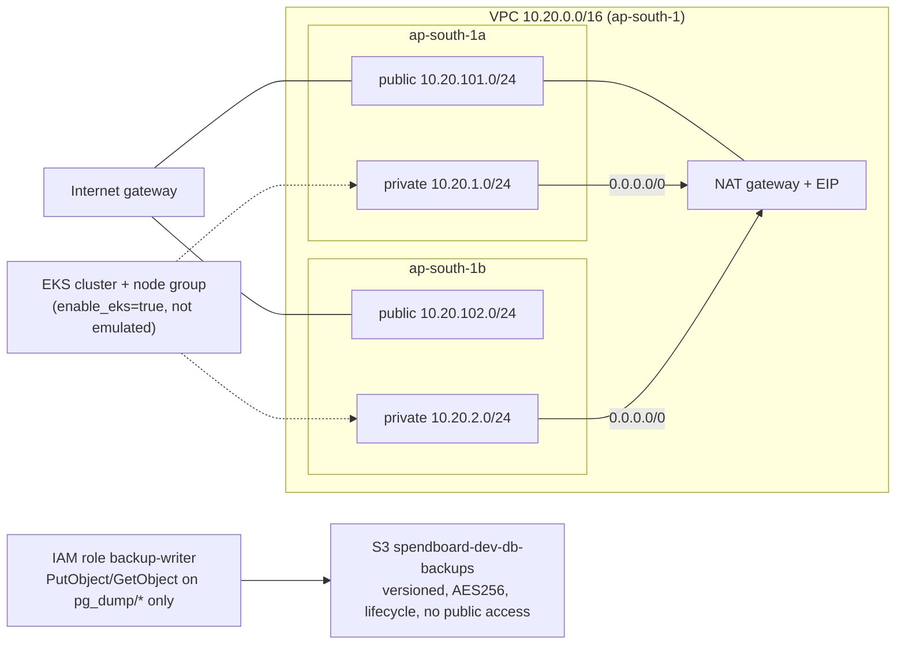

# terraform/ — SpendBoard cloud infrastructure

> **The AWS API here is emulated by LocalStack 4.9** (community edition, in Docker, on `localhost:4566`).
> No real AWS account was used. The code is ordinary AWS-provider Terraform: set
> `use_localstack = false` and supply real credentials, and the same resources are created in AWS.

## What it provisions



| File | Contents |
| --- | --- |
| `versions.tf` | provider pin (`aws ~> 6.0`), LocalStack endpoint switch, `default_tags` |
| `variables.tf` | project, environment (validated), region, AZs, CIDR, `enable_eks`, retention |
| `network.tf` | VPC, IGW, 2 public + 2 private subnets (with `kubernetes.io/role/*elb` tags), EIP, NAT, route tables, node security group |
| `storage.tf` | backup bucket (versioning, SSE, public-access block, lifecycle), least-privilege IAM role and policy |
| `eks.tf` | EKS control plane + managed node group + their IAM roles. `count = 0` unless `enable_eks=true` |
| `outputs.tf` | VPC/subnet/NAT IDs, bucket, role ARN, EKS name |
| `terraform.tfvars.example` | copy to `terraform.tfvars` (git-ignored) |

Dependencies are mostly implicit, through references (subnet → VPC, route → NAT → EIP). Two explicit
`depends_on`: the EIP waits for the IGW, and the EKS resources wait for their policy attachments.

## Run

```bash
docker start localstack || docker run -d --name localstack -p 4566:4566 localstack/localstack:4.9
terraform init && terraform fmt -check && terraform validate
terraform plan -out=spendboard.tfplan && terraform apply spendboard.tfplan
terraform output
terraform destroy -auto-approve
```

Screenshots of every step, plus the LocalStack quirks found along the way, are in the
[project README](../README.md#6-terraform-infrastructure).
